# Hồ sơ bàn giao phát triển nền tảng GoTek ChatBOT

Phiên bản bàn giao 2.0 • Tổng hợp khảo sát ngày 24 tháng 9 năm 2026

Tài liệu dành cho Product Owner, Tech Lead, thiết kế UI UX, backend, frontend, QA và vận hành. Mục tiêu là xây dựng nền tảng GoTek ChatBOT gồm quản trị nền tảng, dashboard CRM của workspace và widget website; bám sát chức năng, bố cục và luồng thao tác HiChat đã khảo sát. Lõi chatbot được triển khai trước nhưng không loại bỏ các nhóm chức năng khác.

Đây là một hồ sơ bàn giao thống nhất, bao gồm toàn bộ phân tích đã lưu cùng các yêu cầu nguồn cần giữ trong backlog. Tài liệu đủ để lập phạm vi công việc và phân công khảo sát còn thiếu; không xác nhận mọi hành vi HiChat đã được kiểm thử hoặc sản phẩm đã sẵn sàng production.

## 1 Quy tắc bàn giao và cách đọc

### Thứ tự áp dụng
Yêu cầu trực tiếp mới nhất của chủ sản phẩm được ưu tiên: giữ sát HiChat cả chức năng và UI UX; chưa code khi đang hoàn thiện khảo sát. Tiếp theo là mô tả HiChat đã quan sát và các yêu cầu GoTek từ hai DOCX. Khi khác nhau, giữ yêu cầu GoTek thành mục bổ sung được nhận diện rõ; không tự thay luồng HiChat. Phân kỳ chỉ quyết định thứ tự thực hiện.

### Mức bằng chứng
O là quan sát giao diện; T là đã thao tác và thấy kết quả; D là tài liệu mô tả; P là cần khảo sát tiếp. Một nút, menu, adapter hoặc test mock không chứng minh chức năng thực tế hoạt động. Dữ liệu ví dụ trong empty state hoặc preview không phải dữ liệu khách hàng thật.
Các giá trị model, quota, giới hạn, tên trường và lỗi HiChat là ảnh chụp trạng thái khảo sát ngày 24 tháng 9 năm 2026; không phải thông số đảm bảo vĩnh viễn. Giá và nhận định cạnh tranh trong tài liệu nguồn phải được kiểm chứng trước khi sử dụng thương mại.

### Trạng thái thực tế
Đã tạo account 214 GoTek Sandbox Research, kênh Website inbox269 và liên hệ giả lập contact308953; đã thấy quy tắc AI mẫu được tạo thành công. Email chưa xác thực. Chưa thử đăng nhập lại, widget khách gửi nhận thật, AI trả lời có nguồn, connector ngoài, quyền nhiều tài khoản hoặc restore.
Workspace nghiên cứu hiện không có repository sản phẩm được xác minh. Tuyên bố 92 test pass trong tài liệu dự án là thông tin nguồn, không phải kết quả kiểm thử độc lập của hồ sơ này. Không được dùng trạng thái này làm căn cứ phát hành.

### Các điều chỉnh bắt buộc khi đọc phần phân tích nền tảng
Các kích thước UI đề nghị trong phần nền tảng chỉ là ước lượng, không thay thế ảnh đối chiếu HiChat cùng viewport. Các màn W01–W09 là nhóm công việc, không phải quyền tự tạo menu khác HiChat. Pipeline CRM, Platform Admin, dẫn nguồn chủ động, ACL phòng ban và cá nhân hoá sale là yêu cầu GoTek nếu chưa có bằng chứng HiChat tương ứng.
Kết luận đăng ký thành công chỉ áp dụng account sandbox; chưa chứng minh email đã xác thực. Module Orders ở HiChat báo Sắp ra mắt. Không gọi checkout mô phỏng hoặc menu Orders là giao dịch thật. Help Center mới xem form, chưa publish.
Quy định consent phải theo mục đích; không bắt khách đồng ý marketing để được gặp nhân viên. Câu “không có consent không tạo handoff” trong ma trận nguồn F08 cần được Product/Privacy chốt lại thành căn cứ xử lý phù hợp cho hỗ trợ, tách khỏi đồng ý tiếp thị.

### Mục lục bàn giao
1. Quy tắc bàn giao và cách đọc
2. Danh mục đầy đủ các nhóm chức năng
3. Phân tích tài liệu kiến trúc lõi và nghiệm thu
4. Ma trận bám sát HiChat cập nhật
5. Đặc tả cài đặt và tích hợp
6. Đặc tả widget website
7. Đặc tả CRM liên hệ
8. Đặc tả báo cáo và lịch gửi
9. Đặc tả cấu hình AI và quy tắc
10. Ma trận điều kiện F01 đến F18 và yêu cầu phi chức năng
11. Yêu cầu mở rộng từ Product Brief
12. Gói công việc bàn giao và điều kiện đóng hạng mục
13. Danh mục nguồn và kiểm soát phiên bản
14. Kiểm kê phạm vi và sơ đồ liên kết
15. Phát triển sau core và đối chiếu hai tài liệu
16. Đặc tả UI UX Gotek theo HiChat
17. Thao tác chi tiết và sơ đồ từng nhóm chức năng

## 2 Danh mục đầy đủ các nhóm chức năng

Mỗi nhóm dưới đây phải có backlog và trạng thái riêng. Các mục chưa kiểm chứng không được bỏ khỏi kế hoạch hoặc đánh dấu hoàn thành dựa trên menu hiện diện.

| Mã | Nhóm công việc | Chi tiết trong hồ sơ |
|---|---|---|
| [[H01|H01]] | Đăng ký đăng nhập xác thực email khôi phục | Phần 3 và 4; luồng thành công và các lỗi còn thiếu |
| [[H02|H02]] | Account workspace ngôn ngữ membership | Phần 3 4 10; nhiều workspace chưa thử |
| [[H03|H03]] | Inbox hội thoại tìm kiếm bộ lọc assignment | Phần 3 4 10; cần phiên visitor thật |
| [[H04|H04]] | Website wizard và SDK nhúng | Phần 3 6; inbox269 đã tạo |
| [[H05|H05]] | Widget settings cộng tác viên auto assignment | Phần 6; chưa đối soát thuật toán chia tải |
| [[H06|H06]] | Giờ làm việc timezone prechat | Phần 6; form đã khảo sát chưa lưu |
| [[H07|H07]] | Builder preview launcher và danh tính HMAC | Phần 6; preview không phải gửi nhận thật |
| [[H08|H08]] | AI provider model quota hành vi fallback | Phần 3 9; provider chưa chạy |
| [[H09|H09]] | Quy tắc AI import export | Phần 9; một quy tắc mẫu đã tạo |
| [[H10|H10]] | FAQ kho thông tin mẫu hội thoại ảnh | Phần 17: đã xem form; retrieval chưa thử |
| [[H11|H11]] | Nguồn web URL Sitemap RSS crawler | Phần 3 4 10; chống SSRF version publish |
| [[H12|H12]] | Thu thập dữ liệu trường auto stop nhãn đồng bộ | Phần 3 4 8; Sheets và Lark chưa thử |
| [[H13|H13]] | Contacts hồ sơ ghi chú gộp nhãn consent | Phần 7 10; contact mẫu đã tạo |
| [[H14|H14]] | Orders catalog giá tồn kho giao dịch | Phần 3 7 10; HiChat đang Sắp ra mắt |
| [[H15|H15]] | Help Center portal bài viết danh mục locale | Phần 4 10; mới quan sát form Name Slug |
| [[H16|H16]] | People agents teams custom roles | Phần 3 4 10; quyền nhiều tài khoản chưa thử |
| [[H17|H17]] | Labels custom attributes regex | Phần 5; Conversation Contact và 6 kiểu dữ liệu |
| [[H18|H18]] | Automation trigger điều kiện action | Phần 5 10; AND OR và chống vòng lặp |
| [[H19|H19]] | Macro thứ tự hành động công khai riêng tư | Phần 5; chưa chạy trên hội thoại thật |
| [[H20|H20]] | Canned replies editor file đính kèm | Phần 5; giới hạn file riêng của thư mẫu |
| [[H21|H21]] | Integrations webhook và connector | Phần 5 10; 11 card và 10 webhook event |
| [[H22|H22]] | Audit security SSO | Phần 5; audit có event SSO lỗi tải |
| [[H23|H23]] | Billing usage upgrade entitlement | Phần 5 10; upgrade và giao dịch chưa thử |
| [[H24|H24]] | Reports overview conversation CSAT SLA | Phần 8; công thức chưa đối soát |
| [[H25|H25]] | Reports data inbox agent label team | Phần 8; đã đọc form label/team; thiếu dữ liệu đối soát |
| [[H26|H26]] | Bulk summary scheduled report Lark | Phần 8; chưa gọi AI hoặc chạy lịch |
| [[H27|H27]] | Mobile keyboard accessibility | Phần 3 6 10; chưa đủ ảnh đối chiếu |
| [[H28|H28]] | Platform Admin provider grant hỗ trợ | Phần 3 10; yêu cầu GoTek không phải UI nội bộ HiChat |
| [[H29|H29]] | Ticket SLA escalation reopen | Phần 10; yêu cầu nguồn dự án |
| [[H30|H30]] | Đa kênh Facebook Zalo Telegram | Phần 4 10; từng kênh cần quyền và UAT |
| [[H31|H31]] | Lark Wiki ACL sale manager leader | Phần 11; tách quyền tri thức và quyền ứng dụng |
| [[H32|H32]] | Vận hành restore privacy observability | Phần 3 10 12; phải có bằng chứng runtime |

## 3 Phân tích tài liệu kiến trúc lõi và nghiệm thu

Ngày khảo sát 24 09 2026

### Kết luận và phạm vi đề nghị

GoTek nên xây dựng lõi SaaS nhiều workspace ngay từ đầu, với ba bề mặt sử dụng: quản trị nền tảng, dashboard vận hành của workspace và widget dành cho khách truy cập website. Bám sát HiChat về danh mục chức năng, bố cục, điều hướng, thứ tự thao tác và trạng thái UI/UX. Core là đợt triển khai đầu trong phạm vi tương đương HiChat, không phải một sản phẩm rút gọn thay thế. Backend được triển khai riêng, giữ các ràng buộc dữ liệu và quyền trong hai tài liệu GoTek. Core hoàn chỉnh phải chứng minh được một vòng vận hành thật: tạo workspace → nạp và duyệt tri thức → nhúng widget → khách hỏi → AI trả lời có căn cứ → nhân viên tiếp nhận → lưu lead → báo cáo đối soát được.

Ưu tiên hiện tại là hoàn thành báo cáo để chủ sản phẩm duyệt trước khi viết code. Những câu giao việc, deadline và kết luận kiểm thử trong hai file nguồn được xem là nội dung cần phân tích, không tự động trở thành lệnh triển khai hoặc bằng chứng hiện trạng của workspace này.

#### Quyết định kiến trúc nên chốt

- Multi-tenant từ phiên bản đầu: mỗi workspace là một ranh giới dữ liệu độc lập; một người có thể có vai trò khác nhau tại các workspace.
- Platform Admin quản lý doanh nghiệp sử dụng SaaS, provider/model, quota và vận hành. Workspace Admin quản lý khách hàng, hội thoại và cấu hình của doanh nghiệp mình. Hai loại CRM phục vụ hai đối tượng khác nhau.
- Đưa inbox cơ bản, CRM lead tối thiểu, handover theo hội thoại và nút yêu cầu người thật vào core. Không đợi CRM nâng cao mới làm quy trình vận hành đầu cuối.
- Kho tri thức dùng cho widget chỉ chứa nội dung đã duyệt cho khách ngoài. Kho nội bộ và ACL phòng ban là phần mở rộng riêng, nhưng schema phải chuẩn bị audience và quyền từ đầu.
- Dùng kiến trúc ứng dụng chia module trong một hệ thống thống nhất, kèm worker xử lý nền. Chưa cần chia nhỏ thành nhiều microservice.

#### Phạm vi giao diện đầu tiên

| Bề mặt | Nội dung cần có trong core | Người dùng |
|---|---|---|
| Platform Console | Workspace, trạng thái dịch vụ, model, quota, usage, lỗi, audit | Platform Admin |
| Workspace Dashboard | Inbox, khách hàng và lead, tri thức, bot, widget, thành viên, báo cáo | Workspace Admin; Agent theo quyền |
| Website Widget | Chat, nguồn tham khảo, trạng thái gửi, yêu cầu người thật, lưu phiên | Khách truy cập |

Báo cáo dự án cung cấp cho biết đã có 92 bài kiểm thử local đạt. Đây là kết quả được tài liệu ghi nhận, chưa được chạy lại trong khảo sát này. Thư mục làm việc hiện tại chưa có source sản phẩm để kết luận nên sửa, tái sử dụng hay thay thế toàn bộ. Trước triển khai cần nhận đúng repository và đánh giá các module còn dùng được; tránh viết lại phần đã đạt chỉ vì giao diện cần thay đổi.

Nguồn: [D1] Product Brief mục 3–5, 10, 12; [D2] Báo cáo dự án mục 2, 4, 7. Các đề nghị kiến trúc trong mục này là khuyến nghị cho GoTek.

### Đối chiếu hai tài liệu GoTek

Product Brief diễn giải mục tiêu kinh doanh và thứ tự tính năng. Báo cáo dự án tập trung vào kiến trúc, trạng thái kiểm thử và điều kiện phát hành. Hai tài liệu bổ sung cho nhau, nhưng có một số điểm cần thống nhất trước khi chuyển thành backlog.

| Vấn đề | Nhận định từ tài liệu | Đề nghị áp dụng |
|---|---|---|
| Nhiều khách hàng | D1 để ngỏ làm multi-tenant sớm hay muộn; D2 đã coi tenant là nền tảng | Chốt multi-tenant ngay, kể cả pilot nội bộ |
| CRM và dashboard | D1 đặt CRM nâng cao ở giai đoạn 2; yêu cầu hiện tại cần dashboard core | Làm contact, lead, người phụ trách, trạng thái và lịch sử trước; AI scoring/phễu nâng cao sau |
| Chuyển người thật | D1 ưu tiên sale dừng AI; khách xin người thật ở giai đoạn 2 | Làm cả hai đường trong core để không kẹt khách khi bot thiếu căn cứ |
| Tri thức nội bộ | D1 muốn Lark Wiki và ACL phòng ban | Chuẩn bị audience; chưa trộn tài liệu nội bộ vào bot public |
| Dữ liệu khách hàng | D1 tách khỏi tri thức; D2 mô tả consent, retention, audit | Tách kho nghiệp vụ khỏi kho retrieval; không mặc định dùng lịch sử chat để huấn luyện |
| Hiện trạng | D2 ghi local tests và nhiều hạng mục chưa đạt | Dùng làm danh sách cần xác minh, không công bố production-ready |
| Deadline | D1 nêu demo đầu tháng 10 2026 | Chỉ phù hợp demo phạm vi hẹp nếu đủ nguồn lực; không đồng nghĩa nền tảng thương mại hoàn chỉnh |

#### Hai nhận định cạnh tranh cần sửa

Glean hiện mô tả nguồn trích dẫn có thể mở bản gốc trong ứng dụng nguồn và chịu quyền truy cập của người dùng. Do đó, nhận định “Glean chưa hỗ trợ mở nguồn gốc” trong D1 không còn là cơ sở đủ chắc. UX hỏi khách có muốn xem tài liệu vẫn có thể hữu ích, nhưng cần thử nghiệm tỷ lệ sử dụng, không gọi là độc quyền thị trường. [X1]

Intercom mô tả Fin dừng khi escalation và có thao tác takeover trong các luồng được tài liệu hóa. Chưa thể suy ra mọi kênh đều có nút pause/resume đúng như GoTek muốn, nhưng cũng không thể nói đối thủ chỉ dừng AI toàn kênh. Giá trị GoTek nên tập trung vào thao tác rõ ràng, không trả lời chồng, tiếng Việt tốt và dữ liệu doanh nghiệp có kiểm soát. [X2][X3]

#### Điểm cần làm rõ trong D2

“Metadata-first” áp dụng cho nhật ký vận hành và quyền xem của Platform Admin. Inbox vẫn cần lưu nội dung hội thoại theo chính sách workspace để nhân viên tiếp nhận được bối cảnh. Nếu hiểu thành không lưu nội dung ở bất kỳ đâu thì inbox, lịch sử và handover sẽ không hoạt động đúng.

Yêu cầu “không consent thì không handoff” nên tách theo mục đích xử lý: giải thích việc chuyển cuộc chat hiện tại cho đội hỗ trợ; chỉ yêu cầu thông tin liên hệ và đồng ý phù hợp khi cần liên lạc lại. Không biến ô đồng ý nhận marketing thành điều kiện bắt buộc để gặp nhân viên.

### HiChat từ đăng ký đến workspace

#### Đăng ký và xác thực

Đã quan sát trực tiếp form tại /app/auth/signup: tên đầy đủ, tên công ty, email công việc, số điện thoại bắt buộc, mã giới thiệu tùy chọn và mật khẩu. Form nói tạo tài khoản đồng nghĩa đồng ý điều khoản và chính sách riêng tư. Tài liệu hướng dẫn mô tả tạo account, gửi lại email xác thực và mở liên kết xác nhận trong email. [H1]

Phiên Chrome sẵn có truy cập được dashboard của một account nhưng vẫn hiển thị cảnh báo chưa xác thực email. Điều này chỉ chứng minh quyền truy cập của phiên quan sát; chưa chứng minh tài khoản chưa xác thực được dùng mọi tính năng.

Đã chuẩn bị form dữ liệu mẫu GoTek Sandbox Research ở phiên riêng. Người dùng nhận tự hoàn tất mật khẩu, điều khoản và email xác thực. Sau khi người dùng tự điền email, số điện thoại và mật khẩu rồi yêu cầu submit, tài khoản đã tạo thành công. HiChat tự tạo account 214 tên GoTek Sandbox Research và chuyển thẳng vào inbox trống. Chưa có bước wizard tạo workspace riêng. Banner xác thực email vẫn hiện; đăng ký thành công không đồng nghĩa email đã xác thực.

#### Đăng nhập và khôi phục

Form /app/login có email, password, hiện/ẩn mật khẩu, ghi nhớ đăng nhập, liên kết quên mật khẩu và đăng ký doanh nghiệp. Trang khôi phục yêu cầu email để gửi hướng dẫn. Đã xem form và tài liệu; chưa gửi yêu cầu khôi phục và chưa kiểm thử thông báo sai mật khẩu, token hết hạn hay khóa tài khoản. [H2]

#### Account và workspace

UI dùng đường dẫn /app/accounts/{id}; trang Doanh nghiệp có tên tài khoản, ngôn ngữ và Account SID để tích hợp. Trong báo cáo này “workspace” là khái niệm GoTek tương ứng phạm vi doanh nghiệp/account đã quan sát, không khẳng định HiChat có cùng mô hình dữ liệu bên trong. Chưa xác minh luồng một người tạo workspace thứ hai hoặc chuyển giữa nhiều workspace. [H3]

#### Luồng GoTek phải bám sát

Đăng ký doanh nghiệp → tự tạo account theo tên công ty → mở inbox trống với cảnh báo xác thực email → Kênh mới → chọn Website → nhập cấu hình → chọn nhân viên → hoàn tất và lấy snippet. Không chèn wizard onboarding mới thay thế luồng đã quan sát.

Đã thực hiện trên sandbox: tạo GoTek Website Sandbox với domain mẫu https://example.com, chọn Người thử nghiệm GoTek làm nhân viên. HiChat tạo inbox 269 và hiển thị “Hộp thư đến của bạn đã sẵn sàng!”, mã SDK nhúng cùng liên kết Nhiều tuỳ chọn hơn và Đưa cho tôi. Đây là bằng chứng tạo kênh và cấu hình, chưa là bằng chứng website bên ngoài nhận/gửi tin thành công.

Các trường hợp email trùng, token hết hạn, khôi phục mật khẩu và nhiều workspace cần khảo sát bổ sung trước đặc tả chi tiết. Không tự xây bộ chọn workspace hoặc thứ tự onboarding khác rồi gọi là giống HiChat. Những hành vi chưa xác minh phải có trạng thái riêng trong ma trận đối chiếu.

### HiChat vận hành bot và widget

#### Tạo kênh website

Wizard thực tế có bốn bước: chọn kênh, tạo hộp thư đến, thêm người dùng và hoàn tất. Form Website có tên, domain, màu widget, tiêu đề chào mừng, bật lời chào và dòng giới thiệu. Tài liệu mô tả chọn nhân viên và lấy JavaScript snippet để nhúng website. Đã hoàn tất wizard trên workspace sandbox mới, tới thông báo sẵn sàng và mã nhúng. Không sửa account sẵn có. [H4]

Kênh website hiện có có sáu mục: Cài đặt, Cộng tác viên, Giờ làm việc, Biểu mẫu trước khi trò chuyện, Trình tạo widget, Cấu hình. Builder cho chọn vị trí trái/phải, kiểu bong bóng, câu chào, màu và preview. Cài đặt còn có thu email, CSAT, file, emoji, tiếp tục hội thoại và công tắc chatbot. Việc có công tắc không phải bằng chứng AI đã phản hồi thành công.

#### Bot và tri thức

| Nhóm | Bằng chứng HiChat | Ý nghĩa với GoTek |
|---|---|---|
| Tổng quan AI | Chế độ key do HiChat quản lý hoặc key riêng; chọn model, kiểm tra kết nối | Tách quyền platform cấp model và workspace chọn model |
| Hành vi | Tên bot, ngôn ngữ, thời gian chờ gom tin, độ trễ gửi, xưng hô, fallback | Giữ cấu hình dễ hiểu; thông số kỹ thuật đặt ở phần nâng cao |
| Quy tắc | Danh sách, tạo mới, import/export XLSX/CSV | Quy tắc kinh doanh có version, không được ghi đè policy bảo mật |
| Kiến thức | Kịch bản phản hồi, kho thông tin, mẫu hội thoại, thư viện ảnh | Phân biệt FAQ, sự kiện thực tế và ví dụ phong cách |
| Nguồn web | UI có URL, Sitemap, RSS; tài liệu hướng dẫn URL và site tĩnh | Core crawler có scope, trạng thái job, giới hạn và publish |
| Thu dữ liệu | Trường tùy chỉnh, bắt buộc, dừng khi đủ, nhãn, Sheets/Lark Bitable | Core lưu lead nội bộ trước; connector đồng bộ là module riêng |

Tài liệu kho thông tin nêu giới hạn 2.000 ký tự/mục, trạng thái hoạt động và phân loại; import qua XLSX/CSV. Tài liệu crawl có số trang, độ sâu, độ trễ, trạng thái tiến hành và yêu cầu reload khi nguồn đổi. Không nên sao chép giới hạn 2.000 ký tự thành giới hạn file GoTek. [H5][H6][H7]

Trang marketing nhắc PDF/DOCX/TXT, nhưng các màn và hướng dẫn vừa khảo sát chưa chứng minh pipeline upload các định dạng này hoạt động đầu cuối. GoTek cần đặc tả và kiểm thử riêng, thay vì suy ra từ một câu giới thiệu. Tương tự, danh sách kênh trên marketing rộng hơn các lựa chọn đang hiện trong wizard account khảo sát.

Tóm tắt hội thoại được tài liệu mô tả có bật/tắt và prompt riêng; vị trí trong UI hiện tại chưa được xác nhận đầy đủ. Đây là ví dụ cần ghi rõ khác biệt giữa tài liệu và phiên bản giao diện. [H8]

### HiChat inbox CRM và yêu cầu bám sát

#### Inbox và vận hành

Inbox quan sát có Của tôi, Chưa được phân công, Tất cả; trạng thái Mở, tìm kiếm, bộ lọc và điều hướng theo kênh/nhãn. Tài liệu mô tả gán agent, team, label và priority cho từng hoặc nhiều cuộc hội thoại. Account khảo sát chưa có hội thoại thật để xác minh composer, receipt, takeover hoặc dữ liệu cập nhật realtime. [H9]

Quản lý nhân sự có các tab Nhân viên, Nhóm và Phân quyền. Form vai trò tùy chỉnh có quyền quản lý tất cả hội thoại; hội thoại chưa gán và được gán; hội thoại tham gia; liên hệ; báo cáo; cơ sở tri thức. Đây là quyền thao tác ứng dụng, không chứng minh ACL truy xuất từng tài liệu cho AI.

#### CRM và báo cáo

Danh bạ có tìm kiếm, lọc, phân theo kênh và thêm liên hệ. Tài liệu có chỉnh sửa, gắn tag, gửi tin và hợp nhất liên hệ. Trang trống dùng hình danh sách mẫu làm nền; không nên đọc các dòng đó như dữ liệu khách hàng thật. [H10]

Menu báo cáo hiện có tổng quan, dữ liệu thu thập, kênh, hội thoại, CSAT, nhân viên, nhãn, nhóm, SLA, tóm tắt và báo cáo định kỳ. Đã xem báo cáo tổng quan ở trạng thái chưa có dữ liệu. Chưa xác minh công thức, quyền export hoặc độ trễ của số liệu.

Automation trong tài liệu gồm sự kiện, điều kiện, toán tử và hành động. Macro là chuỗi hành động do nhân viên kích hoạt, có thứ tự và phạm vi riêng/chung. Khi GoTek bổ sung cần lưu kết quả từng hành động, chống lặp và xử lý thất bại giữa chừng. [H11]

#### Yêu cầu đối chiếu giao diện

Giữ cấu trúc HiChat: rail biểu tượng ở mép trái trên desktop, sidebar theo nhóm chức năng, tên account ở đầu sidebar; nội dung trắng trên nền sáng, màu tím cho mục chọn, form cài đặt chia nhóm và widget có preview cạnh bên. Ở viewport hẹp đã thấy thanh chức năng chuyển xuống đáy, sidebar thu gọn và wizard chỉ hiện bước hiện hành. Phải lấy các trạng thái này làm tham chiếu thay vì tự đặt một kiểu mobile khác.

Danh mục chính giữ Báo cáo, Cuộc hội thoại, Đơn hàng, Liên hệ, Trung tâm trợ giúp và Cài đặt. Cài đặt giữ các nhóm đã quan sát và cấu trúc tab bên trong. Không chuyển AI, Tri thức hay Widget thành menu cấp cao khác chỉ vì thuận tiện triển khai.

Các lỗi nhãn dịch, thông báo không rõ hoặc hành vi chưa chạy được được ghi riêng để xin quyết định, không tự thay bố cục. Nhận diện tên/logo của sản phẩm GoTek được thay theo dự án; những thay đổi khác ngoài tham chiếu phải được duyệt rõ.

Không có quyền Platform Admin của HiChat trong phiên khảo sát. Thiết kế quản trị nền tảng GoTek ở các mục sau là đề xuất dựa trên D2 và yêu cầu người dùng, không phải bản sao màn quản trị hệ thống HiChat đã xác minh.

### Đặc tả UI UX GoTek để duyệt

#### Khung giao diện

Desktop đề nghị: rail 56–64 px; sidebar 208–240 px; danh sách hội thoại 300–360 px; vùng chat co giãn; hồ sơ khách 280–320 px có thể đóng. Đây là kích thước thiết kế khởi điểm, không phải số đo pixel chính xác của HiChat. Ở màn hình hẹp, đóng sidebar phụ và hồ sơ trước, giữ vùng chat đủ rộng.

Bám nền sáng, panel trắng bo góc và màu nhấn tím đã quan sát; không tự chuyển sang hệ màu hoặc design system khác. Bố cục ưu tiên thông tin vận hành; không đưa hiệu ứng trang marketing vào dashboard. Nhận diện và tài sản đồ họa dùng của GoTek, còn mẫu thao tác học từ HiChat.

#### Danh sách màn hình

| Mã | Màn hình | Bố cục và hành động chính |
|---|---|---|
| A01 | Đăng ký và đăng nhập | Form gọn, nhãn rõ, lỗi tại trường, xác thực email và khôi phục |
| W01 | Workspace và onboarding | Tạo account từ form đăng ký, vào inbox; không thêm checklist thay luồng gốc |
| W02 | Tổng quan | Hội thoại mới, chờ người, lead mới, nguồn lỗi; bấm số để xem danh sách |
| W03 | Inbox | Bộ lọc; danh sách; chat; hồ sơ khách; nút tiếp nhận/trả AI luôn nhìn thấy |
| W04 | CRM | Danh sách contact/lead, trạng thái, người phụ trách, vùng/ngành, lịch sử |
| W05 | Tri thức | Nguồn, trạng thái xử lý, bản publish, lần cập nhật, lỗi và thử truy xuất |
| W06 | Bot | Tổng quan, quy tắc, nguồn gắn bot, thử bot, phiên bản đã publish |
| W07 | Website Widget | Form bên trái, preview phải; domain, nhận diện, consent, snippet, kiểm tra cài đặt |
| W08 | Thành viên và quyền | Danh sách, lời mời, vai trò, nhóm; cảnh báo khi thu hồi quyền |
| W09 | Usage và báo cáo | Lọc ngày/bot; định nghĩa chỉ số; quota và chi phí có trạng thái |
| P01 | Quản trị nền tảng | Doanh nghiệp/workspace, gói/quota, provider/model, job, lỗi, audit |

#### Chi tiết inbox

Header hiển thị khách, kênh, trạng thái, người phụ trách và chủ thể trả lời hiện tại. Composer phân biệt “Trả lời khách” với “Ghi chú nội bộ” bằng nhãn và kiểu nền. Panel phải chứa thông tin đã xác nhận, lead stage, tag, consent và tóm tắt AI có nhãn “Gợi ý”. Không tự đổi lead thành thành công chỉ vì AI dự đoán.

“Tiếp nhận” đổi quyền trả lời ở backend, rồi mới xác nhận trên UI. “Trả lại AI” cần hiển thị rõ hậu quả; không tự bật lại khi nhân viên chỉ đổi người phụ trách. Tin lỗi có retry; tin chưa xác định kết quả ghi trạng thái chờ đối soát.

#### Widget và trạng thái bắt buộc

Widget có launcher, câu chào, nhận diện AI, quick question, chat, nguồn, yêu cầu người thật và thông báo ngoài giờ. Nguồn mở bằng thao tác bấm của khách; không tự bật popup. Phải thiết kế đủ loading, rỗng, offline, timeout, hết quota, nguồn chưa sẵn sàng, file không hợp lệ và phiên hết hạn. Hỗ trợ bàn phím, focus quay về launcher, độ tương phản và safe area mobile.

### Phân kỳ toàn bộ phạm vi và ma trận quyền

Core v1 làm trước vòng website và AI. Các module còn lại vẫn thuộc mục tiêu bám sát HiChat; bảng phân kỳ không cho phép loại bỏ tính năng. Chưa có implementation sản phẩm trong thư mục này.

| Module | Phải có trước pilot core | Để sau core |
|---|---|---|
| Identity và workspace | Xác thực, session, membership, lời mời, chuyển workspace, audit | SSO doanh nghiệp nâng cao |
| Bot và AI | Bot version, policy, model được cấp, fallback, kill switch | Routing tối ưu nhiều provider tự động |
| Tri thức | FAQ, nội dung nhập, file PDF/DOCX/TXT, URL tĩnh, job, duyệt/publish, rollback | OCR phức tạp, crawl JS, đồng bộ Lark ACL |
| Inbox | Nhận/gửi, unread, assignment, ghi chú, takeover, resume, đóng/mở lại | Automation builder, macro phức tạp |
| CRM tối thiểu | Contact, lead, người phụ trách, stage, tag, vùng/ngành, lịch sử | Deal/revenue forecasting, AI scoring sâu |
| Widget | Domain, cấu hình, snippet, session, retry, sources, xin người thật | Đồng bộ đa thiết bị và nhiều kênh |
| Quản trị | Workspace lifecycle, model grant, quota, usage, job, lỗi | Billing tự phục vụ, reseller/agency |
| Vận hành | Backup/restore, quan sát lỗi, retention, export/delete theo quyền | Help Center đầy đủ, campaign outbound |

#### Quyền được đề nghị

| Thao tác | Platform Admin | Workspace Admin | Agent |
|---|---|---|---|
| Quản lý workspace/gói/model | Toàn nền tảng theo nhiệm vụ | Xem/chọn trong phạm vi được cấp | Không |
| Xem nội dung hội thoại | Không mặc định; hỗ trợ có grant | Trong workspace | Được gán/tham gia; hàng chờ theo policy |
| Gửi tin và takeover | Chỉ khi có quyền hỗ trợ vận hành rõ | Trong workspace | Hội thoại được cấp |
| Quản lý nguồn và publish | Không mặc định xem nội dung | Có | Không mặc định |
| Xem/chỉnh lead | CRM doanh nghiệp mua SaaS riêng | CRM khách của workspace | Lead được phân công |
| Thành viên và quyền | Quản lý operator; hỗ trợ giới hạn | Thành viên workspace | Không |
| Secret provider | Tham chiếu secret, thay/thu hồi có audit | Không xem key platform | Không |
| Báo cáo | Metadata vận hành toàn nền tảng | Số liệu workspace | Số liệu cá nhân/phạm vi được cấp |

Owner là quyền quản trị workspace kèm chuyển sở hữu và các hành động vòng đời đặc biệt. Giai đoạn đầu có thể dùng Owner/Admin/Agent; mở rộng Manager, Analyst, Editor và Billing sau bằng permission độc lập. Sale chính thức, thử việc và thực tập cùng vai trò Agent theo D1; không tạo cấp quyền vì tình trạng hợp đồng lao động.

Widget public không có quyền đọc database trực tiếp. ACL thao tác dashboard và ACL nội dung AI là hai lớp khác nhau. Người được quản lý nguồn chưa chắc được đưa mọi nguồn lên bot công khai; publish phải xác nhận audience.

### Kiến trúc lõi và dữ liệu

#### Cấu trúc hệ thống đề nghị

Dashboard và widget gọi API backend. Backend xử lý identity, quyền, workspace, conversation, CRM, cấu hình và usage. Bộ điều phối AI dùng retrieval và model gateway; worker xử lý ingest, crawl, thông báo và tổng hợp. Database quan hệ giữ dữ liệu nghiệp vụ; object storage giữ file; chỉ mục vector giữ đoạn tri thức; queue giữ công việc nền. Realtime chỉ truyền sự kiện đã được kiểm quyền.

Có thể lựa chọn TypeScript cho frontend/backend, PostgreSQL và chỉ mục vector tương thích, object storage S3-compatible cùng queue. Đây là phương án khởi điểm để giảm số công nghệ; chỉ chốt framework/version sau khi xem repository hiện hữu, năng lực đội và hạ tầng. Không suy đoán stack nội bộ của HiChat từ giao diện.

#### Các thực thể cốt lõi

| Nhóm | Thực thể chính | Ràng buộc quan trọng |
|---|---|---|
| Tài khoản | User, Workspace, Membership, Invite, Role | Membership theo workspace; Owner cuối cùng được bảo vệ |
| Bot và kênh | Bot, BotVersion, Channel, WidgetConfig, Domain | Public bot ID không phải credential bí mật |
| Tri thức | Source, DocumentVersion, Chunk, IngestionJob, BotSource | Source/version/audience/workspace luôn đi cùng retrieval |
| Hội thoại | VisitorSession, Conversation, Message, Assignment, Note | Message có client ID, thứ tự và loại công khai/nội bộ |
| CRM | Contact, VerifiedIdentity, Lead, LeadStage, Consent | Không gộp khách chỉ vì trùng tên hoặc IP |
| AI | Provider, Model, ModelGrant, Policy, AIRun | Key ở secret store; lưu model và phiên bản policy |
| Vận hành | UsageLedger, AuditEvent, Outbox, SupportGrant | Audit có actor; grant có scope và thời hạn |

Workspace ID lấy từ session/membership đã xác thực, không tin một trường client gửi lên. Mọi truy vấn, cache, file path, vector search, job và subscription realtime đều kiểm phạm vi. Thêm khóa ngoại ghép hoặc ràng buộc tương đương để không gắn contact workspace A vào conversation workspace B. Database isolation là lớp phòng vệ bổ sung, không thay thế kiểm quyền ở ứng dụng.

#### Tin nhắn và tác vụ nền

Mỗi lần gửi có idempotency key; server xác nhận lưu tin một lần rồi mới phát sự kiện. Client reconnect dùng cursor để lấy phần bỏ lỡ, không dựa hoàn toàn vào WebSocket. Retry hữu hạn, tăng khoảng chờ và có dead-letter để xử lý job lỗi. Event và thao tác ghi cần outbox hoặc cơ chế tương đương tránh database ghi thành công nhưng thông báo bị mất.

Usage phải phân biệt estimate, confirmed và unknown. Nếu provider timeout sau khi nhận request, không coi là chắc chắn chưa tốn phí. Hạn mức đồng thời phải được giữ chỗ/đối soát để hai request không cùng vượt quota. Báo cáo tính từ event/ledger có định nghĩa, không đếm trực tiếp các ô đang hiển thị trên UI.

Các nhóm API cần đặc tả trước coding: auth; workspaces/members; bots/versions; knowledge/jobs/publish; conversations/messages/assignment/takeover; contacts/leads; widget bootstrap/session; reports/usage; platform providers/grants/audit.

### AI tri thức và chuyển giao người thật

#### Pipeline tri thức

Nguồn đi qua DRAFT → QUEUED → PROCESSING → READY → PUBLISHED. FAILED là lỗi xử lý; ARCHIVED là ngừng sử dụng. Bản đang phục vụ vẫn tồn tại khi bản mới lỗi. Publish đổi con trỏ phiên bản nguyên tử, ghi audit và vô hiệu cache liên quan; rollback chọn lại bản tốt đã biết.

Parser kiểm loại file, kích thước, nội dung rỗng và file chứa mã nguy hiểm. Crawler giới hạn host, số trang, độ sâu, thời gian và dung lượng; chặn mạng riêng, loopback, metadata endpoint, redirect nguy hiểm và DNS rebinding. URL trả nội dung cần JavaScript phải báo chưa hỗ trợ ở core, không ghi thành công với tài liệu trắng.

Tài liệu và trang web là dữ liệu không đáng tin để ra lệnh. Chỉ dẫn trong tài liệu không được thay policy, tiết lộ secret, mở quyền hoặc kích hoạt công cụ ghi dữ liệu. Mẫu hội thoại chỉ định phong cách; không trở thành nguồn giá và chính sách nếu chưa được duyệt thành tri thức.

#### Một lượt trả lời

Xác định workspace/bot/session → kiểm quota và chủ thể trả lời → truy xuất chỉ nguồn đã publish đúng audience → chọn bằng chứng → gọi model với policy → kiểm nguồn/citation và nội dung trả về → kiểm lại quyền trả lời → lưu và gửi. Khi thiếu căn cứ, nói rõ giới hạn và cho chọn gặp nhân viên; không bịa giá, tồn kho, cam kết giao hàng.

Mỗi citation gắn source ID và version. Widget chỉ nhận nguồn public hoặc đường dẫn đã được cấp quyền. Khách chọn “Xem nguồn” để mở tài liệu; không trả signed URL nội bộ cho khách ẩn danh. Khi thu hồi nguồn, lượt truy xuất mới và cache phải ngừng dùng nguồn đó.

#### Quyền trả lời theo hội thoại

| Trạng thái | AI có được tự gửi không | Chuyển trạng thái |
|---|---|---|
| AI_ACTIVE | Có, nếu đủ policy và căn cứ | Khách xin người/agent tiếp nhận → HANDOFF_PENDING hoặc HUMAN_ACTIVE |
| HANDOFF_PENDING | Không tự tư vấn tiếp; chỉ thông báo hệ thống đã định nghĩa | Agent nhận → HUMAN_ACTIVE; ngoài giờ → chờ hoặc ticket |
| HUMAN_ACTIVE | Không | Agent chủ động trả AI → AI_ACTIVE; xử lý xong → RESOLVED |
| RESOLVED | Không tự bật lại chỉ vì có tin mới | Reopen theo policy; giữ owner rõ ràng |

Cần version hoặc fencing token cho quyền trả lời. Takeover tăng version và hủy lượt AI đang chạy nếu có thể; ngay trước gửi phải kiểm tra lại version. Nếu output AI đã sinh nhưng nhân viên vừa nhận, output cũ không được gửi. Hai agent cùng nhận phải có một kết quả thắng rõ ràng. Không giữ transaction database mở trong suốt thời gian gọi model.

Khi khách cần hỗ trợ, tạo handoff và lưu bối cảnh hiện có. Nếu không ai trực, thông báo thời gian dự kiến và tùy chọn để lại liên hệ theo chính sách. Ticket lỗi hoặc notification lỗi phải hiển thị riêng; không báo “nhân viên đã nhận” khi hệ thống mới đưa yêu cầu vào hàng chờ.

### Widget CRM và vận hành an toàn

#### Widget nhúng website

Snippet chỉ chứa định danh công khai và URL tải widget. Có thể dùng iframe cách ly CSS và giao tiếp postMessage kiểm origin; chỉ cấp session ngắn hạn qua backend. Origin allowlist giảm nhúng sai domain nhưng không phải chứng thực người dùng và không ngăn được mọi client giả header; vẫn cần rate limit, giới hạn session và chống abuse.

Widget phải giữ phiên đúng website/bot, xử lý browser chặn storage, reload, mất mạng và gửi lại. Không đặt API key model, quyền admin hay nội dung tri thức toàn bộ trong bundle. File đính kèm nếu bật phải kiểm MIME thực, dung lượng, mã độc và quyền tải; có thể hoãn attachment public cho pilot đầu nếu chưa đủ kiểm soát.

#### CRM tối thiểu hoạt động thế nào

Khách ẩn danh tạo visitor session. Khi cung cấp thông tin và mục đích phù hợp, hệ thống tạo hoặc liên kết contact; xác minh identity trước khi tự hợp nhất. Lead có nguồn website/bot/conversation, nhu cầu, stage, vùng/ngành, owner, lần cập nhật, việc tiếp theo và lý do mất cơ hội. Tên trường hiển thị có thể đổi theo workspace, nhưng trường hệ thống giữ nghĩa nhất quán.

Pipeline đề nghị: Mới → Đang tư vấn → Đủ điều kiện → Thành công hoặc Không phù hợp/Mất. “Thành công” do nhân viên hoặc connector nguồn xác nhận; đơn mô phỏng không được ghi doanh thu thật. AI có thể đề xuất stage và tóm tắt, kèm căn cứ và nút xác nhận.

#### Định nghĩa báo cáo

| Chỉ số | Định nghĩa đề nghị |
|---|---|
| Hội thoại mới | Conversation tạo trong khoảng ngày theo múi giờ workspace |
| Chờ nhân viên | Handoff chưa được tiếp nhận tại thời điểm đo |
| Thời gian phản hồi đầu của người | Từ yêu cầu chuyển người đến tin công khai đầu tiên của agent; quy tắc giờ làm việc riêng |
| Lead mới | Lead được tạo hợp lệ; không đếm lại khi retry/sync |
| Tỷ lệ chuyển đổi | Lead thành công chia cohort lead đủ điều kiện được định nghĩa; không trộn tháng |
| Chi phí AI | Ledger confirmed, hiển thị estimate/unknown riêng; không coi là hóa đơn provider |

#### Quyền riêng tư và vận hành

Platform chỉ xem metadata mặc định. Khi hỗ trợ cần đọc nội dung, dùng SupportGrant giới hạn workspace, phạm vi, thời hạn và lý do; ghi access log. Lịch sử hội thoại phục vụ vận hành có retention riêng; bản ghi debug prompt/completion không tự bật và không chứa raw key.

Chuẩn bị retention, export/delete, vùng lưu, DPA/provider và nội dung thông báo AI trước pilot. Các diễn giải pháp lý trong D1 cần rà lại theo toàn văn và hướng dẫn hiện hành; nguồn nhà nước xác nhận có hai luật được dẫn, nhưng báo cáo này không kết luận toàn bộ nghĩa vụ của từng mô hình triển khai. [L1][L2]

Backup phải gồm database, uploads, schema, config và tham chiếu secret; diễn tập restore ở môi trường cô lập, tắt gửi webhook/email khi phục hồi. Có kill switch theo bot/workspace/provider và hướng rollback cấu hình, nguồn và release.

### Kế hoạch triển khai và nghiệm thu

#### Thứ tự triển khai sau khi duyệt báo cáo

| Đợt | Kết quả giao | Điều kiện chuyển tiếp |
|---|---|---|
| 0 | Audit repo hiện hữu, phạm vi, wireframe, model dữ liệu, hợp đồng API | Biết phần tái sử dụng và phần thay; chốt acceptance |
| 1 | Auth, workspace, quyền, shell hai console, audit | Test chéo tenant và vòng đời membership đạt |
| 2 | Conversation, widget, agent inbox và handover | Khách/agent nhận đúng tin; retry và tranh chấp không tạo trùng |
| 3 | Ingestion, publish, retrieval, provider thật, citation | File → worker → publish → widget chạy trên môi trường triển khai |
| 4 | CRM tối thiểu, báo cáo, quota, monitoring | Lead và chỉ số truy ngược được về event |
| 5 | Browser/device UAT, bảo mật, restore, pilot | Chủ sản phẩm ký Go hoặc No Go trên bằng chứng |

Ước lượng lập kế hoạch ban đầu: 8–12 tuần với khoảng 3 kỹ sư, QA tham gia thường xuyên và thiết kế/sản phẩm bán thời gian; đã gồm thời gian ổn định và pilot nhỏ, chưa gồm đa kênh đầy đủ, thanh toán hay Lark ACL. Đây là giả định để phân bổ nguồn lực, không phải cam kết deadline. Audit repo có thể làm thay đổi đáng kể ước lượng. Demo đầu tháng 10 nên giới hạn một workspace, một bot, một website và bộ dữ liệu mẫu đã duyệt.

#### Các kịch bản nghiệm thu bắt buộc

| Mã | Tình huống | Kết quả phải quan sát được |
|---|---|---|
| T01 | Đăng ký, xác thực, hết hạn token, login/logout | Trạng thái rõ; session cũ bị thu hồi theo policy |
| T02 | Đổi ID sang workspace khác ở API, file, vector, realtime | Không có dữ liệu chéo quyền; có log phù hợp |
| T03 | Nạp file lỗi và publish bản mới | Bản tốt vẫn phục vụ; draft không ra widget |
| T04 | Hỏi có/không có đáp án và prompt injection | Có nguồn hợp lệ hoặc fallback; không lộ nội dung cấm |
| T05 | Takeover đúng lúc AI đang sinh câu trả lời | AI không gửi sau takeover; chỉ một chủ thể gửi |
| T06 | Hai agent nhận, reconnect, gửi lại cùng client ID | Một assignment hợp lệ; tin không nhân đôi |
| T07 | Ghi chú nội bộ, link nguồn private, session khách khác | Widget không xem được |
| T08 | Hết quota, timeout provider, key bị thu hồi | Lỗi thân thiện; usage unknown được giữ để đối soát |
| T09 | Thu lead, từ chối marketing, đổi owner, lọc báo cáo | Consent tách mục đích; lead đúng phạm vi và không đếm trùng |
| T10 | Nhúng trên site thật và mobile/bàn phím | Không che CTA chính; focus, retry và lịch sử dùng được |
| T11 | Restore database/file/index | Số lượng và ACL đúng; không gửi lại side effect cũ |
| T12 | Support grant hết hạn và bot kill switch | Quyền bị thu hồi, AI ngừng đúng phạm vi |

Mục tiêu đo thử đề nghị: 100 câu hỏi có nhãn, trong đó có câu không có đáp án và tấn công; ít nhất 90% câu thuộc phạm vi có câu trả lời đúng căn cứ, 100% case cách ly dữ liệu không rò rỉ, không trả lời chồng trong toàn bộ test tranh chấp. Chốt thêm tải đồng thời, p95 thời gian phản hồi, chi phí tối đa, RPO/RTO và thời gian trực trước pilot. Đây là ngưỡng đề xuất cần duyệt và đo, không phải kết quả đã đạt.

### Quyết định cần duyệt và hồ sơ nguồn

#### Gói quyết định trước khi viết code

Đề nghị duyệt core website gồm multi-tenant từ đầu, hai console theo quyền, inbox/CRM tối thiểu, kho tri thức có publish, AI có nguồn, handover hai chiều và widget. Các module HiChat ngoài core được triển khai tiếp theo ma trận đối chiếu đầy đủ. Phần riêng trong hai file GoTek được bổ sung sau nền HiChat, không thay đổi nền UI/UX đã yêu cầu.

Chủ sản phẩm cần chốt: repository dùng làm nền; một website và ngành pilot; provider và ngân sách; vùng xử lý và retention; người duyệt tri thức; người trực handoff; mức độ ưu tiên bám bố cục HiChat so với nhận diện GoTek. Đội kỹ thuật cần giao wireframe và acceptance theo màn trước khi bắt đầu xây. Không dùng việc duyệt báo cáo này làm bằng chứng sản phẩm đã nghiệm thu.

#### Nguồn nội bộ

[D1] GoTek - Product Brief Saas “AI Sales Chatbot + Dashboard” (2).docx, bản mở rộng ngày 24 09 2026. Đã đọc toàn bộ nội dung và bảng.

[D2] GoTek ChatBOT - Bao Cáo & Mô Tả Dự Án (1).docx. Đã đọc toàn bộ; các số kiểm thử và trạng thái implementation là thông tin nguồn cung cấp.

#### Tài liệu HiChat đã đọc

[H1] Đăng ký: https://hichat.asia/docs/1-cai-dat-tai-khoan%2F11-dang-ky

[H2] Đăng nhập: https://hichat.asia/docs/1-cai-dat-tai-khoan%2F12-dang-nhap

[H3] Cài đặt doanh nghiệp: https://hichat.asia/docs/1-cai-dat-tai-khoan%2F14-cai-dat-tai-khoan-doanh-nghiep

[H4] Tạo kênh website: https://hichat.asia/docs/2-kt-noi-kenh%2F24-website%2Fwebsite-tao-kenh-chat

[H5] Khởi tạo chatbot: https://hichat.asia/docs/khoi-tao-chatbot

[H6] Kho thông tin: https://hichat.asia/docs/32-them-du-lieu-huan-luyen%2Fdata-items

[H7] Nguồn web: https://hichat.asia/docs/32-them-du-lieu-huan-luyen%2Fweb-source

[H8] Tóm tắt: https://hichat.asia/docs/34tom-tat-cuoc-hoi-thoai

[H9] Quản lý hội thoại và bài gán agent/team/label: https://hichat.asia/docs/4-quan-ly-cuoc-hoi-thoai

[H10] Quản lý liên hệ: https://hichat.asia/docs/5-quan-ly-lien-lac

[H11] Automation và Macros: https://hichat.asia/docs/6-tinh-nang-nang-cao%2F64-automation-va-macros

[H12] Thu thập dữ liệu: https://hichat.asia/docs/33-data-collection%2Fthu-thap-du-lieu

#### Nguồn kiểm chứng bên ngoài

[X1] Glean Citations: https://docs.glean.com/user-guide/assistant/glean-chat/glean-chat-citations/glean-citations

[X2] Intercom Deploy Fin over chat: https://www.intercom.com/help/en/articles/8286630-deploy-fin-ai-agent-over-chat

[X3] Intercom Human in the loop approvals: https://www.intercom.com/help/en/articles/14468561-human-in-the-loop-approvals-for-fin-procedures

[L1] Chính phủ về Luật Trí tuệ nhân tạo: https://xaydungchinhsach.chinhphu.vn/nhung-noi-dung-dang-chu-y-cua-luat-tri-tue-nhan-tao-119260212091614393.htm

[L2] Công báo Luật Bảo vệ dữ liệu cá nhân: https://congbao.chinhphu.vn/tai-ve-van-ban-so-91-2025-qh15-45578-57730?format=pdf

Khảo sát trực tiếp gồm form đăng ký/đăng nhập/khôi phục, dashboard, settings doanh nghiệp, AI, nhân sự/quyền, kênh website và builder, contacts, reports. Đã tạo tài khoản, account 214 và kênh website 269 đến snippet; email chưa xác thực. Chưa gửi tin thử qua website nhúng, chưa chạy provider hoặc kết nối kênh xã hội thật, chưa xem Platform Admin HiChat. Các giới hạn này phải được giữ khi chuyển báo cáo thành đặc tả triển khai.

## 4 Ma trận bám sát HiChat cập nhật

Ngày 24 09 2026. Mục tiêu: bám chức năng, vị trí, luồng và trạng thái UI UX. Không đổi cấu trúc để dễ triển khai. O = trực tiếp quan sát; T = đã thực hiện; D = tài liệu; P = cần khảo sát sâu. Tất cả vẫn thuộc scope; Core chỉ là thứ tự triển khai.

| Nhóm | Phạm vi đã biết | Bằng chứng | Việc tiếp theo |
|---|---|---|---|
| Đăng ký | Tên, công ty, email, điện thoại, referral, password; tự tạo account, vào inbox | T account 214 | Xác thực email, lỗi trùng/token |
| Login/reset | Email/password, remember, reset email | O/D | Login lại do người dùng nhập credential |
| Workspace | Account name, language, SID | O/T | Nhiều account/chuyển account chưa chứng minh |
| Inbox | Mine/unassigned/all, open, search, filters, channel, labels | O/D | Hội thoại có dữ liệu, composer, takeover, receipt |
| Website | Wizard 4 bước, name/domain/color/greeting, agents, snippet | T inbox 269 | Nhúng và tin gửi nhận thật |
| Cài đặt website | Đã đọc sáu mục và preview mẫu cùng tùy chọn HMAC | O | Save/reload cấu hình và widget runtime |
| Hours | Đã mở form: timezone, lịch tuần, cả ngày, giờ vào/ra, thông báo offline | O | Save/reload và hoạt động ngoài giờ |
| Prechat | Đã mở form email/fullName/phone; toggle, required, label, placeholder | O | Save/reload, custom field và widget thật |
| AI overview | Managed key/BYOK, model, test, quota, hành vi/fallback | O/D | Provider thật chưa chạy |
| AI rules | Form tiêu đề 150 nội dung 2000; một quy tắc mẫu tạo thành công | O/T/D | Reload sửa tắt và kiểm tra AI áp dụng |
| AI knowledge | FAQ, kho thông tin, hội thoại mẫu, ảnh | O/D | Tạo dữ liệu mẫu và thử retrieval |
| Web source | URL/Sitemap/RSS, crawl states | O/D | Chạy nguồn mẫu, đối soát kết quả |
| Data collection | Field types/required, stop bot, label, Sheets/Lark | O/D | Save mẫu, đồng bộ chưa thử |
| Contacts | Tạo mẫu không email/sđt thành công; profile/notes/merge; gửi bị thiếu kênh | O/T/D | Widget visitor, nhãn/filter, validation, merge chưa thử |
| Orders | Trang và nút Đơn hàng mới đều báo Sắp ra mắt | O/T | Không coi là nghiệp vụ đơn hàng đã chạy |
| Help Center | Empty state có dữ liệu minh họa; Create Portal mở form Name/Slug, URL /hc/ | O | Chưa tạo portal hoặc publish bài |
| People | Agents, teams, custom roles | O | Quyền bản ghi bằng nhiều tài khoản |
| Labels/attributes | Đã đọc modal tên/màu/sidebar; Contact/Conversation và 6 kiểu dữ liệu | O | Lưu mẫu, regex/List và quyền |
| Automation/macros | Đã đọc form thật, VÀ/HOẶC, action; macro công khai/riêng tư | O/D | Lưu và thực thi trên hội thoại thử |
| Canned replies | Mã rút gọn/editor/attachment; 5 tệp, 40MB/tệp theo UI | O/D | Lưu và chèn trong composer |
| Integrations | 11 card; đã đọc modal webhook và 10 sự kiện | O | Form connector còn lại, delivery thực |
| Audit/security | Audit có event đăng ký; SSO lỗi tải cấu hình | O | Coverage audit và SSO chưa xác minh |
| Billing/usage/upgrade | Đã đọc Starter/billing và quota sandbox | O | Trang nâng cấp và định nghĩa giấy phép |
| Reports | Đã đọc overview/data/inbox/conversation/CSAT/agent/SLA/summary/scheduled | O | Label/team và công thức cùng delivery thực |
| Mobile | Bottom navigation, collapsed sidebar, current wizard step, dropdown settings tabs | O | Chi tiết chat và keyboard |
| Platform Admin | Không có quyền HiChat platform | P | Thiết kế từ D2, ghi rõ không phải UI HiChat đã xác minh |

### Kết quả đã ghi nhận
Account 214 GoTek Sandbox Research; inbox 269 GoTek Website Sandbox, domain mẫu example.com; chính user sandbox là agent. Wizard hoàn tất hiển thị mã JS SDK và nút Nhiều tuỳ chọn hơn/Đưa cho tôi. Đã readback đúng tên, domain và lời chào trong settings. Email chưa xác thực; chatbot đang tắt. Không lưu credential, cookie, token phiên hoặc key provider.

### Nguyên tắc nghiệm thu fidelity
Mỗi module cần route tương ứng, screenshot cùng viewport, nhãn/thứ tự/tab/form/modal, trạng thái empty/loading/error/success, hành vi save/reload và permissions. Menu tồn tại không chứng minh chức năng hoàn tất. Từng dòng chỉ đạt khi có bằng chứng tương ứng, không dùng test backend thay bằng chứng UI.

## 5 Đặc tả cài đặt và tích hợp

Ngày khảo sát: 24/09/2026. Nguồn: UI trực tiếp account sandbox 214. Chỉ đọc biểu mẫu, không tạo webhook, automation, macro hoặc thay bảo mật. Không coi nút hoặc menu hiện diện là bằng chứng xử lý backend thành công.

### Tích hợp
Route: `/app/accounts/:account/settings/integrations`.
Danh sách card có nút Cấu hình: Webhooks; Ứng dụng bảng điều khiển; Linear; Dialogflow; Google Translate; Dyte; Lark; Google Sheets; Kim Kiều Flower; CDP; KiotViet. Các connector chưa được kết nối hoặc thử gửi dữ liệu. Connector theo ngành như Kim Kiều Flower cần xác minh phạm vi sản phẩm trước khi quyết định dữ liệu GoTek tương ứng; không dùng nhãn đó làm bằng chứng tích hợp chung.

Webhook: trang giải thích, empty state, nút Thêm mới webhook mở modal. Trường Tên (tuỳ chọn), Webhook URL, checkbox sự kiện, Huỷ/Tạo webhook. Nút tạo bị vô hiệu khi form trống.
Sự kiện nhìn thấy: conversation_created, conversation_status_changed, conversation_updated, message_created, message_updated, webwidget_triggered, contact_created, contact_updated, data_collected, data_collection_completed.
Chưa xác minh chữ ký, retry, delivery logs, timeout, thứ tự hoặc payload. Khi GoTek triển khai phải có hợp đồng delivery rõ ràng; đó là thiết kế backend GoTek, không phải thông số HiChat đã được công bố.

### Automation
Route: `/settings/automation/list`. Empty state Không tìm thấy luật tự động hoá; nút Tạo mới mở modal.
Trường: Tên luật, Mô tả, Sự kiện, Điều kiện, Hành động. Có thêm/xoá hàng điều kiện và hành động.
Sự kiện: Cuộc hội thoại được tạo; Cuộc hội thoại được cập nhật; Tin nhắn được tạo; Cuộc hội thoại được mở.
Điều kiện mặc định Trạng thái; các lựa chọn: Ngôn ngữ trình duyệt, Tiêu đề email, Tên quốc gia, Số điện thoại, Liên kết giới thiệu, Email, Hộp thư, Ngôn ngữ cuộc hội thoại, Mức độ ưu tiên. Với Trạng thái, operator Bằng/Không bằng và bộ chọn giá trị. Hàng thứ hai có VÀ/HOẶC. Chưa xác minh precedence giữa nhiều phép nối.
Hành động: Phân công nhân viên, Phân công nhóm, Thêm nhãn, Xoá nhãn, Gửi email đến nhóm, Gửi bản ghi email, Tắt cuộc hội thoại, Hoãn cuộc hội thoại, Đánh dấu đã giải quyết, Gửi sự kiện webhook, Gửi tệp đính kèm, Gửi tin nhắn, Thay đổi mức ưu tiên, Add SLA.
Chưa lưu hoặc kích hoạt quy tắc. Chưa chứng minh chống vòng lặp, thứ tự thực thi hoặc điều kiện theo sự kiện khác.

### Macros
Route `/settings/macros`, tạo tại `/settings/macros/new`.
Bố cục quy trình Bắt đầu → các khối hành động → Thêm hành động mới → Kết thúc. Sau đó Tên Macro, Hiển thị Macro Công khai/Riêng tư, nút Lưu macro. Hướng dẫn UI nói kéo tay cầm để sắp thứ tự; macro chạy theo thứ tự đó.
Hành động: Phân công nhóm/nhân viên; thêm/xoá nhãn; xoá nhóm đã phân công; gửi bản ghi email; tắt/hoãn/giải quyết hội thoại; gửi tệp/tin nhắn; ghi chú riêng tư; đổi ưu tiên.
Công khai nghĩa là mọi agent trong account, không phải công khai trên Internet. Riêng tư chỉ người tạo. Chưa lưu/chạy macro thật.

### Nhãn và thuộc tính
Nhãn `/settings/labels/list`: empty state, Tạo mới → modal có Tên nhãn bắt buộc, Mô tả, Màu sắc, Hiển thị nhãn trên sidebar (mặc định bật), Huỷ/Tạo. Nút Tạo bị vô hiệu khi tên trống.
Thuộc tính `/settings/custom-attributes/list`: tab Cuộc hội thoại/Liên lạc. Modal Áp dụng cho Conversation/Contact, Tên hiển thị, Khoá, Mô tả*, Kiểu, Bật kiểm tra regex, Huỷ/Tạo. Kiểu: Text, Number, Link, Date, List, Checkbox. Chưa thử cấu hình riêng cho List hoặc regex, chưa lưu.

### Thư mẫu phản hồi
Route `/settings/canned-response/list`. Hướng dẫn dùng dấu / rồi mã ngắn trong composer. Modal: Mã rút gọn, Tin nhắn (editor), Tệp đính kèm kéo thả/chọn tệp, Huỷ/Lưu. UI ghi tối đa 5 tệp, 40MB mỗi tệp, ảnh/video/âm thanh/PDF/DOC/DOCX. Đây là giới hạn hiển thị cho thư mẫu, không suy rộng sang upload tri thức hoặc widget. Chưa upload hoặc gửi tệp.

### Audit và Bảo mật
Audit `/settings/audit-logs/list` có bản ghi hệ thống mời người thử nghiệm vào account với vai trò administrator, thời gian và IP; phân trang 1/1. Không chép IP vào đặc tả. Chưa có bằng chứng những sự kiện khác đều được audit.
Bảo mật `/settings/security`: tiêu đề đăng nhập một lần SSO, mô tả Google Workspace/Microsoft/Okta, công tắc tắt; xuất hiện thông báo “Không tải được cài đặt. Vui lòng thử lại.” Không bật công tắc. Chỉ xác minh giao diện và lỗi, không xác minh cấu hình SSO hoạt động.

### Billing và Usage
Billing `/settings/billing`: Starter, Hoạt động, Miễn phí, Trọn đời, 1 giấy phép, kỳ tiếp theo/chấm dứt trial Chưa có; nút cổng thanh toán, xem giới hạn, trò chuyện hỗ trợ. Không mở cổng thanh toán hoặc thực hiện giao dịch.
Usage `/settings/usage`: thẻ Người dùng 1/2, Inbox 1/2, Phản hồi AI 0/2.000, Kho tri thức & lưu trữ 0/16. Bảng giới hạn: 2 người dùng, 2 kênh, 2.000 phản hồi hệ thống/tháng, 2.500 API riêng/tháng, FAQ 5, dữ liệu training 5, ảnh 2, nguồn web 1, trường thu thập 3, quy tắc AI 2, mẫu câu 3.
Đây là số hiển thị của sandbox ở thời điểm khảo sát, không phải bảng giá hoặc hạn mức áp dụng cho mọi khách hàng. Billing hiển thị 1 giấy phép còn Usage ngưỡng 2; chưa có đủ bằng chứng giải thích quan hệ này. Cần làm rõ khái niệm giấy phép đã sử dụng/được mua/được phép trước đặc tả dữ liệu.

### Các kiểm thử còn thiếu trước nghiệm thu tương đương
- Lưu/reload/sửa/vô hiệu/xoá có thể khôi phục theo từng module và quyền từng vai trò.
- Automation với hội thoại thử nghiệm; xác minh AND/OR, vòng lặp và side effect.
- Macro công khai/riêng tư và thứ tự hành động trên hội thoại thực.
- Webhook endpoint thử nghiệm có kiểm soát, delivery/retry; không gửi dữ liệu thật đến endpoint không được duyệt.
- Quota sát ngưỡng/vượt ngưỡng và thống nhất meter với hóa đơn.
- Không xem việc sao chép lỗi tải SSO hoặc chuỗi dịch còn thiếu là yêu cầu kỹ thuật của GoTek; giữ cấu trúc UI, ghi lỗi riêng để chủ sản phẩm quyết định.

## 6 Đặc tả widget website

Nguồn: UI trực tiếp sandbox account 214, inbox 269, ngày 24/09/2026. Không nhúng vào website thật, chưa kiểm tra tin gửi nhận. Các giá trị dưới đây là trạng thái sandbox, không khẳng định mặc định toàn sản phẩm.

### Cấu trúc
Route `/app/accounts/:account/settings/inboxes/:inbox`. Sáu mục: Cài đặt, Cộng tác viên, Giờ làm việc, Biểu mẫu trước khi trò chuyện, Trình tạo widget, Cấu hình. Trên viewport hẹp, mục hiện tại là nút mở menu các mục; không phải sáu tab nằm ngang.

### Cài đặt
- Ảnh JPG/PNG, tối đa 5MB, kích thước tối đa 600×600 theo hướng dẫn UI.
- Tên trang web, Domain trang web, Tiêu đề chào mừng, Dòng giới thiệu chào mừng, Màu tiện ích.
- Bật lời chào kênh (tắt): tự gửi lời chào khi hội thoại mới.
- Thời gian phản hồi: vài phút (đang chọn), vài giờ hoặc một ngày. Đây là nội dung hiển thị, chưa chứng minh là SLA tính toán.
- Hộp thu thập email bật; khảo sát CSAT tắt; cho nhắn sau giải quyết bật; tiếp tục qua email bật.
- Chọn Trung tâm trợ giúp.
- Bộ chọn tệp, emoji, khách kết thúc hội thoại: bật. Dùng tên/avatar inbox cho bot: tắt.
- Tên người gửi email: Thân thiện (tên agent + doanh nghiệp) hoặc Chuyên nghiệp (tên doanh nghiệp); liên kết cấu hình tên doanh nghiệp.
- Turn On Chatbot: tắt. Nút Cập nhật.
Không suy ra các công tắc đã chứng minh gửi email hoặc AI hoạt động.

### Giờ làm việc
Tiêu đề Thời gian làm việc; nút Cập nhật; công tắc Kích hoạt trạng thái khả dụng của doanh nghiệp cho hộp thư đến này. Trạng thái lưu trước khảo sát là tắt.
Bật thử trong form, chưa lưu, xuất hiện:
- Editor Thông báo không có sẵn cho khách truy cập.
- Bộ chọn múi giờ; giá trị nhìn thấy Pacific Time (US & Canada) (GMT-07:00).
- Lịch tuần: Sunday đến Saturday. Chủ nhật và thứ bảy không khả dụng. Thứ hai đến thứ sáu 09:00 AM–05:00 PM, hiển thị 8 giờ; mỗi ngày có checkbox khả dụng, checkbox Cả ngày, giờ bắt đầu/kết thúc.
Mô tả nói giờ khả dụng có thể hiện ngay khi mọi agent offline; ngoài giờ có thông báo và prechat. Chưa kiểm tra thời điểm qua ngày, DST, nhiều khoảng giờ/ngày hoặc lịch ngày lễ.
Đã trả công tắc về tắt, không bấm Cập nhật.

### Biểu mẫu trước chat
Tiêu đề Bật biểu mẫu trước khi trò chuyện, mô tả thu thông tin trước bắt đầu; select Có/Không và nút Cập nhật. Trạng thái lưu là Không.
Chọn Có thử, chưa lưu: editor Tin nhắn trước khi trò chuyện (nội dung nhìn thấy Share your queries or comments here.) và bảng có công tắc, Khoá, Kiểu, Bắt buộc, Nhãn, Cụm từ hiện nền trong ô.
| Khoá | Kiểu | Bắt buộc ban đầu | Nhãn | Placeholder |
|---|---|---|---|---|
| emailAddress | email | Có | Email Id | emailAddress |
| fullName | text | Không | Full name | fullName |
| phoneNumber | text | Không | Phone number | phoneNumber |
Cả ba công tắc trường đều tắt lúc mở form. Khi tắt, required/label/placeholder bị disabled. Đã bật email thử: ba control đó được phép chỉnh, email vẫn required. Không nhập dữ liệu cá nhân.
Đã trả email về tắt và prechat về Không; không bấm Cập nhật.

### Điểm cần xác minh khi khảo sát tiếp
- Save/reload cấu hình, preview và widget thật có phản ánh đúng không.
- Trường custom của Contact có xuất hiện trong prechat không khi có dữ liệu.
- Prechat bắt buộc và email collection trong hội thoại có giao nhau hay lặp lại không.
- Hành vi offline/ngoài giờ, quyền gửi sau resolved, CSAT, file/emoji, yêu cầu người thật.
- Cộng tác viên và auto assignment, builder responsive và code nhúng cần thử runtime; form đã được bổ sung ngay bên dưới.
- Kiểm tra cùng viewport bằng ảnh đối chiếu trước nghiệm thu UI; các quan sát AX hiện tại chỉ chứng minh cấu trúc/control, chưa chứng minh pixel fidelity.

### Cộng tác viên và builder — quan sát bổ sung
Cộng tác viên: heading hiển thị “Nhà cung cấp”, mô tả thêm/xoá agent trong inbox; multi-select đang có Người thử nghiệm GoTek và nút Cập nhật. Phân công cuộc trò chuyện có công tắc “Bật tự động chuyển nhượng” đang bật; mô tả tự gán hội thoại mới cho agent đã thêm; trường số “Giới hạn tự động phân công tối đa” và nút Cập nhật. Chưa xác minh thuật toán chia tải, giá trị rỗng hoặc hành vi agent offline; không đổi danh sách/quyền.
Builder trên viewport hẹp có hai nút Cài đặt/Xem trước. Cài đặt có avatar, tên website, hai lời chào, thời gian trả lời (phút/giờ/ngày), màu; vị trí trái/phải (phải đang chọn), kiểu Chuẩn/Mở rộng (Chuẩn đang chọn), tiêu đề launcher “Trò chuyện với chúng tôi”, nút Cập nhật cài đặt widget.
Xem trước có radio Xem trước/Kịch bản, và Mặc định/Chat. Mặc định hiện hai lời chào sandbox, trạng thái trực tuyến, thời gian trả lời, nút bắt đầu hội thoại và thương hiệu HiCHAT. Chat có tên inbox, thời gian trả lời, hai tin mẫu “Xin chào”, ô chat-input, icon thao tác. Đây là preview với dữ liệu mẫu; không gõ hoặc gửi tin và không coi là widget runtime đã hoạt động. Không sửa/lưu cấu hình builder.

### Cấu hình nhúng và danh tính
Tab Cấu hình có Tập lệnh Messenger, hướng dẫn đặt trong body, nút Mở trong CodePen và Sao Chép. SDK tải bất đồng bộ từ host HiChat, gọi hichatSDK.run với websiteToken và baseUrl. Không chép token thực vào tài liệu.
Bên dưới có Xác thực danh tính người dùng, giá trị bí mật và nút sao chép; tùy chọn Bắt buộc Xác thực danh tính người dùng (checkbox Bật) đang tắt. Mô tả: bật sẽ từ chối yêu cầu không thể xác minh. Không sao chép/lưu khóa, không đổi công tắc. Chưa có bằng chứng thuật toán ký, payload, vòng đời khóa hoặc phản ứng widget khi chữ ký sai.
Đã bấm Mở trong CodePen một lần; inventory IAB vẫn chỉ có tab HiChat và UI không thay đổi. Chưa xác định do popup/trình duyệt hay tích hợp; không khẳng định CodePen hoặc widget hỏng. Chưa có runtime visitor nên gửi nhận website vẫn chưa được nghiệm thu.

## 7 Đặc tả CRM liên hệ

Nguồn: quan sát UI trực tiếp ngày 24/09/2026, sandbox account 214. Đã tạo duy nhất một liên hệ mẫu không có email/số điện thoại. Không gửi outbound, gộp hoặc xoá liên hệ.

### Danh sách
Route `/app/accounts/:account/contacts`. Sidebar Tất cả liên lạc và từng kênh. Header Liên hệ, nút Gửi tin nhắn, tìm kiếm và filter. Khi trống có các hồ sơ minh họa phía sau lời nhắc Không tìm thấy liên hệ nào trong tài khoản này; không coi là khách thật.
Sau khi tạo một liên hệ, danh sách hiển thị Khách hàng, Kênh chat, Đơn hàng, Nhãn, Hành động. Liên hệ mẫu có kênh —, đơn hàng Chưa có đơn hàng, nút Gửi tin nhắn. Không suy ra module Orders đã hoạt động vì bản thân trang Orders báo Sắp ra mắt.

### Tạo liên hệ — đã thực hiện
Nút Thêm liên hệ mở modal, tiêu đề thực tế “Chỉnh sửa thông tin liên hệ” dù là tạo mới. Trường tên, họ, email, quốc gia số điện thoại (cờ Việt Nam), điện thoại, thành phố, quốc gia, tiểu sử, công ty; Huỷ/Lưu liên hệ.
Dữ liệu mẫu: tên Sandbox, họ GoTek Research, tiểu sử “Liên hệ giả lập để khảo sát giao diện, không phải khách hàng thật.”, công ty GoTek Sandbox Research. Email/số điện thoại để trống. Lưu thành công; danh sách và hồ sơ hiển thị Sandbox GoTek Research, route `/contacts/308953`.
Bằng chứng này xác nhận tạo contact không bắt buộc email hoặc số điện thoại trong lần thử. Không chứng minh mọi validation, dedup hoặc consent rule.

### Hồ sơ
Header Liên hệ, Thẻ, Gửi tin nhắn. Tên đầy đủ, thời điểm tạo/hoạt động, form sửa có tên/email/điện thoại/thành phố/quốc gia và LinkedIn/Facebook/Instagram/Twitter/Github, nút Xoá liên hệ/Cập nhật liên hệ.
Ô tên AX hiển thị Sandbox GoTek trong khi heading đủ Sandbox GoTek Research; chưa xác minh cách UI tách first/last name. Không sửa lại để tránh kết luận dựa trên suy đoán.
Các mục Thuộc tính/Ghi chú/Gộp. Thuộc tính trống có hướng dẫn tạo trong settings. Ghi chú có editor, bộ đếm 0/200, empty state, Lưu ghi chú disabled khi trống; chưa lưu ghi chú.

### Gộp — chỉ đọc
Mô tả kết hợp hai hồ sơ cùng thuộc tính và hội thoại. Khi xung đột dữ liệu, thông tin liên hệ chính ưu tiên. Form yêu cầu tìm Liên hệ chính, đánh dấu Sẽ được giữ lại; liên hệ đang xem nằm ở phần Sẽ bị gộp/Sẽ bị xoá. Có Huỷ/Gộp liên hệ. Không thực hiện vì có tác động xoá và chưa cần thiết cho khảo sát cấu trúc.

### Bắt đầu hội thoại — không có kênh khả dụng
Từ hồ sơ mẫu bấm Gửi tin nhắn mở composer tới Sandbox GoTek Research nhưng hiển thị “Không có hộp thư nào để bắt đầu cuộc trò chuyện với liên hệ này.” Có Huỷ và Gửi. Đã Huỷ, không gửi.
Điều này cho thấy tạo contact thủ công không tự gắn inbox Website trong lần thử, dù account đã có inbox269. Chưa thể dùng contact này để chứng minh UI hội thoại có dữ liệu. Bước tiếp theo cần một phiên visitor qua widget thật hoặc kênh sandbox tương thích; không tự gán email/điện thoại người thật.

### Nghiệm thu GoTek cần theo dõi
Danh sách/empty state, tạo không email/sđt, trường tên và lưu/reload, filter/kênh, nhãn, thuộc tính theo type, ghi chú, hợp nhất dữ liệu/quyền, chọn kênh tạo hội thoại và trạng thái không có kênh. Mọi CRM pipeline hoặc scoring chưa thấy trong HiChat phải được đánh dấu tính năng riêng theo tài liệu GoTek, không tự thay giao diện contacts HiChat.

## 8 Đặc tả báo cáo và lịch gửi

Ngày 24/09/2026, quan sát trực tiếp account 214. Không có hội thoại thực; số 0/-- và empty state không chứng minh công thức tính. Không tạo lịch gửi, không gọi AI tóm tắt.

### Điều hướng
Tổng quan; Dữ liệu thu thập; Kênh chat; Cuộc hội thoại; CSAT; Nhân viên; Nhãn; Nhóm; SLA; Báo cáo tóm tắt; Báo cáo định kỳ. Các route nằm dưới `/app/accounts/:account/reports/`.

### Tổng quan — overview
Lưu lượng hội thoại theo giờ 0–1 đến 23–24, chú giải 0–5 / 5–10 / hơn 10 hội thoại, nút tải báo cáo. Khối nhóm/inbox/nhãn không có dữ liệu; khối hội thoại của tổng đài viên. Chưa xác minh khoảng ngày và tải tệp.

### Cuộc hội thoại — conversation
Bộ lọc khoảng ngày (7 ngày cuối; 30 ngày; 3 tháng; 6 tháng; năm ngoái; tùy chỉnh), chế độ hiển thị 24x7 và nút tải báo cáo. Chưa xác minh lựa chọn khác của 24x7.
Chỉ số nhìn thấy: Các cuộc trò chuyện; Tin nhắn nhận được; Tin nhắn gửi đi; Thời gian phản hồi đầu tiên; Thời gian giải quyết; Số lượng giải quyết; Thời gian chờ giải quyết. Có trạng thái tải biểu đồ rồi kết thúc tải. Số trong sandbox 0 hoặc 0s. Chưa biết trung bình/trung vị, mẫu số, timezone, loại trừ bot hoặc giờ kinh doanh: phải kiểm chứng bằng dữ liệu thử trước chốt công thức tương đương.

### CSAT — csat
Lọc tổng đài viên, nhóm, inbox, một bộ chọn “Chọn một” chưa rõ nhãn; khoảng ngày và tải báo cáo. Ba chỉ số Tổng số phản hồi/Mức độ hài lòng/Tỷ lệ phản hồi đang --; empty state và phân trang hiển thị 1 của 0 trang. Không suy ra công thức CSAT từ tên chỉ số.

### Tóm tắt hàng loạt — bulk-summary
Sinh AI cho hàng loạt hội thoại cùng bộ lọc. Nút Tạo lại tất cả bị disabled khi chưa có dữ liệu; Tạo tóm tắt. Lọc inbox; trạng thái tất cả/đang mở/chờ xử lý/đã giải quyết; thời gian 7 ngày/30 ngày/tùy chỉnh; số dòng 10/20/50/100 (20 đang chọn). Empty state hướng dẫn chọn lọc và bấm tạo. Không bấm tạo vì chưa có dữ liệu thử phù hợp/provider được kiểm chứng.

### Báo cáo định kỳ — scheduled
Mô tả: tổng hợp hội thoại khách đang chờ phản hồi, tin cuối từ khách chưa được trả lời, đăng vào hội thoại được chọn theo lịch. Empty state và nút Tạo báo cáo.
Modal gồm:
- Tên báo cáo; Kích hoạt (mặc định bật, tắt để tạm dừng không xoá).
- Trạng thái hội thoại (Đang mở hoặc chờ), Múi giờ (Chọn...), Hộp thư áp dụng (để trống = tất cả).
- Kênh gửi: UI dùng nhãn “Hộp thư Chatwoot” hoặc “Chat Lark”. Nhãn này chỉ là bằng chứng UI, không đủ kết luận mã nguồn hoặc kiến trúc HiChat.
- Hộp thư nhận, Liên hệ nhận (disabled trước chọn inbox); hướng dẫn yêu cầu cả hai.
- Lịch chạy, Thêm lịch, Khoảng thời gian (Trong ngày), Giờ 18/Phút 0.
- Huỷ/Lưu; Lưu disabled khi chưa điền đủ.
Đã mở dropdown kênh gửi và đóng modal bằng Huỷ. Không lưu lịch hoặc gửi thông báo. Form Lark và lựa chọn trạng thái/khoảng thời gian đã bổ sung bên dưới; còn kiểm chứng timezone, nhiều lịch, chống gửi trùng, quyền nguồn/đích và receipt.

### Phần còn thiếu
Dữ liệu sau chọn label/team; download/report file; dữ liệu mẫu đối soát công thức; lịch chạy thật và delivery. Dữ liệu thu thập, inbox, agent và SLA đã được bổ sung ngay bên dưới; chưa thử bằng dữ liệu nghiệp vụ thực.

### Bổ sung dữ liệu thu thập, kênh, nhân viên và SLA
Dữ liệu thu thập `/reports/data-collection`: xuất XLSX; khoảng ngày; chọn trường; tìm kiếm; trạng thái Tất cả/Đã hoàn tất/Đang thu thập/Chưa thu thập; sắp theo phần trăm hoàn thành/lần cập nhật/tên, tăng hoặc giảm. Thẻ tổng khách hàng/đã đủ/đang thu thập/chưa có dữ liệu; tiến độ tuần; mức độ hoàn thành theo trường; chi tiết khách hàng. Sandbox có cảnh báo chưa bật thu thập hoặc chưa có trường, nên không dùng các số 0 để kết luận pipeline hoạt động.
Kênh `/reports/inboxes` và nhân viên `/reports/agent` có bộ chọn đối tượng, khoảng ngày, 24x7 và tải báo cáo; chỉ số tương tự báo cáo hội thoại. Kênh sandbox và người thử nghiệm có thể chọn. Chưa đối soát công thức với dữ liệu thật.
SLA `/reports/sla`: khoảng ngày, Thêm bộ lọc, tải báo cáo; Hit Rate, Number of Misses, Number of Conversations; danh sách cuộc hội thoại/policy/nhân viên. Bộ lọc gồm SLA Policy, Hộp thư đến, Nhân viên, Nhóm, Nhãn. Sau tải, UI cho Hit Rate 100% trong khi misses và conversations đều 0, danh sách trống. Đây là quy ước hiển thị quan sát được, không phải bằng chứng đạt SLA thực tế. Cần kiểm thử mẫu số 0 và dữ liệu có vi phạm trước đặc tả công thức.

### Bổ sung báo cáo nhãn nhóm và kênh gửi Lark
Quan sát trực tiếp ngày 24/09/2026 trên account 214. Báo cáo nhãn tại /reports/label có tiêu đề Tổng quan nhãn, bộ chọn Chọn Nhãn, khoảng ngày mặc định 7 ngày cuối, chế độ 24x7 và Tải báo cáo. Dropdown chế độ có Giờ làm việc và 24x7. Báo cáo nhóm tại /reports/teams có tiêu đề Tổng quan nhóm, Chọn nhóm và cùng hàng bộ lọc; danh sách nhóm hiện List is empty. Chưa có đối tượng/dữ liệu để xác minh biểu đồ sau chọn hoặc công thức tính theo giờ làm việc.
Trong form báo cáo định kỳ, trạng thái có Đang mở hoặc chờ, Chỉ đang mở, Tất cả trạng thái. Khoảng thời gian có Trong ngày, Trong tuần, Trong tháng, Trong năm. Chọn Trong tuần vẫn hiển thị Giờ và Phút; không thấy trường chọn thứ trong trạng thái form này. Chưa suy ra đây là tần suất chạy hay ranh giới kỳ dữ liệu chỉ từ nhãn.
Chọn Chat Lark thay phần hộp thư/liên hệ bằng Kết nối Lark (Chọn một tích hợp Lark) và Nhóm Lark (Chọn nhóm Lark). Nhóm bị vô hiệu hóa trước khi chọn kết nối; hai trường hiện thông báo yêu cầu chọn và Lưu bị vô hiệu hóa. Đã Hủy và trở lại danh sách Chưa có báo cáo định kỳ nào. Không lưu lịch, không cấp quyền tích hợp và không gửi thông báo. Còn cần kiểm chứng danh sách nhóm theo quyền, timezone, nhiều lịch, cửa sổ dữ liệu, chống gửi trùng và receipt.

## 9 Đặc tả cấu hình AI và quy tắc

Ngày quan sát 24/09/2026, account214. Không nhập key, không kiểm tra provider hoặc bật chatbot.

### Tổng quan
Chế độ hiện tại Dùng API key của tôi; có lựa chọn khóa do HiCHAT quản lý. Model hiện GPT-4o Mini. Danh sách UI có GPT-5/Mini/Nano, GPT-4.1/Mini/Nano, GPT-4o/Mini, O4 Mini, O3/Mini; đây là danh mục hiển thị, không chứng minh provider nào hoạt động. Có nút Kiểm tra kết nối/Lưu. Bộ đếm 0/2000.
Bot version hiển thị 2.0; tên AI Bot; doanh nghiệp sandbox; ngôn ngữ tự động/Anh/Việt. Debounce 5 giây, delay text 1 giây, media 5 giây, temperature 0,6. Chế độ tư vấn sản phẩm/hỗ trợ khách hàng tắt; xưng mình/hô bạn. Fallback editor và Lưu thay đổi.

### Quy tắc
Điều hướng nằm trong Cài đặt AI. Trang gồm hướng dẫn, Thêm quy tắc, tải XLSX, nhập XLSX/CSV, tìm kiếm, empty state. Form có Tiêu đề bắt buộc với counter /150 và Nội dung bắt buộc /2000; Huỷ/Tạo, Tạo disabled khi trống.
Đã tạo mẫu “Quy tắc khảo sát sandbox”, nội dung “Đây là môi trường dữ liệu giả lập phục vụ khảo sát GoTek. Không mô tả thông tin thử nghiệm là thông tin khách hàng thật.”. UI báo tạo thành công; card hiện tên, Đang hoạt động, thời gian cập nhật, checkbox và các nút icon chưa xác định chức năng. Không suy ra tác dụng model từ trạng thái active.
Quy tắc mẫu vẫn hiển thị khi mở lại. Còn cần edit/deactivate và thử AI thực tế; chưa kiểm tra lỗi vượt giới hạn hoặc quota 2 quy tắc của gói.

### Còn thiếu
Đã bổ sung form FAQ/kho thông tin/mẫu câu/thư mục ảnh/web-source/data fields ở H10–H12; còn thử lưu và đối soát retrieval; import/export nội dung mẫu; phạm vi nguồn, trạng thái xử lý và hành vi lỗi. Không thay bằng sơ đồ RAG đề xuất rồi coi là HiChat đã xác minh.

## 10 Ma trận điều kiện F01 đến F18 và yêu cầu phi chức năng

Các điều kiện dưới đây giữ nguyên nội dung ma trận nguồn D2 để không mất yêu cầu. Đây là mục tiêu nghiệm thu, không phải kết quả đã đạt. Lưu ý điều chỉnh consent F08 tại phần 1.

| Mã | Hạng mục | Điều kiện cần đạt | Bằng chứng nghiệm thu |
|---|---|---|---|
| F01 | Tài khoản và workspace | Đăng ký, đăng nhập, chọn workspace rõ ràng; mỗi request kiểm membership và tenant; owner/staff không đọc chéo. | Một workspace test và một tài khoản khác tenant bị từ chối đúng mã lỗi. |
| F02 | Widget và khách | botKey chỉ định đúng một bot; origin allowlist, session, retry và mobile state hoạt động; không lộ secret. | Domain lạ bị chặn; reload không mất phiên hợp lệ; request lỗi không tạo tin hoặc đơn trùng. |
| F03 | Kho tri thức | Nguồn có DRAFT, job, trạng thái, version, publish và rollback; chỉ bản publish phục vụ khách. | Job lỗi không làm mất bản tốt; tài liệu nháp không xuất hiện trong retrieval. |
| F04 | Crawler | Giới hạn host, depth, dung lượng, thời gian; chặn loopback, mạng nội bộ, metadata endpoint, redirect nguy hiểm và DNS rebinding. | Test site tĩnh, site render bằng JS, 404, redirect và nguồn cấm có kết quả được ghi lại. |
| F05 | AI và RAG | Model có capability; retrieval có tenant/bot filter; thiếu căn cứ thì nói rõ; tool có allowlist, timeout và giới hạn vòng gọi. | Bộ eval có câu hỏi đúng, không có đáp án, prompt injection, typo tiếng Việt và câu hỏi chéo tenant. |
| F06 | Inbox và livechat | Assignment, agent reply, takeover, unread, receipt và trạng thái gửi được kiểm soát; AI không trả lời chồng. | Sau takeover, khách nhận đúng tin staff; AI không sinh thêm câu trả lời. |
| F07 | Ticket và support | Ticket có consent, assignee, SLA, note nội bộ, reopen, escalation và idempotency. | Retry cùng khóa không tạo ticket thứ hai; note nội bộ không đi ra widget. |
| F08 | Khách hàng và consent | Identity verified, consent theo mục đích, retention và unmerge; không gộp chỉ vì trùng tên. | Khách không có consent không tạo handoff; quyền xóa hoặc export có audit. |
| F09 | Catalog và đơn | Giá, tồn kho, trạng thái và nguồn có timestamp; thao tác ghi yêu cầu xác nhận, idempotency và reconciliation. | Đơn test không trừ hàng thật; lỗi usage hoặc nguồn làm rollback toàn bộ side effect. |
| F10 | Connector và webhook | Secret ở backend hoặc vault; scope rõ; retry hữu hạn; receipt, dead letter và replay có kiểm soát. | Mỗi connector có test quyền, lỗi, timeout, duplicate và kết quả cuối. |
| F11 | Automation và macro | Trigger, version, dry run, action ledger, idempotency, loop protection và partial failure. | Một workflow thành công, một workflow lỗi giữa chừng và một replay được đối soát. |
| F12 | Báo cáo | Metric dictionary, mẫu số, drill down, ACL, export hoặc schedule delivery. | Số liệu trace được về event hoặc ledger; analyst không thấy dữ liệu ngoài quyền. |
| F13 | Help Center | Nội dung public có audience, locale, publish, search, thu hồi index và cache. | Thu hồi một bài không còn xuất hiện trong kết quả mới và được audit. |
| F14 | Phân quyền và audit | Owner, staff, editor, analyst, billing, platform admin và support grant có namespace, thời hạn và lý do. | Từng thao tác nhạy cảm có actor, target, fields, time, reason; support hết hạn tự mất quyền. |
| F15 | Billing và quota | Usage ledger, subscription, entitlement, overage, refund và webhook provider chống cấp trùng. | Một event provider gửi lại không nhân đôi gói; quota vượt bị chặn an toàn. |
| F16 | Đa kênh | Từng kênh có capability, identity mapping, token revoke, rate limit và receipt riêng. | Không dùng nút cấu hình làm bằng chứng; có UAT đầu cuối cho từng kênh được bật. |
| F17 | Vận hành platform | Tenant lifecycle, provider health, job queue, abuse, incident, support access, kill switch và rollback. | Operator thực hiện được khóa, mở, replay hoặc rollback với log và kiểm tra sau thao tác. |
| F18 | Backup và khôi phục | Backup DB, object, schema, config và secret reference; restore cô lập; ngăn phát lại side effect. | Restore tạo dữ liệu đúng số lượng, ACL, file và index; webhook hoặc giao dịch cũ không tự gửi lại. |

### Điều kiện phi chức năng

| Nhóm | Điều kiện cần đạt |
|---|---|
| Bảo mật | Không có raw key trong response, browser, log, audit hoặc prompt; kiểm tra XSS, CSRF, SSRF, rate limit, upload MIME, path traversal và quyền support. |
| Riêng tư | Mặc định lưu metadata request, model, provider, time, request ID, usage, cost, latency, error và fallback; nội dung prompt hoặc completion chỉ lưu khi Content Audit được bật với policy, consent, redaction, retention, role hạn chế và access log. |
| Cách ly tenant | Tenant ID được xác định ở backend; cache, object path, vector filter, conversation, tool, catalog và usage đều có scope tenant và bot; test chéo quyền phải thất bại. |
| Độ tin cậy | Retry và idempotency cho tác vụ ghi; phân biệt unknown với failed; queue có backoff, stale recovery, dead letter và trạng thái cuối. |
| Khả năng sử dụng | Mobile safe area, keyboard focus, tương phản, loading, empty, error, offline và retry rõ; không che hành động checkout hoặc handoff. |
| Chất lượng AI | Đo grounded answer rate, retrieval recall, câu sai tự tin, handoff đúng, latency và cost trên bộ câu hỏi có nhãn; đổi prompt, model hoặc index phải chạy regression. |
| Khôi phục | Chốt RPO, RTO, retention, vùng lưu và quyền xóa theo gói; diễn tập restore trước release và ghi kết quả, không suy ra từ việc có Git checkpoint. |
| Pháp lý và thương mại | Chủ sản phẩm phê duyệt quyền gửi dữ liệu tới từng provider, API-on-API hoặc resale rights, DPA, hóa đơn, SLA, refund, thuế và nội dung ngành có yêu cầu riêng. |

### Chỉ số pilot

| Nhóm | Chỉ số | Cách chứng minh |
|---|---|---|
| Chất lượng trả lời | Grounded answer rate, retrieval recall, tỷ lệ câu trả lời thiếu căn cứ và tỷ lệ citation hợp lệ. | Bộ câu hỏi có nhãn theo ngành; phân tích lỗi theo nguồn, model và phiên bản. |
| Handoff | Tỷ lệ chuyển đúng người, thời gian tiếp nhận, tin nhắn bị trả lời chồng và tỷ lệ ticket có consent hợp lệ. | Log conversation, assignment, takeover, ticket và receipt. |
| Kết quả nghiệp vụ | Lead, lịch hẹn, đơn hoặc trạng thái xử lý được xác nhận bởi hệ thống nguồn. | Không dùng câu nói của AI làm bằng chứng hoàn tất; đối soát event hoặc transaction. |
| Vận hành | Latency, error rate, queue age, retry, dead letter, provider fallback, unknown usage và cost. | Request ID, usage ledger, notification outbox, provider receipt và dashboard. |
| Trải nghiệm | Tỷ lệ lỗi trên mobile, thời gian tải widget, CSAT và tỷ lệ khách phải lặp lại bối cảnh. | Browser/device UAT, analytics có consent và khảo sát sau phiên. |
Trước khi mở pilot, chủ sản phẩm cần chốt ngưỡng chấp nhận cho latency, concurrency, CSAT, retention, RPO, RTO, chi phí và tỷ lệ handoff. Không tự gán một SLA hoặc tỷ lệ hoàn thành khi chưa có quyết định và dữ liệu đo.

### Rủi ro và phụ thuộc

| Rủi ro | Ảnh hưởng | Biện pháp kiểm soát |
|---|---|---|
| Chất lượng nguồn | Tài liệu cũ, thiếu version hoặc mâu thuẫn làm AI trả lời sai. | Owner duyệt bản publish; gắn hiệu lực và nguồn; có eval và quy trình sửa. |
| Provider và quyền dữ liệu | Key, vùng xử lý, retention hoặc API-on-API chưa được phê duyệt. | Secret server-side; map model/version/region; DPA, receipt, SLA và kill switch trước live. |
| Connector nghiệp vụ | API nguồn thiếu quyền hoặc không trả trạng thái cuối. | Read-only trước; write action chỉ sau idempotency, receipt và reconciliation. |
| Nhân sự handoff | Không có người tiếp nhận làm trải nghiệm bị treo. | Chốt lịch trực, SLA, escalation, ngoài giờ và owner chịu trách nhiệm. |
| Dữ liệu và privacy | Lưu quá nhiều nội dung hoặc gộp nhầm identity. | Metadata-first; consent theo mục đích; retention, deletion, export và audit. |
| Khôi phục | Git có source nhưng không có DB, uploads hoặc secret backup. | Backup ngoài Git; restore rehearsal; tắt side effect trước khi chuyển traffic. |

### Quyết định trước pilot

1.  Chọn một ngành và một website pilot; chỉ định owner duyệt knowledge và manager chịu trách nhiệm handoff.
2.  Chốt nguồn dữ liệu được phép dùng, vùng xử lý, provider hoặc model, thời hạn lưu và trường thông tin được thu thập.
3.  Chốt các capability mở trong pilot: knowledge-only, catalog, lead, ticket, order mô phỏng hoặc connector read-only.
4.  Chốt ngưỡng latency, concurrency, chi phí, CSAT, handoff, retention, RPO và RTO trước khi đo kết quả.
5.  Chốt quy trình incident, rollback, kill switch, support access và người phê duyệt khi có lỗi hoặc yêu cầu xem nội dung.
6.  Ký biên bản Go hoặc No Go sau browser UAT, security review, provider receipt và restore rehearsal.

## 11 Yêu cầu mở rộng từ Product Brief

Các yêu cầu này thuộc toàn bộ phạm vi GoTek. Phân kỳ D1 là định hướng nguồn; yêu cầu mới nhất ưu tiên core SaaS và bám HiChat. Không đưa một wizard hoặc menu mới lên trước luồng HiChat nếu chưa được chủ sản phẩm chốt.

### Giá trị và nghiệp vụ
Bot trả lời có căn cứ, chủ động mời xem tài liệu gốc và mở nguồn khi khách đồng ý. Link phải theo quyền người xem, không lộ tài liệu nội bộ qua citation. Handover theo từng hội thoại từ hai phía: sale tiếp nhận hoặc khách xin người thật; không ảnh hưởng các cuộc khác. CRM quản lý lead, cơ hội bị lỡ, vùng/ngành, người phụ trách và báo cáo giai đoạn. AI phân tích giai đoạn quan tâm, mức tiềm năng và gợi ý bước tiếp theo tại vùng ngữ cảnh hội thoại; chưa phải hành vi HiChat đã kiểm chứng.

### Hai lớp phân quyền
Quyền ứng dụng kiểm soát màn hình và thao tác; quyền RAG kiểm soát nguồn được dùng để trả lời. Không dùng một lớp thay cho lớp còn lại. Đánh giá ACL Lark Wiki trước khi sync; chọn metadata filtering, đồng bộ identity và quyền vào index, hoặc kiểm tra quyền tại nguồn theo yêu cầu freshness. Thu hồi quyền phải tác động cache và retrieval, không chỉ UI.
Sale chính thức, thử việc và thực tập dùng cùng vai trò. Sale xem và thao tác các khách/hội thoại được phụ trách; quản lý xem nhóm, điều phối lead, hiệu suất, vùng/ngành/giai đoạn; Leader xem tổng hợp công ty và quản lý tri thức/chính sách chung theo quyền, không mặc định thao tác hội thoại hàng ngày. Vai trò kinh doanh này cần ánh xạ permission set với Owner/Admin/Agent, không đồng nhất Leader với Platform Admin.

### Phân loại dữ liệu và onboarding
Tách tri thức doanh nghiệp khỏi thông tin khách hàng/hội thoại/mua hàng. Không tự dùng lịch sử khách làm training. Bảng giá, mô tả sản phẩm/dịch vụ, FAQ là bộ tối thiểu để bot tư vấn đúng phạm vi. Quy trình bán, đào tạo và xử lý từ chối là tài liệu bổ sung nhưng phải xét audience. Lương, hợp đồng, tài chính nội bộ và dữ liệu nhạy cảm theo D1 nằm ngoài kho AI.
Wizard onboarding dữ liệu ba nhóm và cảnh báo upload nhạy cảm là yêu cầu mở rộng D1, chưa quan sát trong luồng đăng ký HiChat. Giữ trong backlog, không tự chèn vào đăng ký. Mỗi khách doanh nghiệp quản lý quyền tổ chức riêng.

### Nội bộ và khách bên ngoài
Widget bên ngoài chỉ dùng nguồn public được publish. Tra cứu nội bộ dùng Lark Wiki với đăng nhập và ACL phòng ban. CRM lead áp dụng cho tư vấn khách ngoài; không buộc mọi truy vấn nội bộ trở thành lead. D1 nêu dùng GoTek nội bộ trước và tệp khách Go Media trên 2.000; đây là bối cảnh doanh nghiệp cung cấp, không phải dữ liệu được nhập hoặc kiểm chứng trong khảo sát.

### Cá nhân hoá theo sale
Cho điều chỉnh giọng điệu, lời chào, chữ ký theo phân kỳ sau core; không cho cá nhân tự thay nguồn hay logic tư vấn. Cần lưu phiên bản và precedence giữa policy workspace với style cá nhân; thay đổi không được vượt quyền dữ liệu.

### Định giá và mốc kế hoạch
D1 đề nghị thuê bao theo tier hội thoại/tháng, chưa dùng per-resolution khi định nghĩa đo chưa đủ tin cậy. Giá benchmark trong tài liệu không phải giá GoTek được phê duyệt. Cần tách conversation, AI response, seat, inbox, knowledge item, storage và provider token; không cộng các đơn vị khác nhau thành một meter không giải thích.
Mốc demo đầu tháng 10 năm 2026 là yêu cầu lịch sử trong nguồn; không phải cam kết đã đạt hoặc bằng chứng production. Kế hoạch phải cập nhật theo repository, đội ngũ và các cửa nghiệm thu thực tế.

### Cạnh tranh và tuân thủ
Giữ phân tích sửa nhận định Glean và Intercom trong phần 3: không dùng các khẳng định độc quyền cũ làm thông điệp bán hàng. Các so sánh Zendesk, Haravan, Tidio, Onyx, Dify và giá trong D1 chưa được tái xác minh toàn bộ ở khảo sát này. Vai trò xử lý dữ liệu, DPA, quyền gửi provider, DPIA, vùng lưu, hợp đồng, thuế/refund và nghĩa vụ ngành cần người phụ trách chuyên môn chốt trước thương mại hoá; không suy ra miễn trừ chỉ vì phục vụ SME.

## 12 Gói công việc bàn giao và điều kiện đóng hạng mục

### Trình tự thực hiện
Bắt đầu bằng xác định repository và audit phần hiện hữu; lấy baseline UI HiChat; chốt schema và permission. Sau đó triển khai auth/workspace, widget và inbox gửi nhận, AI tri thức và handover, CRM và báo cáo, rồi tích hợp và vận hành. Giữ toàn bộ H01–H32 và F01–F18 trong backlog, có owner và phụ thuộc. Đề xuất roadmap trong phần 3 không được hiểu là cho phép loại bỏ module ngoài core.

### Hồ sơ bắt buộc cho từng màn hình
Ghi route, vai trò, điều kiện vào, bố cục và thứ tự control, giá trị mặc định, validation, loading/empty/error/success, hành động và quyền, dữ liệu/API liên quan, audit và bằng chứng thử. Desktop/mobile cần screenshot cùng kích thước và trạng thái với HiChat. Khi chưa có bằng chứng, đặt trạng thái chờ khảo sát, không gán hành vi phỏng đoán.

### Backend và dữ liệu
Dùng workspace từ session/membership, không tin tenant ID phía client. Kiểm tra tenant/bot cho DB, object, cache, vector, job và realtime. Giao dịch ghi có idempotency; timeout provider cần trạng thái unknown và đối soát. Handover kiểm tra version quyền trả lời trước gửi; AI đã tạo câu nhưng mất quyền không được phát ra khách. Chỉ publish nguồn đã xử lý thành công; rollback và thu hồi nguồn không để cache cũ tiếp tục lộ.
API contract cần chốt method/path, schema, validation, permission, error code, pagination, idempotency, audit, event và receipt. Tài liệu chưa có API nội bộ HiChat; team xây backend GoTek theo hành vi cần đạt, không suy đoán cấu trúc hệ thống nguồn.

### Phân công đề nghị
Product Owner chốt yêu cầu còn mâu thuẫn, định nghĩa metric và phạm vi đợt. Design lập bộ ảnh tham chiếu và trạng thái màn hình. Tech Lead chốt tenant boundary, ownership, schema và contract. Backend chịu trách nhiệm xử lý nghiệp vụ, worker, retrieval, usage. Frontend chịu trách nhiệm dashboard/admin/widget đúng layout và hành vi. QA quản lý ma trận quyền, E2E, injection/cross-tenant và đối soát. Ops chuẩn bị vault, giám sát, backup/restore, incident và rollout. Đây là phân công vai trò đề nghị, chưa chỉ định nhân sự cụ thể.

### Điều kiện nghiệm thu
Không đóng hạng mục chỉ vì build/test xanh. Cần bằng chứng đúng phạm vi: request và receipt, dữ liệu đọc lại sau reload, permission nhiều người, screenshot/trình duyệt thiết bị thực, log đã che dữ liệu nhạy cảm. Các tình huống thiếu căn cứ, provider timeout, hết quota, offline/reconnect, retry trùng, tranh chấp hai agent, thu hồi quyền/nguồn và restore không phát lại side effect phải có kết quả.
Pilot chỉ mở capability đã nghiệm thu. Production cần provider và connector thật, quota/billing đối soát, đánh giá bảo mật, restore rehearsal và biên bản Go/No Go. Mọi ngưỡng latency, tải đồng thời, RPO/RTO, CSAT, chi phí và retention phải được chốt trước đo; không tự coi ngưỡng đề xuất trong báo cáo là SLA hợp đồng.

### Các điểm chưa đóng
Widget visitor thật và hội thoại có dữ liệu; email verification/login lại; bộ ảnh UI đồng nhất; thử lưu knowledge/source/data field và retrieval thật; connector thực; SSO lỗi tải; reports label/team có dữ liệu và công thức; upgrade/payment; Help Center publish; role nhiều tài khoản và nhiều workspace; Platform Admin GoTek; production/restore. Những mục này là backlog rõ ràng, không phải các tính năng được bỏ qua trong bàn giao.

## 13 Danh mục nguồn và kiểm soát phiên bản

D1 là GoTek Product Brief Saas AI Sales Chatbot Dashboard bản mở rộng ngày 24 tháng 9 năm 2026. D2 là GoTek ChatBOT Báo Cáo và Mô Tả Dự Án. Danh sách nguồn web chính thức và giới hạn khảo sát nằm tại phần 3. Tài liệu đính kèm là dữ liệu yêu cầu và bối cảnh, không tự cấp quyền gửi dữ liệu, thay đổi hệ thống hoặc triển khai production.
Hồ sơ này đã tổng hợp báo cáo nền tảng, ma trận HiChat và năm phụ lục chi tiết: settings, widget, contacts, reports, AI. Ma trận nguồn F01–F18 được đưa đủ vào phần 10. Các yêu cầu Product Brief được đối chiếu ở phần 11. README và checkpoint chỉ dùng truy vết tiến trình; nội dung nghiệp vụ cần thiết đã đưa vào tài liệu này.
Bản này thay thế việc phải đọc rời các file phân tích khi bàn giao dev. Nếu bổ sung khảo sát, cập nhật đúng mục và evidence status, giữ lịch sử thay đổi; không thay một nhận định chưa xác minh bằng nhãn hoàn thành. Không chứa mật khẩu, cookie, API key hoặc HMAC secret.

---BREAK---
## 14 Kiểm kê phạm vi và sơ đồ liên kết

### Kết luận về mức độ đầy đủ
Toàn bộ nhóm phân tích đã lưu được giữ trong phần 1–13, mở rộng bằng phiếu H01–H32 tại phần 17. Hai file gốc được đọc lại để lập đối chiếu ở phần 15. Đây là độ bao phủ yêu cầu; không phải xác nhận toàn bộ sản phẩm HiChat đã được kiểm thử. Form và trạng thái rỗng đã khảo sát rộng hơn luồng có dữ liệu thật.
Một hạng mục chỉ đủ để code phần giao diện khi có route, ảnh cùng viewport, field/default/validation, thứ tự thao tác và trạng thái. Chỉ đủ nghiệm thu khi có thao tác thành công, readback và trường hợp lỗi/quyền phù hợp. Các mục P không được AI tự điền hành vi rồi gọi là HiChat.
HiChat là sản phẩm tham chiếu đã được người dùng xác nhận; “Hilab” trong trao đổi trước được hiểu là HiChat, không phải sản phẩm khác.

### Cách dùng các liên kết
Bấm mã H trong danh mục phần 2 để đến phiếu thao tác. Phiếu liên kết trở lại nhóm phụ thuộc, ma trận F ở phần 10, bằng chứng chi tiết phần 3–9 và phần UI UX. Mã E ở phần 15 là phần mở rộng sau core. Sơ đồ là minh họa luồng, không phải ảnh chụp UI đã triển khai. Ảnh màn hình HiChat được ghi nhãn riêng tại phần 16.

### Liên kết nghiệp vụ và dữ liệu
| Điểm bắt đầu | Dữ liệu chuyển giao | Nơi tiếp nhận |
| [[H01|H01 Tài khoản]] → [[H02|H02 Workspace]] | Membership và tenant từ phiên đăng nhập | Mọi API, cache, job và realtime |
| [[H10|H10 Kiến thức]] + [[H11|H11 Nguồn web]] | Bản có quyền và đã publish | [[H08|H08 AI]] → [[H07|H07 Widget]] |
| [[H07|H07 Widget]] | Tin khách, session, identity hợp lệ | [[H03|H03 Inbox]] → [[H13|H13 Contact]] |
| [[H03|H03 Inbox]] + [[H12|H12 Collection]] | Giá trị đã xác nhận, trạng thái hội thoại | [[H13|H13 Contact]] + [[H17|H17 Attributes]] |
| [[H18|H18 Automation]] + [[H19|H19 Macro]] | Hành động có actor/event/version | [[H03|H03 Inbox]] + [[H21|H21 Connector]] |
| [[H03|H03 Inbox]] + [[H29|H29 Ticket]] | Event thời gian và status | [[H24|H24 Reports]] + [[H25|H25 Reports]] |
| [[H26|H26 Báo cáo định kỳ]] | Snapshot đúng scope và kỳ | [[H21|H21 Lark hoặc hộp thư]] với receipt |
| [[H28|H28 Platform]] | Model grant, quota, support access | [[H08|H08 AI]] + [[H23|H23 Billing]] |
| [[H31|H31 ACL]] + [[H32|H32 Ops]] | Quyền nguồn, log, version và backup | Bao phủ tất cả luồng trên |

### Các khoảng trống bắt buộc giữ trong backlog
| Nhóm thiếu | Bằng chứng hiện có | Việc phải bổ sung |
| Auth và tenant | Account214 tạo thành công; chưa xác thực email | Xác thực, login lại, reset; hai user/hai workspace và revoke |
| Hội thoại thật | Inbox rỗng; contact thủ công không có kênh outbound | Visitor website → inbox → reply → takeover → resolve/reopen |
| AI và tri thức | Các form H08–H12; một rule mẫu | Save/reload, import/export, crawl, publish/revoke, câu trả lời có nguồn và ảnh |
| Quyền và tích hợp | Form vai trò, 11 connector card, 10 webhook event | Test role matrix, grant/revoke, receipt, retry và reconcile từng connector |
| UI fidelity | Hai ảnh desktop 1280×720; quan sát form hẹp trước đó | Ảnh từng màn ở empty/populated/error/loading; mobile; measurements và font |
| Báo cáo và thu phí | Empty state, form, số liệu sandbox | Dataset đối soát, XLSX, scheduler thật, entitlement/payment events |
| Platform và vận hành | Yêu cầu D2, chưa có runtime repo được xác minh | Repository audit, provider thật, tải thực, backup/restore và release gates |

Không đánh dấu 100% HiChat parity chỉ vì đã có 32 phiếu hoặc đủ F01–F18. Hai mục “đủ danh mục bàn giao” và “đã kiểm chứng hoàn chỉnh” phải hiển thị độc lập trên bảng quản lý dev.

---BREAK---
## 15 Phát triển sau core và đối chiếu hai tài liệu

### Ranh giới core trước khi mở rộng
Core hoàn chỉnh cho pilot phải có auth/workspace nhiều tenant, member scope, tri thức có quyền và publish, provider thật có quota, widget gửi nhận, inbox và handoff hai chiều, Contact/collection tối thiểu, báo cáo đối soát, audit và backup/restore được kiểm thử. Handover khách xin người thật và multi-tenant được đưa vào core theo yêu cầu mới nhất/D2 dù lịch giai đoạn cũ trong D1 đặt một phần ở giai đoạn sau. Không cắt bỏ H01–H32; hoàn thiện các module mở rộng theo dependency sau khi vòng core đạt.
Các chức năng sau đây bổ trợ trên cùng dữ liệu và API; không xây ứng dụng rời làm trùng contact, membership hoặc kho tri thức. Lịch sau core là đề xuất triển khai cho GoTek, không phải mô tả thứ tự xây của HiChat.

### E01 Dẫn nguồn chủ động
Nguồn: D1 mục2,12; D2 F03 F05. Liên kết core: [[H08|H08]] · [[H10|H10]] · [[H11|H11]] · [[H31|H31]].

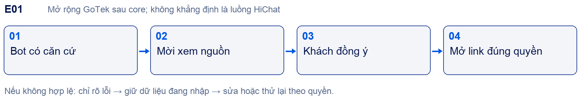

Core cần câu trả lời có nguồn và kiểm quyền. Sau core thêm lời mời xem tài liệu gốc theo ngữ cảnh; người dùng từ chối vẫn tiếp tục chat. Citation phải gắn version, đoạn trích và audience; link hết hạn/thu hồi báo rõ. Không mở nguồn nội bộ cho visitor public.
Nghiệm thu: Kiểm nguồn đúng câu trả lời, từ chối mở, nguồn bị thu hồi và quyền thay đổi; không claim đây là USP độc quyền từ brief cũ.

### E02 CRM lead và cơ hội bán hàng
Nguồn: D1 mục2,3,5,6; D2 F08 F12. Liên kết core: [[H13|H13]] · [[H16|H16]] · [[H17|H17]] · [[H25|H25]].

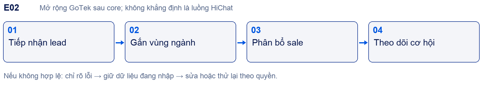

Sau core contacts thêm lead lifecycle, owner, vùng/ngành, cơ hội bị lỡ và phân bổ lại. Cần PO chốt stage dictionary, lý do mất, cách tính conversion; không tự dùng một pipeline SaaS mặc định. Tái dùng Contact, custom fields, assignment và event reports; không tạo bản sao khách hàng riêng.
Nghiệm thu: Một contact nhiều cơ hội; đổi owner có lịch sử; manager chỉ phân bổ nhóm; tổng báo cáo bằng event. AI không tự chốt doanh thu.

### E03 Phân tích AI ngay trong hội thoại
Nguồn: D1 mục5; D2 F05 F12. Liên kết core: [[H03|H03]] · [[H08|H08]] · [[H13|H13]] · [[H25|H25]].

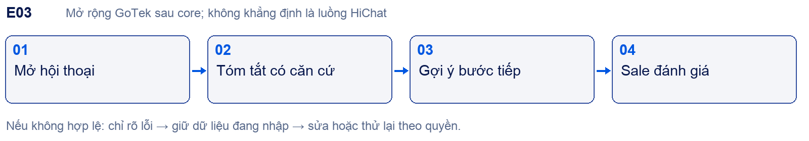

Panel giai đoạn quan tâm, mức tiềm năng và bước tiếp theo sau core. Đây là phần GoTek bổ sung vào khu ngữ cảnh sau khi duyệt thiết kế, không thay timeline hoặc di chuyển composer HiChat. Kết luận AI phải có dữ liệu hỗ trợ, cập nhật thời điểm, phản hồi của sale và trạng thái chưa đủ dữ liệu.
Nghiệm thu: Tắt panel không ảnh hưởng chat; dữ liệu stale được báo; đánh giá sai sửa được; không dùng phân tích làm quyết định tự động ngoài phạm vi tư vấn.

### E04 Lark Wiki và trợ lý nội bộ
Nguồn: D1 mục3,6,7,10; D2 F03 F10 F14. Liên kết core: [[H10|H10]] · [[H11|H11]] · [[H21|H21]] · [[H31|H31]].

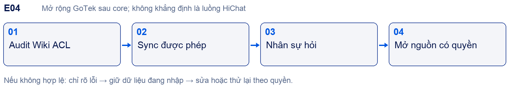

Sau core kết nối Wiki thật bằng quyền được cấp; chọn chiến lược ACL và freshness, audit phân quyền nguồn trước sync. Nội bộ dùng identity doanh nghiệp; khách ngoài chỉ dùng public publish. Không tự nạp 2000 khách Go Media hay tài liệu lương/hợp đồng.
Nghiệm thu: Revoke tại nguồn, chuyển phòng, nghỉ việc, link trực tiếp, citation/snippet/cache; sai quyền phải chặn ở retrieval và nguồn.

### E05 Vai trò kinh doanh và dashboard quản lý
Nguồn: D1 mục3 lớp2,5; D2 F14. Liên kết core: [[H16|H16]] · [[H13|H13]] · [[H24|H24]] · [[H25|H25]] · [[H31|H31]].

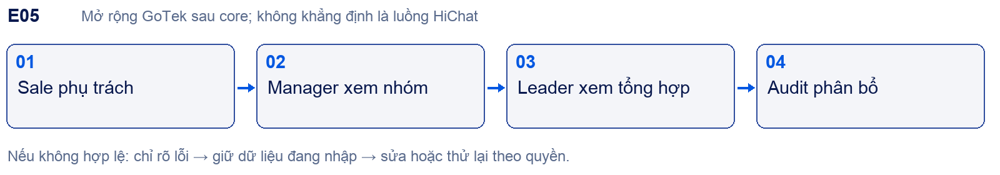

Mở rộng sau core theo permission sets. Sale chính thức/thử việc/thực tập cùng quyền. Manager xem performance và điều phối trong nhóm; Leader số tổng và policy chung, không mặc định vận hành hàng ngày. Platform Admin vẫn là vai trò khác.
Nghiệm thu: Ma trận role×action×scope; staff không nhìn nhóm khác; Leader không có raw key; phân quyền biểu đồ/export cùng phạm vi với UI.

### E06 Onboarding dữ liệu ba nhóm
Nguồn: D1 mục4; D2 F03 F04. Liên kết core: [[H02|H02]] · [[H10|H10]] · [[H11|H11]] · [[H31|H31]].

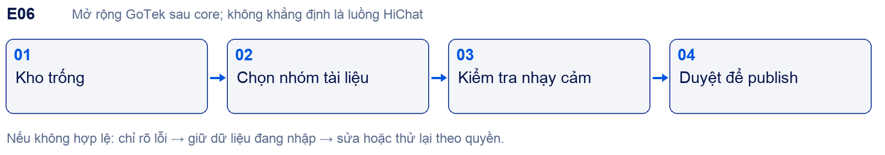

Sau core bổ sung trợ giúp nạp dữ liệu: bảng giá/mô tả/FAQ tối thiểu; quy trình/đào tạo/xử lý từ chối khuyến khích; lương/hợp đồng/tài chính nội bộ loại trừ theo brief. Không chèn wizard này vào đăng ký HiChat trước khi PO duyệt điểm vào.
Nghiệm thu: Tài liệu bị chặn không được index; cảnh báo có lý do và đường xử lý; nhóm khuyến khích phải phân audience, không auto-public.

### E07 Ticket và SLA nâng cao
Nguồn: D2 F07 F12; D1 handover. Liên kết core: [[H03|H03]] · [[H06|H06]] · [[H24|H24]] · [[H29|H29]].

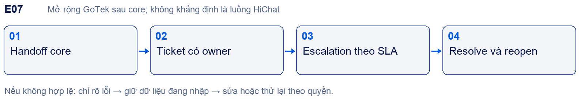

Core cần chuyển người và quyền trả lời ổn định. Sau core mở ticket lifecycle, public/private notes, attachment, escalation và đồng hồ SLA theo lịch. Tái dùng contact, conversation, assignment và outbox.
Nghiệm thu: Không mất bối cảnh, retry không nhân ticket, note không ra widget, SLA có dataset tính tay và reopen policy.

### E08 Catalog đơn hàng và connector giao dịch
Nguồn: D2 F09 F10; D1 tư vấn bán hàng. Liên kết core: [[H14|H14]] · [[H21|H21]] · [[H13|H13]] · [[H32|H32]].

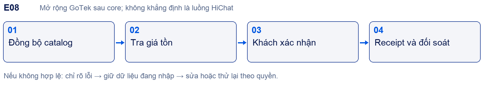

Sau core triển khai read-only catalog rồi từng write action được duyệt. Xác minh API nguồn, timestamp, idempotency, rollback, UNKNOWN và reconcile. Orders HiChat hiện Sắp ra mắt; layout nghiệp vụ thực cần được duyệt là GoTek extension.
Nghiệm thu: Không coi order mock là doanh thu; duplicate timeout không trừ hai lần; giá thay đổi yêu cầu xác nhận lại; thất bại có log nguồn.

### E09 Thuê bao thương mại và hóa đơn
Nguồn: D1 mục11; D2 F15. Liên kết core: [[H23|H23]] · [[H28|H28]] · [[H32|H32]].

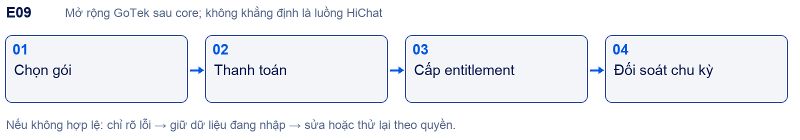

Core phải có usage/quota guard; sau core tích hợp thu phí, invoice, renewal/cancel/refund/grace. D1 ưu tiên tier hội thoại/tháng; giá cụ thể chưa được phê duyệt. Không dùng số sandbox Starter làm bảng giá GoTek.
Nghiệm thu: Provider event trùng, webhook trễ, thất bại, refund, downgrade; usage trace được và không lẫn token/response/conversation.

### E10 Đa kênh và hệ sinh thái tích hợp
Nguồn: D2 F10 F16; HiChat các card tích hợp. Liên kết core: [[H21|H21]] · [[H30|H30]] · [[H03|H03]] · [[H13|H13]].

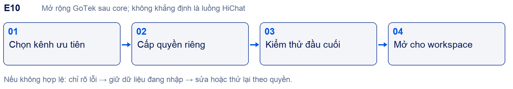

Sau core mở Facebook/Zalo/Telegram và connector theo từng contract/capability. Lark báo cáo khác Lark Wiki/ACL. Sheets/Bitable thu thập khác webhook chung. Lập backlog từng card, kể cả card ngành cần quyết định tương đương.
Nghiệm thu: Mỗi connector cần token revoke/rate limit/retry/receipt; mapping identity không gộp nhầm người; một kênh hỏng không ngắt website.

### E11 Cá nhân hóa phong cách theo sale
Nguồn: D1 mục5 và giai đoạn3. Liên kết core: [[H08|H08]] · [[H09|H09]] · [[H16|H16]] · [[H31|H31]].

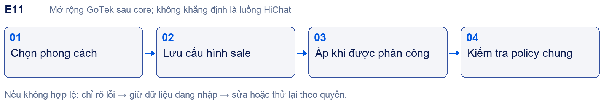

Chỉ giọng điệu,lời chào,chữ ký; không cho đổi logic tư vấn hoặc nguồn tri thức. Tái dùng user profile và bot policy, precedence: quyền/bảo mật và workspace rules cao hơn style cá nhân. Hiệu lực khi chuyển sale phải rõ.
Nghiệm thu: Sale chuyển nhóm/role, rule mâu thuẫn, nguồn cấm, revert version; cá nhân hóa không thay giá/chính sách hoặc lộ tài liệu.

### E12 Mở rộng vận hành sau pilot
Nguồn: D2 F17 F18 và phi chức năng. Liên kết core: [[H22|H22]] · [[H28|H28]] · [[H32|H32]].

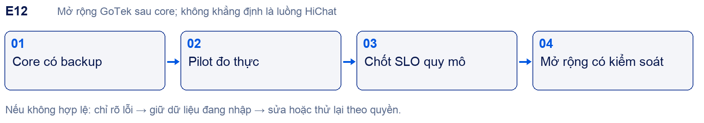

Sau core tăng HA, capacity, dashboard incident, hỗ trợ có hạn và tự động restore drills theo nhu cầu đo được. Tenant isolation, redaction, backup cơ bản và quyền support phải có ngay từ core, không được hoãn với nhãn tối ưu sau.
Nghiệm thu: Load theo workload đã chốt; restore RPO/RTO đo thật; kill switch/rollback; kiểm quyền support; không phát lại side effect sau khôi phục.

### Đối chiếu đầy đủ các mục Product Brief
| Mục D1 | Được giữ ở đâu | Cách xử lý |
| 1 Tổng quan | Phần 1–3, 14–15 | Core trước, không coi deadline nguồn là lệnh triển khai |
| 2 USP | [[E01|E01]], [[E02|E02]], [[H03|H03]], [[E04|E04]] | Giữ yêu cầu, sửa claim độc quyền chưa được chứng minh |
| 3 Hai lớp quyền | [[H16|H16]], [[H31|H31]], [[E05|E05]] | Role ứng dụng và ACL RAG tách nhau |
| 4 Dữ liệu và onboarding | [[H10|H10]], [[H12|H12]], [[E06|E06]] | Không nạp dữ liệu khách làm training mặc định |
| 5 Trải nghiệm | [[H03|H03]], [[E03|E03]], [[E11|E11]] | Inbox theo HiChat; phân tích và style sau core |
| 6 Ngoài và nội bộ | [[H07|H07]], [[H31|H31]], [[E04|E04]] | Public knowledge tách Wiki nội bộ |
| 7 Khách hàng mục tiêu | Phần 3 và [[E04|E04]] | Tệp 2000 khách là bối cảnh nguồn, không phải dữ liệu được phép import |
| 8 Cạnh tranh | Phần 3 và 11 | Không dùng giá/claim chưa cập nhật cho hợp đồng |
| 9 Pháp lý | Phần 10, 11, [[H32|H32]] | Chủ chuyên môn đối chiếu văn bản gốc trước thương mại hóa |
| 10 Kiến trúc mở rộng | [[H02|H02]], [[H28|H28]], [[H31|H31]] | Tenant boundary có ngay từ core |
| 11 Giá | [[H23|H23]], [[E09|E09]] | Tier hội thoại đề xuất; chưa ấn định giá |
| 12 Phân kỳ | Phần 15, E01–E12 | Giữ scope; thay thứ tự theo core HiChat được yêu cầu mới |
| 13 Việc tiếp theo | Phần 12 và 14 | Repo/ACL/metric/UI evidence còn phải chốt |
| 14 Nguồn | Phần 3, 13 và bản gốc đính kèm | Nguồn thứ cấp không tự trở thành kết luận kỹ thuật/pháp lý |

### Đối chiếu tài liệu Báo cáo và mô tả dự án
| Mục D2 | Liên kết trong bàn giao | Điều kiện áp dụng |
| 1–2 Mục tiêu và ba lớp | Phần 3, [[H02|H02]], [[H07|H07]], [[H28|H28]] | Platform không mặc định đọc chat tenant |
| 3 Tệp khách hàng | Phần 3 và core pilot | Chọn một doanh nghiệp, một website và owner tri thức |
| 4 Phạm vi | H01–H32; E01–E12 | Mock/source claim không thay bằng chứng runtime |
| 5 F01–F18 | [[section_10|Phần 10]] và phiếu phần 17 | Giữ đủ 18 điều kiện, sửa cách hiểu consent F08 |
| 6 Phi chức năng | Phần 10, [[H27|H27]], [[H32|H32]] | Không lùi bảo mật/tenant/privacy sang sau core |
| 7 Hiện trạng và release | Phần 1, 12, 14 | 92 test là thông tin tài liệu, chưa tái chạy trong repo này |
| 8 Pilot | Phần 10 và từng phiếu H | Số liệu cần nguồn event/receipt, không dựa lời AI |
| 9 Rủi ro | Phần 10, [[H11|H11]], [[H21|H21]], [[H32|H32]] | Crawler/connector/restore có bằng chứng riêng |
| 10 Quyết định | Phần 10, 12 và 15 | Chốt owner/dữ liệu/provider/ngưỡng trước pilot |
| 11 Tài liệu repo | Phần 13–14 | Các file repo được nguồn nhắc tới chưa xác minh tại workspace này |

---BREAK---
## 16 Đặc tả UI UX Gotek theo HiChat

### Nguyên tắc khóa thiết kế
HiChat quyết định cấu trúc màn, menu, vị trí thao tác và luồng đã quan sát. Gotek quyết định logo và màu nhận diện. Không tự thay hệ thống thành dashboard mẫu của AI. Khi chưa có ảnh/thao tác nguồn, dùng nhãn CHỜ XÁC MINH và yêu cầu thiết kế bổ sung; không xem wireframe minh họa là bằng chứng tương đương.
Giữ rail chức năng, sidebar module, header, vùng nội dung, filter, table/list và panel như nguồn. Giữ thứ tự tab, nội dung form và thao tác chính/phụ. Không thêm hero, bento cards, gradient toàn màn, chart trang trí, dark glass hoặc animation không có trong nguồn. Không thay contacts bằng CRM pipeline; pipeline là E02 được duyệt riêng.

### Tài sản thương hiệu và mức chắc chắn
Nguồn trực tiếp: thư mục Go Tek người dùng cung cấp, gồm Logo, Card, Social pots, Thumbnail, Áo, Thẻ tên, bìa brandguideline. Trong thư mục này chỉ thấy bìa/thankyou của brand guideline, không thấy PDF quy chuẩn đầy đủ hoặc webfont. Palette dưới đây nhận diện từ SVG màu; các token UI bổ sung được ghi là đề xuất, không phải mã màu chính thức do designer xác nhận.
Logo gốc giữ nguyên tỷ lệ và gradient, không vẽ lại bằng chữ, không recolor. Bản màu dùng trên nền sáng; trắng trên nền tối; chừa clear space. Font Gilroy/SVN-Gilroy theo profile asset cần file và license trước khi dùng web; fallback đề xuất Be Vietnam Pro với hỗ trợ tiếng Việt. Trong Word dùng Arial để đảm bảo đọc được, không coi font tài liệu là font UI cuối.

| Token | Giá trị | Nguồn và cách dùng |
| Gradient icon | #37C1F0 → #314F9F → #00BDD5 | Trích SVG; giữ nguyên trong logo, không dùng làm nền mọi card |
| Chữ logo | #273C93 → #1A1A49 | Trích SVG; không dựng lại chữ bằng font thường |
| ui.primary | #0057E1 | Đề xuất từ profile asset; nút chính/link/active trên nền sáng |
| ui.primary.hover | #0047BC | Đề xuất; hover không dịch chuyển layout |
| ui.text | #0A1A4F | Đề xuất trên nền sáng |
| ui.muted | #5A6B8C | Đề xuất cho nhãn phụ; kiểm contrast trên nền thực |
| ui.bg và surface | #F4F5F9 và #FFFFFF | Đề xuất chế độ sáng, giữ diện tích vùng như HiChat |
| ui.border | #E3E7F0 | Đề xuất; viền form/table không thay bố cục |
| ui.focus | #0057E1 + vòng tương phản | Đề xuất; thấy rõ trên cả nền và nút |
| success warning danger | Có icon và nhãn + màu semantic riêng | Không đồng nhất với màu brand; designer chốt trước code |

Sky và Aqua chỉ là màu trang trí hoặc đồ họa, không dùng chữ nhỏ trên nền trắng. Giữ role semantic của lỗi/disabled/success, không đổi mọi trạng thái thành xanh Gotek. Dark mode đang quan sát ở HiChat; chưa có dark token chính thức trong bộ asset nên cần designer chốt cặp màu và kiểm contrast, không tự đảo màu tự động.

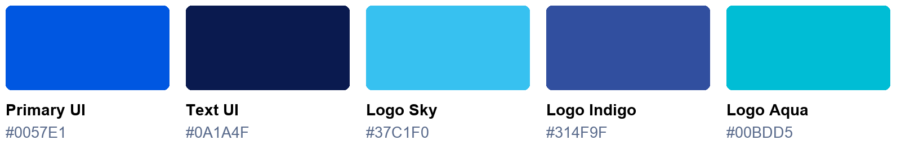

### Ma trận áp màu mà giữ nguyên bố cục
| Thành phần HiChat | Giữ nguyên | Thay bằng Gotek |
| Logo rail và login | Khung, vị trí, padding nguồn | Logo nguyên gốc phù hợp nền |
| Nav đang chọn màu tím | Vị trí, width, radius và icon gốc quan sát | Primary Gotek; trạng thái focus/active rõ |
| Button và link | Kích thước, hierarchy, thứ tự hành động | Accent phù hợp contrast; destructive vẫn semantic |
| Header và bảng | Typographic hierarchy, cột, mật độ, toolbar | Neutral/text Gotek theo theme được duyệt |
| Widget | Launcher, bubble, composer, lời chào và tab nguồn | Logo, màu chủ đề, tên doanh nghiệp đúng workspace |
| Charts | Loại biểu đồ, trục, filter và metric | Palette phân biệt series, không dùng gradient che dữ liệu |

### Ảnh tham chiếu thực tế
Hai ảnh dưới chụp sandbox HiChat tại viewport 1280×720 ngày 24/09/2026, dark mode. Ảnh là nguồn hình học cho trạng thái cụ thể; không chứng minh cả mobile hoặc màn có dữ liệu. Banner chưa xác thực email là trạng thái của account, không phải banner mặc định của mọi người dùng GoTek.

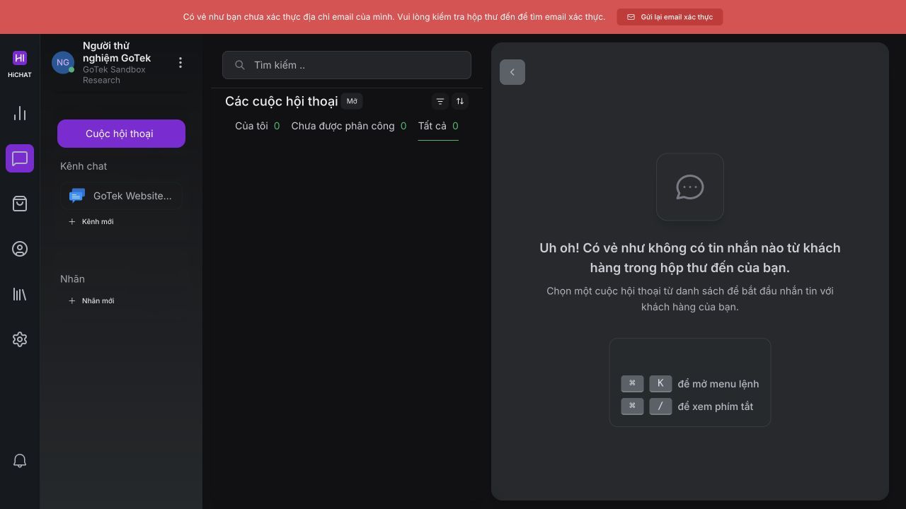

Ảnh UI01 — liên kết [[H03|H03 Inbox]] và [[H27|H27 Responsive]]. Phân biệt rail trái, sidebar kênh/nhãn, danh sách hội thoại và vùng chi tiết. Vùng chi tiết đang trống; không dùng ảnh này để quyết định composer khi đã có tin.

Ảnh UI02 — liên kết [[H12|H12 Collection]], [[H17|H17 Attributes]], [[H21|H21 Sync]]. Nội dung đang cuộn tới nhãn/trường/đồng bộ; top của form ở ngoài ảnh. Giữ cấu trúc navigation hai cấp và card form, không suy ra chiều cao toàn trang từ ảnh này.

### Hợp đồng bàn giao mỗi màn hình
| Trường bắt buộc | Nội dung designer và dev phải lưu |
| Screen ID | Hxx chức năng và mã trạng thái, ví dụ H10 FAQ create empty |
| Reference | URL, ngày, workspace sandbox, viewport, theme, ảnh đầy đủ và vùng scroll |
| Layout | Rail/sidebar/content, alignment, widths đo được, spacing, radius, font size/weight |
| Controls | Nhãn, kiểu, thứ tự tab, required, default, max, helper, validation và disabled |
| State | Empty/loading/populated/error/saving/success/permission denied/offline |
| Interaction | Click/Enter/Escape/back, modal focus, confirm, unsaved changes, retry và toast |
| Data | Entity, permission, request/response, event và readback cần quan sát |
| Evidence | Ảnh trước/sau, case QA, kết quả đúng/sai, người duyệt ngoại lệ |

Không hard-code kích thước ước lượng trong phần 3 thành chuẩn pixel. Đo theo từng ảnh nguồn cùng viewport rồi lưu token được duyệt. 1280/1440 desktop,768 tablet,390/360 mobile là bộ kiểm thử đề xuất; breakpoint chỉ chốt sau khi có ảnh nguồn tương ứng.

### Component và trạng thái phải đối chiếu
Rail và sidebar có expanded/collapsed/selected/hover/focus; header có breadcrumb và primary action; bảng có sort/filter/search/pagination/empty/loading; modal có focus trap, validation, saving, cancel; editor có text/emoji/file/error; toast có success/failure; destructive action phải nói đối tượng và hậu quả. Chip trạng thái có nhãn rõ; disabled không được chỉ là màu nhạt mà vẫn gọi API.
Composer phải phân biệt reply/note, send pending/failed/retry và file đang tải. Panel contact không mất khi đổi filter. Khi đổi workspace, mọi trạng thái tạm liên quan tenant phải được kiểm soát. Các hành vi chưa quan sát là checklist phải xác minh, không tự khẳng định HiChat hoạt động như mô tả.

### Chỉ dẫn dùng cho AI thiết kế và code
Đầu vào bắt buộc: phiếu H cụ thể, ảnh reference đúng state, token Gotek và route contract. Yêu cầu AI liệt kê phần chưa có bằng chứng trước khi triển khai; phần thiếu để placeholder có nhãn trong bản thiết kế nội bộ. Không tự tạo tên module, cột bảng, chart, breakpoint, icon action hoặc chức năng nghiệp vụ ngoài scope. Không tái sử dụng logo HiChat trong sản phẩm Gotek.
Đầu ra mỗi màn: component map, state matrix, permission map, ảnh triển khai cùng viewport và bảng khác biệt với nguồn. Chỉ thay logo/màu/font đã duyệt; thay đổi flow, semantics, menu hoặc dữ liệu phải có decision ID. Các lỗi dịch của HiChat được đưa vào danh sách chỉnh copy, không tự thay cấu trúc.

### Nghiệm thu UI UX
Đặt ảnh HiChat và GoTek cạnh nhau cùng viewport/state/theme. So topology, thứ tự control, alignment, density và kích thước; ghi rõ khác biệt có chủ ý do brand. Không dùng tổng % pixel giống nhau làm tiêu chí duy nhất vì thay màu/font được cho phép. Duyệt từng màn và từng trạng thái, bao gồm focus, error, loading, long text, empty và mobile. Ảnh sơ đồ ở phần 17 không được dùng thay screenshot nghiệm thu.

---BREAK---
## 17 Thao tác chi tiết và sơ đồ từng nhóm chức năng

Các phiếu dưới đây chuyển danh mục H01–H32 thành đầu việc có liên kết. O là quan sát UI, T là thao tác đã thấy kết quả, D là yêu cầu tài liệu, P là chưa xác minh. Luồng bốn bước minh họa đường đi chính; các số .01 trở đi liệt kê chức năng con. Cấu trúc dữ liệu và test GoTek là thiết kế/điều kiện cần đạt, không phải API nội bộ HiChat được truy cập.
Khi phiếu có P, dev có thể ước lượng và thiết kế phần được chứng minh, nhưng không được đóng parity trước khi thu bằng chứng còn thiếu. Không có mã H nào bị loại vì nằm sau core.

### Bản đồ tra cứu cho team phát triển

| Nhóm công việc | Phiếu liên quan | Kết quả cần nối |
| --- | --- | --- |
| Vào hệ thống | [[H01|H01 Tài khoản]] · [[H02|H02 Workspace]] | Membership và workspace hiện hành |
| Chat website | [[H03|H03 Inbox]] · [[H04|H04 SDK]] · [[H05|H05 Phân công]] · [[H06|H06 Giờ làm]] · [[H07|H07 Widget]] | Visitor → conversation → người xử lý |
| AI và tri thức | [[H08|H08 Provider]] · [[H09|H09 Quy tắc]] · [[H10|H10 Kiến thức]] · [[H11|H11 Crawl]] · [[H12|H12 Thu thập]] | Nguồn được phép → trả lời → dữ liệu khách |
| CRM và cộng tác | [[H13|H13 Contacts]] · [[H14|H14 Orders]] · [[H15|H15 Help Center]] · [[H16|H16 Thành viên]] · [[H17|H17 Metadata]] | Hồ sơ, nội dung và quyền thao tác |
| Tự động hóa | [[H18|H18 Automation]] · [[H19|H19 Macro]] · [[H20|H20 Câu trả lời mẫu]] · [[H21|H21 Tích hợp]] | Trigger → điều kiện → action → kết quả |
| Quản trị, báo cáo | [[H22|H22 Audit SSO]] · [[H23|H23 Usage]] · [[H24|H24 Báo cáo]] · [[H25|H25 Phân tích]] · [[H26|H26 Lịch báo cáo]] | Event → ledger → metric → báo cáo |
| Chất lượng, nền tảng | [[H27|H27 UI chất lượng]] · [[H28|H28 Platform Admin]] · [[H32|H32 Vận hành]] | Tenant isolation, nghiệm thu và khôi phục |
| Mở rộng sau core | [[H29|H29 Ticket]] · [[H30|H30 Đa kênh]] · [[H31|H31 Lark ACL]] · [[section_15|E01–E12]] | Chỉ triển khai khi các phụ thuộc core đạt |

Liên kết trong tài liệu dùng được khi chuyển file cho team. Đường dẫn tới bản gốc trên máy là thông tin truy xuất nguồn; nội dung đối chiếu cần thiết đã được tổng hợp trong file này.

---BREAK---
### H01 Đăng ký đăng nhập và khôi phục

Vai trò: Khách đăng ký; thành viên workspace. Đường vào: /app/auth/signup ; /app/login.

Bằng chứng: T: đã tạo sandbox; P: xác thực email, đăng nhập lại, reset và lỗi.

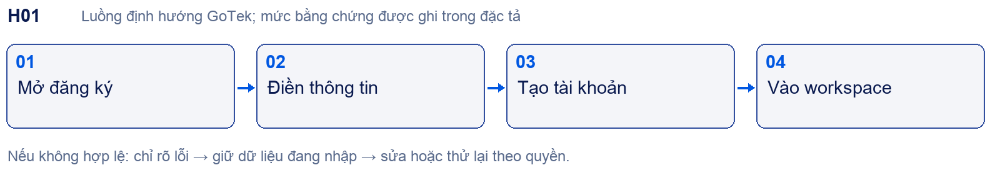

#### Chức năng con và thao tác

- H01.01 Đăng ký: tên đầy đủ, tên doanh nghiệp, email, số điện thoại, mã giới thiệu tùy chọn và mật khẩu; giữ thứ tự theo form nguồn. Không đưa wizard tri thức vào giữa luồng đăng ký.

- H01.02 Xác thực: tài khoản hiện có banner chưa xác thực và Gửi lại email xác thực. Chưa thử link hết hạn, link đã dùng hoặc resend cooldown.

- H01.03 Đăng nhập: email/mật khẩu, hiện/ẩn mật khẩu, ghi nhớ đăng nhập, liên kết khôi phục và đăng ký doanh nghiệp; khôi phục yêu cầu email. Không suy ra remembered session là đăng nhập lại đã đạt.

- H01.04 Thiết kế GoTek: báo lỗi theo trường, chống submit trùng, không lộ email có tồn tại; redirect đúng workspace sau xác thực. Các tình huống này cần PO chốt sau khảo sát.

#### Dữ liệu và liên kết

User; session; verification challenge; membership. Không lưu mật khẩu hoặc token vào tài liệu.
Phụ thuộc và nơi dùng kết quả: [[H02|H02]] · [[H22|H22]] · [[H23|H23]].

#### Điều kiện nghiệm thu

Tạo mới → xác thực → logout → login; sai mật khẩu; link hết hạn; cùng email; refresh; truy cập khi chưa có membership. Cần screenshot từng trạng thái trước khi chốt parity.

Tra cứu: [[section_2|Danh mục]] · [[section_10|Ma trận F01–F18]] · [[section_15|Sau core]] · [[section_16|UI UX]].

---BREAK---
### H02 Workspace và ngữ cảnh doanh nghiệp

Vai trò: Owner và thành viên. Đường vào: /settings/general.

Bằng chứng: O/T: account214 và menu workspace; P: tạo/chuyển workspace thứ hai.

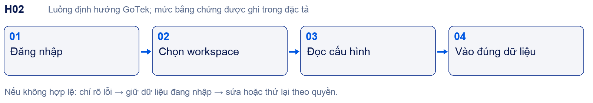

#### Chức năng con và thao tác

- H02.01 Ghi rõ account/workspace đang hoạt động ở sidebar; account214 chỉ là ID khảo sát, không hard-code.

- H02.02 Cài đặt doanh nghiệp: đối chiếu tên, ngôn ngữ và thiết lập được nguồn hiển thị; giữ form trong Cài đặt, không tự chuyển thành màn landing.

- H02.03 Khi chuyển workspace, tải lại membership và dữ liệu có scope; xóa cache UI của workspace trước. Đây là yêu cầu GoTek.

- H02.04 Mời thành viên, giới hạn người dùng và quyền cấu hình nối H16/H23; không coi dropdown chọn account là kiểm thử tenant isolation.

#### Dữ liệu và liên kết

Workspace → memberships → inboxes/bot; workspace_id do server xác định.
Phụ thuộc và nơi dùng kết quả: [[H01|H01]] · [[H16|H16]] · [[H22|H22]] · [[H28|H28]].

#### Điều kiện nghiệm thu

Hai workspace và hai tài khoản: URL sửa account ID không trả dữ liệu; quay lại không thấy cache chéo; thành viên bị thu hồi không tiếp tục thao tác.

Tra cứu: [[section_2|Danh mục]] · [[section_10|Ma trận F01–F18]] · [[section_15|Sau core]] · [[section_16|UI UX]].

---BREAK---
### H03 Inbox hội thoại và chuyển người

Vai trò: Agent; Workspace Admin. Đường vào: /dashboard ; /inbox/:inbox.

Bằng chứng: O: danh sách trống và bộ lọc; P: hội thoại có dữ liệu và takeover thực.

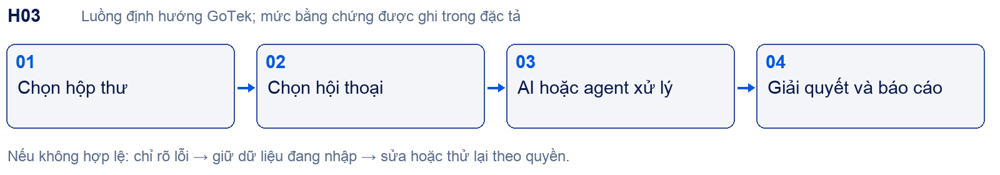

#### Chức năng con và thao tác

- H03.01 Danh sách: tìm kiếm; trạng thái Mở; Của tôi, Chưa được phân công, Tất cả; sidebar kênh và nhãn. Screenshot inbox-empty là mốc hình học hiện có.

- H03.02 Mở hội thoại: cần thu ảnh đầy đủ composer, timeline, thông tin khách, assignment và menu hành động. Không dựng chi tiết panel chưa quan sát thành HiChat đã xác minh.

- H03.03 GoTek core: agent nhận quyền trả lời; khách yêu cầu người thật; trạng thái AI_ACTIVE → HANDOFF_PENDING → HUMAN_ACTIVE; tiếp tục AI phải có hành động rõ.

- H03.04 Tin nhắn gửi phải có pending/sent/failed và retry; ghi chú nội bộ không ra widget; draft không mất khi đổi hội thoại. Cần đo receipt phía khách.

- H03.05 Resolve/reopen/snooze, phân công và đổi ưu tiên nối automation/macro; tất cả thay đổi phải cập nhật realtime và audit.

#### Dữ liệu và liên kết

Conversation; message; assignment; reply-owner version; read cursor; delivery receipt.
Phụ thuộc và nơi dùng kết quả: [[H04|H04]] · [[H08|H08]] · [[H13|H13]] · [[H16|H16]] · [[H18|H18]] · [[H19|H19]] · [[H24|H24]] · [[H29|H29]].

#### Điều kiện nghiệm thu

AI đang tạo câu trả lời thì agent takeover: câu AI cũ không được gửi. Hai agent tranh nhận; mất mạng/retry không nhân đôi; giải quyết rồi khách nhắn lại theo cấu hình.

Tra cứu: [[section_2|Danh mục]] · [[section_10|Ma trận F01–F18]] · [[section_15|Sau core]] · [[section_16|UI UX]].

---BREAK---
### H04 Tạo kênh website và nhúng SDK

Vai trò: Workspace Admin; người quản trị website. Đường vào: /settings/inboxes/new.

Bằng chứng: T: inbox269 tạo xong; P: widget visitor gửi nhận thật.

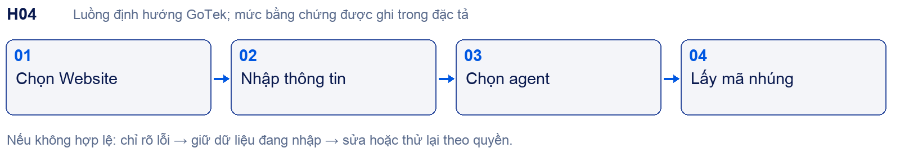

#### Chức năng con và thao tác

- H04.01 Wizard chọn loại kênh Website; nhập tên website/domain và thông tin hiển thị theo form nguồn.

- H04.02 Bước agent chọn thành viên; hoàn tất kênh và chuyển cài đặt hoặc mã nhúng. Inbox269 là sandbox đã tạo, không dùng làm ID GoTek.

- H04.03 Mã nguồn quan sát: SDK tải bất đồng bộ, hichatSDK.run có websiteToken/baseUrl. GoTek cung cấp SDK riêng; không chép token HiChat vào mã sản phẩm.

- H04.04 Đặt script trong body của website test; kiểm tra khởi tạo một lần, nhiều lần nhúng và domain sai. Nút CodePen đã thử nhưng chưa tạo được phiên visitor kiểm chứng.

- H04.05 Không yêu cầu người dùng nhập provider key trong widget; bot token công khai không thay thế kiểm tra domain, tenant và danh tính.

#### Dữ liệu và liên kết

Inbox website; public bot key; domain policy; installation version; visitor session.
Phụ thuộc và nơi dùng kết quả: [[H02|H02]] · [[H05|H05]] · [[H06|H06]] · [[H07|H07]] · [[H03|H03]].

#### Điều kiện nghiệm thu

Website test mở launcher, gửi tin, inbox nhận, agent trả lời, khách nhận; reload giữ session đúng; domain khác bị từ chối; không có secret trong bundle.

Tra cứu: [[section_2|Danh mục]] · [[section_10|Ma trận F01–F18]] · [[section_15|Sau core]] · [[section_16|UI UX]].

---BREAK---
### H05 Cộng tác viên và tự phân công

Vai trò: Workspace Admin. Đường vào: /settings/inboxes/:inbox.

Bằng chứng: O: form và công tắc; P: lưu và thuật toán phân công.

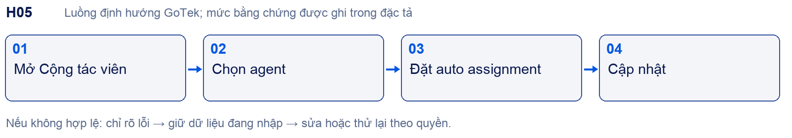

#### Chức năng con và thao tác

- H05.01 Sáu mục cấu hình inbox giữ thứ tự nguồn: Cài đặt, Cộng tác viên, Giờ làm việc, Biểu mẫu trước khi trò chuyện, Trình tạo widget, Cấu hình.

- H05.02 Multi-select agent hiện người thử nghiệm; nhãn heading nguồn dịch là Nhà cung cấp. GoTek cần nhãn tiếng Việt thống nhất được duyệt, không sao chép lỗi dịch máy.

- H05.03 Bật tự động chuyển nhượng đang bật; có Giới hạn tự động phân công tối đa và Cập nhật. Chưa biết rỗng có nghĩa vô hạn hay giá trị mặc định.

- H05.04 Quy tắc phân phối, online/offline, công suất và agent bị gỡ phải được kiểm chứng; không tự ghi round-robin là hành vi HiChat.

- H05.05 Lưu agent và cấu hình auto assignment là hai thao tác cần audit riêng; không để user thiếu quyền thay đổi bằng request trực tiếp.

#### Dữ liệu và liên kết

Inbox membership; availability; assignment policy; concurrency capacity.
Phụ thuộc và nơi dùng kết quả: [[H03|H03]] · [[H16|H16]] · [[H06|H06]] · [[H22|H22]].

#### Điều kiện nghiệm thu

Hai agent, ngưỡng đầy, offline và không có agent: xác minh phân phối và hàng chờ; agent bị gỡ không đọc hội thoại mới.

Tra cứu: [[section_2|Danh mục]] · [[section_10|Ma trận F01–F18]] · [[section_15|Sau core]] · [[section_16|UI UX]].

---BREAK---
### H06 Giờ làm việc và biểu mẫu trước chat

Vai trò: Workspace Admin; visitor. Đường vào: /settings/inboxes/:inbox.

Bằng chứng: O: bật thử form rồi hoàn nguyên, chưa lưu.

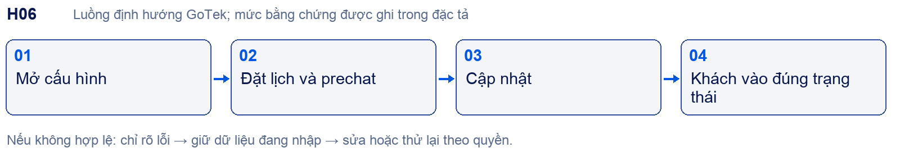

#### Chức năng con và thao tác

- H06.01 Giờ làm việc: công tắc khả dụng; thông báo ngoài giờ; timezone; Chủ nhật–Thứ bảy, khả dụng/cả ngày/giờ bắt đầu-kết thúc. Giá trị sandbox Pacific GMT-07 và 09–17 không phải mặc định GoTek.

- H06.02 Prechat: Có/Không; editor lời nhắn; các hàng emailAddress, fullName, phoneNumber; bật, kiểu, bắt buộc, nhãn và placeholder.

- H06.03 Khi trường tắt, required/label/placeholder disabled. Email đã thử bật thì required còn chọn; chưa kiểm tra validate email phía khách.

- H06.04 Email collection trong hội thoại và prechat phải tránh hỏi lặp; không đồng nhất thông tin bắt buộc với đồng ý marketing.

- H06.05 Trạng thái ngoài giờ, agent offline, qua nửa đêm và timezone thay đổi nối H05/H24; chưa biết hỗ trợ ngày lễ hoặc nhiều khoảng trong ngày.

#### Dữ liệu và liên kết

Business hours; timezone; prechat schema; visitor submission; consent purpose.
Phụ thuộc và nơi dùng kết quả: [[H04|H04]] · [[H05|H05]] · [[H07|H07]] · [[H12|H12]] · [[H13|H13]] · [[H24|H24]].

#### Điều kiện nghiệm thu

Trước/sau giờ, cuối tuần, DST nếu có; required thiếu/sai; phone optional; form lưu rồi reload; khách mobile mở bàn phím không che nút gửi.

Tra cứu: [[section_2|Danh mục]] · [[section_10|Ma trận F01–F18]] · [[section_15|Sau core]] · [[section_16|UI UX]].

---BREAK---
### H07 Widget builder preview và danh tính

Vai trò: Workspace Admin; visitor. Đường vào: /settings/inboxes/:inbox.

Bằng chứng: O: sáu mục, preview và HMAC; P: widget thật và chữ ký.

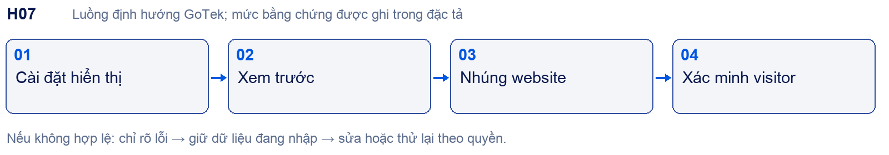

#### Chức năng con và thao tác

- H07.01 Cài đặt: ảnh JPG/PNG ≤5MB và ≤600×600; tên/domain, tiêu đề và mô tả chào, màu, thời gian trả lời vài phút/giờ/ngày.

- H07.02 Toggles: lời chào, email, CSAT, nhắn sau resolved, tiếp tục qua email, file, emoji, khách kết thúc, tên/avatar inbox cho bot; chọn Help Center; tên gửi email.

- H07.03 Builder: vị trí trái/phải; kiểu Chuẩn/Mở rộng; tiêu đề launcher. Viewport hẹp có Cài đặt/Xem trước; preview Mặc định/Chat và Kịch bản.

- H07.04 Preview có tin mẫu, không chứng minh AI hoặc gửi nhận thật. Màu Gotek thay accent/brand; không thay vị trí launcher hay thêm hero trang trí.

- H07.05 Cấu hình có Messenger script, Copy, CodePen; xác thực danh tính với secret và công tắc bắt buộc. Không đưa secret vào ảnh hoặc tài liệu; thuật toán ký cần spec chính thức.

#### Dữ liệu và liên kết

WidgetConfig; public SDK config; server-side identity signature; visitor identity.
Phụ thuộc và nơi dùng kết quả: [[H04|H04]] · [[H06|H06]] · [[H03|H03]] · [[H15|H15]] · [[H22|H22]] · [[H27|H27]].

#### Điều kiện nghiệm thu

So preview với widget cùng config; required signature thiếu/sai/hết hạn; đổi người dùng không nối lịch sử sai; attachment lỗi; emoji; CSAT; resolved và reopen.

Tra cứu: [[section_2|Danh mục]] · [[section_10|Ma trận F01–F18]] · [[section_15|Sau core]] · [[section_16|UI UX]].

---BREAK---
### H08 Provider model và hành vi AI

Vai trò: Workspace Admin chọn model; Platform Admin cấp model. Đường vào: /settings/ai-settings → Tổng quan.

Bằng chứng: O: cấu hình; P: kết nối provider và sinh trả lời.

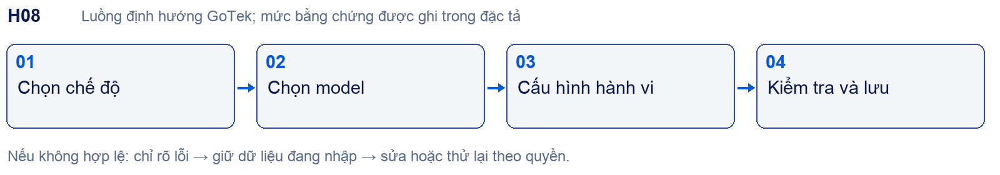

#### Chức năng con và thao tác

- H08.01 Chế độ key HiChat quản lý hoặc API key riêng; model dropdown và Kiểm tra kết nối/Lưu. Danh sách model quan sát không chứng minh model khả dụng.

- H08.02 Tên bot, doanh nghiệp, ngôn ngữ tự động/Anh/Việt; debounce 5s, delay text1s/media5s và temperature0.6 là trạng thái sandbox.

- H08.03 Chế độ tư vấn sản phẩm, hỗ trợ khách hàng; xưng/hô; editor fallback. Không bật provider trong khảo sát.

- H08.04 GoTek: provider registry và capability server-side; chỉ model được grant; timeout/fallback/quota/kill switch có kết quả phân biệt.

- H08.05 Không coi nút Lưu là publish tri thức. Quy tắc, nguồn, tool và quyền H09–H12 được kiểm tra trước mỗi lượt trả lời.

#### Dữ liệu và liên kết

Model grant; provider secret reference; routing; generation policy; request usage.
Phụ thuộc và nơi dùng kết quả: [[H09|H09]] · [[H10|H10]] · [[H11|H11]] · [[H12|H12]] · [[H23|H23]] · [[H28|H28]] · [[H32|H32]].

#### Điều kiện nghiệm thu

Provider lỗi/timeout/hết quota; model không đủ capability; fallback đúng; usage chỉ tính theo receipt; retry không gửi đáp án hai lần.

Tra cứu: [[section_2|Danh mục]] · [[section_10|Ma trận F01–F18]] · [[section_15|Sau core]] · [[section_16|UI UX]].

---BREAK---
### H09 Quy tắc AI và nhập xuất

Vai trò: Workspace Admin. Đường vào: /settings/ai-settings → Quy tắc AI.

Bằng chứng: T: một rule được tạo; O: còn hiển thị trong lần mở lại; P: ảnh hưởng runtime, edit và import.

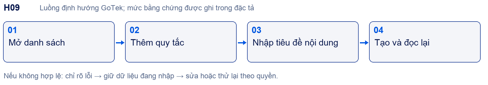

#### Chức năng con và thao tác

- H09.01 Danh sách: tìm kiếm, checkbox chọn, Thêm quy tắc, Tải xuống XLSX, Tải lên XLSX/CSV; card có trạng thái và cập nhật.

- H09.02 Form tiêu đề bắt buộc tối đa150, nội dung bắt buộc tối đa2000; Tạo disabled khi trống. Rule sandbox đã tạo, không phải tri thức khách.

- H09.03 Import theo mẫu xuất; cần đặc tả header, encoding, dòng lỗi, trùng và quota. Chưa đo thực tế nên không tự chọn chính sách ghi đè.

- H09.04 Chính sách GoTek: rule không được vượt tenant, quyền nguồn, bảo mật hoặc cho phép tự xác nhận giao dịch; version và audit khi sửa.

- H09.05 Trạng thái active chỉ là cấu hình được bật, chưa chứng minh mọi phản hồi đều tuân thủ. QA cần thử rule mâu thuẫn, bị tắt và prompt injection.

#### Dữ liệu và liên kết

AI rule; active flag; version; import batch/errors; evaluation case.
Phụ thuộc và nơi dùng kết quả: [[H08|H08]] · [[H10|H10]] · [[H23|H23]] · [[H22|H22]].

#### Điều kiện nghiệm thu

Tạo/lưu/reload; 150/151 và 2000/2001; import một dòng lỗi; quota2 của sandbox; tắt rule không còn tác dụng khi chạy AI.

Tra cứu: [[section_2|Danh mục]] · [[section_10|Ma trận F01–F18]] · [[section_15|Sau core]] · [[section_16|UI UX]].

---BREAK---
### H10 FAQ kho thông tin mẫu câu và ảnh

Vai trò: Workspace Admin; editor theo quyền GoTek. Đường vào: /settings/ai-settings → Kiến thức cho AI.

Bằng chứng: O: bốn danh sách và form mới đã đọc; P: lưu/import/retrieval/ảnh runtime.

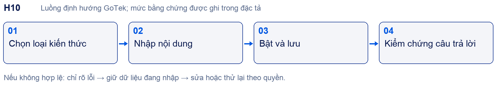

#### Chức năng con và thao tác

- H10.01 FAQ/Kịch bản phản hồi: câu hỏi kích hoạt bắt buộc100 ký tự; Thêm bước → editor mỗi bước; tối đa5 ảnh/bước chọn từ thư viện; tổng câu trả lời2000; danh mục; active bật; Hủy/Tạo.

- H10.02 Kho thông tin: Thông tin cho AI bắt buộc100; editor nội dung bắt buộc2000; danh mục tùy chọn, thêm danh mục; active bật. Lọc danh mục/trạng thái/nguồn thủ công/mới-cũ.

- H10.03 Mẫu hội thoại: UI gọi Mẫu câu AI; tiêu đề150, nội dung2000 bắt buộc; Hủy/Tạo. Danh sách tìm kiếm, mới/cũ và nhập xuất XLSX/CSV.

- H10.04 Ảnh: Thêm thư mục → tên và mô tả bắt buộc, danh mục, Hủy/Lưu. Hướng dẫn nêu thư mục/ảnh active, title/description/tags, ẩn/hiện, copy URL, image_item_id; tối đa10 ảnh gần nhất/thư mục trong prompt. Chưa thử upload.

- H10.05 FAQ và kho thông tin có filter/search/import/export; giới hạn này chỉ áp dụng form tương ứng. Pipeline DRAFT/job/publish/version theo D2 phải được tích hợp rõ, không tự gắn nhãn là UI HiChat.

#### Dữ liệu và liên kết

FAQ + ordered steps + image references; business item; sample; image folder/item; version/publication.
Phụ thuộc và nơi dùng kết quả: [[H08|H08]] · [[H09|H09]] · [[H11|H11]] · [[H23|H23]] · [[H31|H31]] · [[H32|H32]].

#### Điều kiện nghiệm thu

Chỉ nguồn active/publish đúng quyền xuất hiện; thu hồi ảnh không trả URL cũ; FAQ nhiều bước đúng thứ tự; lỗi import không ghi dở; vượt từng giới hạn báo đúng trường.

Tra cứu: [[section_2|Danh mục]] · [[section_10|Ma trận F01–F18]] · [[section_15|Sau core]] · [[section_16|UI UX]].

---BREAK---
### H11 Nguồn web và crawler

Vai trò: Workspace Admin; editor. Đường vào: /settings/ai-settings → Nguồn dữ liệu cho AI.

Bằng chứng: O: danh sách và form; P: crawl, lịch refresh, lỗi.

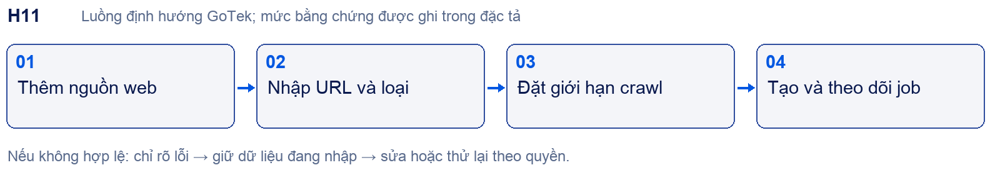

#### Chức năng con và thao tác

- H11.01 Nguồn web: tìm kiếm; trạng thái Hoạt động/Tạm dừng/Lỗi; loại URL/Sitemap/RSS; empty state và Thêm nguồn web.

- H11.02 Form: Tên nguồn*, URL*, Loại nội dung*; số trang tối đa20, độ sâu2, độ trễ0 giây đang hiển thị; Hủy/Tạo disabled khi trống.

- H11.03 Chưa thử Sitemap/RSS validation hoặc job. Không suy ra URL chỉ cho domain chính, cron, format parser hay lịch auto-refresh.

- H11.04 D2 yêu cầu giới hạn bytes/time/host, chặn SSRF/loopback/private IP/metadata/DNS rebinding; kiểm tra mọi redirect chứ không chỉ URL đầu.

- H11.05 Nguồn thay đổi → version mới → index thử → publish/rollback; lỗi crawl không xóa bản đang phục vụ. Trạng thái này là backend GoTek đề xuất theo D2.

#### Dữ liệu và liên kết

WebSource; crawl job; fetched page; content version; index revision; publish pointer.
Phụ thuộc và nơi dùng kết quả: [[H10|H10]] · [[H08|H08]] · [[H23|H23]] · [[H31|H31]] · [[H32|H32]].

#### Điều kiện nghiệm thu

URL hợp lệ, 404, JS, redirect, sitemap lớn, RSS thay đổi, nguồn cấm; lỗi giữ bản cũ; timeout và retry hữu hạn; draft không được trả lời.

Tra cứu: [[section_2|Danh mục]] · [[section_10|Ma trận F01–F18]] · [[section_15|Sau core]] · [[section_16|UI UX]].

---BREAK---
### H12 Thu thập dữ liệu và đồng bộ

Vai trò: Workspace Admin; visitor. Đường vào: /settings/ai-settings → Thu thập dữ liệu.

Bằng chứng: O: cấu hình và form trường; P: extraction/sync/auto stop.

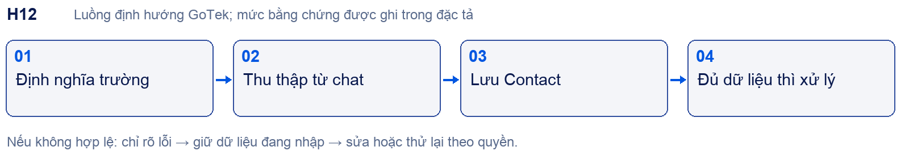

#### Chức năng con và thao tác

- H12.01 Bật thu thập dữ liệu; tự tắt chatbot khi đủ Chỉ trường bắt buộc/Toàn bộ trường. Hai nút disabled khi công tắc liên quan tắt.

- H12.02 Thêm nhãn khi hoàn tất: công tắc, tên data_collected, màu; cho lowercase/số/gạch ngang/gạch dưới; nhãn tự tạo nếu chưa có theo mô tả UI.

- H12.03 Thêm trường: Tên trường*, Tên hiển thị*, mô tả; Trường bắt buộc mặc định tắt; Bật thu thập mặc định bật; Tạo disabled khi trống.

- H12.04 Hướng dẫn ghi giá trị vào thuộc tính tùy chỉnh Contact và đồng bộ đích. Đích Tắt/Google Sheets/Lark Bitable và Lưu đích đồng bộ; chưa chọn kết nối.

- H12.05 Cần phân biệt chưa có/đang thu/đã đủ; sửa giá trị, consent và kiểu dữ liệu liên hệ; bot dừng vì đủ dữ liệu không tự đồng nghĩa handoff thành công.

#### Dữ liệu và liên kết

Collection field; extraction candidate; validated contact attribute; completion event; sync outbox.
Phụ thuộc và nơi dùng kết quả: [[H03|H03]] · [[H13|H13]] · [[H17|H17]] · [[H21|H21]] · [[H25|H25]] · [[H26|H26]].

#### Điều kiện nghiệm thu

Khách từ chối, sửa thông tin, đủ required nhưng thiếu optional; không tắt sớm; trùng event không ghi hai dòng; sync lỗi có retry/receipt; không yêu cầu marketing consent để hỗ trợ.

Tra cứu: [[section_2|Danh mục]] · [[section_10|Ma trận F01–F18]] · [[section_15|Sau core]] · [[section_16|UI UX]].

---BREAK---
### H13 CRM liên hệ và hồ sơ khách

Vai trò: Agent theo scope; Workspace Admin. Đường vào: /contacts ; /contacts/:id.

Bằng chứng: T: tạo contact không email/phone; O: hồ sơ/gộp; P: ghi chú/gộp/outbound.

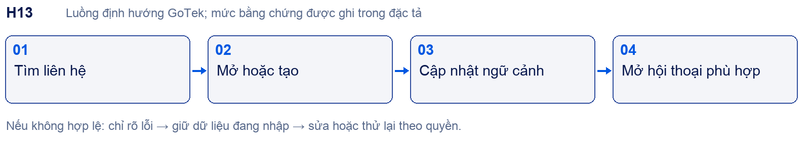

#### Chức năng con và thao tác

- H13.01 Danh sách có Khách hàng, Kênh chat, Đơn hàng, Nhãn, Hành động; tìm kiếm/filter và theo kênh; empty state không phải dữ liệu thật.

- H13.02 Thêm liên hệ: tên/họ/email/phone/quốc gia/thành phố/tiểu sử/công ty. Lần thử không email và phone vẫn lưu thành công; tiêu đề form ghi Chỉnh sửa thông tin liên hệ.

- H13.03 Hồ sơ: thông tin xã hội, Thuộc tính/Ghi chú/Gộp; ghi chú200 ký tự, nút lưu disabled khi trống. Không suy ra note contact là note nội bộ hội thoại.

- H13.04 Gộp: liên hệ chính giữ lại và ưu tiên trường xung đột, liên hệ phụ bị gộp/xóa theo UI. Chưa thực hiện; cần preview và phục hồi GoTek theo D2.

- H13.05 Gửi tin nhắn với contact thủ công báo Không có hộp thư nào để bắt đầu...; Website inbox không tự gắn contact. CRM lead pipeline/scoring sau core ở E02/E03.

#### Dữ liệu và liên kết

Contact; identities; attributes; note; merge audit; conversation links; consent.
Phụ thuộc và nơi dùng kết quả: [[H03|H03]] · [[H12|H12]] · [[H17|H17]] · [[H14|H14]] · [[H31|H31]].

#### Điều kiện nghiệm thu

Tên đầy đủ lưu đúng; không tự gộp trùng tên; permission note; không có kênh; gộp preview; xóa/export có audit; không lộ khách ngoài nhóm.

Tra cứu: [[section_2|Danh mục]] · [[section_10|Ma trận F01–F18]] · [[section_15|Sau core]] · [[section_16|UI UX]].

---BREAK---
### H14 Catalog và đơn hàng

Vai trò: Agent; người quản lý catalog; visitor. Đường vào: /orders.

Bằng chứng: O: HiChat Sắp ra mắt; D: D2 F09; P: toàn bộ giao dịch.

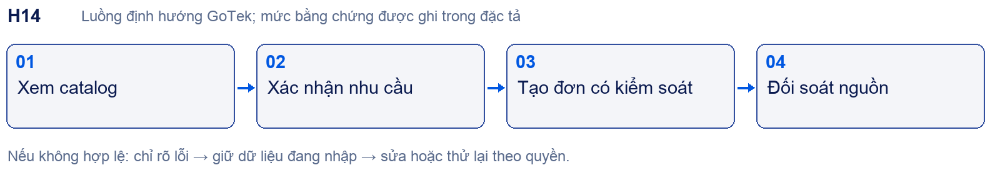

#### Chức năng con và thao tác

- H14.01 Không dựng checkout hoạt động rồi gọi là bản sao HiChat: hiện chỉ có menu Orders và Sắp ra mắt. UI thực thi là thiết kế GoTek cần duyệt.

- H14.02 D2: giá, tồn kho, trạng thái và timestamp nguồn; catalog sản phẩm hoặc danh mục dịch vụ theo workspace.

- H14.03 Đơn test không trừ hàng thật; thao tác ghi cần khách xác nhận và idempotency; timeout có UNKNOWN chờ reconciliation.

- H14.04 Contact có cột đơn hàng nhưng chưa chứng minh order flow. Nối contact/conversation/order theo ID đúng tenant.

- H14.05 Thanh toán, shipping và doanh thu chỉ được ghi thành công sau receipt hệ thống nguồn; triển khai sau core theo E08.

#### Dữ liệu và liên kết

CatalogItem; inventory snapshot; order intent; transaction; provider receipt.
Phụ thuộc và nơi dùng kết quả: [[H13|H13]] · [[H21|H21]] · [[H23|H23]] · [[H28|H28]] · [[H32|H32]].

#### Điều kiện nghiệm thu

Giá stale, hết hàng, timeout, duplicate, rollback; order mock tách ledger thật; không AI tự tuyên bố đã thanh toán.

Tra cứu: [[section_2|Danh mục]] · [[section_10|Ma trận F01–F18]] · [[section_15|Sau core]] · [[section_16|UI UX]].

---BREAK---
### H15 Help Center và nội dung công khai

Vai trò: Editor; Workspace Admin; visitor. Đường vào: /portals/portal_articles_index.

Bằng chứng: O: form portal Name/Slug; P: biên tập, publish và tìm kiếm.

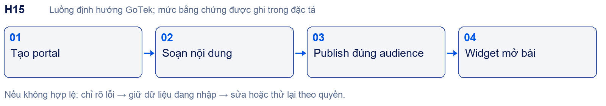

#### Chức năng con và thao tác

- H15.01 Menu Help Center có sẵn; form Name/Slug mới quan sát. Không tự chốt toàn bộ editor hoặc taxonomy của HiChat.

- H15.02 D2 yêu cầu article/category/locale/audience, nháp/xuất bản/thu hồi và search; quyền editor khác quyền publish nếu được PO phê duyệt.

- H15.03 Inbox có chọn Trung tâm trợ giúp; bài public hiển thị đúng portal/locale. Bài nội bộ không xuất ra widget public.

- H15.04 Thu hồi phải xóa khỏi search và cache, không chỉ ẩn hàng trong admin; URL cũ tuân theo policy truy cập.

- H15.05 Import web không tự động xuất bản Help Center; cần ranh giới giữa nguồn AI và nội dung công khai.

#### Dữ liệu và liên kết

Portal; category; article; locale; audience; version; search index.
Phụ thuộc và nơi dùng kết quả: [[H07|H07]] · [[H10|H10]] · [[H11|H11]] · [[H16|H16]] · [[H31|H31]].

#### Điều kiện nghiệm thu

Draft bị chặn ở URL public; publish/withdraw; search theo locale; xóa index; truy cập chéo workspace; bài không có kết quả.

Tra cứu: [[section_2|Danh mục]] · [[section_10|Ma trận F01–F18]] · [[section_15|Sau core]] · [[section_16|UI UX]].

---BREAK---
### H16 Thành viên nhóm và vai trò

Vai trò: Workspace Admin. Đường vào: /settings/people/agents.

Bằng chứng: O: agents/teams/custom roles; P: mời nhận và quyền đa tài khoản.

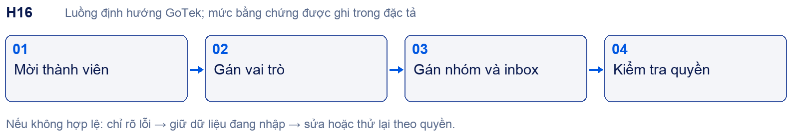

#### Chức năng con và thao tác

- H16.01 Giữ cấu trúc Quản lý nhân sự và phân biệt agent/team/custom role; không dùng chức danh kinh doanh làm system role mặc định.

- H16.02 GoTek mapping: Owner/Admin quản lý workspace; Agent xử lý scope được gán; Editor/Analyst/Billing chỉ khi permission set được chốt.

- H16.03 Sale chính thức/thử việc/thực tập cùng vai trò theo D1. Manager thấy nhóm, Leader thấy tổng hợp; Leader không phải Platform Admin.

- H16.04 Membership account không đồng nghĩa tham gia tất cả inbox; agent assignment H05 và nhóm H03 cần kiểm soát server.

- H16.05 Mời hết hạn, email đã tồn tại, thu hồi, rời workspace và hạ quyền là P; không gửi lời mời người thật trong khảo sát.

#### Dữ liệu và liên kết

Membership; team; role; permission set; invitation; inbox membership.
Phụ thuộc và nơi dùng kết quả: [[H01|H01]] · [[H02|H02]] · [[H03|H03]] · [[H05|H05]] · [[H22|H22]] · [[H23|H23]] · [[H31|H31]].

#### Điều kiện nghiệm thu

Mỗi endpoint thử allow/deny với ít nhất hai role; thu hồi có hiệu lực session/realtime; agent không sửa billing/provider; không vượt số seat.

Tra cứu: [[section_2|Danh mục]] · [[section_10|Ma trận F01–F18]] · [[section_15|Sau core]] · [[section_16|UI UX]].

---BREAK---
### H17 Nhãn và thuộc tính tùy chỉnh

Vai trò: Workspace Admin; agent sử dụng. Đường vào: /settings/labels/list ; /settings/custom-attributes/list.

Bằng chứng: O: form và types; P: lưu, list options, regex.

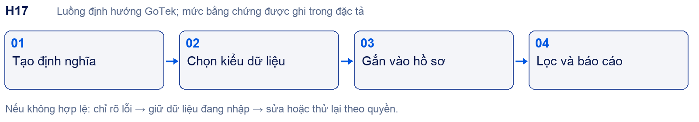

#### Chức năng con và thao tác

- H17.01 Nhãn: tên bắt buộc, mô tả, màu, Hiển thị nhãn trên sidebar bật; Hủy/Tạo, tên trống bị disabled.

- H17.02 Thuộc tính: Cuộc hội thoại/Liên lạc; Áp dụng cho Conversation/Contact, tên hiển thị, khóa, mô tả*, kiểu và bật regex.

- H17.03 Kiểu Text, Number, Link, Date, List, Checkbox; cần khảo sát từng form phụ và giá trị rỗng, format ngày, số thập phân.

- H17.04 Collection H12 ghi Contact attribute; automation H18 có thể thêm/xóa nhãn; reports H25 lọc theo nhãn.

- H17.05 Đổi khóa/type có dữ liệu phải có migration hoặc chặn rõ; không silently drop. Đây là yêu cầu GoTek cần thiết kế.

#### Dữ liệu và liên kết

Label; entity-label link; attribute definition; typed value; validation rule.
Phụ thuộc và nơi dùng kết quả: [[H12|H12]] · [[H13|H13]] · [[H18|H18]] · [[H19|H19]] · [[H25|H25]].

#### Điều kiện nghiệm thu

Trùng khóa, unicode, regex lỗi/tốn thời gian, xóa label đang dùng; filter cập nhật; permissions; migration type giữ dữ liệu đúng.

Tra cứu: [[section_2|Danh mục]] · [[section_10|Ma trận F01–F18]] · [[section_15|Sau core]] · [[section_16|UI UX]].

---BREAK---
### H18 Tự động hóa hội thoại

Vai trò: Workspace Admin. Đường vào: /settings/automation/list.

Bằng chứng: O: builder; P: lưu và chạy.

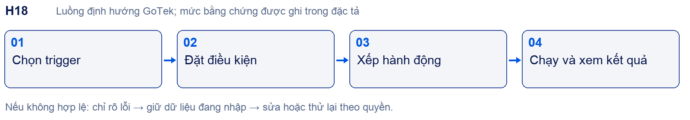

#### Chức năng con và thao tác

- H18.01 Form Tên luật, Mô tả, Sự kiện, Điều kiện, Hành động; thêm/xóa hàng; hàng thứ hai VÀ/HOẶC.

- H18.02 Trigger: hội thoại tạo/cập nhật/mở và tin nhắn tạo; condition có trạng thái/ngôn ngữ/email/quốc gia/phone/referrer/inbox/priority. Operator phụ thuộc kiểu; precedence AND/OR chưa chứng minh.

- H18.03 Actions: agent/team, thêm/xóa nhãn, email nhóm/transcript, tắt/hoãn/resolve, webhook, attachment/message, priority và Add SLA.

- H18.04 D2: version/dry run/action ledger; giới hạn vòng lặp, event idempotency, lỗi giữa chừng không tự lặp lại hành động đã thành công.

- H18.05 Mỗi action nhận scope từ workspace; không cho rule gọi endpoint/đính kèm ngoài quyền hoặc gửi note nội bộ ra khách.

#### Dữ liệu và liên kết

AutomationRule; condition tree; action list; event; execution ledger.
Phụ thuộc và nơi dùng kết quả: [[H03|H03]] · [[H16|H16]] · [[H17|H17]] · [[H21|H21]] · [[H29|H29]] · [[H32|H32]].

#### Điều kiện nghiệm thu

AND/OR truth table, trigger lặp, action2 lỗi sau action1, replay, quyền webhook, chống loop rule A↔B; có trạng thái partial failure.

Tra cứu: [[section_2|Danh mục]] · [[section_10|Ma trận F01–F18]] · [[section_15|Sau core]] · [[section_16|UI UX]].

---BREAK---
### H19 Macro nhiều hành động

Vai trò: Agent tạo riêng; Admin chia sẻ theo quyền. Đường vào: /settings/macros ; /settings/macros/new.

Bằng chứng: O: builder/thứ tự/công khai; P: lưu và thực thi.

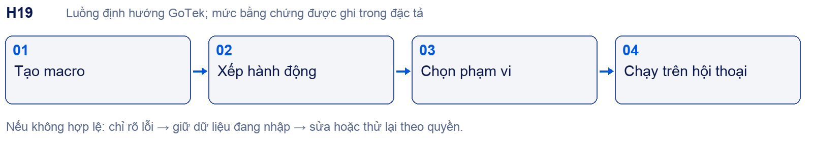

#### Chức năng con và thao tác

- H19.01 Canvas Bắt đầu → action → Thêm hành động mới → Kết thúc; kéo tay cầm sắp thứ tự theo hướng dẫn nguồn.

- H19.02 Actions: team/agent, nhãn, gỡ nhóm, email transcript, tắt/hoãn/resolve, file/message, note riêng, priority.

- H19.03 Tên Macro; Công khai/Riêng tư; Lưu macro. Công khai là trong account, không phải Internet.

- H19.04 Phân biệt macro do agent gọi với automation theo event; cả hai có action audit nhưng không chia sẻ quyền vượt role.

- H19.05 Xác minh note và reply khác nhau; partial failure cần báo action nào xong/lỗi, retry không gửi trùng.

#### Dữ liệu và liên kết

Macro; owner; visibility; ordered actions; execution result.
Phụ thuộc và nơi dùng kết quả: [[H03|H03]] · [[H16|H16]] · [[H17|H17]] · [[H18|H18]] · [[H20|H20]] · [[H22|H22]].

#### Điều kiện nghiệm thu

Hai agent kiểm visibility; kéo thứ tự; quyền gọi; action không còn hợp lệ; gửi file lỗi; replay không gửi đôi; note chỉ nội bộ.

Tra cứu: [[section_2|Danh mục]] · [[section_10|Ma trận F01–F18]] · [[section_15|Sau core]] · [[section_16|UI UX]].

---BREAK---
### H20 Thư mẫu phản hồi

Vai trò: Agent theo quyền; Admin quản lý. Đường vào: /settings/canned-response/list.

Bằng chứng: O: form và giới hạn file; P: upload và composer.

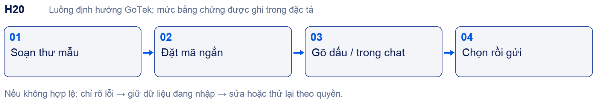

#### Chức năng con và thao tác

- H20.01 Modal Mã rút gọn, Tin nhắn editor, tệp đính kèm, Hủy/Lưu; danh sách và tìm kiếm cần đối chiếu khi có dữ liệu.

- H20.02 Hướng dẫn UI tối đa5 tệp, 40MB/tệp; ảnh/video/audio/PDF/DOC/DOCX. Không áp giới hạn này cho nguồn tri thức.

- H20.03 Composer dùng /mã để chèn thư; việc chọn mẫu không được tự gửi trước khi agent xác nhận theo UX cần kiểm chứng.

- H20.04 Tệp quét MIME/kích thước; URL tải có quyền và thời hạn; mẫu bị sửa/xóa khi agent đang soạn xử lý rõ.

- H20.05 Mẫu câu AI H10 là dữ liệu cho bot, không phải canned reply cho agent. Hai module không gộp.

#### Dữ liệu và liên kết

CannedResponse; short code; rich content; attachment references.
Phụ thuộc và nơi dùng kết quả: [[H03|H03]] · [[H19|H19]] · [[H16|H16]] · [[H32|H32]].

#### Điều kiện nghiệm thu

Mã trùng, 6file, 40MB+, MIME sai, thiếu quyền, template bị xóa; nội dung XSS; chèn đúng và gửi được phía visitor.

Tra cứu: [[section_2|Danh mục]] · [[section_10|Ma trận F01–F18]] · [[section_15|Sau core]] · [[section_16|UI UX]].

---BREAK---
### H21 Tích hợp và webhook

Vai trò: Workspace Admin; quản trị tích hợp. Đường vào: /settings/integrations.

Bằng chứng: O: 11 card và 10 event; P: kết nối/delivery.

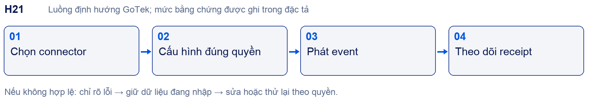

#### Chức năng con và thao tác

- H21.01 Card: Webhooks, Ứng dụng bảng điều khiển, Linear, Dialogflow, Google Translate, Dyte, Lark, Google Sheets, Kim Kiều Flower, CDP, KiotViet. Không loại bỏ card mà chưa ghi quyết định sản phẩm.

- H21.02 Webhook form: tên tùy chọn, URL, checkbox event, Hủy/Tạo disabled khi trống.

- H21.03 Event conversation_created/status_changed/updated; message_created/updated; webwidget_triggered; contact_created/updated; data_collected/data_collection_completed.

- H21.04 D2: secret vault, scope, signature contract, retry hữu hạn, outbox/dead letter/replay và delivery log; các chi tiết này chưa xác minh là cơ chế HiChat.

- H21.05 Connector ngành cần mapping dữ liệu và API thật riêng. Ứng dụng bảng điều khiển cần sandbox nội dung nhúng và quyền; không mặc định chung contract với webhook.

#### Dữ liệu và liên kết

IntegrationConfig; secret reference; event envelope; delivery attempt; external ID map.
Phụ thuộc và nơi dùng kết quả: [[H12|H12]] · [[H14|H14]] · [[H18|H18]] · [[H26|H26]] · [[H30|H30]] · [[H31|H31]] · [[H32|H32]].

#### Điều kiện nghiệm thu

Timeout, HTTP429/500, webhook trùng/out-of-order, quyền thu hồi, chữ ký sai, endpoint private; không leak secret; receipt cho từng connector.

Tra cứu: [[section_2|Danh mục]] · [[section_10|Ma trận F01–F18]] · [[section_15|Sau core]] · [[section_16|UI UX]].

---BREAK---
### H22 Audit và bảo mật SSO

Vai trò: Workspace Admin; auditor theo quyền. Đường vào: /settings/audit-logs/list ; /settings/security.

Bằng chứng: O: event mời admin; SSO lỗi tải; P: cấu hình hoạt động.

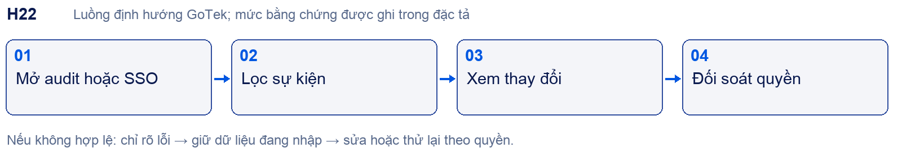

#### Chức năng con và thao tác

- H22.01 Audit có actor, vai trò, thời gian/IP trong event mời; không đưa IP thật vào tài liệu. Một event không chứng minh bao phủ tất cả thao tác.

- H22.02 SSO mô tả Google Workspace/Microsoft/Okta và công tắc; đã thấy Không tải được cài đặt. Vui lòng thử lại. Không coi lỗi này là yêu cầu tái tạo.

- H22.03 GoTek: log actor/action/target/change/time/request/reason, có retention và quyền export; không lưu secret hoặc toàn nội dung chat mặc định.

- H22.04 Bật SSO cần test fallback admin và tránh lockout; role mapping và revoke phải đúng workspace. Chi tiết form chờ xác minh.

- H22.05 Đăng nhập/SSO, hỗ trợ platform và content audit là quyền riêng; không dùng một toggle chung.

#### Dữ liệu và liên kết

AuditEvent; auth policy; identity provider config; support grant.
Phụ thuộc và nơi dùng kết quả: [[H01|H01]] · [[H16|H16]] · [[H28|H28]] · [[H32|H32]].

#### Điều kiện nghiệm thu

Login và cấu hình bị từ chối có log; redaction; role revoked; SSO error/retry; tài khoản admin khôi phục; log không sửa trái phép.

Tra cứu: [[section_2|Danh mục]] · [[section_10|Ma trận F01–F18]] · [[section_15|Sau core]] · [[section_16|UI UX]].

---BREAK---
### H23 Gói quota billing và nâng cấp

Vai trò: Owner; billing role; Platform Admin quản lý catalog gói. Đường vào: /settings/billing ; /settings/usage ; /settings/upgrade.

Bằng chứng: O: billing/usage; P: upgrade/payment và meter thực.

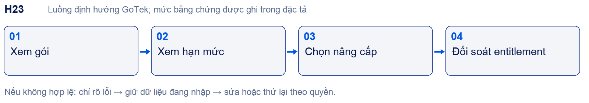

#### Chức năng con và thao tác

- H23.01 Sandbox: Starter/Hoạt động/Miễn phí/Trọn đời/1 giấy phép; Usage người1/2, inbox1/2, AI0/2000, kho0/16. Không coi đây là giá GoTek.

- H23.02 Hạn mức theo từng loại: 2user,2inbox,2000AI hệ thống/tháng,2500API riêng,FAQ5,training5,ảnh2,web1,field3,rule2,sample3.

- H23.03 Nút cổng thanh toán/xem giới hạn/hỗ trợ; nâng cấp chưa thực hiện. Chênh 1 giấy phép và limit2 chưa giải thích.

- H23.04 D1 đề nghị tier hội thoại/tháng; phải tách conversation, AI response, seat, inbox, storage và token. Không cộng meter khác đơn vị.

- H23.05 D2: entitlement chỉ cấp sau event xác nhận, webhook chống trùng; cancel/refund/grace/downgrade lưu policy. Sau core ở E09, nhưng quota guard phải có trong core.

#### Dữ liệu và liên kết

Plan; subscription; entitlement; usage ledger; invoice event; billing receipt.
Phụ thuộc và nơi dùng kết quả: [[H08|H08]] · [[H10|H10]] · [[H16|H16]] · [[H28|H28]] · [[H32|H32]].

#### Điều kiện nghiệm thu

Vượt ngưỡng; reset chu kỳ/timezone; concurrent request gần ngưỡng; payment callback trùng; downgrade không mất dữ liệu; UNKNOWN không coi thất bại để thu tiền lại.

Tra cứu: [[section_2|Danh mục]] · [[section_10|Ma trận F01–F18]] · [[section_15|Sau core]] · [[section_16|UI UX]].

---BREAK---
### H24 Báo cáo tổng quan hội thoại CSAT SLA

Vai trò: Admin; analyst theo scope. Đường vào: /reports/overview ; /reports/conversation ; /reports/csat ; /reports/sla.

Bằng chứng: O: filter/chỉ số/empty; P: công thức và export.

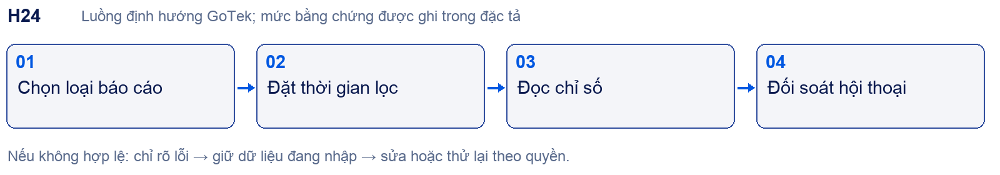

#### Chức năng con và thao tác

- H24.01 Overview: open/unassigned/pending, trạng thái agent, heatmap giờ0–24, khối team/inbox/label và agent; không tự thay bằng dashboard doanh thu.

- H24.02 Conversation: khoảng7ngày/30ngày/3tháng/6tháng/nămngoái/custom,24x7; conversations,incoming/outgoing,first reply,resolution,resolved count,pending time.

- H24.03 CSAT: agent/team/inbox, bộ chọn chưa rõ nhãn, date/export; total responses/satisfaction/response rate; empty phân trang1/0.

- H24.04 SLA: Hit Rate/Misses/Conversations; filter SLA Policy,inbox,agent,team,label; list conversation/policy/agent. Sandbox0conversation nhưng Hit Rate100%.

- H24.05 Metric dictionary GoTek phải định nghĩa numerator/denominator, timezone, bot/agent, reopened, business hours, empty; chưa có dữ liệu thì không tự khẳng định bằng công thức tên gọi.

#### Dữ liệu và liên kết

Conversation events; message timings; CSAT response; SLA policy evaluation; report snapshot.
Phụ thuộc và nơi dùng kết quả: [[H03|H03]] · [[H05|H05]] · [[H06|H06]] · [[H16|H16]] · [[H17|H17]] · [[H29|H29]] · [[H32|H32]].

#### Điều kiện nghiệm thu

Dataset nhỏ có đáp án tính tay; 0 mẫu, ngoài giờ, reopen, missing agent, bot reply; export bằng UI; quyền analyst; drilldown tái tính đúng.

Tra cứu: [[section_2|Danh mục]] · [[section_10|Ma trận F01–F18]] · [[section_15|Sau core]] · [[section_16|UI UX]].

---BREAK---
### H25 Báo cáo dữ liệu kênh agent nhãn nhóm

Vai trò: Admin; analyst. Đường vào: /reports/data-collection ; /reports/inboxes ; /reports/agent ; /reports/label ; /reports/teams.

Bằng chứng: O: đủ các màn/bộ lọc; P: dữ liệu thực và export.

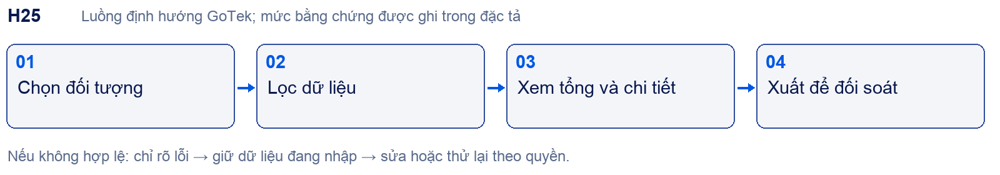

#### Chức năng con và thao tác

- H25.01 Data collection: XLSX,date,trường,tìm kiếm,status tất cả/đã hoàn tất/đang/chưa thu; sort completion/update/name tăng/giảm.

- H25.02 Thẻ tổng khách/đủ/đang/chưa có; tiến độ tuần, theo trường, chi tiết khách. Cảnh báo chưa bật collection/không có trường không phải lỗi xử lý.

- H25.03 Inbox/agent: chọn đối tượng,date,24x7,export và metrics hội thoại. Nhãn/team có title Tổng quan, bộ chọn,7ngày,24x7,Tải báo cáo.

- H25.04 Dropdown giờ ở nhãn có Giờ làm việc/24x7; nhóm hiện List is empty. Chưa thấy biểu đồ sau khi chọn nhóm hoặc nhãn có dữ liệu.

- H25.05 Export là dữ liệu cá nhân, phải cùng scope filter/permission; giá trị bảng và file phải đối soát, không lộ khách tenant khác.

#### Dữ liệu và liên kết

Collection progress; dimension keys; report filters; export job; scoped result.
Phụ thuộc và nơi dùng kết quả: [[H12|H12]] · [[H13|H13]] · [[H16|H16]] · [[H17|H17]] · [[H24|H24]].

#### Điều kiện nghiệm thu

Required vs all, thay schema field, khách sửa dữ liệu; label bị gỡ; agent rời nhóm; range/timezone; XLSX tiếng Việt, công thức CSV injection.

Tra cứu: [[section_2|Danh mục]] · [[section_10|Ma trận F01–F18]] · [[section_15|Sau core]] · [[section_16|UI UX]].

---BREAK---
### H26 Tóm tắt AI và báo cáo định kỳ

Vai trò: Admin; manager theo quyền. Đường vào: /reports/bulk-summary ; /reports/scheduled.

Bằng chứng: O: form bao gồm Lark; P: AI run/schedule delivery.

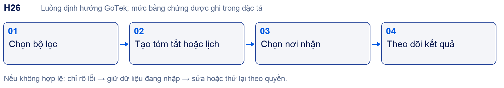

#### Chức năng con và thao tác

- H26.01 Bulk: inbox,status open/pending/resolved/all,7ngày/30/custom,số dòng10/20/50/100; Tạo tóm tắt/Tạo lại tất cả; chưa chạy AI.

- H26.02 Scheduled: tên,active,open-or-pending/only-open/all,timezone,inbox nguồn trống=tất cả; một hoặc thêm lịch.

- H26.03 Đích Chatwoot: inbox nhận→contact nhận; đích Lark: kết nối→nhóm. Trường sau disabled khi chưa chọn trường trước.

- H26.04 Khoảng Trong ngày/tuần/tháng/năm,Giờ18/Phút0 đang hiển thị; chọn tuần không xuất hiện thứ trong lần thử. Cần chốt ranh giới kỳ và tần suất.

- H26.05 Lịch tổng hợp khách chờ trả lời theo mô tả nguồn; không tự dùng để broadcast marketing. Scheduler phải dedup theo report/window/destination và có receipt.

#### Dữ liệu và liên kết

Summary batch; scoped conversations; report schedule/timezone; run window; delivery receipt.
Phụ thuộc và nơi dùng kết quả: [[H03|H03]] · [[H08|H08]] · [[H21|H21]] · [[H24|H24]] · [[H25|H25]] · [[H31|H31]].

#### Điều kiện nghiệm thu

Không data, AI lỗi/hết quota, nhiều lịch trùng, timezone/DST; người nhận mất quyền; retry không gửi đôi; không gửi chat nội bộ vào nhóm ngoài scope.

Tra cứu: [[section_2|Danh mục]] · [[section_10|Ma trận F01–F18]] · [[section_15|Sau core]] · [[section_16|UI UX]].

---BREAK---
### H27 Responsive bàn phím và khả năng tiếp cận

Vai trò: Mọi vai trò. Đường vào: Tất cả dashboard và widget.

Bằng chứng: O: cấu hình inbox hẹp đổi menu; P: matrix viewport và keyboard đầy đủ.

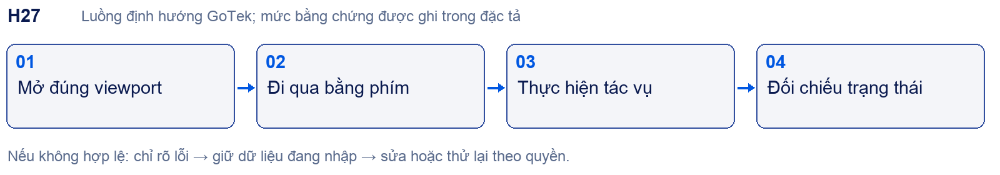

#### Chức năng con và thao tác

- H27.01 Desktop giữ rail/module sidebar/content theo ảnh nguồn. Hẹp: menu tab chuyển dropdown đã quan sát ở widget settings; breakpoint cụ thể chưa đo.

- H27.02 Inbox mobile cần list→conversation→contact có đường quay lại và giữ draft; đây là yêu cầu chất lượng GoTek chờ đối chiếu HiChat mobile.

- H27.03 Modal: focus vào form, trap focus, Escape/Hủy không lưu, trở về trigger; validation đặt ngay trường và đọc được bằng screen reader.

- H27.04 Widget: safe area, bàn phím ảo, upload progress, reconnect và launcher không che CTA website; không dùng màu làm dấu hiệu duy nhất.

- H27.05 Khóa baseline theo viewport/state/theme/font. Không cho AI tự thêm layout SaaS marketing, bento card hoặc animation chưa có trong nguồn.

#### Dữ liệu và liên kết

Viewport/state reference; focus order; accessible name; UI token; visual regression fixture.
Phụ thuộc và nơi dùng kết quả: [[H01|H01]] · [[H03|H03]] · [[H07|H07]] · [[H10|H10]] · [[H13|H13]] · [[H24|H24]].

#### Điều kiện nghiệm thu

Desktop1280/1440,tablet768,mobile390/360 là viewport test đề xuất; capture nguồn tương ứng trước chốt. Tab/ShiftTab/Enter/Escape,200% zoom, lỗi form và đọc nhãn.

Tra cứu: [[section_2|Danh mục]] · [[section_10|Ma trận F01–F18]] · [[section_15|Sau core]] · [[section_16|UI UX]].

---BREAK---
### H28 Platform Admin và cấp quyền AI

Vai trò: Platform Admin; support grant có thời hạn. Đường vào: Không có màn HiChat nội bộ được truy cập.

Bằng chứng: D: D2; P: thiết kế và runtime GoTek.

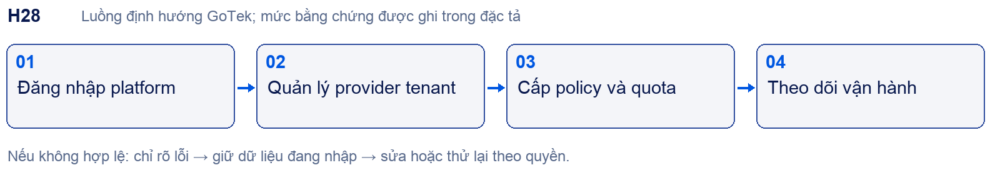

#### Chức năng con và thao tác

- H28.01 Tách console platform với workspace; không giả định HiChat có bố cục Platform Admin giống dashboard khách.

- H28.02 Registry provider/model/capability; secret reference; grant tenant/bot; routing/fallback; quota và kill switch có reason/audit.

- H28.03 Support chỉ metadata mặc định; truy cập nội dung cần grant đúng scope, lý do, thời hạn và log; hết hạn mất quyền.

- H28.04 Tenant lifecycle, plan và health job/queue nối H23/H32; emergency disable không xóa dữ liệu.

- H28.05 UI dùng component Gotek từ shell đã đối chiếu, nhưng navigation platform là thiết kế riêng có nhãn đề xuất, PO duyệt trước code.

#### Dữ liệu và liên kết

Provider; model; capability; tenant grant; policy version; support access; incident.
Phụ thuộc và nơi dùng kết quả: [[H02|H02]] · [[H08|H08]] · [[H22|H22]] · [[H23|H23]] · [[H32|H32]].

#### Điều kiện nghiệm thu

Grant sai capability bị chặn; key không xuất browser; support expiry; disable provider có fallback; cross-tenant; restore không tự mở grant cũ.

Tra cứu: [[section_2|Danh mục]] · [[section_10|Ma trận F01–F18]] · [[section_15|Sau core]] · [[section_16|UI UX]].

---BREAK---
### H29 Ticket SLA và escalation

Vai trò: Agent; manager; visitor xem trạng thái được phép. Đường vào: Theo D2 F07; chưa có route HiChat đã xác minh.

Bằng chứng: D: yêu cầu nguồn; P: UI/runtime.

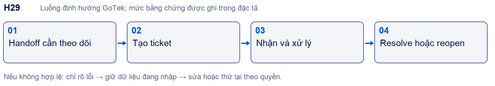

#### Chức năng con và thao tác

- H29.01 Ticket liên kết conversation/contact,không tự tạo trùng khi retry; assignee,status,priority,SLA,attachment và note.

- H29.02 Chuyển từ chat sang ticket giữ bối cảnh và quyền; khách chỉ thấy nội dung public, note nội bộ luôn tách.

- H29.03 SLA theo policy đã chốt: giờ kinh doanh,timezones,pause/escalation; báo cáo H24 cần dùng cùng event và definition.

- H29.04 Resolve/reopen và escalation có thông báo đúng đối tượng; không đồng nhất đóng hội thoại với hoàn tất ticket.

- H29.05 Core phải có handoff ổn định; ticket nâng cao sau core E07. Không lùi reply ownership/consent theo mục đích sang giai đoạn sau.

#### Dữ liệu và liên kết

Ticket; conversation link; status history; SLA clock; escalation job; public/private note.
Phụ thuộc và nơi dùng kết quả: [[H03|H03]] · [[H06|H06]] · [[H13|H13]] · [[H16|H16]] · [[H21|H21]] · [[H24|H24]].

#### Điều kiện nghiệm thu

Retry không nhân ticket; reopen khởi động đồng hồ theo policy; quá hạn và ngày nghỉ; note không lộ; assignee rời nhóm; khách xem đúng ticket.

Tra cứu: [[section_2|Danh mục]] · [[section_10|Ma trận F01–F18]] · [[section_15|Sau core]] · [[section_16|UI UX]].

---BREAK---
### H30 Đa kênh và nhận diện khách

Vai trò: Workspace Admin; agent. Đường vào: Kênh chat → chọn loại kênh.

Bằng chứng: O/D: danh mục kênh; P: provider connect và receipt.

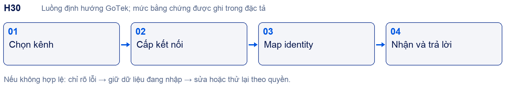

#### Chức năng con và thao tác

- H30.01 Facebook/Zalo/Telegram là phạm vi cần xem contract riêng; không đồng nhất webhook hay widget với omnichannel đã hoàn chỉnh.

- H30.02 Mỗi kênh cần loại tài khoản hỗ trợ, callback/subscription, token expiry/revoke,định dạng message/media và hạn chế thời gian trả lời.

- H30.03 Identity theo channel+external_id+workspace; không gộp người chỉ vì trùng tên,avatar,phone chưa xác minh.

- H30.04 Composer chỉ bật capability kênh cho phép; rate limit/permission denied/unsend hay delivery status phải hiển thị rõ.

- H30.05 Sau core triển khai từng kênh E10; migration conversation và timeline không làm lộ note/nguồn nội bộ.

#### Dữ liệu và liên kết

Channel account; capability; external identity map; event/message mapping; receipt.
Phụ thuộc và nơi dùng kết quả: [[H03|H03]] · [[H04|H04]] · [[H13|H13]] · [[H16|H16]] · [[H21|H21]] · [[H23|H23]].

#### Điều kiện nghiệm thu

Webhook duplicate/out-of-order, hết token, quá cửa sổ, media không hỗ trợ, revoke; E2E inbound/outbound riêng mỗi kênh, không chỉ card Cấu hình.

Tra cứu: [[section_2|Danh mục]] · [[section_10|Ma trận F01–F18]] · [[section_15|Sau core]] · [[section_16|UI UX]].

---BREAK---
### H31 Lark Wiki và quyền tri thức kinh doanh

Vai trò: Sale; manager; leader; knowledge owner. Đường vào: GoTek mở rộng D1 mục3–6; không phải HiChat đã chứng minh.

Bằng chứng: D: hai lớp quyền; P: ACL nguồn và sync.

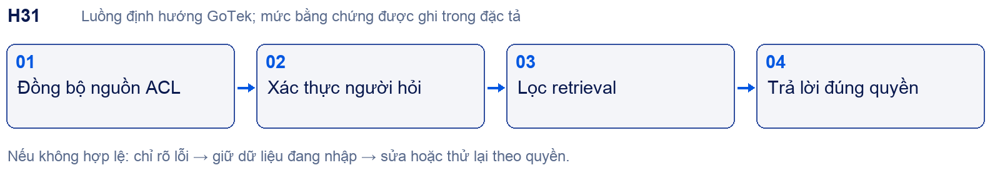

#### Chức năng con và thao tác

- H31.01 Quyền ứng dụng quyết định ai xem/chat/phân bổ; quyền RAG quyết định nguồn trả lời. Phải kiểm cả hai, không dùng role UI để thay ACL nguồn.

- H31.02 Lark Wiki cần audit quyền hiện có; metadata filter,permission sync hoặc check realtime là ba lựa chọn chưa chốt; revoke phải tác động cache và index.

- H31.03 Dữ liệu tri thức tách khách hàng/hội thoại; lương,hợp đồng,tài chính nội bộ loại khỏi nguồn AI theo D1.

- H31.04 Sale cùng quyền dù chính thức/thử việc/thực tập; manager scope nhóm; leader tổng hợp và policy,không default chat thường nhật.

- H31.05 Sau core E04/E05 triển khai Lark/internal assistant; nguồn public website vẫn cách ly ngay trong core. Nội bộ không buộc tạo CRM lead.

#### Dữ liệu và liên kết

Source ACL; subject/group map; document audience; permission version; business role scope.
Phụ thuộc và nơi dùng kết quả: [[H10|H10]] · [[H11|H11]] · [[H13|H13]] · [[H16|H16]] · [[H21|H21]] · [[H28|H28]] · [[H32|H32]].

#### Điều kiện nghiệm thu

Người khác phòng không thấy snippet/citation; revoke có hiệu lực trong thời gian chốt; link gốc kiểm quyền; tenant khác cùng email không được truy cập.

Tra cứu: [[section_2|Danh mục]] · [[section_10|Ma trận F01–F18]] · [[section_15|Sau core]] · [[section_16|UI UX]].

---BREAK---
### H32 Vận hành privacy và khôi phục

Vai trò: Ops; Platform Admin; auditor. Đường vào: Theo D2 F17 F18; GoTek console vận hành.

Bằng chứng: D: yêu cầu; P: production/restore thực.

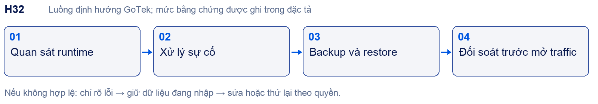

#### Chức năng con và thao tác

- H32.01 Log metadata request/model/provider/time/usage/cost/error; nội dung chỉ bật Content Audit có policy/retention/role; redaction secret.

- H32.02 Worker bounded: claim/retry/backoff/stale recovery/dead letter; idempotency cho mọi side effect và trạng thái UNKNOWN khi chưa có receipt.

- H32.03 Backup database/object/schema/config/secret reference; môi trường restore cô lập,cấm gửi email/webhook và giao dịch cũ.

- H32.04 Đối soát số lượng,file,ACL,index; RPO/RTO cần chủ hệ thống chốt và diễn tập,không coi Git checkpoint là backup dữ liệu.

- H32.05 Incident/rollback/kill switch, retention/export/delete và tenant closure; bản phát hành cần owner ký evidence. Core không được hoãn tenant isolation,bảo mật,backup tối thiểu.

#### Dữ liệu và liên kết

Request/usage/audit ledger; job; outbox; backup manifest; restore report; incident.
Phụ thuộc và nơi dùng kết quả: [[H08|H08]] · [[H11|H11]] · [[H21|H21]] · [[H22|H22]] · [[H23|H23]] · [[H28|H28]].

#### Điều kiện nghiệm thu

Restore sang môi trường mới; kiểm ACL/file/index; không replay side effect; quota reconciliation; lỗi provider; retention purge đúng scope; drill incident và rollback.

Tra cứu: [[section_2|Danh mục]] · [[section_10|Ma trận F01–F18]] · [[section_15|Sau core]] · [[section_16|UI UX]].
