# GoTek Chatbot

GoTek Chatbot là nền tảng hỗ trợ khách hàng cho doanh nghiệp: mỗi workspace có hội thoại, widget và kho tri thức riêng; AI trả lời theo dữ liệu đã xuất bản của doanh nghiệp.

**Status: Active Development / MVP In Progress.** Core backend đang phát triển; chưa nghiệm thu toàn bộ H01–H32/E01–E12, chưa phát hành production. HiChat (hichat.asia, sản phẩm HiLab) là tham chiếu chức năng/UI; không có bằng chứng về kiến trúc backend nội bộ HiChat.

## Product purpose

Tập trung tiếp nhận khách hàng, chuyển tiếp AI/nhân viên, quản lý dữ liệu doanh nghiệp và kiểm soát model/quota từ Platform Admin. Workspace Admin và Platform Admin là hai miền quyền khác nhau.

## Main features

- ✅ Các lát cắt backend đã có kiểm thử local: auth, tenant/RLS, widget/hội thoại, tri thức có phiên bản, quota/jobs/audit. Mức xác minh từng phần ở [PROJECT-STATUS](docs/PROJECT-STATUS.md), không đồng nghĩa nghiệm thu toàn module.
- 🚧 AI grounding, provider/model registry, web ingestion và luồng agent; còn live-provider/browser acceptance.
- ⏳ Phần còn lại của H01–H32 và E01–E12 theo [backlog](delivery/BACKLOG.csv).
- ⚠️ Production bị chặn trong entrypoint; các test DB yêu cầu cluster local chuyên dụng. Không dùng dữ liệu khách thật.

## Tech stack

React 19 + Vite 6; Express 5 + TypeScript; PostgreSQL 16 qua `pg`, SQL migrations (không ORM); Argon2 và cookie session; PostgreSQL durable jobs; local file/runtime storage. Provider transports có Gemini, OpenAI/ChatGPT, Anthropic/Claude Code và custom LLM. Có adapter không đồng nghĩa đã kiểm thử API thật. Không có production hosting/CI/CD đã được xác nhận.

## Quick start

```sh
git clone https://github.com/GoTekIT/GoTek-ChatBOT.git
cd GoTek-ChatBOT
git checkout codex/chatbot-delivery
npm ci
```

Chuẩn bị PostgreSQL theo [DEVELOPMENT](docs/DEVELOPMENT.md), sau đó:

```sh
npm run db:setup
npm run dev
```

Mở http://127.0.0.1:4317. `db:setup` yêu cầu cluster đã chạy; nó không tự cài/start PostgreSQL. `.env.example` chỉ là danh mục cấu hình: backend **không tự đọc `.env`**. Mặc định kết nối qua `.local/runtime.json` do setup tạo; các biến khác phải export trong shell.

## Common commands

| Command | Purpose |
|---|---|
| `npm run dev` | Express + Vite middleware local |
| `npm run build` | TypeScript check + frontend build |
| `npx tsc --noEmit` | TypeScript check |
| `npm test` | Node test runner, serial, có DB integration |
| `npm run db:setup` | Apply SQL migrations |
| `npm run db:restore-drill` | Local backup/restore verification |
| `npm run worker:ai` | AI worker, cần workspace env hoặc `-- --all` |
| `npm run worker:embedding` | Một batch embedding, cần env |
| `npm run worker:web` | Web refresh worker, cần workspace env |

Không có script lint. Xem [TESTING](docs/TESTING.md) trước khi chạy test.

## Documentation map

1. [Start here](docs/00-START-HERE.md)
2. [Project status](docs/PROJECT-STATUS.md)
3. [Architecture](docs/ARCHITECTURE.md)
4. [System flow](docs/SYSTEM-FLOW.md)
5. [Development handoff](docs/HANDOFF.md)
6. [AI agent instructions](AGENTS.md)

Nguồn yêu cầu: [handoff v2.0](delivery/GoTek_Chatbot_Skill_Dev_Kit/handoff/GoTek_ChatBOT_Ban_giao_Dev_Toan_bo.docx), [chỉ đạo](research/USER_DIRECTION.md), [ghi chép khảo sát HiChat](research/HICHAT_AI_SPEC.md), [checkpoint](delivery/CHECKPOINT.md). Tài liệu lịch sử/snapshot không thay thế trạng thái hiện hành và bằng chứng kiểm thử.

## Visual reference and product evidence

The repository contains GoTek assets and captured HiChat reference observations. These images document the source material and current investigation; they do not prove that GoTek has pixel parity or that HiChat's private implementation is known.


| Reference | What it documents | Evidence boundary |
|---|---|---|
| 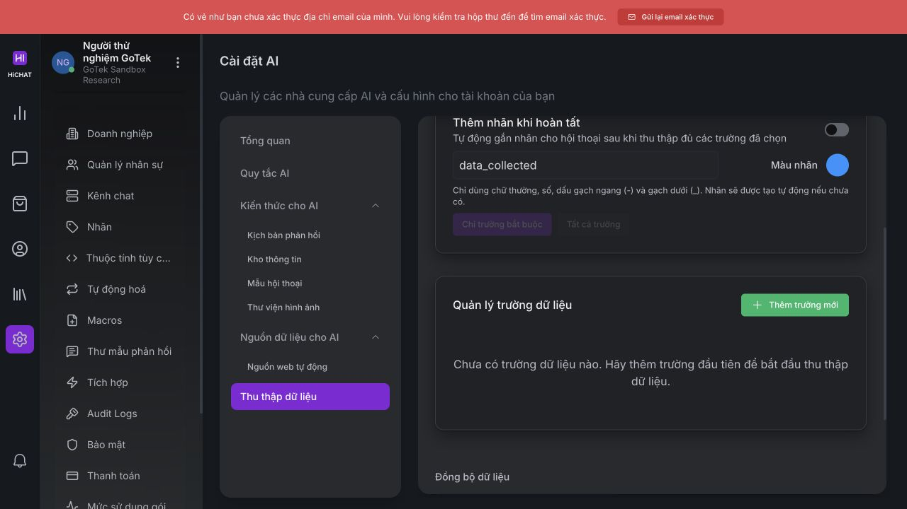 | Knowledge/data collection surface observed during HiChat research | Reference UX only |
| 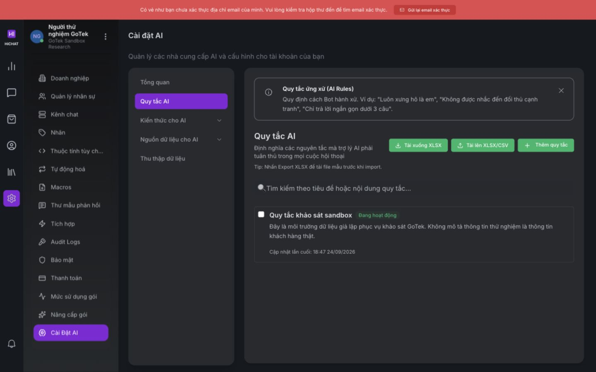 | AI rule list and settings arrangement | Reference UX only |
| 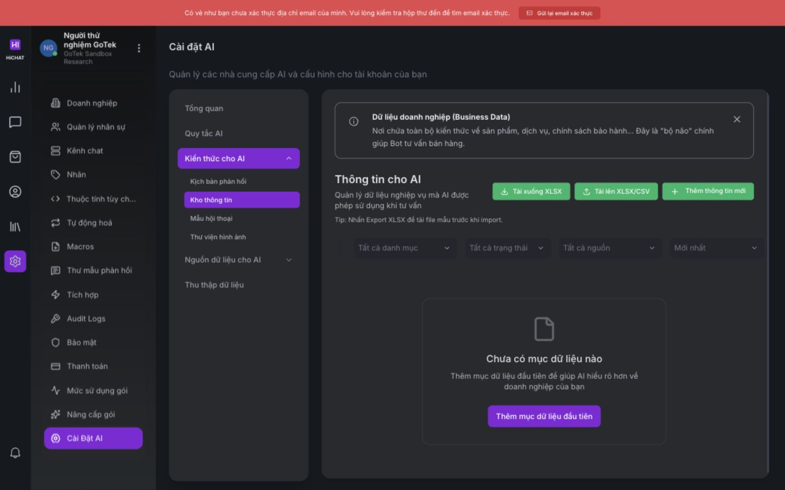 | Knowledge management layout and controls | Reference UX only |
| 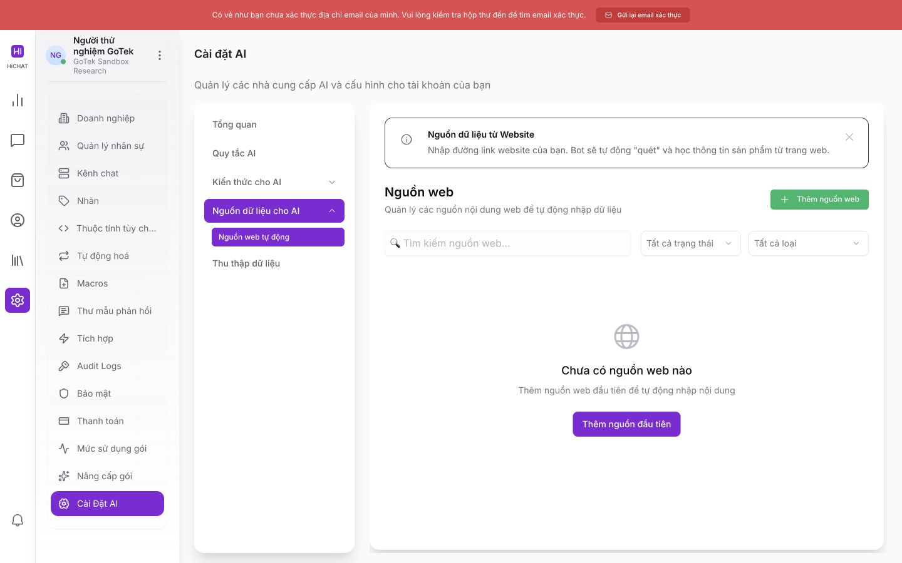 | Web source list and refresh states | Reference UX only |
| 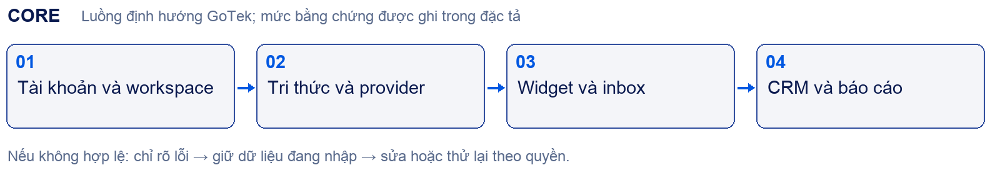 | Handoff scope illustration for the core | Planning/reference asset, not runtime architecture |

## Product model

### Users and permission domains

| Actor | Responsibility | Boundary |
|---|---|---|
| Visitor | Opens a business widget and asks questions | Receives public published knowledge and public messages for that channel only |
| Agent | Reads assigned inbox work and replies | Workspace membership, channel assignment and conversation ownership are checked server-side |
| Workspace Admin/Owner | Configures a business workspace, channels, knowledge, rules and members | Can operate only inside active workspace membership |
| Platform Admin | Registers providers/models, grants capabilities and handles platform operations | Separate platform permission; does not automatically read tenant chat |
| Support operator | Performs an approved operational action | Requires an expiring scoped support grant with reason and audit |

Each workspace represents one business. A widget public key identifies a channel, while the visitor bearer token identifies the visitor session. Neither credential contains a provider secret. The server derives workspace scope from a session, membership or validated widget credential; a client supplied workspace ID is never trusted as authorization.

### Core value

The core path connects business data to a bounded customer answer:

1. A business creates a workspace and channel.
2. Workspace staff import or write knowledge.
3. A draft is processed and explicitly published as `PUBLIC`.
4. The widget creates a visitor session and stores an idempotent message.
5. The worker retrieves current, public, tenant-scoped context.
6. A granted provider receives the grounded prompt on the server.
7. The worker checks ownership, quota and grant state again before committing an answer.
8. A human can take over; stale AI work becomes unknown or is prevented from writing.

## Current delivery status

The current state is **MVP / core backend in progress**. The initial handoff snapshot is `fb8f2589c30d1de936c3cb6b35e067fc2558322d` on branch `codex/chatbot-delivery`; the current commit also includes the expired-grant hardening, fresh core evidence and this expanded guide.

### Verified local evidence

| Area | Current result | What this proves | What it does not prove |
|---|---:|---|---|
| Full configured regression after expired-grant fix | **174/174 PASS** | Existing serial unit/integration suites remain green | Full product acceptance or browser parity |
| P0.1 focused core path | **9/9 PASS** | Auth, tenant isolation, widget, knowledge, grounded AI fixture, quota and audit boundaries | Live provider/email, browser, staging or production |
| Provider/grant focused contract | **19/19 PASS** | Wire shapes, stable errors, endpoint policy, embedding and expired grant fence | Vendor latency, streaming, live receipt or cost |
| TypeScript/build | **PASS** | `tsc --noEmit` and Vite build | Deployment readiness |
| Restore drill | **PASS, 55 tables** | Disposable database restore, hashes, policy/RLS and quarantine checks | Production RPO/RTO or external object restore |

Evidence files are in [`delivery/evidence/`](delivery/evidence/). The source of truth for detailed status is [`docs/PROJECT-STATUS.md`](docs/PROJECT-STATUS.md); the next exact task is [`docs/HANDOFF.md`](docs/HANDOFF.md).

### H/E group status at this snapshot

This table is a scope map, not a completion percentage. A group remains `IN PROGRESS` when only backend slices or focused tests exist.

| Status | H groups | E groups |
|---|---|---|
| `IN PROGRESS` | H01–H13, H16, H22–H23, H28, H32 | E01, E06 |
| `TODO` | H14–H15, H17–H21, H24–H27, H29–H31 | E02–E05, E07–E12 |
| `DONE` | Only explicitly verified slices listed in PROJECT-STATUS | None as a whole epic |
| `DONE BUT NEEDS VERIFICATION` | Provider/grant hardening and other listed slices | None as a whole epic |

The backlog contains 170 rows: 107 `Backlog`, 61 `In progress`, and 2 `Implemented`. These values are intentionally not mass-promoted by passing tests. Group acceptance still requires UI, API/data, permissions, failure states, side-effect evidence and the applicable reference/owner decision.

## End-to-end flows

The diagrams below describe the implementation currently present in the repository. Read the linked system-flow document for preconditions, database changes and failure states.

### 1. Registration, verification and workspace session

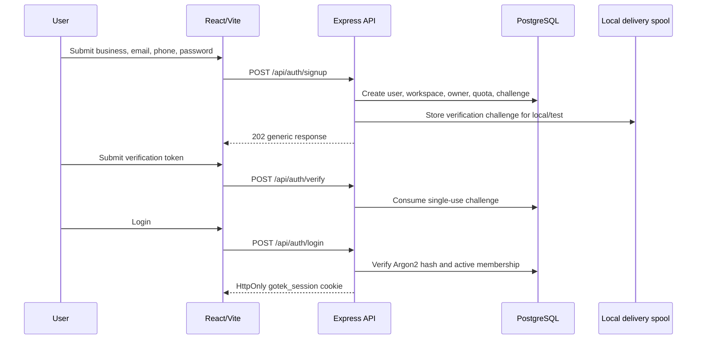

The local delivery spool is test infrastructure. SMTP, email provider receipts and browser acceptance remain open. Reset consumes a single-use token and revokes existing sessions.

### 2. Workspace, channel and visitor widget

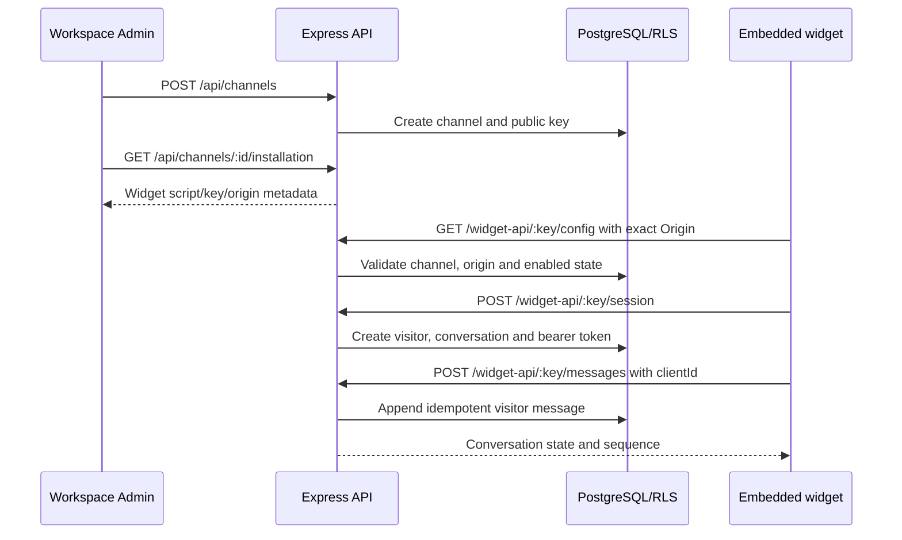

Wrong origin, expired visitor token, disabled channel and cross-tenant identifiers fail with stable errors. Internal staff notes never appear in the public transcript.

### 3. Knowledge import, publish and retrieval

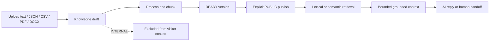

Knowledge versions are immutable after processing. Retrieval checks workspace, audience, active publication, source validity and embedding model/dimension. A visitor cannot select an arbitrary version or private note. Web snapshots follow a similar snapshot → generation draft → publish/rollback lifecycle.

### 4. AI worker, quota and takeover fence

```mermaid
sequenceDiagram
    participant V as Visitor
    participant API as Widget API
    participant Q as PostgreSQL jobs/quota
    participant W as AI worker
    participant P as Provider API
    participant H as Human agent
    V->>API: Send question
    API->>Q: Append message and enqueue ai.reply
    W->>Q: Claim lease and lock owner version
    W->>Q: Check workspace, rules, public knowledge, grant and quota
    W->>P: Grounded request with server-side secret
    P-->>W: Answer and usage metadata
    W->>Q: Recheck lease, owner version, grant and workspace state
    alt AI still owns conversation
        W->>Q: Commit public answer and settle usage
    else Human takeover or state changed
        W->>Q: Record unknown/handoff; do not append stale answer
    end
    H->>API: Takeover / resume AI with expected version
```

Provider failure responses are redacted into stable codes. A grant expiry now stops provider transport before I/O. A dispatched result whose final state is unknown is not blindly retried.

### 5. Platform Admin model and agent flow

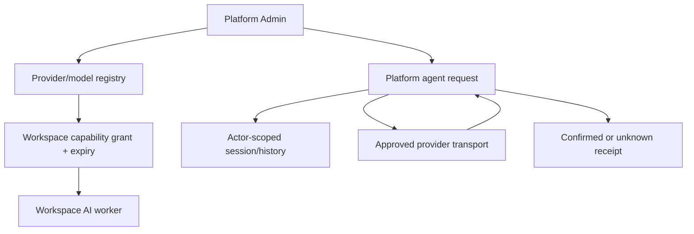

Supported adapter labels are Gemini, Anthropic, `claude_code`, OpenAI, ChatGPT and `custom_llm`. The `claude_code` label currently uses the Anthropic Messages transport; it is not evidence that a Claude Code CLI process is spawned. Provider credentials are environment references on the server and are never accepted as client secrets.

### 6. Web source refresh and generation

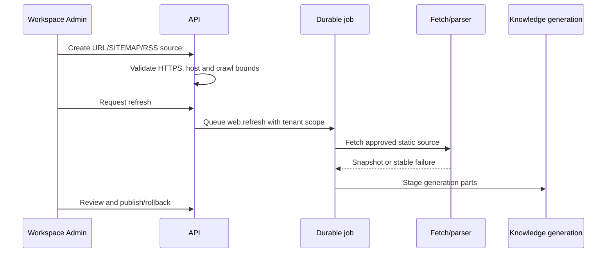

Static HTTP and sitemap paths have focused tests. A browser JavaScript crawler and broad real-source acceptance are not implemented/verified.

### 7. Audit, backup and restore

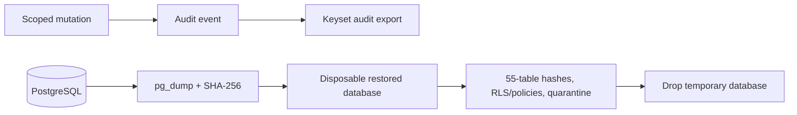

The restore drill quarantines sessions, challenges, local delivery, invitations, jobs and provider effects. It is a local verification tool and does not constitute a production backup policy.

## Failure and state semantics

| Situation | Stored/result state | Expected behavior |
|---|---|---|
| Invalid session or membership | `401` / `403` | No tenant data returned |
| Wrong widget origin | `403 DOMAIN_DENIED` | No widget state or message access |
| Duplicate client/request ID | Existing receipt | No duplicate side effect |
| AI ownership changed | `STALE_REPLY_OWNER` / handoff | Stale AI output is not appended |
| Provider timeout/network/malformed response | Stable provider error | Redacted fallback and handoff; no secret/body leak |
| External dispatch result unknown | `unknown` | No blind resend; reconcile explicitly |
| Expired model grant | `AI_MODEL_REVOKED` | Provider call blocked before transport |
| Quota period closed/exceeded | `QUOTA_PERIOD_CLOSED` / `QUOTA_EXCEEDED` | No dispatch; owner must provision/renew |
| Workspace disabled | `WORKSPACE_DISABLED` | Workers stop claiming/processing work |

## Repository map and where to change what

```text
src/server/        Express routes and backend services
src/web/           React/Vite application pages and API wrapper
public/sdk.js      Public embeddable widget client
db/migrations/     Ordered PostgreSQL schema, RLS and grants
scripts/           Database setup, AI/embedding/web workers, restore drill
tests/             Serial node:test suites and local fixtures
delivery/          H/E requirements, contracts, backlog, checkpoint, evidence
research/          HiChat observations, screenshots and handoff source material
docs/              Current architecture, status, flows and handoff
.ai/               Portable context protocol for coding agents
```

| Change needed | Start here | Check before editing |
|---|---|---|
| Auth/session/tenant | `src/server/app.ts`, `security.ts`, `db.ts` | H01/H02 tests and RLS migrations |
| Widget/inbox/handoff | `widget.ts`, `inbox.ts`, `chat-store.ts`, `channels.ts` | ownership, origin, idempotency and public/private visibility |
| Knowledge/RAG | `knowledge*.ts`, `knowledge-retrieval.ts`, embedding worker | version/audience/publish and model-grant checks |
| Provider/model | `platform.ts`, `provider-transport.ts`, `model-grant-policy.ts` | secrets, endpoint policy, expiry and usage receipt |
| Jobs/workers | `jobs.ts`, `worker.ts`, `scripts/*worker.ts` | lease, retry, unknown and tenant scope |
| Database | `db/migrations/` | add ordered migration; do not rewrite deployed history |
| UI | `src/web/` | use observed HiChat screen/state evidence; preserve GoTek identity |
| Acceptance state | `docs/PROJECT-STATUS.md`, `docs/HANDOFF.md`, `delivery/CHECKPOINT.md` | label Implemented / Verified / Accepted separately |

## Local usage guide

### Prerequisites

- Node/npm and PostgreSQL 16-compatible local tools (`initdb`, `pg_ctl`, `psql`, `pg_dump`, `pg_restore`).
- A dedicated local PostgreSQL cluster on socket `/tmp`, port `55432` for the current test scripts.
- No production account or provider key is needed for auth/widget/knowledge fixture tests.

### Install and run

```sh
npm ci
mkdir -p .local
initdb -D .local/postgres -U gotek_migrator --auth-local=trust --auth-host=scram-sha-256
pg_ctl -D .local/postgres -l .local/postgres.log -o "-p 55432 -k /tmp -h 127.0.0.1" start
npm run db:setup
npm run dev
```

Open `http://127.0.0.1:4317`. The backend does not load `.env` automatically. If `DATABASE_URL` is absent, it reads the private `.local/runtime.json` created by `db:setup`. Never commit that file.

### Build, test and restore

```sh
npm run build
npx tsc --noEmit
npm test
npm run db:restore-drill
```

The package test script runs serially because integration fixtures share the dedicated local database. Do not run the full suite concurrently against the same cluster.

### Worker commands

```sh
GOTEK_WORKER_WORKSPACE=<workspace-uuid> npm run worker:ai -- --once
npm run worker:ai -- --all --once
GOTEK_WORKER_WORKSPACE=<workspace-uuid> npm run worker:web -- --once
GOTEK_WORKER_WORKSPACE=<workspace-uuid> \
GOTEK_KNOWLEDGE_VERSION=<version-uuid> \
GOTEK_EMBEDDING_MODEL=<model-uuid> \
npm run worker:embedding
```

Workers are separate processes from the web server. `--all` and a specific workspace selector are mutually exclusive. Provider calls may consume real quota when credentials are configured.

### Environment inventory

See [.env.example](.env.example). Important variables are `DATABASE_URL`, `APP_ORIGIN`, `COOKIE_SECURE`, `SERVE_BUILD`, `GOTEK_DEFAULT_AI_RESPONSE_QUOTA`, worker selectors, embedding selectors and token-metering rates. Provider rows hold the name of a server-side secret environment variable; actual key values never belong in this file or the database payload.

## What is not implemented yet

The following is intentionally explicit so a new developer does not mistake a route or component for a complete feature:

- Full browser acceptance for signup, email, workspace switch, widget embed, inbox takeover and mobile/accessibility states.
- Live Gemini/OpenAI/Anthropic/custom LLM receipts, vendor rate limits, streaming/tool calls and real cost reconciliation.
- JavaScript-rendered web crawler and broad source-provider acceptance.
- Catalog/orders, Help Center, labels, automations, macros, templates, integrations/webhooks, reports, CSAT/SLA, ticket escalation, omnichannel and Lark Wiki flows.
- Commercial subscription/invoicing and the E02–E12 expansion groups.
- H32.05 retention/delete/tenant closure policy, legal hold, object/vector deletion, owner sign-off and production RPO/RTO.
- Production hosting, CI/CD, secrets manager, monitoring, multi-instance rate limiting and staging release evidence.

Do not close any of these from a green unit test alone. Use `UNKNOWN / NEEDS VERIFICATION` when the required external evidence or owner decision is absent.

## Parallel delivery protocol

Parallel work is allowed only with disjoint file ownership:

1. Name the H/E or P0 slice and its acceptance contract.
2. Assign one source/test/evidence area to each worker; do not let two workers edit the same migration, route or status document.
3. Run shared PostgreSQL suites serially from the integration owner.
4. Rebase or inspect every diff before integration; never discard another worker's unfinished changes.
5. The integration owner runs build, full tests, restore drill and updates checkpoint/backlog.

This protocol is why the current core work can proceed in multiple tracks without presenting conflicting status as one completed feature.

## Further reading

- [First 30 minutes](docs/00-START-HERE.md)
- [Product overview](docs/PRODUCT-OVERVIEW.md)
- [Current project status](docs/PROJECT-STATUS.md)
- [Architecture](docs/ARCHITECTURE.md)
- [System flows](docs/SYSTEM-FLOW.md)
- [Database](docs/DATABASE.md)
- [API inventory](docs/API.md)
- [Development setup](docs/DEVELOPMENT.md)
- [Testing and verification matrix](docs/TESTING.md)
- [Known issues](docs/KNOWN-ISSUES.md)
- [Actionable TODO](docs/TODO.md)
- [Development handoff](docs/HANDOFF.md)
- [Conversation summary](docs/CONVERSATION-SUMMARY.md)
- [AI agent rules](AGENTS.md)
- [Portable project-context skill](.ai/skills/project-context/SKILL.md)

The exact next task is P0.2 live-provider receipt acceptance when an authorized test account is available; until then, continue core hardening and local failure-state verification without adding UI claims.
