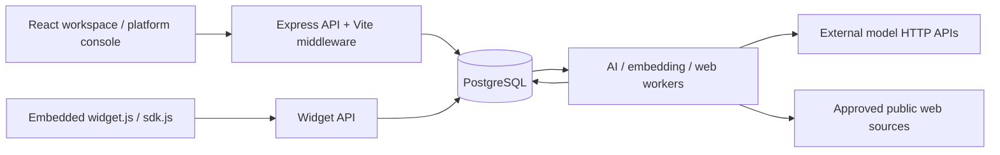

# Architecture

Snapshot: 2026-09-27. Describes the current local/test implementation, not HiChat's private backend. Product-wide acceptance remains incomplete; see [PROJECT-STATUS](PROJECT-STATUS.md).

## High-level architecture

## Components and boundaries

- `src/server/index.ts` starts Express on **127.0.0.1:4317**. Development uses Vite middleware; `SERVE_BUILD=true` serves `dist`. `NODE_ENV=production` deliberately throws. There is no approved production deployment.
- `src/server/app.ts` is the HTTP composition root. Services use `pg` and explicit SQL; there is no ORM. `db.ts` provides transactions and transaction-local workspace scope.
- `src/web/main.tsx` implements React routing with History API/popstate, auth and workspace shell. Feature components use local React state/effects and the `api.ts` fetch wrapper; no Redux or router library. Most API state is fetched per component; changing workspace remounts the content key.
- `widget.ts`, `widget-embed.ts`, `public/sdk.js` provide website integration. Widget key identifies a channel, but is not a provider credential. The channel's configured Origin and visitor bearer token are separately enforced.
- PostgreSQL stores identity, conversations, knowledge, uploaded import bytes, jobs, audit and usage. Embeddings are JSONB in `knowledge_chunks`, not a pgvector index. No separate object store, Redis or message broker is implemented in the inspected code.
- `jobs.ts` is a durable PostgreSQL queue with leases/attempts and terminal/unknown outcomes. `scripts/ai-worker.ts` handles one workspace or trusted `--all` discovery; `scripts/web-refresh-worker.ts` polls schedules for one configured workspace; embedding script processes an explicitly selected version/model batch. These processes must be launched independently of the web server.
- `provider-transport.ts` maps registered adapter names to HTTP protocols. `chatgpt` is an OpenAI-compatible adapter label; `claude_code` is an Anthropic-compatible adapter label, not a spawned Claude Code CLI. `local` has no inference engine. Live provider/account capability is **UNKNOWN / NEEDS VERIFICATION** until tested with authorized credentials.

## Authentication and authorization

Workspace login verifies Argon2id hashes, stores only SHA-256 of an opaque session token, and issues `gotek_session` HttpOnly/SameSite=Lax cookie. Secure flag is configurable. Normal sessions last one day; remember-me lasts thirty days. Reset and verification challenges are hashed and single-use; reset invalidates existing sessions. Verification/invitation delivery is currently `local_delivery`, not SMTP.

`identity()` joins session to active membership, locks those rows, sets `app.workspace_id`, then checks active workspace. Owner/Admin management checks run in services; Agent inbox access additionally requires channel membership. Last Owner and seat limits are checked transactionally. Tenant tables use forced RLS; identity tables intentionally form a trusted non-RLS boundary. Do not assume every table has tenant RLS.

Platform identity is separate: active `platform_admins` membership plus session, then transaction-local `app.platform` and `app.actor_id`. Workspace Admin does not gain platform privileges. Platform status/provider/model operations carry audit reasons. Support uses expiring/revocable explicit grants rather than blanket chat access.

## Data and AI flow

Visitor messages append with a per-conversation sequence and unique client ID. Only AI_ACTIVE conversations enqueue AI work. AI processing checks ownership version, public published knowledge, model grants/expiry, workspace/provider state and quota; dispatch is fenced before external invocation and results are revalidated before insertion. Usage reservation and settlement are distinct from token telemetry. An uncertain external result is recorded as unknown, not automatically treated as a delivered reply.

Knowledge drafts are processed to READY and separately published. Retrieval for visitors is PUBLIC-only and tenant-scoped; publication/current-source checks prevent stale or private context from becoming a reply. Semantic retrieval is optional and requires populated compatible embeddings and a grant. There is no general guarantee that any model always follows source restrictions: adversarial/live answer quality acceptance remains open.

## Error handling and security

API mutations require `X-Gotek-Request: 1` and reject mismatched Origin. Zod validates inputs. Error middleware returns stable `{error}` codes, validation field maps, conflict responses for unique violations, and sanitized INTERNAL failures. Multer limits upload size to 2,000,000 bytes. Frontend fetch failures display the Vietnamese connection error; that text alone cannot identify a backend root cause.

Rate limits are process-local. Helmet is enabled but CSP is disabled in current app construction. Provider and web fetch paths apply target/SSRF policy. Secrets are resolved on the server from environment variable names stored in provider records. Provider secrets must not appear in UI, widget payloads, audit exports or committed runtime configuration.

## Constraints and debt

Single Express composition file and compact SQL-heavy services increase review cost. Local provisioning assumes a PostgreSQL administrator/socket/port; it is not a portable container stack. Embedding ranking reads JSON vectors rather than using an indexed vector database. Some list screens are bounded without full pagination. Email delivery, production hosting, multi-instance rate limiting, external-channel delivery and end-to-end provider acceptance are not established. See [KNOWN-ISSUES](KNOWN-ISSUES.md) and [DEPLOYMENT](DEPLOYMENT.md).
