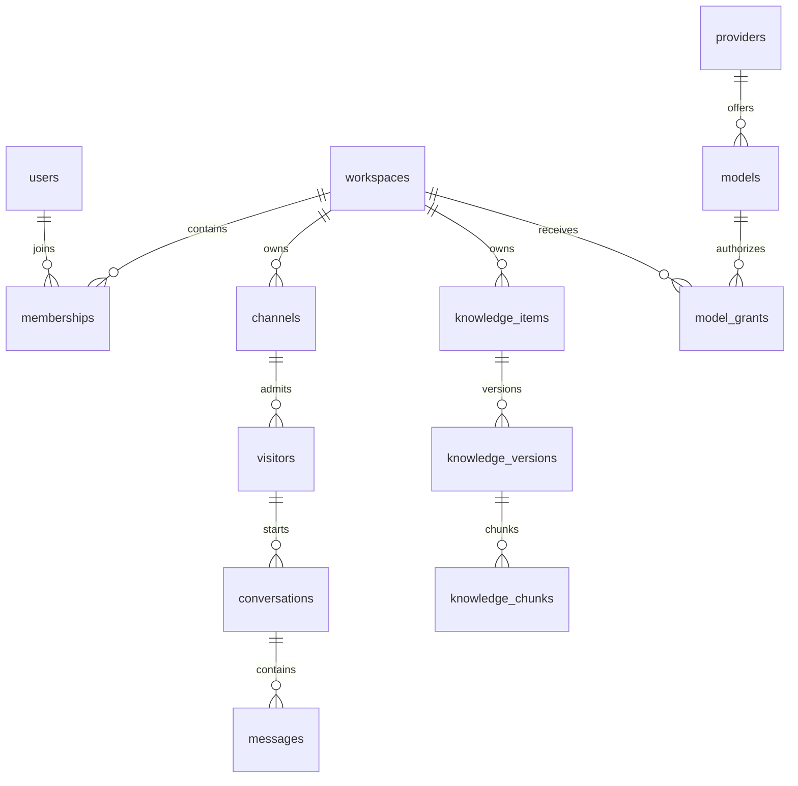

# Database

## Technology and access

PostgreSQL via `pg`, raw parameterized SQL, no ORM. Source of truth is `db/migrations/*.sql`, applied by `scripts/setup-db.ts`. `src/server/db.ts` loads DATABASE_URL or `.local/runtime.json`. Runtime role is intended to be `gotek_app` (NOSUPERUSER/NOBYPASSRLS); setup uses `gotek_migrator` at `/tmp`, port 55432. Do not use the migrator role for the web application.

## Main relationships

Composite tenant foreign keys (workspace plus object IDs) are used for chat, knowledge and other domain relations. `knowledge_items` points separately to draft and published versions; published content must be READY and permitted for the audience. Embeddings live as JSONB with model/dimension metadata and shape constraints in chunks. Import file bytes are database-backed, not S3.

## Important invariants

- Workspace membership roles: Owner/Admin/Agent; active status and final Owner protected in services.
- Sessions and challenges store token hashes; `local_delivery` contains sensitive local test delivery material and is not an external mail system.
- Messages have unique workspace/conversation/client ID and sequence constraints; only agents can create internal notes.
- Tenant RLS uses transaction-local `app.workspace_id`; platform policies use `app.platform`, and actor-scoped platform chat uses `app.actor_id`. Identity tables are a deliberate trusted boundary, not universally RLS protected.
- Audit runtime privileges disallow ordinary update/delete on audit records. Queue/usage/request records implement idempotency and reservation/dispatch state; do not repair them with ad hoc deletes.
- Model grants can expire; selectors enforce expiry. Schema support does not imply all UI/API expiry controls exist.

## Migration and seed strategy

The runner sorts full filenames lexicographically, checks `schema_migrations.name`, and wraps each new migration in a transaction. There are two different `048_*.sql` files: filenames, not numeric prefixes, are the migration identity. Latest filename: `056_model_grant_expiry.sql`. No incomplete migration file was established by this audit; deployed migration state outside local/test is **UNKNOWN / NEEDS VERIFICATION**.

`db:setup` creates infrastructure/schema, not demo product accounts or an automatic Platform Admin. Tests create fixtures. Provision real local test users through signup; privileged bootstrap must be explicitly administered. Historical ALTER/reconciliation migrations can change or invalidate data; read a new migration and take a verified backup before applying to an existing non-test dataset. Never rewrite an applied migration merely to simplify a fresh clone.

`npm run db:restore-drill` is a local backup/restore verification tool. It restores into a disposable DB, compares content hashes/counts/policies, checks fail-closed RLS and quarantines credentials/work. It is not an approved production restore runbook. See [DEPLOYMENT](DEPLOYMENT.md).

## Table creation index

This index maps initial definitions; later migrations add columns/constraints/policies, so always read subsequent migrations too.

| Table | Initial migration |
|---|---|
| `users` | `001_identity.sql` |
| `workspaces` | `001_identity.sql` |
| `memberships` | `001_identity.sql` |
| `sessions` | `001_identity.sql` |
| `challenges` | `001_identity.sql` |
| `local_delivery` | `001_identity.sql` |
| `audit_events` | `001_identity.sql` |
| `invitations` | `001_identity.sql` |
| `quota_budgets` | `002_quota.sql` |
| `usage_operations` | `002_quota.sql` |
| `jobs` | `004_jobs.sql` |
| `platform_admins` | `005_platform.sql` |
| `providers` | `005_platform.sql` |
| `models` | `005_platform.sql` |
| `model_grants` | `005_platform.sql` |
| `platform_audit` | `005_platform.sql` |
| `support_grants` | `006_support.sql` |
| `channels` | `007_channels.sql` |
| `channel_members` | `007_channels.sql` |
| `visitors` | `008_chat.sql` |
| `conversations` | `008_chat.sql` |
| `messages` | `008_chat.sql` |
| `ai_rules` | `015_ai_rules.sql` |
| `web_sources` | `017_web_sources.sql` |
| `knowledge_items` | `019_knowledge.sql` |
| `knowledge_versions` | `019_knowledge.sql` |
| `knowledge_mutations` | `019_knowledge.sql` |
| `knowledge_categories` | `020_knowledge_categories.sql` |
| `data_collection_configs` | `022_data_collection.sql` |
| `data_collection_completions` | `022_data_collection.sql` |
| `data_collection_outbox` | `022_data_collection.sql` |
| `data_collection_mutations` | `022_data_collection.sql` |
| `active_citations` | `023_active_citations.sql` |
| `active_citation_sources` | `024_citation_schema_reconciliation.sql` |
| `active_citation_permissions` | `024_citation_schema_reconciliation.sql` |
| `active_citations` | `024_citation_schema_reconciliation.sql` |
| `onboarding_sources` | `025_onboarding.sql` |
| `platform_agent_sessions` | `026_platform_ai_agent.sql` |
| `platform_agent_messages` | `026_platform_ai_agent.sql` |
| `ai_usage_ledger` | `028_ai_usage_ledger.sql` |
| `knowledge_chunks` | `030_knowledge_chunks.sql` |
| `knowledge_imports` | `035_knowledge_imports.sql` |
| `knowledge_import_files` | `036_knowledge_import_files.sql` |
| `platform_agent_requests` | `037_platform_agent_requests.sql` |
| `web_source_snapshots` | `039_web_source_snapshots.sql` |
| `web_snapshot_knowledge` | `040_web_snapshot_knowledge.sql` |
| `web_source_document_groups` | `041_web_source_generations.sql` |
| `web_source_generations` | `041_web_source_generations.sql` |
| `web_source_generation_parts` | `041_web_source_generations.sql` |
| `contacts` | `042_contacts.sql` |
| `contact_merge_history` | `046_contact_merge_history.sql` |
| `contact_tags` | `047_contact_tags.sql` |
| `contact_tag_links` | `047_contact_tags.sql` |
| `ai_reply_dispatches` | `052_ai_reply_dispatch_fence.sql` |
