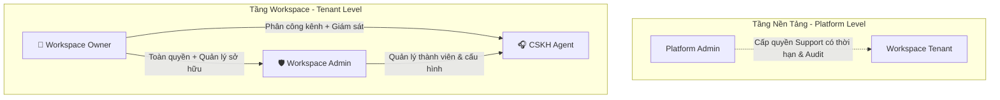
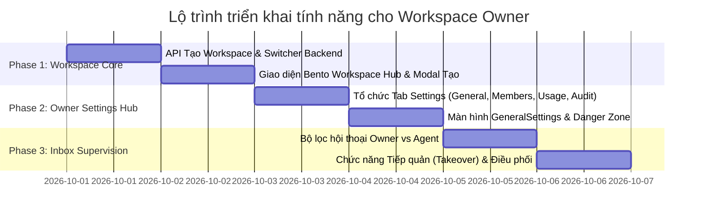

# Kế Hoạch Chi Tiết: Các Ca Sử Dụng & Luồng Nghiệp Vụ Của Workspace Owner (GoTek Chatbot)

Tài liệu đặc tả toàn diện về vai trò **Workspace Owner** (Chủ sở hữu Không gian làm việc), bao gồm ma trận quyền hạn, 7 nhóm nghiệp vụ chính, các rào chắn bảo mật (fences/guards), và kế hoạch triển khai chi tiết trên cả Backend lẫn Frontend.

---

## 1. Vị Trí & Ma Trận Quyền Hạn Của Owner

Trong hệ thống GoTek Chatbot (Clean Architecture, Multi-tenant, RLS), **Owner** là vai trò tối cao trong một Workspace độc lập:

### Bảng Ma Trận Phân Quyền (RBAC Matrix)

| Nhóm chức năng | 👑 Workspace Owner | 🛡️ Workspace Admin | 🎧 CSKH Agent |
| :--- | :---: | :---: | :---: |
| **Tạo mới Workspace** | ✅ Có | ✅ Có | ✅ Có |
| **Đổi tên, Logo, Ngôn ngữ Workspace** | ✅ Toàn quyền | ✅ Toàn quyền | ❌ Không |
| **Xóa / Tạm dừng Workspace (Danger Zone)** | ✅ **Chỉ duy nhất Owner** | ❌ Không | ❌ Không |
| **Mời thành viên (Admin, Agent)** | ✅ Có | ✅ Có | ❌ Không |
| **Phong quyền Owner / Chuyển nhượng Owner** | ✅ **Chỉ duy nhất Owner** | ❌ Không | ❌ Không |
| **Giáng chức Owner (khi có >= 2 Owner)** | ✅ **Chỉ duy nhất Owner** | ❌ Không | ❌ Không |
| **Tự giáng chức / Tự xóa khi là Last Owner** | ❌ **Bị chặn (409 Conflict)** | N/A | N/A |
| **Xem & Giám sát TẤT CẢ hội thoại Inbox** | ✅ Toàn bộ kênh | ✅ Toàn bộ kênh | ❌ Chỉ kênh được gán |
| **Tiếp quản khẩn cấp (Takeover) từ Agent khác** | ✅ Có quyền | ✅ Có quyền | ❌ Chỉ tiếp quản từ AI |
| **Cấu hình Kênh (Website Widget, Social)** | ✅ Toàn quyền | ✅ Toàn quyền | ❌ Không |
| **Cấu hình AI Copilot, Prompt & RAG Tri thức** | ✅ Toàn quyền | ✅ Toàn quyền | ❌ Không |
| **Xem Hạn mức sử dụng AI & Báo cáo** | ✅ Toàn quyền | ✅ Toàn quyền | ❌ Không |
| **Xem & Xuất Nhật ký kiểm toán (Audit Logs)** | ✅ Toàn quyền | ✅ Toàn quyền | ❌ Không |

---

## 2. Chi Tiết 7 Nhóm Use Cases Của Workspace Owner

### 🏢 Nhóm 1: Quản Trị Vòng Đời Workspace (Workspace Lifecycle)
1. **Case 1.1 - Khởi tạo Workspace mặc định**:
   - Khi người dùng đăng ký tài khoản (qua Form hoặc Google SSO), hệ thống tự động sinh 1 Workspace cá nhân mang tên doanh nghiệp.
   - User đó tự động được gán vai trò `Owner` của Workspace này, được cấp Quota AI mặc định (`GOTEK_DEFAULT_AI_RESPONSE_QUOTA = 1000`).
2. **Case 1.2 - Tạo Workspace mới (Create Multiple Workspaces)**:
   - Một người dùng có thể làm chủ nhiều Workspace (ví dụ: *GoTek E-commerce*, *GoTek Edu*).
   - Nút **"Tạo không gian mới"** tại Modal chuyển Workspace cho phép nhập tên doanh nghiệp, chọn ngôn ngữ mặc định. User lập tức trở thành Owner của workspace đó và tự động chuyển môi trường làm việc.
3. **Case 1.3 - Chuyển đổi linh hoạt giữa các Workspace (Workspace Switcher)**:
   - Header/Sidebar hiển thị danh sách các Workspace người dùng đang tham gia (kèm vai trò tương ứng).
   - Gọi `POST /api/workspace/switch`, session cập nhật `workspace_id` tức thì mà không cần đăng nhập lại.
4. **Case 1.4 - Cấu hình thông tin doanh nghiệp (General Settings)**:
   - Chỉnh sửa tên hiển thị, logo nhận diện, ngôn ngữ hiển thị giao diện (`vi` / `en`).
5. **Case 1.5 - Tạm dừng & Lưu trữ Workspace**:
   - Owner có thể chuyển trạng thái Workspace sang `disabled` (tạm dừng hoạt động). Các session của nhân viên bị đóng, Widget ngoài website tạm ẩn.
6. **Case 1.6 - Xóa vĩnh viễn Workspace (Danger Zone)**:
   - Chỉ Owner mới có nút xóa.
   - Cơ chế bảo mật an toàn: Yêu cầu Owner nhập lại chính xác tên Workspace và mật khẩu tài khoản để xác nhận trước khi xóa (soft-delete hoặc cascade cleanup).

---

### 👥 Nhóm 2: Quản Trị Thành Viên & Quyền Sở Hữu (Ownership & Personnel)
1. **Case 2.1 - Mời thành viên mới**:
   - Nhập email và chọn vai trò: `Admin` (Quản lý) hoặc `Agent` (Nhân viên trực chat).
   - Tạo bản ghi trong bảng `invitations`.
2. **Case 2.2 - Nâng cấp thành viên lên Owner (Promote to Owner)**:
   - Owner chọn một Admin hoặc Agent uy tín và thăng cấp lên thành Co-Owner.
3. **Case 2.3 - Chuyển giao quyền sở hữu tối cao (Transfer Ownership)**:
   - Bàn giao quyền làm chủ Workspace cho người khác, tự hạ vai trò mình xuống Admin hoặc rời Workspace.
4. **Case 2.4 - Giáng chức Owner phụ**:
   - Khi Workspace có từ 2 Owner trở lên, Owner A có quyền giáng chức Owner B xuống Admin/Agent nếu có sự thay đổi nhân sự cấp cao.
5. **Case 2.5 - Rào chắn bảo vệ Owner cuối cùng (Last-Owner Guard)**:
   - Nếu trong Workspace chỉ còn duy nhất 1 Owner đang hoạt động (`active Owners === 1`):
     - Giao diện vô hiệu hóa nút xóa / giáng chức của chính Owner đó.
     - Backend trả về `409 LAST_OWNER` nếu có request cố tình gửi lên.
6. **Case 2.6 - Thu hồi quyền & Khóa thành viên (Instant Session Revocation)**:
   - Khi Owner ấn vô hiệu hóa (`active = false`) một thành viên, Backend xóa sạch session tokens của user đó trong Workspace hiện tại ngay trong transaction. Thành viên bị đẩy về màn hình đăng nhập lập tức ở request tiếp theo.

---

### 💬 Nhóm 3: Giám Sát & Điều Phối Hộp Thư Hội Thoại (Inbox Supervision)
1. **Case 3.1 - Chế độ xem Toàn cảnh (Omni-channel View)**:
   - Owner không bị giới hạn theo kênh. Owner có thể xem:
     - Toàn bộ cuộc hội thoại từ tất cả Kênh Website, Facebook, Zalo.
     - Bộ lọc: *Chưa gán (Unassigned)*, *Đang xử lý bởi AI*, *Của nhân viên A/B/C*, *Đã hoàn tất (Resolved)*.
2. **Case 3.2 - Tiếp quản khẩn cấp (Emergency Takeover)**:
   - Nếu thấy AI Copilot trả lời chưa đúng hoặc nhân viên CSKH xử lý chưa làm hài lòng khách VIP, Owner có quyền ấn **"Tiếp quản" (Takeover)**. Hệ thống gửi thông báo nội bộ và giao toàn quyền gửi tin nhắn cho Owner.
3. **Case 3.3 - Điều phối & Phân công lại (Re-assign Conversation)**:
   - Owner có thể chuyển cuộc trò chuyện từ Agent A sang Agent B hoặc phân công lại từ hàng đợi chưa gán.
4. **Case 3.4 - Ghi chú nội bộ (Internal Coaching Notes)**:
   - Owner có thể viết tin nhắn vàng (Internal Note) trong luồng chat để nhắc bài, hướng dẫn nhân viên mà khách hàng không thể nhìn thấy.

---

### 🌐 Nhóm 4: Cấu Hình Kênh Giao Tiếp & Widget Khách Hàng (Channels & Widget)
1. **Case 4.1 - Khởi tạo & Quản lý Kênh**:
   - Sinh mã nhúng `public_key` cho từng kênh Website.
2. **Case 4.2 - Rào chắn tên miền an toàn (Origin Domain Fence)**:
   - Cấu hình danh sách domain được phép gắn widget (ví dụ: `https://gotek.vn`). Ngăn chặn bên thứ 3 sao chép trộm script widget gắn lên trang web lừa đảo.
3. **Case 4.3 - Tùy biến giao diện Widget thương hiệu**:
   - Tiêu đề widget, lời chào ban đầu (Greeting), mã màu chủ đạo, logo thương hiệu, vị trí hiển thị (Góc trái / Góc phải).
4. **Case 4.4 - Cấu hình Giờ làm việc & Khung giờ trực**:
   - Thiết lập giờ mở/đóng ca hỗ trợ trong tuần. Tin nhắn tự động phản hồi ngoài giờ làm việc.
5. **Case 4.5 - Biểu mẫu trước khi chat (Pre-chat Survey)**:
   - Thu thập Tên, SĐT, Email trước khi bắt đầu trò chuyện.
6. **Case 4.6 - Phân phối ca trực (Assignment Capacity)**:
   - Bật tự động chia việc (Auto-assignment) và giới hạn tải (Capacity limit: tối đa N chat cùng lúc/Agent). Phân bổ Agent vào danh sách trực của Kênh (`channel_members`).

---

### 🧠 Nhóm 5: Quản Trị AI Copilot & Tri Thức Doanh Nghiệp (AI & RAG)
1. **Case 5.1 - Quản lý Kho tài liệu (Knowledge Base)**:
   - Tải lên PDF cẩm nang sản phẩm, bảng giá CSV, tài liệu nội bộ.
   - Theo dõi trạng thái trích xuất vector embeddings trong `pgvector`.
2. **Case 5.2 - Thiết lập Luật & Giọng điệu AI (AI Persona & System Prompt)**:
   - Cài đặt tính cách, xưng hô, quy tắc cấm tiết lộ thông tin bí mật kinh doanh, độ nhạy phản hồi.
3. **Case 5.3 - Đồng bộ trang web (Automated Web Crawler)**:
   - Cung cấp URL hoặc sitemap website công ty để AI định kỳ tự động học dữ liệu mới.
4. **Case 5.4 - Quy tắc Chuyển giao cho người (AI-to-Human Handoff)**:
   - Khi AI không tìm thấy câu trả lời với độ tự tin (Confidence score) thấp, tự động chuyển về trạng thái `HANDOFF_PENDING` để nhân viên tiếp quản.

---

### 📊 Nhóm 6: Quản Lý Hạn Mức, Token & Báo Cáo Doanh Nghiệp (Usage & Quotas)
1. **Case 6.1 - Theo dõi hạn mức sử dụng AI**:
   - Xem số lượt AI phản hồi, số token tiêu thụ trong tháng, số lượng còn lại.
2. **Case 6.2 - Cơ chế giữ chỗ hạn mức an toàn (Quota Reservation & CAS)**:
   - Tránh việc 2 luồng đồng thời vượt hạn mức; đảm bảo hạch toán chuẩn xác từng đơn vị sử dụng.
3. **Case 6.3 - Báo cáo phân tích hiệu suất (Analytics Dashboard)**:
   - Biểu đồ lưu lượng chat theo ngày/giờ.
   - Thời gian phản hồi trung bình (FRT).
   - Tỷ lệ khách hàng đánh giá hài lòng (CSAT).
   - Tỷ lệ AI giải quyết thành công không cần can thiệp.

---

### 🛡️ Nhóm 7: Bảo Mật, Kiểm Toán & Hỗ Trợ Kỹ Thuật (Audit & Compliance)
1. **Case 7.1 - Nhật ký kiểm toán Workspace (Audit Trail)**:
   - Ghi nhận lịch sử chi tiết mọi thao tác nhạy cảm: Đổi vai trò, xóa tài liệu, thay đổi cấu hình kênh, tiếp quản hội thoại.
2. **Case 7.2 - Xuất dữ liệu kiểm toán**:
   - Hỗ trợ tải file CSV/JSON để lưu trữ tuân thủ quy chuẩn bảo mật doanh nghiệp.
3. **Case 7.3 - Cấp quyền Hỗ trợ Kỹ thuật cấp Nền tảng (Platform Support Grant)**:
   - Khi cần hỗ trợ chuyên sâu từ kỹ sư GoTek, Owner có thể tạo một mã cấp quyền (Support Grant) có thời hạn giới hạn (ví dụ: 2 giờ). Kỹ sư nền tảng chỉ được xem dữ liệu cấu hình trong thời gian này và mọi hành động đều được ghi log kiểm toán độc lập.

---

## 3. Lộ Trình Triển Khai (Implementation Roadmap)

### Kế hoạch hành động cụ thể:

#### Bước 1: Mở rộng Backend Workspace Management
- Bổ sung `POST /api/workspaces`: Cho phép người dùng tạo thêm một Workspace mới với tên tự chọn, tạo AI Quota mặc định và gán người tạo làm `Owner`.
- Bổ sung `DELETE /api/workspace` (Danger Zone): Xóa workspace hiện tại (chỉ cho phép Owner thực hiện và bắt buộc có xác thực mật khẩu).

#### Bước 2: Nâng cấp Bento Workspace Hub trên Frontend
- Biến nút "Tạo không gian mới" từ thông báo toast tĩnh thành **Modal Form nhập liệu chuẩn Bento**:
  - Tên không gian làm việc
  - Ngôn ngữ mặc định
  - Nút Xác nhận tạo ➡️ Tự động gọi API, cập nhật danh sách workspace và switch sang workspace mới.

#### Bước 3: Hoàn thiện Tab Navigation trong Trang Settings
- Thêm thanh Tab chuyên nghiệp tại `/app/settings/*`:
  1. `🏢 Không gian làm việc` (Workspace General Settings + Danger Zone cho Owner)
  2. `👥 Thành viên & Phân quyền` (MembersSettings hiện tại)
  3. `📊 Hạn mức & Sử dụng` (Usage & Quotas)
  4. `🛡️ Nhật ký kiểm toán` (Audit Logs)

#### Bước 4: Tích hợp Bộ lọc & Quyền Giám sát Hộp thư (Inbox)
- Tại Header của Inbox:
  - Nếu là `Owner` hoặc `Admin`: Hiển thị nút lọc `Tất cả kênh`, `Hội thoại chưa gán`, `Hội thoại theo Agent`.
  - Nếu là `Agent`: Cố định bộ lọc `Được phân công cho tôi` và các kênh được chỉ định.
