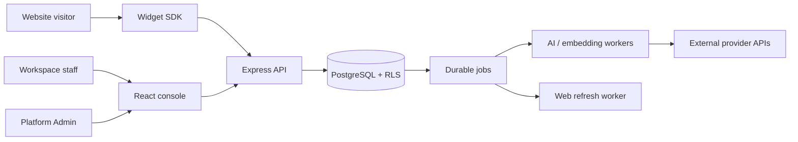
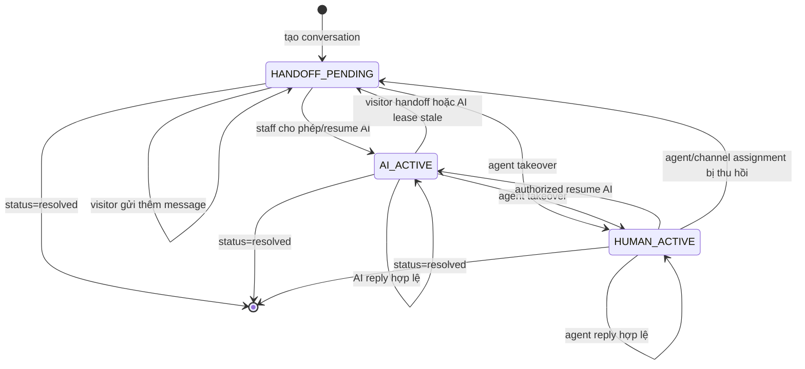

# Software Requirements Specification (SRS)
## GoTek Chatbot

**Version:** 1.0  
**Date:** 2026-09-28  
**Status:** Draft for product and engineering review  
**Repository:** `D:\GoTek-ChatBOT`

> Tài liệu này mô tả sản phẩm, yêu cầu và trạng thái triển khai dựa trên source code, migrations, tests, evidence và handoff hiện tại. `Implemented` không đồng nghĩa với `Accepted`; các phần chưa có browser, live-provider, staging hoặc owner evidence được ghi là `IN PROGRESS` hoặc `UNKNOWN / NEEDS VERIFICATION`.

## 1. Mục đích và phạm vi

GoTek Chatbot là nền tảng hội thoại đa doanh nghiệp. Mỗi doanh nghiệp vận hành một hoặc nhiều workspace, website channel, inbox nhân viên, kho tri thức và cấu hình AI riêng. Khách truy cập website trò chuyện qua widget; AI trả lời dựa trên tri thức đã được xử lý và công khai; nhân viên có thể tiếp quản hội thoại.

Phạm vi hiện tại gồm:

- identity, workspace, membership và session;
- website widget, visitor session, pre-chat profile và conversation;
- inbox, assignment, takeover, resume AI, public reply và internal note;
- knowledge manual/import, version, processing, publication, rollback và retrieval;
- AI rules, provider/model registry, grant, quota, durable jobs và usage accounting;
- web source, snapshot, generation và publish lifecycle;
- contacts, tags, data collection, citations, audit và support grants;
- Platform Admin và platform agent;
- vận hành recovery, restore drill, audit và privacy boundary.

Catalog/order, ticket/SLA nâng cao, đa kênh, billing thương mại, Lark Wiki và các nhóm E mở rộng nằm ngoài phần đã được nghiệm thu của snapshot này.

## 2. Người dùng và vai trò

| Vai trò | Quyền và trách nhiệm chính |
|---|---|
| Visitor | Mở widget của một channel, gửi tin, cung cấp pre-chat profile, xem public replies và yêu cầu handoff. |
| Agent | Xem conversation được phép theo workspace/channel assignment, gửi public reply hoặc internal note, takeover và resolve. |
| Workspace Admin | Quản lý channel, knowledge, AI rules, contacts, members, quota view và workspace settings. |
| Workspace Owner | Toàn bộ quyền Admin, quản lý Owner/member và các thay đổi nhạy cảm của workspace. |
| Platform Admin | Quản lý provider, model, capability grant, workspace state và platform agent; không mặc nhiên đọc tenant chat. |
| Support Operator | Chỉ thao tác qua support grant có scope, lý do, thời hạn, revoke và audit. |
| Worker/Operator | Chạy AI, embedding, web refresh, recovery và restore drill theo cấu hình được cấp. |

## 3. Mục tiêu sản phẩm

1. Cung cấp một inbox dùng chung cho AI và nhân viên.
2. Bảo vệ dữ liệu giữa các workspace bằng session membership, transaction-local tenant scope và PostgreSQL RLS.
3. Chỉ đưa knowledge đã READY và PUBLIC vào câu trả lời visitor.
4. Không để provider secret xuất hiện ở browser, widget, audit export hoặc request client.
5. Bảo đảm idempotency, quota reservation, lease recovery và không replay mù khi kết quả gọi provider không rõ.
6. Cung cấp lịch sử, audit, citation và trạng thái đủ để đối soát vận hành.

## 4. Bối cảnh và kiến trúc mức cao

- Backend: Express 5, TypeScript strict, `pg`, raw parameterized SQL, SQL migrations.
- Frontend: React 19 + Vite, History API routing, local component state và API wrapper.
- Authentication: Argon2 password hash, SHA-256 session token hash, HttpOnly cookie.
- Runtime storage: PostgreSQL và local runtime configuration; không có ORM, Redis hoặc message broker.
- Provider adapters: OpenAI-compatible, Anthropic-compatible, Gemini và custom/local labels. Adapter tồn tại không chứng minh live acceptance.

## 5. Functional requirements

### 5.1 Identity và workspace

- **FR-AUTH-01:** Người dùng có thể đăng ký với full name, business, email, phone và password.
- **FR-AUTH-02:** Hệ thống tạo user, workspace, Owner membership và default quota trong cùng transaction.
- **FR-AUTH-03:** Login xác thực Argon2, tạo session cookie HttpOnly và chỉ chọn workspace có membership active.
- **FR-AUTH-04:** Reset/verification token phải được hash, single-use, có expiry; reset phải revoke các session cũ.
- **FR-AUTH-05:** Người dùng có thể xem và switch giữa các workspace mình có membership; client không được tự cấp quyền bằng workspace ID.
- **FR-AUTH-06:** Membership revoke, seat limit và xóa/hạ Owner cuối cùng phải bị chặn.
- **Trạng thái:** backend và local tests có nhiều slice đã verified; external email, browser flow và toàn bộ acceptance vẫn `IN PROGRESS`.

### 5.2 Channel và widget

- **FR-WIDGET-01:** Admin tạo channel với origin chính xác, greeting, pre-chat fields, business hours và widget options.
- **FR-WIDGET-02:** Widget key xác định channel; origin phải được kiểm tra exact match/allowlist.
- **FR-WIDGET-03:** Session visitor dùng bearer token riêng, có expiry và không chứa provider secret.
- **FR-WIDGET-04:** Visitor có thể tạo/resume conversation, cập nhật profile, gửi message với `clientId` idempotent và poll theo sequence.
- **FR-WIDGET-05:** Widget chỉ nhận public messages, public receipts và public state của channel hiện tại.
- **FR-WIDGET-06:** Visitor có thể yêu cầu handoff nhưng không tự chọn agent hoặc tự resume AI.
- **Trạng thái:** backend boundary, token/origin, capacity/takeover có local evidence; browser/mobile/accessibility parity chưa nghiệm thu.

### 5.3 Inbox và human handoff

- **FR-INBOX-01:** Agent chỉ xem conversation thuộc workspace và channel assignment được phép.
- **FR-INBOX-02:** Agent có thể takeover bằng owner version hiện tại; stale version phải trả conflict.
- **FR-INBOX-03:** Agent có thể gửi public reply hoặc internal note; internal note không được xuất hiện trong widget.
- **FR-INBOX-04:** Agent có thể resume AI hoặc đổi trạng thái open/resolved/snoozed theo quyền.
- **FR-INBOX-05:** Gửi tin phải idempotent theo conversation/client ID.
- **FR-INBOX-06:** Assignment phải tôn trọng active membership và capacity.

### 5.4 Knowledge và publication

- **FR-KNOW-01:** Admin có thể tạo/sửa knowledge item, category, draft version và import file bounded.
- **FR-KNOW-02:** Hệ thống theo dõi lifecycle `DRAFT`, processing, `READY`, failed và published history.
- **FR-KNOW-03:** Publication là thao tác explicit, có revision check; sửa draft không tự publish.
- **FR-KNOW-04:** Rollback chỉ được thực hiện với published version hợp lệ.
- **FR-KNOW-05:** Retrieval của visitor phải giới hạn tenant, source hiện hành, audience `PUBLIC` và publication state hợp lệ.
- **FR-KNOW-06:** INTERNAL/draft/unpublished/revoked content không được làm context cho visitor.
- **FR-KNOW-07:** Import và web snapshot phải có trạng thái, lỗi bounded và retry/recovery rõ ràng.
- **Trạng thái:** backend lifecycle/retrieval có evidence; semantic performance, live source và JS-rendered crawler vẫn `UNKNOWN / NEEDS VERIFICATION`.

### 5.5 AI, provider và quota

- **FR-AI-01:** Platform Admin đăng ký provider bằng secret reference của environment, không nhận secret value từ client.
- **FR-AI-02:** Model phải có capability; workspace chỉ dùng model có active grant, provider/model enabled và grant chưa hết hạn.
- **FR-AI-03:** AI worker chỉ chạy khi conversation còn `AI_ACTIVE`, owner version còn hợp lệ và source public còn hợp lệ.
- **FR-AI-04:** Quota phải được reserve trước dispatch và settle/release/unknown sau kết quả.
- **FR-AI-05:** Timeout/network ambiguity phải chuyển thành unknown hoặc trạng thái cần đối soát, không replay mù.
- **FR-AI-06:** Provider response phải được chuẩn hóa thành text, token telemetry, stop reason và receipt/error phù hợp.
- **FR-AI-07:** Provider call diễn ra ngoài transaction; trước khi commit reply phải revalidate ownership, publication và grant.
- **FR-AI-08:** Câu trả lời visitor phải có context bounded; thiếu knowledge/entitlement không cho phép ungrounded answer.
- **Trạng thái:** injected transport, grant/expiry, quota và worker recovery có local evidence; live receipt, giá, chất lượng và production latency chưa xác minh.

### 5.6 Web source và onboarding

- **FR-WEB-01:** Admin tạo source theo URL policy và có status active/paused.
- **FR-WEB-02:** Refresh kiểm tra redirect, DNS, SSRF, size, timeout, content type và snapshot bounded.
- **FR-WEB-03:** Snapshot được chuyển thành staged generation; publish/rollback là explicit và atomic theo version.
- **FR-WEB-04:** Schedule phải có cursor/trạng thái và không tạo refresh trùng ngoài idempotency policy.
- **FR-WEB-05:** Onboarding phải phân biệt tài liệu bị block, pending, ready và audience; không auto-public tài liệu khuyến khích.
- **Trạng thái:** static fetch, sitemap và generation có code/evidence; JS rendering và source acceptance thực tế chưa đóng.

### 5.7 Contacts và data collection

- **FR-CRM-01:** Workspace staff có thể tạo, đọc, sửa, soft-delete, restore và export contacts trong tenant.
- **FR-CRM-02:** Contact merge phải có preview, revision check, history và undo.
- **FR-CRM-03:** Tags và custom collection fields phải scope theo workspace.
- **FR-CRM-04:** Data collection completion phải kiểm tra required fields, field allowlist, idempotency và outbox destination.

### 5.8 Audit, support và operations

- **FR-OPS-01:** Thay đổi cấu hình, membership, grants, provider/model và support phải ghi audit event.
- **FR-OPS-02:** Audit list dùng bounded keyset pagination; export hiện tại là bounded NDJSON trong JSON response.
- **FR-OPS-03:** Support access phải có subject, scope, reason, expiry, revoke và audit.
- **FR-OPS-04:** Jobs phải có idempotency key, attempts, lease, retry/dead/unknown và recovery khi lease mất.
- **FR-OPS-05:** Restore drill phải kiểm hash, policy/RLS, quarantine credential và disposable cleanup.
- **FR-OPS-06:** Retention, delete và workspace closure chỉ được triển khai sau khi policy owner phê duyệt.

## 6. Mô hình trạng thái hội thoại

Conversation có **hai trục trạng thái độc lập**:

1. `status`: vòng đời xử lý của conversation.
2. `reply_owner`: thực thể đang được phép phát public reply.

Không được gộp hai trục này thành một status duy nhất.

### 6.1 `status` — vòng đời conversation

| Giá trị | Ý nghĩa | Có nhận message mới? | Có phải đang chờ người? |
|---|---|---:|---:|
| `open` | Conversation đang hoạt động. Có thể do AI, agent hoặc visitor tương tác. | Có | Không kết luận được; phải xem `reply_owner`. |
| `resolved` | Đã đóng xử lý theo nghiệp vụ. | Theo policy hiện tại không coi là active inbox work. | Không. |
| `snoozed` | Tạm ẩn khỏi luồng xử lý chính để xử lý sau. | Theo policy UI/service. | Không. |

`status='open'` không có nghĩa AI đang trả lời và cũng không có nghĩa đã có agent nhận việc.

### 6.2 `reply_owner` — quyền phát public reply

| Giá trị | Ý nghĩa chính xác | `assigned_to` | AI job mới |
|---|---|---|---|
| `AI_ACTIVE` | AI được phép xử lý message mới và phát public reply nếu grant, quota, knowledge và owner version còn hợp lệ. | Có thể null. | Có thể enqueue khi visitor gửi message. |
| `HANDOFF_PENDING` | Visitor đã yêu cầu người hỗ trợ hoặc conversation chưa được giao quyền trả lời cho AI/agent. Đây là trạng thái **chờ xử lý**, không phải takeover thành công. | Có thể null hoặc đang chờ assignment. | Không được coi là đủ điều kiện để enqueue AI reply. |
| `HUMAN_ACTIVE` | Agent đã takeover thành công với owner version hợp lệ; chỉ agent được assign mới được gửi public reply. | Phải là agent hợp lệ cho channel/workspace. | Không enqueue AI reply. |

### 6.3 Phân biệt các khái niệm dễ nhầm

- **Handoff request:** visitor gửi yêu cầu hỗ trợ. Kết quả thông thường là `reply_owner=HANDOFF_PENDING`.
- **Handoff pending:** yêu cầu đã ghi nhận nhưng chưa có agent takeover. Không đồng nghĩa đã assign người xử lý.
- **Assigned:** `assigned_to` có user hợp lệ. Một conversation có thể được assign nhưng chưa ở `HUMAN_ACTIVE` nếu takeover chưa hoàn tất.
- **Takeover:** thao tác của agent chuyển owner sang `HUMAN_ACTIVE`, tăng `owner_version` và thiết lập quyền gửi public reply.
- **AI active:** owner là `AI_ACTIVE`; không dùng `status='open'` để suy ra AI đang hoạt động.
- **Resolved:** chỉ là vòng đời conversation; không tự chuyển owner sang AI hoặc human.
- **Snoozed:** chỉ là trì hoãn xử lý; không tự cấp quyền reply.

### 6.4 State transition chuẩn

Mọi transition nhạy cảm phải kiểm tra workspace, membership/channel assignment, `owner_version` và transaction lock. Kết quả provider đến sau takeover hoặc sau publication/grant thay đổi phải bị loại bằng stale owner/source checks.

### 6.5 Hiển thị UI và API

- Inbox nên hiển thị riêng `status` và `reply_owner`, ví dụ: `Đang mở · Chờ nhân viên` hoặc `Đang mở · AI xử lý`.
- Không gắn nhãn `HANDOFF_PENDING` là `Đã tiếp nhận` hay `Đã giao nhân viên`.
- Widget chỉ nên hiển thị trạng thái public phù hợp; không lộ internal assignment metadata nếu không cần.
- API response nên trả cả hai trường dạng ổn định: `status`, `replyOwner`, `ownerVersion`, `assignedTo` theo quyền caller.
- Bộ lọc `open/resolved/snoozed` lọc vòng đời; bộ lọc AI/human/pending lọc `reply_owner`.
## 6. Quy tắc dữ liệu và bảo mật

- Domain tables phải có `workspace_id`; quan hệ con cần composite tenant FK khi phù hợp.
- Runtime role không được `BYPASSRLS`; tenant scope dùng transaction-local `app.workspace_id`.
- Platform scope dùng `app.platform` và actor scope dùng `app.actor_id`.
- Mọi SQL dùng placeholder PostgreSQL; không nối chuỗi dữ liệu người dùng vào SQL.
- Mutation API yêu cầu `X-Gotek-Request: 1` và origin hợp lệ.
- Session, challenge và visitor tokens chỉ lưu hash; cookie session là HttpOnly/SameSite.
- Provider secret chỉ được resolve server-side từ environment reference.
- Multer và JSON body phải có giới hạn kích thước; fetch web phải có SSRF/redirect policy.
- Audit records không được cho runtime role tùy ý sửa/xóa.

## 7. API và tích hợp

- Workspace API: `/api`.
- Public widget API: `/widget-api`.
- Embed loader: `/widget.js`.
- API input dùng strict Zod schemas tại handler/service.
- API hiện dùng success payload trực tiếp hoặc `{ ok: true }`; error hiện là `{ error, fields? }`. Chuẩn hóa envelope `{ success, data, error }` là yêu cầu kiến trúc mục tiêu và cần migration tương thích trước khi áp dụng toàn bộ.
- Không có OpenAPI generated document; request/response contract phải đọc từ handler, tests và `docs/API.md`.

## 8. Yêu cầu giao diện

- Console gồm auth, workspace shell, inbox, channels, knowledge, web sources, rules, contacts, usage, jobs, support và Platform Admin.
- Smart/container components quản lý state/API; presentational components nhận props và callback.
- UI phải có trạng thái idle/loading/success/error và retry phù hợp.
- Màu sắc, spacing, radius và typography dùng design tokens; không hardcode màu trong component.
- Widget phải hiển thị public transcript, pre-chat, handoff, loading/error và receipt state.
- Responsive keyboard/mobile/accessibility và HiChat visual parity cần browser evidence trước khi nghiệm thu.

## 9. Yêu cầu phi chức năng

| Nhóm | Yêu cầu |
|---|---|
| Isolation | Không đọc/ghi chéo workspace; kiểm bằng RLS, service predicates và negative tests. |
| Security | Không lộ secret; CSRF/origin/session/role/support grant phải được kiểm tra server-side. |
| Reliability | Job lease, idempotency, retry/dead/unknown và no-blind-resend. |
| Consistency | Publish, quota settlement, audit và outbox thay đổi cùng transaction khi cùng side-effect. |
| Performance | List có bounded limit; các màn hình lớn cần keyset pagination; semantic retrieval cần chiến lược vector phù hợp trước scale. |
| Observability | Audit event, job state, usage operation, provider receipt/unknown và structured error logging. |
| Accessibility | Keyboard focus, semantic labels, responsive layout, error association và contrast cần browser acceptance. |
| Maintainability | TypeScript strict, module boundary rõ, không God file; route/controller/service/repository separation là kiến trúc mục tiêu. |
| Availability | Production hosting, multi-instance rate limit, backup RPO/RTO chưa được xác nhận. |
| Privacy | Retention/delete/closure policy phải được owner phê duyệt trước destructive implementation. |

## 10. Quy trình chính

### 10.1 Visitor đến AI hoặc human

1. Widget kiểm tra origin và channel key.
2. Server tạo/resume visitor session và conversation.
3. Visitor hoàn thành profile bắt buộc.
4. Message được append theo sequence và `clientId`.
5. Nếu AI active, durable job được enqueue.
6. Worker claim lease, kiểm ownership/quota/grant/source.
7. Provider được gọi ngoài transaction.
8. Worker revalidate rồi settle usage và append public reply.
9. Visitor poll public messages và gửi receipt.
10. Agent có thể takeover; stale AI result bị loại bỏ.

### 10.2 Knowledge publish

1. Tạo item/import draft.
2. Extract/chunk/process.
3. Kiểm tra READY và revision.
4. Publish explicit với audience.
5. Retrieval chỉ chọn current published version.
6. Rollback/retire cập nhật visibility atomically.

### 10.3 Provider grant

1. Platform Admin đăng ký provider reference.
2. Tạo model/capability.
3. Cấp grant cho workspace với expiry/state.
4. Worker kiểm tra provider/model/grant trước dispatch.
5. Expired/revoked grant chặn dispatch.
6. Usage và receipt được đối soát sau kết quả.

## 11. Trạng thái và tiêu chí nghiệm thu

- **DONE:** slice có source và kiểm tra phù hợp.
- **DONE BUT NEEDS VERIFICATION:** code/test cục bộ có nhưng thiếu live/browser/owner gate.
- **IN PROGRESS:** chỉ một phần flow hoàn thành.
- **TODO:** chưa có triển khai đủ.
- **UNKNOWN / NEEDS VERIFICATION:** chưa có bằng chứng đáng tin.

Acceptance tối thiểu cho một module:

1. happy path qua API và UI;
2. tenant/role negative cases;
3. validation và stable error behavior;
4. idempotency/concurrency/retry nếu có side effect;
5. audit/quota/outbox evidence nếu có thay đổi;
6. loading, empty, error, retry và responsive UI;
7. browser/live-provider/staging evidence khi requirement yêu cầu;
8. cập nhật `PROJECT-STATUS`, `HANDOFF`, backlog và evidence.

## 12. Phạm vi chưa hoàn tất và rủi ro

- Toàn bộ H01–H13, H16, H22–H23, H28, H32 và E01/E06 còn `IN PROGRESS` ở cấp nhóm.
- H14–H15, H17–H21, H24–H27, H29–H31 và phần lớn E backlog.
- Live AI/provider/email, browser parity, JS crawler, staging/production, production RPO/RTO và retention policy chưa được xác minh.
- `app.ts` và `platform.ts` còn tập trung nhiều route/logic.
- Embedding hiện lưu JSONB và retrieval semantic chưa dùng indexed vector storage.
- API error envelope và frontend feature separation chưa đồng nhất với kiến trúc mục tiêu.

## 13. Tài liệu tham chiếu

- [README](../README.md)
- [Project status](PROJECT-STATUS.md)
- [Development handoff](HANDOFF.md)
- [Architecture](ARCHITECTURE.md)
- [System flow](SYSTEM-FLOW.md)
- [API surface](API.md)
- [Database](DATABASE.md)
- [System design and standards](SYSTEM-DESIGN-AND-STANDARDS.md)
- [Backlog](../delivery/BACKLOG.csv)
- [Evidence](../delivery/evidence/)

