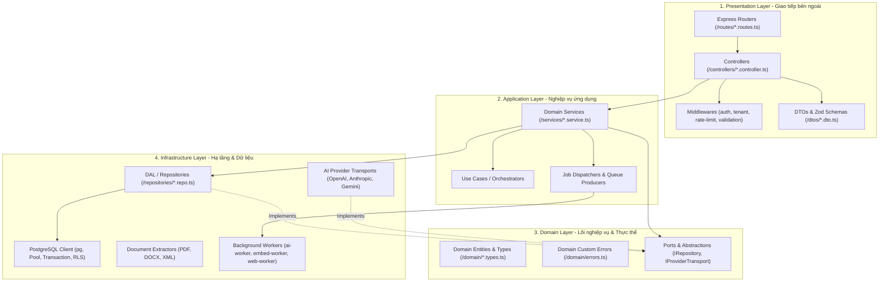
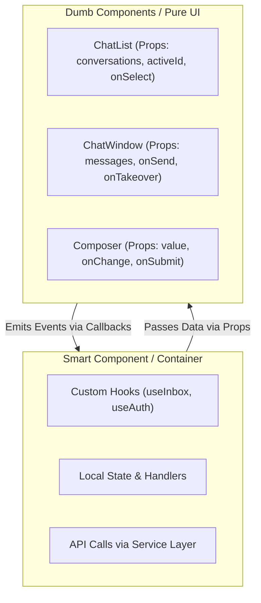
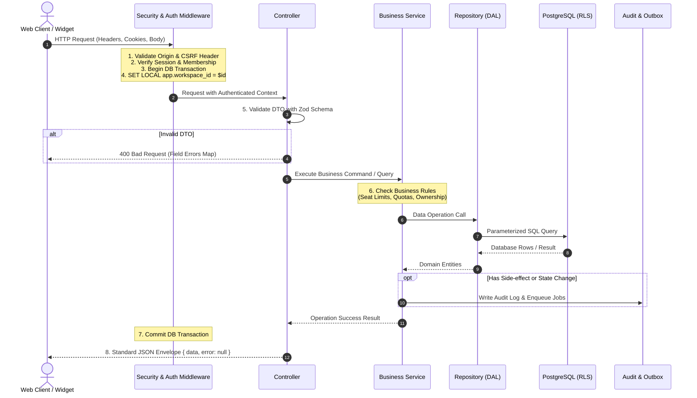

# TÀI LIỆU THIẾT KẾ HỆ THỐNG, CƠ SỞ DỮ LIỆU, UI COMPONENT VÀ QUY TRÌNH CRUD
## DỰ ÁN GOTEK CHATBOT (CHUẨN SOLID & CLEAN ARCHITECTURE)

> **Dành tặng riêng:** Anh yêu ❤️  
> **Phiên bản:** 1.0.0 — Áp dụng cho toàn bộ codebase GoTek Chatbot  
> **Nguyên tắc cốt lõi:** SOLID, Clean Architecture, Multi-tenant Isolation (PostgreSQL RLS), Type-Safe End-to-End, Unidirectional Data Flow.

---

## 1. THIẾT KẾ KIẾN TRÚC HỆ THỐNG (SYSTEM DESIGN)

### 1.1. Kiến trúc phân tầng (Clean Layered Architecture)

Nhằm giải quyết triệt để vấn đề "God File" của `src/server/app.ts` (>32KB) và chuẩn bị cho việc mở rộng quy mô, toàn bộ backend được thiết kế lại theo **Clean Architecture** phân tách thành 4 tầng rõ rệt:



### 1.2. Ứng dụng chuẩn SOLID vào kiến trúc backend

#### 1. S - Single Responsibility Principle (Đơn trách nhiệm)
* **Router:** Chỉ định nghĩa đường dẫn (route path), HTTP method, và xâu chuỗi middleware.
* **Controller:** Chỉ bóc tách HTTP request, gọi Zod validate DTO, chuyển tiếp dữ liệu cho Service, và format HTTP response. Tuyệt đối không viết câu lệnh SQL hoặc logic nghiệp vụ ở Controller.
* **Service:** Chứa 100% nghiệp vụ (business rules, validation logic, tính toán quota, điều phối luồng).
* **Repository (DAL):** Đảm nhiệm việc truy vấn dữ liệu thông qua parameterized SQL. Không xử lý HTTP req/res.

#### 2. O - Open/Closed Principle (Mở rộng để phát triển, đóng để sửa đổi)
* **AI Provider Registry:** Khi tích hợp thêm nhà cung cấp LLM mới (DeepSeek, Groq, Cohere), không sửa đổi logic lõi của `ai-reply-worker.ts`. Thay vào đó, chỉ cần tạo mới adapter kế thừa `IProviderTransport` và đăng ký vào Provider Map:
  ```typescript
  export interface IProviderTransport {
    readonly providerName: string;
    generateChatCompletion(request: ProviderChatRequest): Promise<ProviderChatResponse>;
    generateEmbedding?(request: ProviderEmbeddingRequest): Promise<ProviderEmbeddingResponse>;
    probeHealth(): Promise<boolean>;
  }
  ```
* **Document Extraction Pipeline:** Tương tự, bộ bóc tách tài liệu tuân theo interface `IDocumentExtractor` cho phép bổ sung định dạng mới (như Excel, Markdown) mà không ảnh hưởng code cũ.

#### 3. L - Liskov Substitution Principle (Thay thế Liskov)
* Mọi adapter của Provider (ví dụ `OpenAiTransport`, `AnthropicTransport`, `LocalTransport`) đều có thể thay thế cho nhau tại runtime qua `IProviderTransport` mà không làm thay đổi tính đúng đắn của `ai-reply-worker`.
* Định dạng đầu ra `ProviderChatResponse` được chuẩn hóa (tokens, completion text, stop reason, raw payload) thống nhất cho mọi LLM.

#### 4. I - Interface Segregation Principle (Phân tách Interface)
* Không tạo một "God Interface" khổng lồ cho database. Thay vào đó, chia nhỏ interface:
  - `IReadableRepository<T>`: Chỉ cung cấp `findById`, `findMany`.
  - `IWritableRepository<T>`: Cung cấp `create`, `update`, `delete`.
  - `IChatStoreVisitor`: Dành riêng cho Widget chỉ đọc/ghi tin nhắn public.
  - `IChatStoreStaff`: Dành cho nhân viên xem cả internal notes và audit logs.

#### 5. D - Dependency Inversion Principle (Đảo ngược phụ thuộc)
* Các tầng cao (Application/Service) phụ thuộc vào **Interface (Abstractions)**, không phụ thuộc trực tiếp vào triển khai cụ thể của tầng dưới (Infrastructure/Repositories/Adapters).
* Khởi tạo và cung cấp dependencies thông qua Dependency Injection (DI) hoặc Factory Pattern tại composition root:
  ```typescript
  // Service phụ thuộc interface
  export class AiReplyService {
    constructor(
      private readonly chatRepo: IChatRepository,
      private readonly quotaService: IQuotaService,
      private readonly providerFactory: IProviderTransportFactory
    ) {}
  }
  ```

---

## 2. THIẾT KẾ CƠ SỞ DỮ LIỆU (DATABASE DESIGN)

### 2.1. Quy tắc Multi-tenant và Phân quyền RLS
1. **Khóa ngoại tổng hợp (Composite Foreign Keys):**
   - Mọi bảng thuộc phạm vi tenant bắt buộc phải có cột `workspace_id UUID NOT NULL`.
   - Các quan hệ con phải dùng khóa ngoại kép `(workspace_id, parent_id)` tham chiếu tới `(workspace_id, id)` của bảng cha. Điều này ngăn chặn triệt để lỗi logic khi bản ghi của tenant A trỏ tới dữ liệu tenant B.
2. **Kích hoạt bắt buộc RLS (Forced Row-Level Security):**
   ```sql
   ALTER TABLE <table_name> ENABLE ROW LEVEL SECURITY;
   ALTER TABLE <table_name> FORCE ROW LEVEL SECURITY;

   CREATE POLICY tenant_isolation_policy ON <table_name>
     AS RESTRICTIVE
     USING (workspace_id = current_setting('app.workspace_id', true)::uuid)
     WITH CHECK (workspace_id = current_setting('app.workspace_id', true)::uuid);
   ```
3. **Thiết lập Tenant Scope an toàn trong Transaction:**
   ```typescript
   export async function withTenantScope<T>(
     client: PoolClient,
     workspaceId: string,
     callback: () => Promise<T>
   ): Promise<T> {
     await client.query("SET LOCAL app.workspace_id = $1", [workspaceId]);
     return await callback();
   }
   ```

### 2.2. Nâng cấp Lưu trữ Vector Embedding (`pgvector`)
Chuyển đổi lưu trữ vector từ `JSONB` sang kiểu dữ liệu `vector` chuyên dụng để tối ưu hiệu năng:
```sql
-- Cài đặt extension
CREATE EXTENSION IF NOT EXISTS vector;

-- Cập nhật bảng knowledge_chunks
ALTER TABLE knowledge_chunks 
  ADD COLUMN embedding_vec vector(1536);

-- Tạo chỉ mục HNSW siêu tốc cho tìm kiếm cosine similarity (<=>)
CREATE INDEX idx_knowledge_chunks_hnsw 
  ON knowledge_chunks 
  USING hnsw (embedding_vec vector_cosine_ops)
  WITH (m = 16, ef_construction = 64);
```

### 2.3. Quy tắc Idempotency và Quản lý Hàng đợi (Durable Jobs)
1. **Idempotency Key:** Mọi tác vụ có side-effect (thanh toán token, gửi tin AI, cào web) bắt buộc lưu `idempotency_key` duy nhất kèm `workspace_id`.
2. **Hàng đợi `jobs` không khóa chết (Non-blocking Queue):**
   ```sql
   -- Truy vấn lấy tác vụ không tranh chấp
   SELECT id, kind, payload 
   FROM jobs 
   WHERE status = 'queued' AND attempts < max_attempts 
   ORDER BY priority DESC, created_at ASC 
   FOR UPDATE SKIP LOCKED 
   LIMIT 1;
   ```
3. **Chính sách không gửi lại mù quáng (No-blind-resend):** Khi gọi provider thất bại không rõ nguyên nhân (Network Timeout, Socket Hang up), chuyển trạng thái sang `UNKNOWN` để đối soát, không tự ý replay.

---

## 3. THIẾT KẾ GIAO DIỆN VÀ THÀNH PHẦN (UI COMPONENT DESIGN)

Áp dụng chuẩn **Feature-Driven Component Architecture** cho React 19 + TypeScript.

### 3.1. Cấu trúc cây thư mục Frontend chuẩn hóa

```
src/web/
├── assets/                  # SVG icons, images, brand assets
├── styles/                  # Design tokens, variables, global CSS
│   ├── tokens.css           # Colors, spacing, shadows, typography
│   ├── reset.css            # Base resets
│   └── main.css             # Root styles
├── components/              # Pure Presentational Components (Dumb components)
│   ├── ui/                  # Button, Input, Modal, Dropdown, Table, Badge, Spinner
│   ├── layout/              # Sidebar, Header, PageContainer, SplitPane
│   └── feedback/            # Toast, Alert, EmptyState, Skeleton
├── features/                # Feature-based Modules (Smart / Business components)
│   ├── auth/                # Login, Signup, Verify, ResetPassword
│   ├── inbox/               # ChatList, ChatWindow, MessageBubble, Composer
│   ├── knowledge/           # DocumentUpload, ChunkViewer, VersionHistory
│   ├── channels/            # ChannelSettings, WidgetBuilderPreview
│   └── platform/            # ProviderManager, ModelGrants, QuotaView
├── hooks/                   # Custom Hooks tái sử dụng
│   ├── useAuth.ts           # Trạng thái đăng nhập & phân quyền
│   ├── useTenant.ts         # Workspace context hiện tại
│   └── useAsync.ts          # Quản lý request async (loading, error, data)
├── services/                # API Client & Network layer
│   ├── http-client.ts       # Fetch wrapper kèm CSRF header & error handling
│   └── api/                 # Endpoint functions theo domain
└── types/                   # Frontend TypeScript interfaces
```

### 3.2. Mô hình Smart vs Dumb Components (Container vs Presentation)



* **Presentational Components (Dumb):**
  - Chỉ nhận dữ liệu qua `props` và phát sinh sự kiện qua callback (`onClick`, `onSubmit`).
  - Không gọi API trực tiếp.
  - Không chứa logic nghiệp vụ phức tạp.
  - Tối ưu hóa render với `React.memo` khi cần thiết.
* **Container / Feature Pages (Smart):**
  - Quản lý trạng thái, kết nối API qua Custom Hooks.
  - Điều phối luồng dữ liệu, xử lý lỗi giao diện qua `ErrorBoundary`.

### 3.3. Quy chuẩn Design Tokens & Styling
* **Không hard-code mã màu hex trực tiếp trong CSS:**
  Sử dụng hệ thống biến CSS đồng bộ:
  ```css
  :root {
    /* Brand Colors */
    --color-primary-50: #f0fdf4;
    --color-primary-500: #10b981;
    --color-primary-700: #047857;
    
    /* Neutral & Backgrounds */
    --color-bg-base: #ffffff;
    --color-bg-subtle: #f8fafc;
    --color-border: #e2e8f0;
    --color-text-main: #0f172a;
    --color-text-muted: #64748b;
    
    /* Spacing & Radii */
    --radius-sm: 4px;
    --radius-md: 8px;
    --radius-lg: 12px;
    --shadow-sm: 0 1px 2px 0 rgb(0 0 0 / 0.05);
    --shadow-md: 0 4px 6px -1px rgb(0 0 0 / 0.1);
  }
  ```

---

## 4. QUY TRÌNH XỬ LÝ CRUD CHUẨN (STANDARD CRUD FLOW)

Mọi thao tác thêm, đọc, sửa, xóa trong hệ thống bắt buộc phải trải qua luồng xử lý 8 bước tuần tự nghiêm ngặt:



### Chi tiết 8 bước trong luồng CRUD:
1. **Kiểm tra an ninh tầng mạng (Security Inspection):**
   - Header bắt buộc: `X-Gotek-Request: 1` cho các request sửa đổi (`POST`, `PUT`, `PATCH`, `DELETE`).
   - Kiểm tra `Origin` trùng khớp với `APP_ORIGIN` hoặc whitelist của Channel.
2. **Xác thực danh tính & Thiết lập phạm vi Tenant:**
   - Đọc cookie HttpOnly `gotek_session`, kiểm tra mã băm SHA-256 trong bảng `sessions`.
   - Lấy `workspace_id` đang kích hoạt của user, bắt đầu transaction cơ sở dữ liệu và gọi ngay:
     `SET LOCAL app.workspace_id = '<current_workspace_id>'`.
3. **Xác thực dữ liệu đầu vào (DTO Validation via Zod):**
   - Mọi request body hoặc query params đều phải đi qua schema Zod nghiêm ngặt (`.strict()`).
   - Nếu dữ liệu sai định dạng, trả về mã lỗi 400 kèm chi tiết lỗi từng trường (`validation: { field: message }`).
4. **Kiểm soát quyền hạn nghiệp vụ (Authorization & Business Rules):**
   - Service kiểm tra vai trò người dùng (`Owner`, `Admin`, `Agent`).
   - Kiểm tra các ràng buộc thực thể: Giới hạn ghế ngồi (`SEAT_LIMIT`), hạn mức AI (`QUOTA_EXCEEDED`), không cho phép xóa Owner cuối cùng (`LAST_OWNER`).
5. **Thao tác dữ liệu qua Repository (DAL):**
   - Tuyệt đối dùng Parameterized Query (`$1, $2, ...`). Không bao giờ cộng chuỗi SQL.
   - Cơ chế RLS tự động lọc dữ liệu, đảm bảo tuyệt đối không lộ dữ liệu chéo giữa các workspace.
6. **Xử lý tác vụ ngầm & Bất đồng bộ (Async Job Outbox):**
   - Nếu thao tác phát sinh tác vụ tốn thời gian (sinh embedding, cào web, trả lời AI), Service ghi bản ghi vào bảng `jobs` trong cùng transaction.
7. **Ghi nhật ký kiểm toán (Audit Trail):**
   - Mọi hành động làm thay đổi dữ liệu cấu hình hoặc nhân sự đều phải ghi một bản ghi vào bảng `audit_events`.
8. **Đóng gói phản hồi chuẩn (Standard Response Envelope):**
   - Thành công: `{ "success": true, "data": <payload> }` (hoặc HTTP 201 / 204).
   - Thất bại: `{ "success": false, "error": { "code": "STRING_CODE", "message": "Chi tiết lỗi", "details": ... } }`.

---

## 5. BẢNG MÃ LỖI VÀ QUY CHUẨN XỬ LÝ LỖI (ERROR HANDLING CONVENTIONS)

Tất cả các lỗi trả về từ API phải có mã lỗi cố định (stable error code), không trả về thông báo lỗi chung chung:

| HTTP Status | Mã lỗi (Error Code) | Ý nghĩa nghiệp vụ |
|:---:|:---|:---|
| **400** | `VALIDATION_FAILED` | Dữ liệu đầu vào sai định dạng Zod. |
| **400** | `INVALID_OR_EXPIRED_TOKEN` | Token xác minh/lời mời/reset mật khẩu đã hết hạn hoặc không hợp lệ. |
| **401** | `UNAUTHORIZED` | Chưa đăng nhập hoặc phiên làm việc đã hết hạn. |
| **401** | `INVALID_CREDENTIALS` | Sai email hoặc mật khẩu đăng nhập. |
| **403** | `FORBIDDEN` | Không đủ quyền thực thi hành động này trong workspace. |
| **403** | `DOMAIN_DENIED` | Widget được nhúng trên website không nằm trong whitelist cấu hình. |
| **404** | `NOT_FOUND` | Không tìm thấy tài nguyên yêu cầu trong workspace hiện tại. |
| **409** | `CONFLICT` | Trùng lặp dữ liệu (vi phạm Unique Constraint). |
| **409** | `SEAT_LIMIT` | Đã đạt số lượng ghế thành viên tối đa của gói. |
| **409** | `LAST_OWNER` | Không thể xóa hoặc hạ quyền Owner duy nhất còn lại của workspace. |
| **429** | `RATE_LIMITED` | Vượt quá tần suất gửi yêu cầu cho phép. |
| **429** | `QUOTA_EXCEEDED` | Workspace đã cạn kiệt hạn mức token / lượt phản hồi AI trong tháng. |
| **500** | `INTERNAL_SERVER_ERROR` | Lỗi hệ thống nội bộ (được ẩn chi tiết kỹ thuật nhạy cảm trên client). |
