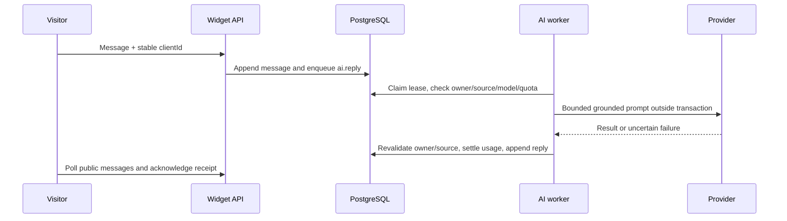

# System flows

These describe code paths, not a claim that every browser/provider flow has been accepted.

## Register, verify and log in

**Trigger:** signup/login forms in `src/web/main.tsx`. **Preconditions:** database/schema available, valid form input.

1. `POST /api/auth/signup` validates, hashes password, locks normalized email, creates user/workspace/Owner membership/default monthly AI response quota.
2. Verification challenge hash and local delivery payload are recorded; endpoint returns generic 202 including duplicate email cases.
3. `POST /api/auth/verify` consumes a valid challenge once. `POST /api/auth/login` verifies password and finds an active membership/workspace; it creates session hash and HttpOnly cookie.
4. `GET /api/me` drives workspace shell; `POST /api/workspace/switch` checks membership before changing session scope.

**Files/tables:** `app.ts`, `security.ts`; users, workspaces, memberships, sessions, challenges, local_delivery, quota_budgets, audit_events. **Success:** authenticated scoped session. **Failures/edges:** INVALID_CREDENTIALS, NO_MEMBERSHIP, invalid/expired/reused challenge, disabled tenant, duplicate signup privacy. Email receipt is not implemented. Reset invalidates sessions; verification is required for invitation acceptance but is not a universal login requirement.

## Website visitor → inbox → human handoff

**Trigger:** installed widget starts session. **Preconditions:** enabled channel and workspace, exact configured Origin.

1. `/widget-api/:key/session` validates channel/origin; creates visitor token hash and conversation or resumes an existing visitor. Optional least-loaded assignment respects active channel membership and capacity under a channel lock.
2. Profile endpoint validates configured prechat fields; messages reject missing mandatory data.
3. Visitor sends `{clientId,body}` to messages; `appendMessage` serializes sequence and deduplicates client ID. Reusing a conflicting request is not a new message.
4. Workspace inbox accesses conversations through session and channel membership. Agent takeover uses current ownership version; public replies and internal notes are distinct.
5. Widget polling returns only public messages after sequence cursor; receipts mark visible agent/AI messages as received. A stored message alone is not a visitor receipt.
6. Visitor handoff chuyển `reply_owner` sang `HANDOFF_PENDING`: đây là yêu cầu chờ người xử lý, chưa phải agent takeover và không đồng nghĩa đã assign. `status` của conversation vẫn là trục vòng đời riêng (`open`, `resolved`, `snoozed`). Chỉ authorized staff mới được chuyển sang `HUMAN_ACTIVE` (takeover) hoặc `AI_ACTIVE` (resume AI), luôn kèm owner-version checks.

**Files/tables:** `widget.ts`, `inbox.ts`, `chat-store.ts`, channels/channel_members/visitors/conversations/messages. **Success:** scoped public transcript and receipt. Inbox phải hiển thị riêng `status` và `reply_owner` để không nhầm `HANDOFF_PENDING` với `HUMAN_ACTIVE`. **Failures:** DOMAIN_DENIED, VISITOR_SESSION_EXPIRED, PRECHAT_REQUIRED, stale owner, channel membership denial. **Edge:** initial conversations default HANDOFF_PENDING; creating a widget session does not automatically enable AI.

## Grounded AI response

**Trigger:** a new visitor message while reply_owner=AI_ACTIVE. **Preconditions:** runnable worker, active provider/model/grant, public published source and quota.

`worker.ts` and `ai-reply-worker.ts` coordinate jobs, published knowledge retrieval, optional embeddings, rules, quota and dispatch fencing. Tenant comes from trusted job scope, not caller-selected prompt metadata. Before output commit, source validity/ownership can invalidate an otherwise successful provider response. Missing knowledge or unavailable entitlement does not authorize an ungrounded answer. Unknown external outcomes are not silently retried as fresh paid requests. Tables include jobs, ai_reply_dispatches, usage events/budgets, AI ledger, messages and knowledge versions/chunks; consult actual migration names in [DATABASE](DATABASE.md).

**Success:** one valid public reply and settled accounting. **Failures/edges:** takeover during call, stale publication, exhausted quota, missing secret, malformed response, timeout, lost lease/crash; tests do not substitute for live provider receipts.

## Upload/manual knowledge → publication

**Trigger:** workspace admin creates item/import. **Preconditions:** Owner/Admin, valid file/content/request ID.

1. `knowledge.ts` and import services validate input and create tracked imports/draft versions. Multipart file extraction is bounded and records failure states.
2. `knowledge-lifecycle.ts` processes content/chunks to READY; publication is explicit and revision-checked.
3. Published version pointer determines retrievable content. Editing a draft does not implicitly publish it. Rollback refers to eligible published history.
4. Widget retrieval selects tenant-scoped PUBLIC content; INTERNAL content stays outside visitor context. Embedding batches require an explicit compatible model/grant/version.

**Tables:** knowledge_items/versions/mutations/chunks/imports/import_files and publication history. **Success:** READY published version with traceable chunks. **Failures:** invalid content/file, extraction failure, version conflict, wrong tenant/audience, no published source. **Edge:** accepted upload is not evidence of successful processing or AI answer quality.

## Web source refresh → knowledge generation

**Trigger:** admin refresh or due schedule. **Preconditions:** active approved source, URL policy, running web worker.

1. Web source service enqueues durable `web.refresh`; schedule cursor advances under service rules.
2. Worker fetches bounded static HTML/text/XML with DNS/redirect/SSRF checks; sitemap traversal captures snapshots.
3. Snapshot-to-generation bridge splits content into staged UPSERT parts and retires obsolete parts; generation publication is explicit.
4. Publish/rollback updates knowledge visibility atomically through versioned generation services.

**Files:** `web-sources.ts`, `web-source-schedule.ts`, `web-refresh-worker.ts`, `web-source-fetch.ts`, `web-sitemap-crawl.ts`, `web-snapshot-generation.ts`, `web-generations.ts`. **Data:** web_sources, snapshots, schedules/generation tables and knowledge versions. **Failures:** SSRF_BLOCKED, unsupported/empty/oversized body, timeout, paused source, failed job, revision conflict. **Edge:** this is not a JavaScript browser renderer; live site and parity acceptance remain open.

## Platform provider setup and admin AI chat

**Trigger:** separate Platform console. **Preconditions:** authenticated active platform administrator.

1. Register provider with an environment-variable secret reference and validated endpoint; create model/capabilities and workspace grants.
2. Enabling non-local provider requires available secret. Connectivity test invokes selected chat model; local adapter reports not_configured.
3. `/api/platform/agent/chat` authenticates in a short transaction, then runs detached durable agent processing; user/session ownership, request identity, turn fences and recovery protect concurrent attempts.
4. Prompt context and result are persisted according to request status; token telemetry is separate from confirmed external completion.

**Files/tables:** `platform.ts`, `platform-agent.ts`, `platform-agent-prompt.ts`, `provider-transport.ts`; platform_admins/providers/models/model_grants/platform_audit/platform_agent_* and ai_usage_ledger. **Failures:** PLATFORM_FORBIDDEN, missing secret/model capability, duplicate/conflicting request, pending/unknown recovery, malformed provider result. **Edge:** Platform Admin is not automatically entitled to arbitrary workspace private messages; support grants are a separate boundary.

## Contact collection, audit and operations

Data collection configuration and contact lifecycle are implemented in `data-collection.ts`/`contacts.ts`: permission checks, revisioned updates, soft deletion, merge preview/history/undo and tags. Inspect their schemas before constructing requests; collection configuration alone is not proof that every desired visitor-to-contact automation is connected.

Administrative changes write audit events. `audit-log.ts` uses bounded keyset listing; `audit-export.ts` creates a bounded NDJSON payload inside a JSON response, not a streaming export service. Restore drill is operator-driven and quarantines restored delivery/work credentials. Retention and workspace closure policy remains a decision gap, not a scheduled deletion workflow.

