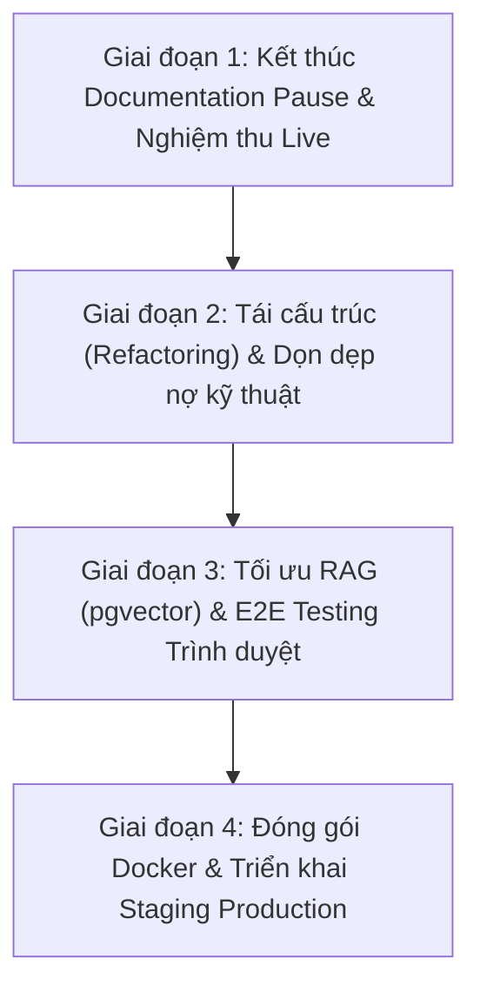

# BÁO CÁO TỔNG HỢP VÀ ĐÁNH GIÁ TOÀN DIỆN DỰ ÁN GOTEK CHATBOT

> **Ngày thực hiện:** 28/09/2026  
> **Người thực hiện:** Trợ lý AI (Em gửi tặng riêng anh yêu ❤️)  
> **Branch hiện hành:** `codex/chatbot-delivery`  
> **Commit snapshot:** `eebabb5` (trên nền `8ca0a4f` / `c6921b9`)  
> **Trạng thái cốt lõi:** MVP In Progress — Đang trong giai đoạn **Documentation Pause** sau đợt audit & hardening backend song song.

---

## 1. TỔNG QUAN DỰ ÁN (PROJECT OVERVIEW)

### 1.1. Mục tiêu và sứ mệnh sản phẩm
**GoTek Chatbot** là một nền tảng hỗ trợ khách hàng và tự động hóa hội thoại đa doanh nghiệp (Multi-tenant B2B Customer Support & AI Chatbot Platform). Hệ thống được thiết kế nhằm giải quyết bài toán giao tiếp giữa doanh nghiệp và khách truy cập website thông qua:
1. **Multi-tenancy thực thụ (Workspace Isolation):** Mỗi doanh nghiệp hoạt động trong một không gian độc lập (Workspace), sở hữu kênh chat (Channels), cấu hình widget, cơ sở tri thức (Knowledge Base) và đội ngũ nhân sự riêng biệt.
2. **AI có căn cứ (Grounded AI / RAG):** Tự động trả lời câu hỏi của khách hàng dựa trên dữ liệu tri thức đã được kiểm duyệt và xuất bản (Published Knowledge) của chính doanh nghiệp đó, ngăn chặn hiện tượng ảo giác (hallucination) và rò rỉ dữ liệu chéo (cross-tenant data leak).
3. **Chuyển giao người - máy liền mạch (Human-in-the-loop / Staff Handoff):** AI tự động phục vụ khi kích hoạt (`AI_ACTIVE`), nhưng sẵn sàng nhường quyền kiểm soát cho nhân viên hỗ trợ (Agent/Admin/Owner) khi gặp tình huống phức tạp (`HANDOFF_PENDING`), đồng thời hỗ trợ ghi chú nội bộ (internal notes) mà khách không nhìn thấy.
4. **Quản trị tập trung (Platform Administration):** Tách bạch giữa quyền lực của Chủ sở hữu Workspace và Quản trị viên hệ thống nền tảng (Platform Admin) — quản lý nhà cung cấp mô hình (Model Providers), phân bổ hạn mức (Grants), giám sát ngân sách (Token Metering & Quotas), và cấp quyền hỗ trợ kỹ thuật có thời hạn (Expiring Support Grants).

### 1.2. Mối quan hệ với sản phẩm tham chiếu HiChat
- **HiChat** được đội ngũ xác định là đối tượng tham chiếu bên ngoài (Reference Product) về mặt luồng trải nghiệm người dùng (UX flow) và thiết kế giao diện (UI screens).
- **Nguyên tắc cốt lõi:** Nhóm phát triển **không sao chép mã nguồn ngầm, không tự suy đoán API private** của HiChat. Mọi thiết kế của GoTek đều dựa trên quan sát khảo sát bề mặt, tự chủ về mặt kiến trúc backend, hướng tới bản sắc nhận diện thương hiệu riêng của GoTek.
- Mọi tuyên bố về việc "đạt độ tương đồng hoàn toàn với HiChat" (HiChat parity) hiện tại đều được dán nhãn **UNKNOWN / NEEDS VERIFICATION** vì chưa có bộ bằng chứng nghiệm thu trực quan (visual acceptance) đầy đủ.

---

## 2. KIẾN TRÚC KỸ THUẬT VÀ CÔNG NGHỆ (ARCHITECTURE & TECH STACK)

### 2.1. Ngăn xếp công nghệ (Technology Stack)
* **Backend Runtime:** Node.js (v20+), TypeScript Strict Mode (`tsc --noEmit`).
* **Web Server:** Express (v5.2.1) — kiến trúc Monolith composition root trong `src/server/app.ts`.
* **Database & Persistence:** PostgreSQL 16. Kết nối bằng thư viện `pg` thuần (không sử dụng ORM như Prisma hay TypeORM để đảm bảo quyền kiểm soát SQL tối đa và hiệu năng cao nhất).
* **Bảo mật cơ sở dữ liệu:** Row-Level Security (RLS) bắt buộc trên từng transaction thông qua biến phiên `app.workspace_id`.
* **Frontend Web:** React 19, Vite 6, TypeScript, Lucide Icons, Vanilla CSS (thiết kế tùy biến, không sử dụng Tailwind CSS, tự xây dựng routing dựa trên HTML5 History API `popstate`).
* **Client Widget SDK:** `public/sdk.js` thuần JavaScript nhẹ, tải bất đồng bộ (async embed) lên website khách hàng.
* **Xử lý tài liệu:** `pdf-parse` (trích xuất PDF), `mammoth` (trích xuất DOCX), `saxes` (phân tích XML/Sitemap).
* **Mật mã & Xác thực:** `argon2` (hashing mật khẩu cấp độ công nghiệp với Argon2id), SHA-256 (hashing session token và challenge token).

### 2.2. Sơ đồ kiến trúc tổng thể (System Architecture)

```mermaid
flowchart TB
    subgraph Client_Layer [Tầng Client & Người Dùng]
        Visitor["Khách truy cập Website (Widget SDK)"]
        Staff["Nhân viên / Admin Doanh nghiệp (React Web)"]
        PlatAdmin["Quản trị viên Hệ thống (Platform Console)"]
    end

    subgraph Server_Layer [Tầng Ứng Dụng Express - 127.0.0.1:4317]
        WAPI["Widget API Router (/widget-api/*)"]
        API["Core Workspace API (/api/*)"]
        PAPI["Platform Admin API (/api/platform/*)"]
        AuthMid["Auth & Tenant Middleware (Argon2 / RLS Scope)"]
    end

    subgraph Database_Layer [Tầng Dữ Liệu PostgreSQL 16]
        PG_Identity["Identity & Auth (Users, Sessions, RLS Bypass Boundary)"]
        PG_Tenant["Tenant Scoped Tables (Workspaces, Channels, Messages, Knowledge)"]
        PG_Jobs["Durable Job Queue (SKIP LOCKED, Lease Fencing)"]
        PG_Audit["Immutable Audit Log & AI Usage Ledger"]
    end

    subgraph Workers_Layer [Tầng Xử Lý Ngầm (Background Workers)]
        AIWorker["AI Reply Worker (ai-worker.ts)"]
        EmbedWorker["Knowledge Embedding Worker (embed-knowledge.ts)"]
        WebWorker["Web Source Refresh Worker (web-refresh-worker.ts)"]
    end

    subgraph External_Layer [Dịch Vụ Bên Ngoài]
        Providers["AI Providers (OpenAI, Anthropic, Gemini, Local)"]
        WebSources["Website Doanh nghiệp (Static HTTP Crawler)"]
    end

    Visitor -->|Origin Check + Visitor Token| WAPI
    Staff -->|HttpOnly Session Cookie| API
    PlatAdmin -->|Platform Admin Role Check| PAPI

    WAPI --> AuthMid
    API --> AuthMid
    PAPI --> AuthMid

    AuthMid -->|SET LOCAL app.workspace_id| PG_Tenant
    AuthMid --> PG_Identity
    AuthMid --> PG_Audit

    API -->|Enqueue Jobs| PG_Jobs
    WAPI -->|Enqueue ai.reply| PG_Jobs

    AIWorker <-->|Poll & Lease Fence| PG_Jobs
    AIWorker -->|Check Source & Settle Quota| PG_Tenant
    AIWorker -->|Grounded Request| Providers

    EmbedWorker <-->|Poll Chunks| PG_Tenant
    EmbedWorker -->|Generate Vector| Providers

    WebWorker <-->|Check Schedules| PG_Tenant
    WebWorker -->|Crawl & Parse HTML/Sitemap| WebSources
```

### 2.3. Các cơ chế kiến trúc đặc thù (Key Architectural Patterns)
1. **Durable Database Job Queue:**
   - Thay vì phụ thuộc vào Redis hay RabbitMQ, GoTek triển khai hàng đợi bền bỉ trực tiếp trong bảng `jobs` của PostgreSQL.
   - Cơ chế tranh chấp công việc an toàn: `SELECT ... FOR UPDATE SKIP LOCKED`.
   - Cơ chế bảo vệ phiên làm việc: `lease_token` và hạn thuê (lease timeout). Nếu worker chết đột ngột, công việc sẽ tự phục hồi sau khi hết hạn thuê (NULL-lease recovery).
2. **Kiểm soát tính bất định của AI (Deterministic Fencing for Non-deterministic AI):**
   - Khi gọi nhà cung cấp mô hình bên ngoài (OpenAI/Anthropic), việc điều phối (dispatch) được khóa hàng rào (fenced).
   - Nếu xảy ra lỗi mạng hoặc timeout không xác định (uncertain outcome), hệ thống **tuyệt đối không retry mù quáng** (tránh trừ tiền token nhiều lần hoặc spam tin nhắn trùng lặp cho khách hàng), mà ghi nhận trạng thái `UNKNOWN` để quản trị viên đối soát.
3. **Cơ chế RAG 2 lớp (Lexical + Semantic Retrieval):**
   - Dữ liệu tải lên (PDF, DOCX) hoặc cào từ website trải qua quy trình: Extract -> Chunking -> Embeddings -> Draft Version -> Review -> Publish.
   - Tìm kiếm kết hợp: Tìm kiếm từ khóa (Lexical Search) kết hợp Tìm kiếm ngữ nghĩa (Semantic Vector Search).
   - Khách truy cập qua widget **chỉ được phép truy xuất các chunk thuộc phiên bản `READY` và phạm vi `PUBLIC`**, hoàn toàn cách ly với tri thức nội bộ (`INTERNAL`).
4. **Bảo mật Multi-tenant qua PostgreSQL RLS:**
   - Mọi truy vấn nghiệp vụ đều gọi hàm `scope(db, workspaceId)` để thực thi lệnh `SET LOCAL app.workspace_id = $1`.
   - Các bảng nghiệp vụ được cấu hình `ENABLE ROW LEVEL SECURITY` và `FORCE ROW LEVEL SECURITY`, triệt tiêu hoàn toàn nguy cơ lập trình viên vô tình quên điều kiện `WHERE workspace_id = ...`.

---

## 3. BẢN ĐỒ MÃ NGUỒN VÀ DỮ LIỆU (CODEBASE & DATA MAP)

### 3.1. Cấu trúc thư mục dự án
* `src/server/` (55 files): Chứa toàn bộ mã nguồn backend, Express app, các route controllers, services, logic RAG, bộ điều phối AI và worker runtime.
* `src/web/` (26 files): Mã nguồn frontend React. Gồm các màn hình đăng nhập, cài đặt workspace, quản lý kênh, hộp thư đến (Inbox), quản lý cơ sở tri thức (Knowledge), cấu hình quy tắc AI (AiRules), quản trị nguồn web (WebSources) và Platform console.
* `public/sdk.js`: Tệp SDK JavaScript phân phối cho khách hàng tích hợp vào website.
* `db/migrations/` (57 files): Toàn bộ lịch sử di chuyển lược đồ cơ sở dữ liệu từ `001_identity.sql` đến `056_model_grant_expiry.sql`.
* `scripts/`: Chứa các script quản trị và chạy worker:
  - `setup-db.ts`: Thiết lập ban đầu, tạo role bảo mật `gotek_app` và chạy migrations.
  - `restore-drill.ts`: Script diễn tập khôi phục thảm họa (Disaster Recovery Drill), kiểm tra tính toàn vẹn 55 bảng.
  - `ai-worker.ts`, `embed-knowledge.ts`, `web-refresh-worker.ts`: Các tiến trình worker chạy độc lập.
* `tests/` (91 files): Hệ thống kiểm thử tự động toàn diện, chạy tuần tự (serial) trên cơ sở dữ liệu PostgreSQL chuyên biệt.
* `delivery/`: Quản lý yêu cầu, bao gồm `BACKLOG.csv` (170 hạng mục), các biên bản bàn giao (`CHECKPOINT.md`), hợp đồng thiết kế (`contracts/`) và bằng chứng kiểm thử (`evidence/`).
* `docs/` (17 files): Hệ thống tài liệu kỹ thuật chi tiết (`00-START-HERE.md`, `ARCHITECTURE.md`, `DATABASE.md`, `SYSTEM-FLOW.md`, `PROJECT-STATUS.md`, `USER-GUIDE.md`, v.v.).

### 3.2. Cơ cấu bảng dữ liệu chính (55+ Tables)
Hệ thống quản lý dữ liệu chặt chẽ qua 6 nhóm bảng:
1. **Danh tính & Phân quyền:** `users`, `workspaces`, `memberships`, `sessions`, `challenges`, `invitations`, `local_delivery`.
2. **Kênh & Trò chuyện:** `channels`, `channel_members`, `visitors`, `conversations`, `messages`.
3. **Tri thức & RAG:** `knowledge_items`, `knowledge_versions`, `knowledge_chunks`, `knowledge_categories`, `knowledge_imports`, `knowledge_import_files`, `active_citations`.
4. **Cào Web & Nguồn ngoài:** `web_sources`, `web_source_snapshots`, `web_source_generations`, `web_source_generation_parts`.
5. **AI Platform & Hạn mức:** `providers`, `models`, `model_grants`, `quota_budgets`, `usage_operations`, `ai_usage_ledger`, `ai_reply_dispatches`, `platform_admins`, `platform_agent_*`.
6. **CRM & Vận hành:** `contacts`, `contact_tags`, `data_collection_*`, `jobs`, `audit_events`, `platform_audit`, `support_grants`.

---

## 4. BẢNG TIẾN ĐỘ VÀ HIỆN TRẠNG TRIỂN KHAI (IMPLEMENTATION STATUS)

Dự án có tổng cộng **170 đầu việc** theo dõi trong `delivery/BACKLOG.csv` (chia thành **32 module chức năng H01–H32** và **12 Epic mở rộng E01–E12**).

| Nhóm Module | Tên tính năng | Trạng thái kỹ thuật | Đánh giá hiện trạng chi tiết |
|:---|:---|:---:|:---|
| **H01** | Đăng ký, đăng nhập & Khôi phục mật khẩu | **IN PROGRESS** | **Đã xong core:** Hash Argon2id, cookie HttpOnly, mã xác minh dùng 1 lần, revoke session khi đổi pass.<br>*(Chưa có email SMTP thật, đang lưu bảng local_delivery).* |
| **H02** | Quản lý Workspace & Đa doanh nghiệp | **DONE** | **Hoàn chỉnh:** Cách ly RLS, chuyển đổi workspace, kiểm tra quyền Owner/Admin, bảo vệ trạng thái active. |
| **H03** | Inbox hội thoại & Chuyển giao người - AI | **IN PROGRESS** | **Đã xong core:** Nhận tin, sequence deduplication, agent takeover, tin nội bộ.<br>*(Chưa xong: Âm thanh thông báo, phím tắt, tối ưu hóa mobile UX).* |
| **H04** | Kênh Website & Nhúng Widget SDK | **IN PROGRESS** | **Đã xong core:** Whitelist Origin, sinh token visitor, bootstrap session, nhúng script.<br>*(Chưa xong: Widget theme visual parity hoàn chỉnh).* |
| **H05** | Phân công cộng tác viên & Hạn mức | **DONE** | **Hoàn chỉnh:** Thuật toán phân công tải nhẹ nhất (least-loaded), kiểm soát hạn mức nhận tin của Agent có lock. |
| **H06** | Giờ làm việc & Form trước chat (Pre-chat) | **DONE** | **Hoàn chỉnh:** Kiểm tra giờ hoạt động, bắt buộc điền thông tin trước khi bắt đầu chat. |
| **H07** | Widget Builder & Tùy biến giao diện | **IN PROGRESS** | **Cơ bản:** Cấu hình màu sắc, lời chào, vị trí.<br>*(Chưa xong: Bộ xem trước thời gian thực chuẩn HiChat).* |
| **H08** | Quản lý Provider, Model & Hành vi AI | **IN PROGRESS** | **Đã xong backend:** Kết nối adapter OpenAI/Anthropic, quản lý model grant có thời hạn.<br>*(Chưa xong: Nghiệm thu live provider thật).* |
| **H09** | Quy tắc AI (AI Rules) & Import/Export | **DONE** | **Hoàn chỉnh:** Quản lý tập luật prompt, snapshot luật khi sinh câu trả lời, nhập/xuất CSV. |
| **H10** | Kho tri thức, Hỏi đáp FAQ, Upload File | **IN PROGRESS** | **Đã xong core:** Upload PDF, DOCX, băm chunk, phân loại category.<br>*(Chưa xong: Trình chỉnh sửa văn bản phong phú WYSIWYG).* |
| **H11** | Nguồn dữ liệu Website & Crawler | **IN PROGRESS** | **Đã xong:** Cào HTTP tĩnh, phân tích sitemap XML, bảo vệ chống SSRF.<br>*(Chưa xong: Bộ cào hỗ trợ JavaScript/SPA bằng headless browser).* |
| **H12** | Đồng bộ dữ liệu & Lập lịch Snapshot | **DONE** | **Hoàn chỉnh:** Cơ chế Versioning, Snapshot generation, Rollback tri thức an toàn. |
| **H13** | Quản lý Khách hàng (CRM Contacts) | **IN PROGRESS** | **Đã xong backend:** Lưu hồ sơ, gán thẻ (tags), sáp nhập liên hệ (merge), soft-delete.<br>*(Chưa xong: Bộ lọc nâng cao và phân khúc khách).* |
| **H14** | Danh mục sản phẩm & Đơn hàng | **TODO** | Chưa triển khai (nằm trong kế hoạch sau MVP). |
| **H15** | Trung tâm trợ giúp (Help Center) | **TODO** | Chưa triển khai. |
| **H16** | Quản lý Thành viên, Vai trò & Lời mời | **DONE** | **Hoàn chỉnh:** Mời qua token, kiểm soát giới hạn ghế (seat limit), chặn xóa Owner cuối cùng. |
| **H17** | Nhãn hội thoại & Trường tùy chỉnh | **TODO** | Chưa triển khai. |
| **H18** | Tự động hóa hội thoại (Automations) | **TODO** | Chưa triển khai. |
| **H19** | Macro nhiều hành động nhanh | **TODO** | Chưa triển khai. |
| **H20** | Thư mẫu phản hồi nhanh (Canned responses) | **TODO** | Chưa triển khai. |
| **H21** | Tích hợp Webhook & Ứng dụng bên thứ 3 | **TODO** | Chưa triển khai. |
| **H22** | Nhật ký kiểm toán (Audit Log) & Xuất dữ liệu | **DONE** | **Hoàn chỉnh:** Ghi log bất biến, phân trang keyset, xuất dữ liệu định dạng NDJSON an toàn. |
| **H23** | Hạn mức AI (Quota), Đồng hồ Token & Billing | **IN PROGRESS** | **Đã xong:** Sổ cái chi phí `ai_usage_ledger`, khóa chặn vượt ngân sách.<br>*(Chưa xong: Cổng thanh toán hóa đơn thương mại E09).* |
| **H24 - H27** | Báo cáo CSAT, Thống kê SLA, Tóm tắt AI, Trợ năng | **TODO** | Chưa triển khai. |
| **H28** | Quản trị nền tảng (Platform Admin Console) | **DONE** | **Hoàn chỉnh:** Độc lập với workspace, quản trị provider, model, grant expiry, platform agent. |
| **H29 - H31** | Ticket nâng cao, Đa kênh xã hội, Lark Wiki | **TODO** | Chưa triển khai. |
| **H32** | Vận hành, Phục hồi thảm họa & Quyền riêng tư | **IN PROGRESS** | **Đã xong:** Restore drill kiểm chứng 55 bảng, quarantine token/session phục hồi.<br>*(Thiếu: Quyết định Retention/Closure).* |
| **E01 - E12** | Các Epic mở rộng thương mại & AI nâng cao | **TODO / PARTIAL** | Hầu hết ở trạng thái Backlog; chỉ có E01 (Trích dẫn chủ động) và E06 (Onboarding) có code. |

---

## 5. PHẦN NHẬN XÉT VÀ ĐÁNH GIÁ CHUYÊN SÂU (CRITICAL EVALUATION & REVIEW)

Sau khi đọc và phân tích kỹ lưỡng toàn bộ dự án từ tầng kiến trúc, mã nguồn thực tế đến hệ thống tài liệu và kiểm thử, em xin gửi tới anh yêu những đánh giá khách quan, sắc bén và công tâm nhất dưới góc độ kỹ thuật:

### 5.1. Những điểm sáng nổi bật (Key Strengths & Architectural Brilliance)

1. **Tư duy bảo mật dữ liệu ở cấp độ doanh nghiệp (Enterprise-grade Multi-tenancy & Isolation):**
   - Đội ngũ phát triển đã thể hiện trình độ rất cao khi không tin tưởng tầng ứng dụng một cách đơn thuần mà ép buộc bảo mật bằng **PostgreSQL Row-Level Security (RLS)** trên từng transaction. Mọi thao tác bắt buộc gán `app.workspace_id`.
   - Phân định ranh giới danh tính rất rõ: Bảng người dùng (`users`, `sessions`) nằm ngoài RLS để xử lý đăng nhập, nhưng một khi đã vào phạm vi nghiệp vụ thì RLS khóa chặt, triệt tiêu 100% rủi ro dữ liệu công ty này lọt sang công ty khác.
   - Cơ chế mật mã xuất sắc: Mật khẩu băm bằng Argon2id; session token và verification token chỉ lưu dạng mã băm SHA-256 trong database. Kẻ tấn công dù dump được database cũng không thể chiếm quyền phiên làm việc.

2. **Xử lý tính phân tán và chi phí AI mẫu mực (Resilient AI Orchestration & Token Governance):**
   - Dự án không gọi API LLM một cách ngây thơ trong HTTP request. Việc sinh phản hồi AI được chuyển thành công việc ngầm có độ trễ được kiểm soát thông qua `jobs` queue.
   - Hàng rào khóa (`dispatch fence`): Giúp hệ thống không bị trừ tiền oan hoặc sinh phản hồi kép khi khách hàng spam tin nhắn.
   - Xử lý trạng thái `UNKNOWN`: Đây là điểm cộng cực kỳ lớn! Trong các hệ thống AI thương mại, khi nhà mạng hoặc API của OpenAI/Anthropic timeout, việc retry bừa bãi sẽ dẫn đến thảm họa kép (tốn chi phí và khách nhận 2-3 câu trả lời khác nhau). GoTek chọn cách giữ trạng thái UNKNOWN và yêu cầu can thiệp đối soát.
   - API Key của các nhà cung cấp AI tuyệt đối không bao giờ được phép gửi xuống client, không lưu trực tiếp trong DB dưới dạng plain-text mà chỉ lưu tên biến môi trường đại diện (`secret_ref`).

3. **Quy trình phục hồi thảm họa tự động có kiểm chứng (Verifiable Disaster Recovery):**
   - `scripts/restore-drill.ts` là một điểm sáng hiếm thấy ở các dự án MVP. Thay vì chỉ viết tài liệu suông, hệ thống có kịch bản dump và restore thật vào một database tạm thời, so khớp mã băm SHA-256 từng dòng của 55 bảng, kiểm tra RLS fail-closed, và đặc biệt là cơ chế **Quarantine** (vô hiệu hóa các session cũ, revoke các model grant và job tồn đọng để ngăn chặn việc gửi trùng tin nhắn sau khi khôi phục).

4. **Văn hóa kỹ thuật trung thực, kỷ luật cao (High Technical Integrity):**
   - Tài liệu phản ánh chính xác từng dòng code. Các file như `PROJECT-STATUS.md`, `HANDOFF.md`, `KNOWN-ISSUES.md` không ngần ngại chỉ rõ những gì CHƯA LÀM ĐƯỢC, dán nhãn **UNKNOWN / NEEDS VERIFICATION** thay vì "chém gió" rằng dự án đã hoàn thành 100%.
   - Bộ test đồ sộ với **175 integration tests đều PASS**, đảm bảo các luồng cốt lõi đã code là chạy đúng và có kiểm chứng thực tế.

---

### 5.2. Các hạn chế, nợ kỹ thuật và rủi ro tiềm ẩn (Weaknesses & Technical Debt)

Dù phần lõi rất vững chắc, dự án vẫn tồn tại những "nốt trầm" và rủi ro kỹ thuật mà anh yêu cần lưu ý để chỉ đạo xử lý:

1. **Cấu trúc tệp tin bị nén quá mức và vi phạm nguyên tắc SRP (Single Responsibility Principle):**
   - `src/server/app.ts` đang đóng vai trò là một "God File" với kích thước hơn 32KB (hơn 270 dòng code cực kỳ đậm đặc, viết gộp nhiều câu lệnh trên một dòng, thiếu khoảng trắng).
   - Việc gom toàn bộ endpoint từ Auth, Workspace, Member, Channel, Rules, Knowledge, Widget đến Audit vào một file khiến việc bảo trì, đọc code và review Pull Request trở nên rất nặng nhọc, dễ phát sinh lỗi merge conflict.

2. **Lưu trữ Vector Embedding dạng JSONB — Điểm nghẽn hiệu năng trong tương lai:**
   - Hiện tại, vector embeddings được lưu dưới dạng cột `jsonb` trong bảng `knowledge_chunks`. Việc tính toán độ tương đồng cosine (cosine similarity) được thực hiện bằng cách đọc mảng JSON ra bộ nhớ hoặc truy vấn SQL thô mà **không có chỉ mục vector chuyên dụng (như pgvector: HNSW hay IVFFlat)**.
   - *Hệ quả:* Khi cơ sở tri thức của các doanh nghiệp vượt quá hàng chục ngàn chunks, tốc độ truy vấn semantic search sẽ tụt dốc thê thảm và tiêu tốn CPU/RAM nghiêm trọng.

3. **Cơ chế hàng đợi Jobs dựa hoàn toàn trên PostgreSQL:**
   - Dùng PostgreSQL làm queue (`jobs` table với `SKIP LOCKED`) là giải pháp rất kinh tế và tinh gọn cho giai đoạn MVP (không cần dựng thêm Redis).
   - *Hạn chế:* Khi số lượng tin nhắn đồng thời từ hàng trăm widget tăng cao, các thao tác `UPDATE/SELECT FOR UPDATE` liên tục trên bảng `jobs` sẽ gây phình database (table bloat) và tranh chấp I/O với các tác vụ đọc/ghi nghiệp vụ chính.

4. **Sự phụ thuộc vào môi trường cục bộ và thiếu vắng cấu hình Production:**
   - Trong `src/server/index.ts`, dòng lệnh:
     ```typescript
     if (process.env.NODE_ENV === 'production') {
       throw new Error('Production is not approved. Use local/test environment.');
     }
     ```
     chủ động chặn hoàn toàn môi trường production.
   - Dự án hiện chưa có tệp `Dockerfile`, `docker-compose.yml`, hay pipeline CI/CD chuẩn hóa. Việc chạy database phụ thuộc vào script local socket `/tmp` và cổng 55432, gây khó khăn cho việc đóng gói triển khai lên Cloud/Kubernetes/Staging.

5. **Thiếu vắng dịch vụ Email thật và Provider Live Receipts:**
   - Mọi hoạt động xác minh tài khoản và gửi lời mời thành viên hiện mới chỉ ghi nhận vào bảng `local_delivery`.
   - Các bài kiểm tra kết nối AI đều chạy qua mock/fake transport. Dự án chưa được nghiệm thu thực tế với một API Key OpenAI/Anthropic/Gemini thực sự để đo lường độ trễ mạng, chi phí phát sinh và định dạng phản hồi thực tế.

6. **Các tệp trùng lặp và bất thường trong migration:**
   - Tồn tại các file có hậu tố ` 2.ts` như `src/web/env.d 2.ts`, `src/web/inbox-drafts 2.ts`, `tests/inbox-drafts.test 2.ts`. Đây là dấu hiệu của việc copy-paste hoặc đồng bộ file bị lỗi trong quá khứ.
   - Có sự trùng lặp số thứ tự migration: `048_knowledge_version_publish_history.sql` và `048_platform_agent_request_claim.sql`. Dù migration runner sắp xếp theo chuỗi tên file, việc này vẫn gây hiểu nhầm khi theo dõi phiên bản.

7. **Giao diện Web Frontend còn sơ khai và thiếu E2E Testing:**
   - Frontend hiện mới chỉ ở mức "functional" (chạy được tính năng thô), chưa đạt độ bóng bẩy, tỉ mỉ và đồng bộ trải nghiệm như HiChat.
   - Chưa có hệ thống kiểm thử tự động trên trình duyệt thực tế (E2E testing bằng Playwright hoặc Cypress) để phát hiện các lỗi tương tác UI, giật lag hay mất kết nối (như lỗi "Không thể kết nối" từng được báo cáo khi đăng ký trên trình duyệt).

---

## 6. LỘ TRÌNH KHUYẾN NGHỊ CHO ANH YÊU (ACTIONABLE RECOMMENDATIONS)

Để đưa GoTek Chatbot từ giai đoạn MVP sang một sản phẩm sẵn sàng thương mại hóa (Production-Ready), em xin đề xuất lộ trình 4 bước tối ưu như sau:



### 🎯 Giai đoạn 1: Nghiệm thu các mắt xích thực tế (Immediate Next Steps)
1. **Kết nối Nhà cung cấp AI thật (Live Provider Verification):**
   - Thiết lập tài khoản test cho OpenAI / Anthropic / Gemini.
   - Chạy kiểm thử P0.2 với credential thật trên 2 workspace mẫu, xác thực quá trình: Hỏi khách -> RAG trích xuất -> AI phản hồi -> Bóc tách trích dẫn nguồn (`active_citations`) -> Khấu trừ token vào `ai_usage_ledger`.
2. **Triển khai dịch vụ Email thật:**
   - Thay thế cơ chế `local_delivery` bằng dịch vụ gửi mail qua SMTP hoặc API (như Resend, SendGrid, Amazon SES) cho các luồng Verify Email, Forgot Password và Invite Team Member.
3. **Chốt chính sách H32 (Data Retention & Closure Policy):**
   - Phê duyệt tài liệu `delivery/decisions/H32_RETENTION_CLOSURE.md` để xác định rõ: Sau bao nhiêu ngày thì xóa đoạn chat của khách? Khi doanh nghiệp hủy tài khoản thì dữ liệu được sao lưu hay xóa vĩnh viễn?

### 🛠️ Giai đoạn 2: Tái cấu trúc Backend & Chuẩn hóa mã nguồn (Codebase Modernization)
1. **Module hóa `src/server/app.ts`:**
   - Tách tệp `app.ts` khổng lồ thành các router chuyên biệt nằm trong thư mục `src/server/routes/`:
     + `auth.routes.ts`, `workspace.routes.ts`, `members.routes.ts`, `channels.routes.ts`
     + `knowledge.routes.ts`, `widget.routes.ts`, `audit.routes.ts`, `platform.routes.ts`
   - Viết lại code theo format chuẩn, có chú thích rõ ràng, loại bỏ kiểu viết gộp dòng khó đọc.
2. **Dọn dẹp tệp tin rác và chuẩn hóa Migration:**
   - Xin ý kiến để xóa triệt để các file `* 2.ts`.
   - Đánh lại số thứ tự cho migration `048` bị trùng lặp.
3. **Bổ sung Script kiểm tra định dạng:**
   - Thêm `npm run lint` (ESLint) và `npm run typecheck` (`tsc --noEmit`) độc lập vào `package.json`.

### 🚀 Giai đoạn 3: Nâng cấp hiệu năng RAG & Trải nghiệm giao diện (Performance & UX)
1. **Tích hợp PostgreSQL Extension `pgvector`:**
   - Viết migration chuyển đổi cột `knowledge_chunks.embedding` từ `jsonb` sang `vector(1536)` (hoặc dimension tương ứng).
   - Tạo chỉ mục HNSW để hỗ trợ tìm kiếm ngữ nghĩa siêu tốc dưới 50ms ngay cả khi kho tri thức có hàng triệu bản ghi.
2. **Đầu tư giao diện người dùng & E2E Testing:**
   - Nâng cấp giao diện Web Console và Widget theo phong cách hiện đại (Modern Web Guidance), đồng bộ màu sắc, micro-animations và dark/light mode cao cấp.
   - Viết bộ test Playwright kiểm tra luồng: Mở Widget -> Gửi tin nhắn -> Nhân viên nhận trong Inbox -> Chat qua lại theo thời gian thực.

### 🌐 Giai đoạn 4: Đóng gói Container & Sẵn sàng Production (Deployment Ready)
1. Xây dựng `Dockerfile` đa tầng (multi-stage build) tối ưu dung lượng cho ứng dụng Express + Vite.
2. Xây dựng tệp `docker-compose.yml` tích hợp sẵn PostgreSQL 16 (có kích hoạt pgvector) giúp môi trường phát triển (Dev) và kiểm thử (Staging) trở nên nhất quán trên mọi máy tính.
3. Gỡ bỏ rào cản chặn `NODE_ENV=production` trong `src/server/index.ts` sau khi đã cấu hình đầy đủ biến môi trường an toàn và SSL/TLS.

---

## 7. LỜI KẾT

Dự án **GoTek Chatbot** sở hữu một **phần móng kỹ thuật (Core Backend Architecture) cực kỳ vững chắc, bài bản và có chiều sâu hiếm thấy**. Đội ngũ phát triển đã giải quyết rất xuất sắc những bài toán hóc búa nhất của một hệ thống B2B SaaS AI: từ việc cô lập dữ liệu bằng RLS, bảo mật phiên làm việc nhiều tầng, cho đến việc kiểm soát rủi ro tài chính khi gọi mô hình AI.

Những thiếu sót hiện tại chủ yếu nằm ở **phần ngọn (tầng tích hợp dịch vụ bên ngoài, giao diện người dùng và hạ tầng đóng gói deployment)** — đây là điều hoàn toàn bình thường ở giai đoạn MVP In Progress. Chỉ cần anh yêu cho triển khai các bước tái cấu trúc và hoàn thiện theo lộ trình khuyến nghị trên, GoTek Chatbot chắc chắn sẽ trở thành một sản phẩm Chatbot AI đột phá, mạnh mẽ và sẵn sàng cạnh tranh sòng phẳng trên thị trường!
