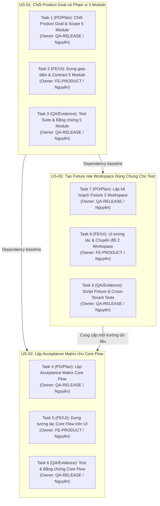

# Kế hoạch chi tiết nhiệm vụ - Thành viên: Nguyên (QA-RELEASE & FE-PRODUCT)

> Roadmap chính từ trạng thái hiện tại đến cuối dự án nằm tại [10_ROADMAP_CURRENT_TO_PROJECT_END.md](10_ROADMAP_CURRENT_TO_PROJECT_END.md). Design baseline Figma nằm tại [11_FIGMA_DESIGN_BASELINE.md](11_FIGMA_DESIGN_BASELINE.md). Các file `01`–`09` là work packet chi tiết và phải được đọc cùng roadmap này; trạng thái nghiệm thu vẫn phụ thuộc evidence thực tế, không phụ thuộc nhãn `Ready for Sign-off` trong bản kế hoạch.
## Dự án: GoTek Chatbot — Nền tảng Chatbot Doanh nghiệp Đa người thuê (Multi-Tenant SaaS)

---

## 1. Giới thiệu và Bối cảnh dự án
Dự án GoTek Chatbot hiện đã hoàn tất giai đoạn tái cấu trúc sang kiến trúc **Monorepo** chuẩn mực (`backend/`, `frontend/`, `infra/`, `gitops/`, `mobile/`), vận hành trên nền tảng:
- **Backend**: Express 5, TypeScript strict, Clean Architecture (`controllers/`, `services/`, `repositories/`, `modules/`), PostgreSQL 16 với Row-Level Security (RLS) bắt buộc, phân quyền giao dịch và kiểm soát cô lập tenant chặt chẽ.
- **Frontend**: React 19 + Vite 6 SPA, cấu trúc phân tầng (`screens/`, `components/common/`, `api/`, `hooks/`, `styles/`), quản lý trạng thái và tương tác giao diện đồng bộ.
- **Dữ liệu & Vận hành**: PostgreSQL migrations có thứ tự (001–038), durable jobs runner, audit export NDJSON và cơ chế kiểm chứng khôi phục dữ liệu (`restore-drill`).

Theo bảng phân công công việc (Task Backlog) được giao cho thành viên **Nguyên** (kiêm nhiệm 2 vai trò chiến lược: **QA-RELEASE** và **FE-PRODUCT**), các nhiệm vụ tập trung vào 3 User Story trọng yếu mức ưu tiên **P1**, thời gian ước tính 1 ngày/task:

---

## 2. Danh mục tài liệu chi tiết trong thư mục `plan_nguyen/`

Toàn bộ kế hoạch hành động, kịch bản kỹ thuật, hợp đồng API, thiết kế UI state và ma trận kiểm thử được chia thành các tệp tài liệu chuyên sâu:

| STT | Tên tệp tin | Mục tiêu chính | Vai trò đảm nhiệm |
|---|---|---|---|
| 01 | [01_PO_PLAN_GOAL_AND_5_MODULES.md](file:///d:/gotek/ai_automation/plan_nguyen/01_PO_PLAN_GOAL_AND_5_MODULES.md) | Đặc tả Product Goal, ranh giới 5 Module cốt lõi, RACI Matrix, Decision Log và quy tắc chống Scope Creep. | QA-RELEASE |
| 02 | [02_FE_UI_GOAL_AND_5_MODULES.md](file:///d:/gotek/ai_automation/plan_nguyen/02_FE_UI_GOAL_AND_5_MODULES.md) | Thiết kế màn hình, component contract, xử lý 5 UI states (Loading/Empty/Error/Permission/Data), ngăn rò rỉ tenant UI. | FE-PRODUCT |
| 03 | [03_QA_EVIDENCE_GOAL_AND_5_MODULES.md](file:///d:/gotek/ai_automation/plan_nguyen/03_QA_EVIDENCE_GOAL_AND_5_MODULES.md) | Kịch bản kiểm thử Happy Path, Negative, Phân quyền, Cross-Tenant và xử lý các lỗi rủi ro quản trị dự án. | QA-RELEASE |
| 04 | [04_PO_PLAN_ACCEPTANCE_MATRIX.md](file:///d:/gotek/ai_automation/plan_nguyen/04_PO_PLAN_ACCEPTANCE_MATRIX.md) | Ma trận nghiệm thu Core Flow tích hợp từ Widget -> AI -> Handoff -> Staff Reply -> Quota/Audit trên 2 Workspace. | QA-RELEASE |
| 05 | [05_FE_UI_ACCEPTANCE_MATRIX.md](file:///d:/gotek/ai_automation/plan_nguyen/05_FE_UI_ACCEPTANCE_MATRIX.md) | Kế hoạch hiện thực hóa UI liên kết liền mạch Core Flow, xử lý trục trạng thái kép (`status` vs `reply_owner`). | FE-PRODUCT |
| 06 | [06_QA_EVIDENCE_ACCEPTANCE_MATRIX.md](file:///d:/gotek/ai_automation/plan_nguyen/06_QA_EVIDENCE_ACCEPTANCE_MATRIX.md) | Bộ kịch bản kiểm thử tự động, giải quyết 3 nguy cơ (tiêu chí mơ hồ, thiếu fixture, test không thể tái lập). | QA-RELEASE |
| 07 | [07_PO_PLAN_TWO_WORKSPACE_FIXTURES.md](file:///d:/gotek/ai_automation/plan_nguyen/07_PO_PLAN_TWO_WORKSPACE_FIXTURES.md) | Đặc tả kiến trúc dữ liệu Fixture hai workspace cô lập (`Workspace_Alpha` & `Workspace_Beta`), tính lặp lại (idempotency). | QA-RELEASE |
| 08 | [08_FE_UI_TWO_WORKSPACE_FIXTURES.md](file:///d:/gotek/ai_automation/plan_nguyen/08_FE_UI_TWO_WORKSPACE_FIXTURES.md) | Xây dựng công cụ chuyển đổi workspace test, dọn sạch bộ nhớ cache, ngăn chặn lưu vết chéo trên giao diện. | FE-PRODUCT |
| 09 | [09_QA_EVIDENCE_TWO_WORKSPACE_FIXTURES.md](file:///d:/gotek/ai_automation/plan_nguyen/09_QA_EVIDENCE_TWO_WORKSPACE_FIXTURES.md) | Script tạo fixture tự động, bộ kiểm thử cô lập dữ liệu (Tenant Isolation) với kết quả chứng minh thực tế. | QA-RELEASE |
| 10 | [CHECKLIST_AND_DAILY_SCHEDULE.md](file:///d:/gotek/ai_automation/plan_nguyen/CHECKLIST_AND_DAILY_SCHEDULE.md) | Lộ trình thực thi chi tiết theo ngày, bảng theo dõi tiến độ, Definition of Done checklist trước khi bàn giao. | QA & FE |

---

## 3. Tổng hợp 5 Module Cốt lõi của Hệ thống GoTek Chatbot

1. **Module 1: Định danh, Tài khoản & Ngữ cảnh Doanh nghiệp (Auth & Multi-Tenant Workspace Context)**
   - *Phạm vi*: Đăng ký doanh nghiệp, kích hoạt tài khoản, đăng nhập an toàn, chuyển đổi workspace, phân quyền vai trò (Owner, Admin, Agent, Visitor, Platform Admin).
   - *Mã tham chiếu*: `H01`, `H02`, `H16`, `H23`.
   - *Ràng buộc*: Tuyệt đối không tin cậy `workspace_id` từ client; giải quyết ngữ cảnh tenant thông qua session xác thực trên server.

2. **Module 2: Kênh Website & Nhúng Widget SDK (Channels & Widget SDK)**
   - *Phạm vi*: Tạo kênh website, cấu hình bảo mật Origin allowlist, cài đặt lời chào, biểu mẫu trước khi trò chuyện (Pre-chat profile), thời gian làm việc, xuất mã nhúng SDK.
   - *Mã tham chiếu*: `H04`, `H06`, `H07`.
   - *Ràng buộc*: Không để lộ Provider Secret hoặc định danh nội bộ hệ thống ra bên ngoài Widget.

3. **Module 3: Hộp thư Hội thoại & Chuyển giao Người thật (Live Inbox & Staff Handoff)**
   - *Phạm vi*: Tiếp nhận tin nhắn thời gian thực, điều phối tự động (auto-assignment) theo năng lực nhân viên, phân tách rạch ròi tin nhắn công khai (Public Reply) và ghi chú nội bộ (Internal Note), cơ chế tiếp quản (Takeover).
   - *Mã tham chiếu*: `H03`, `H05`, `H13`.
   - *Ràng buộc*: Quản lý chặt chẽ 2 trục trạng thái độc lập (`status` gồm `open`/`resolved`/`snoozed` và `reply_owner` gồm `AI_ACTIVE`/`HANDOFF_PENDING`/`HUMAN_ACTIVE`). Chặn đứng câu trả lời cũ của AI nếu nhân viên đã tiếp quản.

4. **Module 4: Cơ sở Tri thức & Thu thập Nguồn Web (Knowledge Base & Web Sources)**
   - *Phạm vi*: Quản lý hỏi đáp thủ công (FAQ), tài liệu nhập khẩu (PDF/DOCX), thu thập tự động từ website (Web Crawler/Sitemap), vòng đời phiên bản (`DRAFT` -> `READY` -> `PUBLISHED` -> `ROLLBACK`), phân định phạm vi hiển thị (`PUBLIC` vs `INTERNAL`).
   - *Mã tham chiếu*: `H09`, `H10`, `H11`, `H12`.
   - *Ràng buộc*: Chỉ có tri thức mang trạng thái `PUBLISHED` và phạm vi `PUBLIC` mới được đưa vào ngữ cảnh sinh câu trả lời cho khách truy cập.

5. **Module 5: Động cơ AI, Phân bổ Model, Hạn mức & Kiểm toán (AI Engine, Quota & Operations)**
   - *Phạm vi*: Đăng ký nhà cung cấp AI (Provider Registry), phân bổ quyền sử dụng Model cho từng workspace (Model Grants), trừ trước và đối soát hạn mức (Quota Reservation & Settlement), tác vụ nền bền bỉ (Durable Jobs), nhật ký kiểm toán (Audit Export) và kiểm thử khôi phục thảm họa (Restore Drill).
   - *Mã tham chiếu*: `H08`, `H22`, `H28`, `H32`.
   - *Ràng buộc*: Xử lý ngoại lệ an toàn khi provider gặp sự cố (timeout, network fail) chuyển sang trạng thái chờ đối soát, không thực hiện retry mù gây phát sinh chi phí kép.

---

## 4. Quy tắc vận hành và Bàn giao (Delivery Standard)
- Mọi tài liệu phải tuân thủ chuẩn Clean Architecture và cấu trúc Monorepo hiện tại của dự án.
- Không xem việc "test xanh" là hoàn tất nếu thiếu bằng chứng thực thi thực tế (Execution Evidence) và xác nhận ký duyệt của PO/Tech Lead.
- Giữ vững tính trung thực kỹ thuật: phần nào chưa kiểm chứng live provider phải ghi rõ `UNKNOWN / NEEDS VERIFICATION` hoặc `DONE BUT NEEDS VERIFICATION`.
