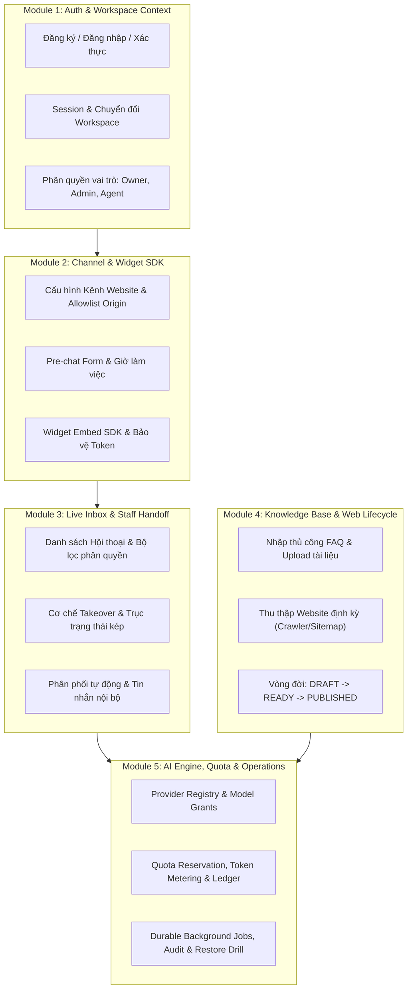

# Kế hoạch Triển khai Nhiệm vụ (PO/Plan): Chốt Product Goal và Scope 5 Module
**Mã công việc:** `PLAN-01` | **Mức ưu tiên:** P1 | **Ước tính:** 1 ngày  
**Phân quyền (Owner Slot):** QA-RELEASE | **Người thực hiện:** Nguyên  
**Trạng thái mục tiêu:** Đã sẵn sàng ký duyệt (Ready for Sign-off)

---

## 1. Mục tiêu Sản phẩm Cốt lõi (Product Goal)
Xây dựng nền tảng **GoTek Chatbot** thành giải pháp SaaS Chatbot Đa doanh nghiệp (Multi-tenant) đạt tiêu chuẩn vận hành an toàn và tin cậy cao:
1. **Hợp nhất kênh hội thoại**: Cho phép doanh nghiệp kết nối khách truy cập thông qua Website Widget với một Hộp thư chung (Unified Inbox) phục vụ đồng thời cho AI Agent và Nhân viên tư vấn.
2. **Cô lập dữ liệu tuyệt đối (Tenant Isolation)**: Đảm bảo dữ liệu giữa các doanh nghiệp (Workspace) được bảo vệ bằng chính sách Row-Level Security (RLS) ở tầng cơ sở dữ liệu PostgreSQL và kiểm tra quyền nghiêm ngặt ở tầng ứng dụng (Service Layer). Doanh nghiệp A tuyệt đối không thể đọc, ghi hay suy diễn dữ liệu của Doanh nghiệp B.
3. **Kiểm soát tri thức an toàn**: Chỉ những dữ liệu tri thức đã qua xử lý, được duyệt phát hành (`PUBLISHED`) và có phạm vi công khai (`PUBLIC`) mới được đưa vào ngữ cảnh sinh câu trả lời của AI. Bí mật nhà cung cấp (API Secrets) và ghi chú nội bộ không bao giờ bị rò rỉ ra ngoài.
4. **Cơ chế chuyển giao người - máy (Human Handoff) chuẩn mực**: Quản lý độc lập 2 trục trạng thái (`status` và `reply_owner`). Khi nhân viên tiếp quản (takeover), hệ thống khóa phiên bản (owner version) để ngăn chặn triệt để phản hồi trễ từ AI ghi đè lên hội thoại.
5. **Minh bạch hạn mức & Vận hành bền vững**: Quota được đặt trước (reservation) trước khi gọi LLM; tác vụ nền bền bỉ có khả năng tự phục hồi khi crash; mọi thay đổi trọng yếu đều được lưu vết nhật ký kiểm toán (Audit Trail).

---

## 2. Ranh giới và Phạm vi Chi tiết 5 Module Cốt lõi

### Module 1: Auth & Ngữ cảnh Doanh nghiệp (Auth & Multi-Tenant Workspace Context)
- **Mã tham chiếu:** `H01`, `H02`, `H16`, `H23`.
- **Mục tiêu:** Cung cấp định danh an toàn và cô lập ngữ cảnh làm việc cho từng doanh nghiệp.
- **Phạm vi In-Scope:**
  - Đăng ký tài khoản doanh nghiệp: họ tên, tên doanh nghiệp, email, số điện thoại, mật khẩu mã hóa Argon2id.
  - Tự động sinh `user`, `workspace`, vai trò `Owner` và hạn mức dùng thử ban đầu trong một transaction nguyên tử.
  - Quản lý phiên làm việc qua HTTP-only cookie, chống giả mạo token; cơ chế chuyển đổi workspace an toàn.
  - Quản lý thành viên: mời thành viên, đổi vai trò (`Admin`, `Agent`), thu hồi quyền, ngăn chặn xóa Owner cuối cùng.
- **Phạm vi Out-of-Scope (Chống Scope Creep):**
  - Đăng nhập mạng xã hội (Google, Facebook, GitHub SSO) ở pha MVP.
  - Phân quyền tùy biến theo từng hành động chi tiết (Custom Granular RBAC) ngoài 3 vai trò cố định: `Owner`, `Admin`, `Agent`.
- **Thành phần mã nguồn chính:**
  - Controller & Services: `backend/src/controllers/auth.controller.ts`, `backend/src/services/auth.service.ts`, `backend/src/services/workspace.service.ts`.
  - Database: Bảng `users`, `workspaces`, `memberships`, `sessions`, `challenges`.

---

### Module 2: Kênh Website & Nhúng Widget SDK (Channels & Widget SDK)
- **Mã tham chiếu:** `H04`, `H06`, `H07`.
- **Mục tiêu:** Cung cấp kênh giao tiếp cho khách truy cập website và thu thập thông tin khởi đầu.
- **Phạm vi In-Scope:**
  - Tạo kênh Website với kiểm tra Origin bảo mật nghiêm ngặt (chỉ cho phép domain được khai báo).
  - Cấu hình biểu mẫu tiền trò chuyện (Pre-chat profile): Họ tên, Email, Số điện thoại (bắt buộc hoặc tùy chọn).
  - Thiết lập giờ làm việc (Business Hours), thông điệp ngoài giờ và lời chào mở đầu.
  - Xuất mã nhúng SDK (`sdk.js`) nhẹ, tải bất đồng bộ, chỉ truyền `channelKey` công khai, tuyệt đối không có Provider Secret hay Internal Workspace ID.
  - Preview Widget trực tiếp trong trang quản trị theo cấu hình giao diện.
- **Phạm vi Out-of-Scope:**
  - Tích hợp các kênh mạng xã hội thứ ba (Facebook Messenger API, Zalo OA, Telegram Bot) trong pha P1.
  - Tự động dịch tin nhắn đa ngôn ngữ theo thời gian thực phía widget.
- **Thành phần mã nguồn chính:**
  - Backend: `backend/src/modules/widget/`, `backend/public/sdk.js`, `backend/src/controllers/channels.controller.ts`.
  - Database: Bảng `channels`, `channel_members`, `visitors`.

---

### Module 3: Hộp thư Hội thoại & Chuyển giao Nhân viên (Live Inbox & Staff Handoff)
- **Mã tham chiếu:** `H03`, `H05`, `H13`.
- **Mục tiêu:** Tiếp nhận hội thoại, điều phối nhân viên và xử lý chuyển đổi mượt mà giữa AI và Người.
- **Phạm vi In-Scope:**
  - Giao diện Inbox chia danh sách: Của tôi (Mine), Chưa phân công (Unassigned), Tất cả (All).
  - Cơ chế tự động gán việc (Auto-assignment) theo ngưỡng tối đa (Capacity limit) của nhân viên đang hoạt động.
  - Quản lý rạch ròi 2 trục trạng thái:
    - Vòng đời: `open`, `resolved`, `snoozed`.
    - Quyền phản hồi: `AI_ACTIVE`, `HANDOFF_PENDING`, `HUMAN_ACTIVE`.
  - Cơ chế Tiếp quản (Takeover): Nhân viên bấm tiếp quản sẽ nâng `owner_version`, hủy quyền của AI ngay tức khắc.
  - Hỗ trợ gửi tin nhắn công khai (Public Reply) tới khách và ghi chú nội bộ (Internal Note) chỉ nhân viên nhìn thấy.
- **Phạm vi Out-of-Scope:**
  - Gọi thoại / Gọi video trực tiếp (Audio/Video calling WebRTC).
  - Tự động gắn tag bằng AI phân loại cảm xúc phức tạp (Sentiment analysis NLP nâng cao).
- **Thành phần mã nguồn chính:**
  - Backend: `backend/src/modules/chat/`, `backend/src/controllers/inbox.controller.ts`, `backend/src/services/chat-store.service.ts`.
  - Database: Bảng `conversations`, `messages`, `contacts`.

---

### Module 4: Cơ sở Tri thức & Vòng đời Nguồn Web (Knowledge Base & Web Sources)
- **Mã tham chiếu:** `H09`, `H10`, `H11`, `H12`.
- **Mục tiêu:** Cung cấp nguồn dữ liệu chuẩn xác cho AI tư vấn, có vòng đời kiểm soát và phân loại đối tượng.
- **Phạm vi In-Scope:**
  - Quản lý danh mục tri thức và các mục hỏi đáp thủ công (FAQ: Câu hỏi & Câu trả lời).
  - Tải lên tài liệu văn bản tĩnh (PDF, DOCX) với cơ chế bóc tách nội dung có kiểm soát kích thước.
  - Thu thập dữ liệu website tự động (Web Crawler qua static fetch, sitemap parser, bảo vệ chống SSRF và kiểm soát tốc độ).
  - Vòng đời phiên bản tri thức chặt chẽ: `DRAFT` -> `PROCESSING` -> `READY` -> `PUBLISHED` -> `ROLLBACK`.
  - Phân quyền đối tượng xem: `PUBLIC` (khách truy cập xem được) vs `INTERNAL` (chỉ nhân viên xem được).
- **Phạm vi Out-of-Scope:**
  - Trình thu thập trang web chạy JavaScript đầy đủ (Headless Chrome / Playwright browser crawler) ở giai đoạn này.
  - Đồng bộ tự động thời gian thực hai chiều với hệ thống Notion/Google Drive/Lark Wiki (thuộc pha E mở rộng).
- **Thành phần mã nguồn chính:**
  - Backend: `backend/src/modules/knowledge/`, `backend/src/modules/web-sources/`, `backend/src/modules/extractors/`.
  - Database: Bảng `knowledge_items`, `knowledge_versions`, `knowledge_chunks`, `web_sources`, `web_snapshots`.

---

### Module 5: Động cơ AI, Phân bổ Model, Hạn mức & Kiểm toán (AI Engine, Quota & Operations)
- **Mã tham chiếu:** `H08`, `H22`, `H28`, `H32`.
- **Mục tiêu:** Điều phối gọi LLM thông minh, kiểm soát chi phí token, bảo đảm vận hành bền bỉ và kiểm toán toàn vẹn.
- **Phạm vi In-Scope:**
  - Provider Registry trên Platform Admin: Quản lý OpenAI, Anthropic, Gemini compatible adapters.
  - Cấp quyền Model cho Workspace (Model Grants): Kiểm tra capability (Chat, Embeddings), trạng thái kích hoạt và thời hạn.
  - Cơ chế Quota Budget & Reservation: Đặt trước hạn mức trước khi gọi LLM, đối soát chính xác sau khi có receipt.
  - AI Reply Worker nền: Lấy dữ liệu tri thức có liên quan (Retrieval), kiểm tra lại quyền `AI_ACTIVE` trước khi commit câu trả lời.
  - Xử lý lỗi nhà cung cấp an toàn: Không resend mù khi kết quả chưa rõ; ghi nhận trạng thái kiểm tra đối soát.
  - Quản lý tác vụ nền bền vững (Durable Jobs) với khóa lease, phục hồi sau crash, nhật ký kiểm toán (Audit Export).
  - Diễn tập khôi phục dữ liệu định kỳ (`restore-drill`) kiểm tra tính toàn vẹn 55 bảng.
- **Phạm vi Out-of-Scope:**
  - Cổng thanh toán trực tuyến tự động trừ thẻ tín dụng quốc tế (Stripe, Paypal checkout).
  - Tự động huấn luyện lại mô hình (Fine-tuning LLM model trên dữ liệu riêng).
- **Thành phần mã nguồn chính:**
  - Backend: `backend/src/modules/ai/`, `backend/src/modules/jobs/`, `backend/src/modules/platform/`, `backend/src/modules/audit/`.
  - Database: Bảng `providers`, `models`, `model_grants`, `quota_budgets`, `ai_usage_ledger`, `jobs`, `audit_events`.

---

## 3. Ma trận Phân công Trách nhiệm (RACI Matrix)

| Hạng mục / Module | PO / Tech Lead | QA-RELEASE (Nguyên) | FE-PRODUCT (Nguyên) | BE Core Dev |
|---|:---:|:---:|:---:|:---:|
| **Product Goal & Scope Definition** | **A** (Phê duyệt) | **R** (Đề xuất & Soạn thảo) | **C** (Đóng góp) | **C** (Tư vấn) |
| **Module 1: Auth & Workspace** | **A** | **R** (Test & Gate) | **R** (Dựng UI & Contract) | **R** (API & DB) |
| **Module 2: Channel & Widget** | **A** | **R** (Test Boundary) | **R** (UI Setup & Preview) | **R** (SDK & Backend) |
| **Module 3: Live Inbox & Handoff** | **A** | **R** (Test State Machine) | **R** (UI Inbox & States) | **R** (Chat Store Engine) |
| **Module 4: Knowledge Base** | **A** | **R** (Test Retrieval Isolation) | **R** (UI Knowledge & CRUD) | **R** (Extract & Embeddings) |
| **Module 5: AI Engine & Quota** | **A** | **R** (Audit & Drill Test) | **R** (UI Usage & Platform) | **R** (Worker & Adapters) |
| **Ký duyệt Baseline nghiệm thu** | **A** (Ký duyệt chính thức) | **R** (Trình nộp hồ sơ) | **I** (Theo dõi) | **I** (Theo dõi) |

*Ghi chú:*
- **R (Responsible):** Người trực tiếp triển khai và hoàn thiện công việc.
- **A (Accountable):** Người chịu trách nhiệm cao nhất, có quyền phê chuẩn / ký duyệt.
- **C (Consulted):** Người được tham vấn ý kiến kỹ thuật / nghiệp vụ.
- **I (Informed):** Người nhận thông tin sau khi hạng mục được duyệt.

---

## 4. Nhật ký Quyết định Kỹ thuật (Decision Log)

| Mã | Quyết định kỹ thuật | Cơ sở & Lý giải | Tác động / Ảnh hưởng |
|---|---|---|---|
| **D001** | Giữ nguyên kiến trúc Monorepo chia tách `backend/` và `frontend/` độc lập. | Chuẩn hóa theo tiêu chuẩn dự án tham chiếu `wdp`, giúp dễ build, test và deploy độc lập. | Cần điều phối các lệnh npm từ root (`npm run dev`, `npm run build:all`). |
| **D002** | Sử dụng PostgreSQL 16 Native RLS kết hợp Client Transaction Scope (`SET LOCAL app.current_workspace_id`). | Ngăn chặn triệt để nguy cơ rò rỉ dữ liệu chéo giữa các tenant từ tầng thấp nhất của DB. | Tất cả query backend đều phải chạy trong ngữ cảnh transaction đã định danh tenant. |
| **D003** | Khóa phiên bản phản hồi (`owner_version`) trong bảng `conversations`. | Khi nhân viên tiếp quản (Takeover), AI đang chạy ngầm sẽ bị chặn commit câu trả lời cũ vào DB. | Loại bỏ lỗi AI trả lời đè lên câu trả lời của nhân viên chăm sóc khách hàng. |
| **D004** | Chỉ lấy dữ liệu tri thức có cờ `is_published = true` và `audience = 'PUBLIC'` cho Widget. | Bảo vệ dữ liệu nội bộ của doanh nghiệp, không bao giờ để khách truy cập đọc được FAQ nội bộ. | Tầng Retrieval phải bắt buộc thêm điều kiện lọc audience vào mọi câu truy vấn SQL. |
| **D005** | Quota đặt trước (Reservation) trước khi gửi yêu cầu tới LLM Provider. | Tránh tình trạng khách spam tin nhắn làm cạn kiệt tài khoản mà không thể kiểm soát hạn mức. | Khi có lỗi hoặc hoàn tất, worker gọi settle để quyết toán lượng token thực tế hoặc hoàn quota. |

---

## 5. Rào cản Chống Phình Phạm vi (Scope Creep Fencing)
Nhằm đảm bảo dự án về đích đúng hẹn và đạt chất lượng kiểm định cao nhất, các yêu cầu sau đây được xếp vào danh mục **BỊ CHẶN (FENCED OUT)** khỏi phạm vi hiện tại:
1. Không mở rộng tích hợp các kênh mạng xã hội bên ngoài (Zalo, Messenger, WhatsApp) khi kênh Website Widget chưa được nghiệm thu đạt chuẩn.
2. Không thêm các biểu đồ KPI tiếp thị, thẻ thống kê màu mè hoặc trang trí hero image chưa có trong đặc tả gốc.
3. Không tự ý thay đổi hệ màu nhận diện thương hiệu GoTek hoặc bổ sung theme tối (Dark Mode) khi chưa có sự thống nhất từ PO.
4. Mọi tính năng mở rộng (như Lark Wiki, Custom Granular Webhooks) phải được ghi vào Backlog tương lai và chỉ kích hoạt sau khi Phase P1 hoàn tất.

---

## 6. Tiêu chí Hoàn thành (Definition of Done - DoD)
- [x] Tài liệu Product Goal & Scope 5 Module được biên soạn chi tiết, minh bạch ranh giới In-scope / Out-of-scope.
- [ ] Trình nộp PO và Tech Lead phê duyệt, ký duyệt lưu trữ tại tài liệu dự án.
- [x] Mỗi module cốt lõi được định danh chủ sở hữu (Owner) và đầu mối chịu trách nhiệm kỹ thuật rõ ràng.
- [x] Nhật ký quyết định (Decision Log) được ghi nhận đầy đủ, không còn điểm mờ mịt về mặt kiến trúc.
- [x] Danh sách phụ thuộc (Dependencies) giữa các module được làm rõ, tạo tiền đề thông suốt cho Task FE và QA tiếp theo.
