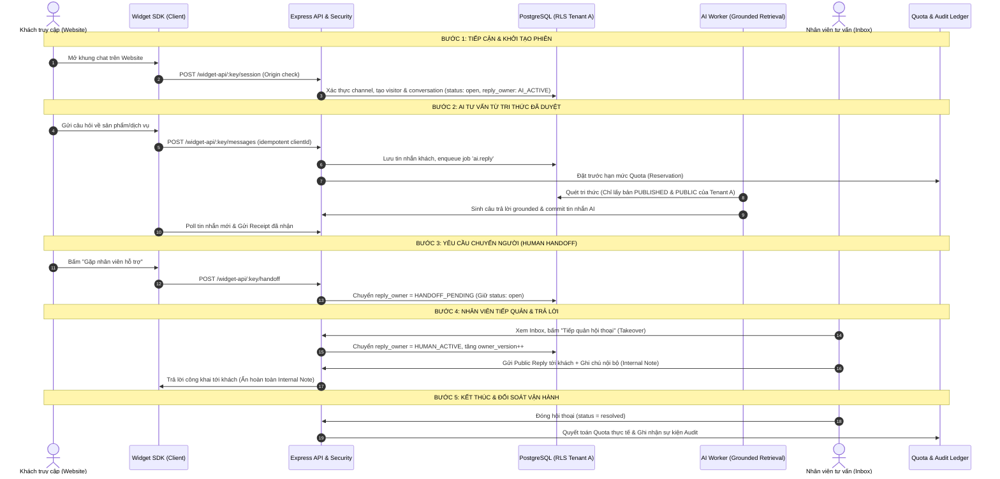

# Kế hoạch Triển khai Nhiệm vụ (PO/Plan): Lập Acceptance Matrix cho Core Flow
**Mã công việc:** `PLAN-02` | **Mức ưu tiên:** P1 | **Ước tính:** 1 ngày  
**Phân quyền (Owner Slot):** QA-RELEASE | **Người thực hiện:** Nguyên  
**Phụ thuộc (Dependency):** `PLAN-01` (Baseline 5 Module đã chốt)  
**Trạng thái mục tiêu:** Đã sẵn sàng ký duyệt Ma trận Nghiệm thu (Ready for Sign-off)

---

## 1. Định nghĩa Luồng Cốt lõi của Hệ thống (End-to-End Core Flow)
Luồng cốt lõi (Core Flow) của GoTek Chatbot là chuỗi tương tác khép kín nối liền **5 Module Cốt lõi** từ khi khách hàng bắt đầu tiếp cận đến khi hoàn tất phiên hỗ trợ và hạch toán hệ thống:

---

## 2. Thiết kế Ma trận Nghiệm thu (Acceptance Matrix) cho 2 Workspace Độc lập

Ma trận nghiệm thu yêu cầu kiểm chứng tính đúng đắn trên **Hai Workspace hoàn toàn tách biệt** (`Workspace_Alpha` và `Workspace_Beta`) để khẳng định không có sự can thiệp hoặc rò rỉ dữ liệu chéo:

### 2.1. Ma trận Kịch bản Chi tiết trên 5 Module Cốt lõi

| Module | Mã Tiêu chí | Loại Kịch bản | Mô tả kiểm thử trên 2 Workspace | Tiêu chí Nghiệm thu (Acceptance Criteria) | Chủ sở hữu QA |
|:---:|:---:|:---:|---|---|:---:|
| **M1: Auth & Workspace** | **ACM-01-POS** | Positive | Owner A đăng nhập Workspace Alpha; Owner B đăng nhập Workspace Beta. | Mỗi owner chỉ nhìn thấy thông tin doanh nghiệp, thành viên và cấu hình của riêng mình. | QA-RELEASE (Nguyên) |
| **M1: Auth & Workspace** | **ACM-01-NEG** | Negative / Security | User A cố ý dùng session của mình gửi request `POST /api/workspace/switch` sang Workspace ID của B. | Hệ thống từ chối lập tức với mã HTTP 403 Forbidden; audit ghi nhận hành vi truy cập trái phép. | QA-RELEASE (Nguyên) |
| **M2: Channel & Widget** | **ACM-02-POS** | Positive | Channel Alpha nhúng trên domain `alpha.gotek.vn`; Channel Beta nhúng trên `beta.gotek.vn`. | Widget của từng kênh khởi tạo phiên chính xác, nạp đúng lời chào và cấu hình tương ứng. | QA-RELEASE (Nguyên) |
| **M2: Channel & Widget** | **ACM-02-NEG** | Negative / Security | Khách từ domain lạ `malicious.com` gọi tới Channel Key của Alpha. | API từ chối với mã 403 `DOMAIN_DENIED`; không cấp visitor token. | QA-RELEASE (Nguyên) |
| **M3: Live Inbox & Handoff** | **ACM-03-POS** | Positive | Khách A chat trên Widget Alpha; Nhân viên A nhìn thấy hội thoại trên Inbox Alpha, bấm tiếp quản (Takeover) và trả lời. | Quá trình tiếp quản tăng `owner_version`; tin nhắn đến khách mượt mà; tin nhắn ghi chú nội bộ không lộ ra widget. | QA-RELEASE (Nguyên) |
| **M3: Live Inbox & Handoff** | **ACM-03-NEG** | Negative / Concurrency | Nhân viên A bấm tiếp quản cùng thời điểm AI đang sinh câu trả lời dở. | Hệ thống chặn đứng câu trả lời của AI không cho ghi vào DB vì stale `owner_version`; chỉ chấp nhận câu trả lời của Nhân viên A. | QA-RELEASE (Nguyên) |
| **M4: Knowledge Base** | **ACM-04-POS** | Positive | Workspace Alpha publish tài liệu "Chính sách bảo hành Alpha"; Workspace Beta publish tài liệu "Chính sách bảo hành Beta". | Khách Alpha hỏi về bảo hành nhận câu trả lời dựa trên tài liệu Alpha; không chứa thông tin Beta. | QA-RELEASE (Nguyên) |
| **M4: Knowledge Base** | **ACM-04-NEG** | Negative / Privacy | Khách Alpha đặt câu hỏi mẹo nhằm trích xuất tài liệu Internal hoặc dữ liệu của Workspace Beta. | AI từ chối trả lời do không tìm thấy tri thức `PUBLIC` phù hợp trong tenant Alpha; không leak dữ liệu Beta. | QA-RELEASE (Nguyên) |
| **M5: AI Engine & Quota** | **ACM-05-POS** | Positive | Workspace Alpha sử dụng model GPT-4o với hạn mức 100,000 token; Workspace Beta dùng model Claude 3.5 với 50,000 token. | Quota của Alpha bị trừ tương ứng với token thực tế phát sinh; hoàn toàn không ảnh hưởng đến số dư Quota của Beta. | QA-RELEASE (Nguyên) |
| **M5: AI Engine & Quota** | **ACM-05-NEG** | Negative / Resilience | Đứt kết nối mạng giữa worker AI và LLM Provider trong quá trình xử lý hội thoại của Alpha. | Worker ghi nhận trạng thái unknown, hoàn trả lượng quota đã đặt trước một cách an toàn, chuyển hội thoại sang `HANDOFF_PENDING` để nhân viên hỗ trợ khách. | QA-RELEASE (Nguyên) |

---

## 3. Quy chuẩn Đánh giá và Phân loại Kết quả Kiểm thử (Scoring Rubric)

Mỗi kịch bản trong Acceptance Matrix được đánh giá theo 4 mức độ nghiêm ngặt:
1. **PASS (Đạt chuẩn):**
   - Đáp ứng 100% tiêu chí nghiệp vụ và kỹ thuật.
   - Dữ liệu được ghi nhận chính xác tại PostgreSQL với đầy đủ transaction boundary.
   - Có file log hoặc hình ảnh screenshot bằng chứng đi kèm.
2. **PASS WITH GAPS (Đạt kèm Ghi chú):**
   - Chức năng hoạt động tốt trên môi trường giả lập (Local Injected Stub/Mock) nhưng chưa kiểm chứng với Live Provider thực tế do chưa có tài khoản thanh toán quốc tế.
   - Bắt buộc phải gắn nhãn rõ ràng: `LOCAL STUB VERIFIED - LIVE ACCEPTANCE PENDING`.
3. **FAIL (Không đạt):**
   - Vi phạm bất kỳ điều kiện nào về mặt cô lập dữ liệu (Cross-tenant leak).
   - Rò rỉ ghi chú nội bộ ra Widget của khách.
   - Phát sinh lỗi không bắt được (Unhandled 500 Internal Server Error) hoặc sai lệch trạng thái hội thoại.
4. **BLOCKED (Bị chặn):**
   - Thiếu dữ liệu fixture đầu vào hoặc môi trường test gặp sự cố chưa thể tiến hành.

---

## 4. Nhật ký Quyết định & Bàn giao Phụ thuộc (Decisions & Dependencies)

- **Quyết định Kỹ thuật (Decision):** 
  - Khẳng định tính độc lập của 2 trục trạng thái: Không gộp `open` với `AI_ACTIVE`. Một hội thoại ở trạng thái `open` có thể do AI hoặc do Nhân viên phụ trách tùy theo trường `reply_owner`.
  - Quy định nghiệm thu: Không chấp nhận việc đóng task nếu chỉ test bằng các lệnh gọi curl đơn lẻ; bắt buộc phải chạy qua test suite tự động (`tests/*.test.ts`) kiểm tra assertion trực tiếp trên DB.
- **Bàn giao Phụ thuộc (Dependencies Handover):**
  - Bàn giao Ma trận nghiệm thu này cho **FE-PRODUCT** để dựng các luồng tương tác trên UI ([Task 05](file:///d:/gotek/ai_automation/plan_nguyen/05_FE_UI_ACCEPTANCE_MATRIX.md)).
  - Bàn giao danh sách Positive/Negative cases cho **QA-RELEASE** để viết test tự động và thu thập bằng chứng ([Task 06](file:///d:/gotek/ai_automation/plan_nguyen/06_QA_EVIDENCE_ACCEPTANCE_MATRIX.md)).

---

## 5. Tiêu chí Hoàn thành (Definition of Done - DoD)
- [x] Ma trận nghiệm thu Core Flow được thiết lập đầy đủ cho 5 module và 2 workspace độc lập.
- [x] Mỗi kịch bản có định danh rõ ràng, bao quát đầy đủ Positive cases, Negative cases và Security boundaries.
- [x] Phân công rõ ràng QA Owner chịu trách nhiệm nghiệm thu từng tiêu chí.
- [x] Có quy chuẩn đánh giá kết quả minh bạch (PASS / PASS WITH GAPS / FAIL / BLOCKED).
- [x] Bản kế hoạch sẵn sàng trình nộp PO và Tech Lead phê duyệt chính thức.
