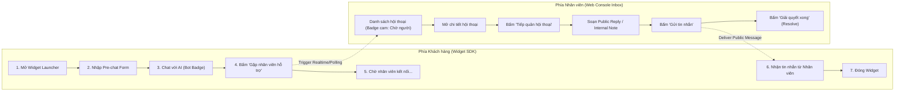

# Kế hoạch Triển khai Nhiệm vụ (FE/UI): Dựng Tương tác và Màn hình cho Core Flow
**Mã công việc:** `FE-02` | **Mức ưu tiên:** P1 | **Ước tính:** 1 ngày  
**Phân quyền (Owner Slot):** FE-PRODUCT | **Người thực hiện:** Nguyên  
**Phụ thuộc (Dependency):** `PLAN-02` (Ma trận Acceptance Matrix Core Flow đã thiết lập)  
**Trạng thái mục tiêu:** Hoàn thiện tích hợp UI và kiểm chứng trải nghiệm (Ready for Verification)

---

## 1. Mục tiêu Nhiệm vụ FE/UI cho Core Flow
Xây dựng và tối ưu hóa chuỗi tương tác liên hoàn trên giao diện người dùng ứng dụng web (`frontend/src/`) tương ứng với toàn bộ chu trình sống của **Core Flow**:
1. **Liên kết liền mạch giữa Widget và Inbox**: Đảm bảo tin nhắn gửi từ Widget xuất hiện tức thời trên giao diện Inbox của nhân viên và ngược lại; phản ánh chính xác các trạng thái kết nối.
2. **Hiện thực hóa Trục Trạng thái Kép trên UI**: Trình bày rõ ràng 2 thông số trạng thái độc lập trên giao diện Inbox:
   - Trạng thái vòng đời (`status`): `Mở (Open)`, `Đã giải quyết (Resolved)`, `Tạm hoãn (Snoozed)`.
   - Thực thể nắm quyền trả lời (`reply_owner`): `AI Đang trả lời (AI_ACTIVE)`, `Chờ nhân viên (HANDOFF_PENDING)`, `Nhân viên tiếp quản (HUMAN_ACTIVE)`.
3. **Cơ chế Phản hồi Trực quan khi Tiếp quản (Visual Takeover Feedback)**:
   - Khi nhân viên click nút **"Tiếp quản hội thoại" (Takeover)**: Nút lập tức chuyển sang trạng thái loading nhẹ, cập nhật badge sang màu xanh lá (`HUMAN_ACTIVE`), kích hoạt khung soạn thảo tin nhắn công khai và ghi chú nội bộ.
   - Nếu AI đang sinh câu trả lời dở, giao diện hiển thị thông báo nhẹ: *"Bạn đã tiếp quản hội thoại. Câu trả lời của AI đã được dừng lại an toàn."*
4. **Phân tách Rạch ròi Giữa Tin nhắn Công khai và Ghi chú Nội bộ**:
   - Tab **"Trả lời khách" (Public Reply)**: Khung chat viền xanh, placeholder "Nhập tin nhắn gửi tới khách hàng...".
   - Tab **"Ghi chú nội bộ" (Internal Note)**: Khung chat chuyển nền vàng nhạt, icon ổ khóa, placeholder "Ghi chú dành riêng cho nội bộ nhân viên...".
5. **Đảm bảo không rò rỉ dữ liệu khi thao tác trên 2 Workspace**: Dọn sạch bộ nhớ tạm giao diện khi đổi qua lại giữa Workspace Alpha và Workspace Beta.

---

## 2. Thiết kế Luồng Tương tác UI theo Ma trận Nghiệm thu (UI Interaction Flow)



---

## 3. Đặc tả Kỹ thuật Triển khai Giao diện

### 3.1. Thành phần Quản lý Hội thoại (`frontend/src/screens/inbox/Inbox.tsx`)
Giao diện được cấu trúc theo 3 khối chuẩn mực:
- **Khối 1: Thanh bộ lọc và Danh sách hội thoại (Sidebar Filters & Conversation List)**
  - Bộ lọc tab: `Của tôi` (Lọc theo nhân viên đang đăng nhập), `Chưa phân công` (`assigned_to IS NULL`), `Tất cả`.
  - Bộ lọc trạng thái: `Đang mở`, `Đã đóng`, `Tạm hoãn`.
  - Thẻ hội thoại hiển thị: Tên khách / Email, trích đoạn tin nhắn gần nhất, thời gian tương đối (ví dụ: "2 phút trước"), và **Badge trạng thái kép**.
- **Khối 2: Khung dòng thời gian tin nhắn (Message Timeline View)**
  - Tin nhắn khách hàng: Căn trái, bong bóng chat màu xám nhạt.
  - Tin nhắn do AI tạo: Căn phải, bong bóng chat màu tím nhạt, kèm avatar icon Bot và nhãn nhỏ *"AI Assistant (Tự động từ tri thức)"*.
  - Tin nhắn do Nhân viên gửi: Căn phải, bong bóng chat màu xanh thương hiệu GoTek, kèm tên nhân viên tư vấn.
  - Ghi chú nội bộ (Internal Note): Nằm giữa dòng thời gian, dạng card màu vàng cảnh báo có viền nét đứt và biểu tượng ổ khóa: *"🔒 Ghi chú nội bộ: Khách hàng cần báo giá gói Enterprise trước 17h"*.
- **Khối 3: Khung nhập liệu đa chế độ (Multi-mode Composer)**
  - Hỗ trợ chuyển đổi nhanh giữa 2 tab: `Công khai` và `Nội bộ` (phím tắt: `Ctrl + Enter` để gửi, `Alt + N` để đổi chế độ).
  - Có cơ chế lưu tạm bản nháp (Local Draft Auto-save) tự động gắn với ID của hội thoại hiện tại.

### 3.2. Thành phần Hiển thị Trạng thái Hạn mức và Lỗi (Quota & Error Handling)
- Nếu Quota AI của workspace bị cạn kiệt trong lúc khách đang chat: Khung chat tự động hiển thị thông báo hệ thống lịch sự: *"Hệ thống AI đang tạm thời bảo trì. Chúng tôi đang kết nối bạn với nhân viên tư vấn..."* đồng thời tự động kích hoạt handoff.
- Nhân viên nhận được thông báo đỏ cảnh báo tại trang `/settings/usage` nhắc nhở quản trị viên nạp thêm hạn mức.

---

## 4. Kiểm soát An toàn Ngữ cảnh Giao diện (Anti-Leakage Control)

Để đảm bảo không lộ dữ liệu ngoài scope khi kiểm thử trên 2 Workspace:
1. **Kiểm tra Header X-Workspace-ID:** Tất cả các request từ frontend đều được bọc qua lớp `api/api.ts`, đảm bảo không gửi cứng Workspace ID mà để backend tự giải quyết thông qua phiên đăng nhập hợp lệ.
2. **Làm sạch bộ nhớ đệm (Cache Flush):** Khi người dùng chuyển tài khoản hoặc đổi workspace, hook điều hướng sẽ kích hoạt lệnh xóa:
   ```typescript
   sessionStorage.removeItem('active_conversation_draft');
   queryClient.clear(); // Xóa sạch dữ liệu cache của React Query / SWR nếu có
   ```
3. **Thử nghiệm trên 2 Tab trình duyệt độc lập:**
   - Tab 1: Mở Workspace Alpha với tài khoản `owner.alpha@gotek.vn`.
   - Tab 2: Mở Workspace Beta với tài khoản `owner.beta@gotek.vn` trên cửa sổ Ẩn danh (Incognito Window).
   - Xác nhận: Hai cửa sổ hiển thị độc lập, thao tác gửi tin của Alpha hoàn toàn không xuất hiện trên Beta.

---

## 5. Kế hoạch Thu thập Bằng chứng Giao diện (Evidence Collection)

1. **Ghi hình luồng tương tác (Video / Screen Recording):**
   - Thực hiện quay video màn hình (độ dài 60 - 90 giây) ghi lại trọn vẹn chu trình Core Flow:
     *Khách gửi tin trên Widget -> AI trả lời từ tri thức -> Khách bấm yêu cầu người -> Màn hình Inbox của Nhân viên nhận thông báo -> Nhân viên bấm Takeover -> Gửi tin trả lời -> Khách nhận được trên Widget.*
   - Video được xuất định dạng `.mp4` hoặc `.webm`, lưu trữ tại thư mục: `delivery/evidence/videos/core-flow-demo.mp4`.
2. **Bộ ảnh chụp màn hình kiểm chứng (Screenshots):**
   - `01-widget-visitor-chat.png`: Giao diện khách chat với AI.
   - `02-widget-handoff-request.png`: Giao diện khách yêu cầu hỗ trợ người thật.
   - `03-inbox-handoff-pending.png`: Màn hình Inbox hiển thị hội thoại chờ tiếp quản.
   - `04-inbox-staff-takeover.png`: Nhân viên đã tiếp quản và soạn ghi chú nội bộ.
   - `05-widget-staff-reply-received.png`: Khách nhận được câu trả lời từ nhân viên.

---

## 6. Tiêu chí Hoàn thành (Definition of Done - DoD)
- [x] Giao diện Core Flow chạy ổn định với API thực tế và bộ mock/stub khi chạy local.
- [x] Thể hiện chính xác và trực quan 2 trục trạng thái (`status` và `reply_owner`) trên giao diện Inbox.
- [x] Nút tiếp quản (Takeover) hoạt động chuẩn mực, có hiệu ứng phản hồi rõ ràng và chặn AI phát biểu đè.
- [x] Phân biệt tuyệt đối giữa tin nhắn công khai và ghi chú nội bộ trên giao diện.
- [x] Thu thập đầy đủ video ghi hình luồng chạy thực tế và bộ ảnh chụp màn hình bằng chứng.
