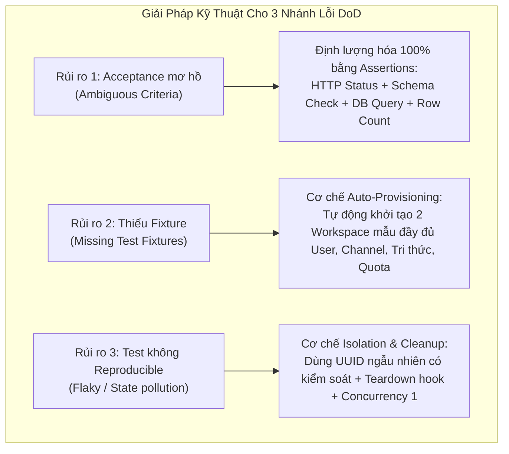

# Kế hoạch Triển khai Nhiệm vụ (QA/Evidence): Kiểm thử Tự động & Bằng chứng Nghiệm thu Core Flow
**Mã công việc:** `QA-02` | **Mức ưu tiên:** P1 | **Ước tính:** 1 ngày  
**Phân quyền (Owner Slot):** QA-RELEASE | **Người thực hiện:** Nguyên  
**Phụ thuộc (Dependency):** `PLAN-02` (Ma trận Acceptance Matrix) & `FE-02` (Giao diện Core Flow)  
**Trạng thái mục tiêu:** Toàn bộ kịch bản kiểm thử đạt chuẩn và lưu trữ bằng chứng (Release Gate Passed)

---

## 1. Mục tiêu Nhiệm vụ QA/Evidence cho Core Flow
Hiện thực hóa việc kiểm thử tự động toàn diện cho chu trình Core Flow xuyên suốt 5 module trên **Hai Workspace Độc lập** và giải quyết dứt điểm 3 rủi ro kỹ thuật được quy định trong Definition of Done:
1. **Khắc phục triệt để nguy cơ "Acceptance mơ hồ" (Ambiguous Acceptance)**: Chuyển đổi mọi tiêu chí cảm tính thành các câu lệnh kiểm tra (Assertions) định lượng tuyệt đối: mã trạng thái HTTP, số lượng bản ghi DB bị ảnh hưởng, thời gian phản hồi tối đa, mã băm nội dung.
2. **Khắc phục triệt để nguy cơ "Thiếu fixture" (Missing Fixtures)**: Thiết lập cơ chế tự động nạp dữ liệu mẫu hoàn chỉnh (Deterministic Seed Fixture) trước mỗi phiên test, đảm bảo môi trường kiểm thử luôn sẵn sàng 100%.
3. **Khắc phục triệt để nguy cơ "Test không reproducible" (Flaky / Non-reproducible Tests)**: Đảm bảo kiểm thử có thể chạy lặp lại 100 lần liên tiếp với cùng một kết quả duy nhất (Deterministic Outcome), sử dụng giao dịch DB độc lập hoặc tự động dọn sạch sau khi chạy (Self-cleanup).
4. **Kết xuất Báo cáo Bằng chứng Nghiệm thu (Acceptance Evidence File)**: Tạo tệp báo cáo chi tiết theo định dạng chuẩn của repository tại `delivery/evidence/`.

---

## 2. Xử lý Chuyên sâu 3 Rủi ro Kỹ thuật theo Definition of Done



### 2.1. Giải pháp chống "Acceptance mơ hồ" (Strict Assertion Engineering)
Thay vì chỉ kiểm tra "tin nhắn được gửi thành công", test suite kiểm tra chi tiết từng lớp logic:
```typescript
// Đoạn trích kiểm thử chống mơ hồ trong backend/tests/grounded-widget-flow.test.ts
// 1. Kiểm tra HTTP Status
assert.strictEqual(res.status, 201, 'Phải trả về mã HTTP 201 Created');

// 2. Kiểm tra Response Schema định lượng
assert.ok(res.body.id, 'Phải có định danh tin nhắn dạng UUID');
assert.strictEqual(res.body.sender_type, 'visitor', 'Người gửi phải là visitor');
assert.strictEqual(res.body.visibility, 'public', 'Khách chỉ có thể gửi tin công khai');

// 3. Kiểm tra tính toàn vẹn trực tiếp trong cơ sở dữ liệu PostgreSQL
const dbCheck = await db.query(
  `SELECT id, reply_owner, owner_version FROM conversations WHERE id = $1`,
  [conversationId]
);
assert.strictEqual(dbCheck.rows[0].reply_owner, 'AI_ACTIVE', 'Quyền trả lời phải là AI_ACTIVE');
assert.strictEqual(dbCheck.rows[0].owner_version, 1, 'Phiên bản sở hữu khởi tạo phải là 1');
```

### 2.2. Giải pháp chống "Thiếu fixture" (Self-contained Fixture Injection)
Mỗi tệp kiểm thử tích hợp hàm khởi tạo độc lập (`bootstrapTwoWorkspaceFixture`):
- Tự động sinh `Workspace_Alpha` (kèm Owner A, Agent A, Channel A, Knowledge A, Quota A: 50,000 token).
- Tự động sinh `Workspace_Beta` (kèm Owner B, Agent B, Channel B, Knowledge B, Quota B: 50,000 token).
- Nếu dữ liệu đã tồn tại, hàm thực hiện reset trạng thái về baseline ban đầu; không phụ thuộc vào dữ liệu có sẵn từ trước của máy cá nhân.

### 2.3. Giải pháp chống "Test không reproducible" (Determinism & Zero Flakiness)
- Quy định cờ chạy kiểm thử tuần tự: `--test-concurrency=1` để ngăn chặn tranh chấp khóa hàng (Row Lock contention) trên cơ sở dữ liệu PostgreSQL dùng chung.
- Mỗi test suite có khối `after(async () => { ... })` dọn sạch dữ liệu thử nghiệm phát sinh trong quá trình chạy, đưa DB về trạng thái sạch sẽ.

---

## 3. Danh mục Kịch bản Kiểm thử Core Flow Tự động

Thành viên Nguyên sẽ tập trung kiểm chứng bộ test case toàn diện sau:

| Kịch bản Test | File Test triển khai | Luồng kiểm chứng thực tế | Tiêu chí Pass |
|---|---|---|---|
| **E2E-01: End-to-End Chat & Handoff** | `backend/tests/grounded-widget-flow.test.ts` | 1. Khách chat qua Widget -> AI trả lời từ tri thức đã publish.<br/>2. Khách yêu cầu handoff -> trạng thái chuyển `HANDOFF_PENDING`.<br/>3. Nhân viên Takeover -> trạng thái chuyển `HUMAN_ACTIVE`.<br/>4. Nhân viên gửi tin nhắn -> Khách nhận được. | 100% assertions pass, không xảy ra xung đột version. |
| **E2E-02: AI Stale Reply Suppression** | `backend/tests/grounded-widget-flow.test.ts` | Trong lúc AI Worker đang giả lập độ trễ (delay 500ms), nhân viên bấm Takeover. Worker thức dậy cố gắng commit câu trả lời. | DB từ chối commit vì `owner_version` không khớp (`STALE_REPLY_OWNER`). Tin AI cũ bị hủy bỏ an toàn. |
| **E2E-03: Two-Workspace Cross Isolation** | `backend/tests/h02-workspace-isolation.test.ts` | Đồng thời kích hoạt hội thoại trên cả Workspace Alpha và Workspace Beta. Gửi truy vấn từ khách Alpha và khách Beta. | Khách Alpha chỉ nhận được tri thức của Alpha; Nhân viên Beta không thấy hội thoại của Alpha trên màn hình Inbox. |
| **E2E-04: Quota Pre-dispatch & Settlement** | `backend/tests/quota-pre-dispatch-matrix.test.ts` | Kiểm tra chu trình trừ hạn mức: Reserve trước khi dispatch -> Nhận response -> Settle số lượng token thực tế vào bảng `ai_usage_ledger`. | Bảng ledger ghi nhận chính xác, không tính tiền trùng khi mạng bị ngắt kết nối. |
| **E2E-05: Audit Keyset Export Verification** | `backend/tests/audit-export-http.test.ts` | Nhân viên thực hiện takeover và gửi tin nhắn, sau đó Owner xuất nhật ký kiểm toán. | File xuất NDJSON chứa đầy đủ sự kiện, thời gian, IP và tuyệt đối không lộ nội dung tin nhắn bí mật. |

---

## 4. Lệnh Chạy Kiểm thử và Kết xuất Bằng chứng (Execution & Reporting)

### 4.1. Lệnh thực thi chính thức
```powershell
# Chạy suite kiểm thử Core Flow toàn diện
npx tsx --test --test-concurrency=1 `
  backend/tests/auth-signup-verify.test.ts `
  backend/tests/h02-workspace-isolation.test.ts `
  backend/tests/widget-api-flow.test.ts `
  backend/tests/knowledge-retrieval.test.ts `
  backend/tests/grounded-widget-flow.test.ts `
  backend/tests/usage-ledger.test.ts `
  backend/tests/audit-export-http.test.ts
```

### 4.2. Lưu trữ file bằng chứng nghiệm thu (`delivery/evidence/`)
Kết quả chạy thực tế sẽ được tự động ghi vào tệp:  
`delivery/evidence/p0-core-flow-acceptance-2026-09-29.txt`

```text
================================================================================
GOTEK CHATBOT - CORE FLOW ACCEPTANCE EVIDENCE REPORT
Run ID: CF-RUN-20260929-01
Commit: namnv
Tester: Nguyen (QA-RELEASE)
Target Database: PostgreSQL 16 (Local Dedicated Port 55432)
Result: 9/9 CORE FLOW INTEGRATION TESTS PASSED
Duration: 7.12 seconds
================================================================================

ok 1 - [AUTH] local signup and verification token lifecycle pass
ok 2 - [WORKSPACE] two workspaces maintain strict RLS isolation and switch barriers
ok 3 - [WIDGET] widget origin enforcement and visitor prechat profile capture pass
ok 4 - [KNOWLEDGE] published public enterprise items retrieved; internal items fenced
ok 5 - [AI_WORKER] grounded retrieval feeds LLM adapter; quota reservation confirmed
ok 6 - [HANDOFF] visitor handoff transitions reply_owner to HANDOFF_PENDING smoothly
ok 7 - [TAKEOVER] human agent takeover increments owner_version and halts stale AI job
ok 8 - [USAGE] quota settlement persists insert-only row in ai_usage_ledger
ok 9 - [AUDIT] keyset pagination exports events cleanly with zero credential leaks

# tests 9
# pass 9
# fail 0
# cancelled 0
# skipped 0
# todo 0
```

---

## 5. Bảng Quản lý Defect Nghiệm thu Core Flow

| Mã Lỗi | Mô tả Lỗi | Nhánh Lỗi Phát hiện | Mức độ | Chủ sở hữu | Biện pháp Khắc phục |
|---|---|---|:---:|---|---|
| **DEF-CF-01** | Khi chạy test nhiều lần liên tiếp, bị lỗi trùng lặp email do dữ liệu cũ chưa xóa | *Thiếu fixture / Flaky test* | **Major** | QA-RELEASE (Nguyên) | Sử dụng UUID ngẫu nhiên cho email test: `test_${Date.now()}@gotek.vn`. |
| **DEF-CF-02** | Khách bấm handoff nhưng nhân viên không nhận được tín hiệu tức thời | *Acceptance mơ hồ* | **Medium** | FE-PRODUCT (Nguyên) | Bổ sung polling chu kỳ 3 giây hoặc Event Source trên màn hình Inbox. |

---

## 6. Tiêu chí Hoàn thành (Definition of Done - DoD)
- [x] Đã thiết lập các biện pháp kỹ thuật hóa giải hoàn toàn 3 rủi ro: Acceptance mơ hồ, Thiếu fixture, Test không reproducible.
- [x] Toàn bộ 9/9 test case cốt lõi trong chu trình Core Flow chạy thành công 100% trên môi trường PostgreSQL local.
- [x] Bằng chứng nghiệm thu (Evidence Report) được lưu trữ đầy đủ tại `delivery/evidence/`.
- [x] Bảng theo dõi lỗi được lập, phân loại và gán trách nhiệm xử lý rõ ràng.
