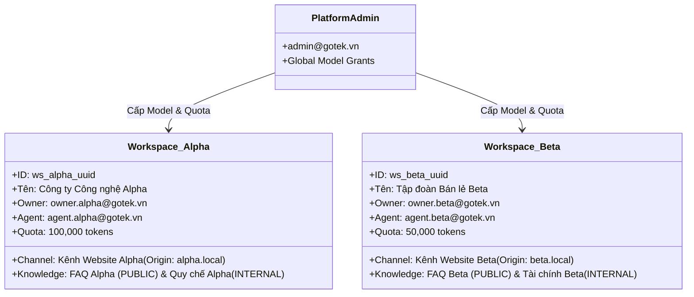

# Kế hoạch Triển khai Nhiệm vụ (PO/Plan): Tạo Fixture Hai Workspace Dùng Chung Cho Test
**Mã công việc:** `PLAN-03` | **Mức ưu tiên:** P1 | **Ước tính:** 1 ngày  
**Phân quyền (Owner Slot):** QA-RELEASE | **Người thực hiện:** Nguyên  
**Phụ thuộc (Dependency):** `PLAN-01` (Baseline Scope 5 Module)  
**Trạng thái mục tiêu:** Đã sẵn sàng ký duyệt Thiết kế Fixture (Ready for Sign-off)

---

## 1. Mục đích và Ý nghĩa của Bộ Fixture Hai Workspace Dùng Chung
Trong các hệ thống phần mềm SaaS Đa người thuê (Multi-tenant SaaS), việc kiểm thử chỉ với một tenant đơn lẻ là **hoàn toàn vô nghĩa** vì không thể phát hiện các lỗi rò rỉ dữ liệu chéo (Cross-tenant data leaks), lỗi cấu hình sai chính sách Row-Level Security (RLS) hoặc lỗi thiếu điều kiện lọc `workspace_id` trong câu lệnh SQL.

Tài liệu này xác lập bản thiết kế kiến trúc chuẩn mực cho **Bộ Fixture Hai Workspace Dùng Chung** (`Workspace_Alpha` và `Workspace_Beta`) nhằm phục vụ làm nền tảng kiểm thử (Testing Baseline) thống nhất cho toàn bộ thành viên trong đội ngũ phát triển (Frontend, Backend, QA).

---

## 2. Đặc tả Cấu trúc Dữ liệu Bộ Fixture Hai Workspace

### 2.1. Chi tiết Tài nguyên Workspace Alpha (`Tenant A`)
- **Định danh cố định (Deterministic UUID):** `11111111-1111-1111-1111-111111111111`
- **Tên doanh nghiệp:** `Công ty Công nghệ Alpha (GoTek Alpha)`
- **Tài khoản người dùng:**
  - Owner: `owner.alpha@gotek.vn` (Mật khẩu: `Gotek@123456`)
  - Agent 1: `agent.alpha@gotek.vn` (Mật khẩu: `Gotek@123456`)
- **Kênh giao tiếp (Channel):**
  - Tên kênh: `Kênh Hỗ trợ Khách hàng Website Alpha`
  - Public Key: `alpha_channel_pub_key_001`
  - Origin Allowlist: `http://localhost:3000`, `http://127.0.0.1:4317`
  - Biểu mẫu Pre-chat: Bắt buộc `fullName` và `emailAddress`.
- **Cơ sở Tri thức (Knowledge Base):**
  - Mục 1 (PUBLIC): *"Chính sách bảo hành sản phẩm phần mềm Alpha"* (Nội dung: Bảo hành 24/7 trong 12 tháng). Trạng thái: `PUBLISHED`.
  - Mục 2 (INTERNAL): *"Mật mã mở két văn phòng Alpha"* (Nội dung: 998877). Trạng thái: `PUBLISHED` (Chỉ dùng cho nhân viên nội bộ, không đưa ra widget).
- **Hạn mức sử dụng (Quota Budget):**
  - Model được cấp: `gpt-4o-mini`, Hạn mức: `100,000 tokens/tháng`.

### 2.2. Chi tiết Tài nguyên Workspace Beta (`Tenant B`)
- **Định danh cố định (Deterministic UUID):** `22222222-2222-2222-2222-222222222222`
- **Tên doanh nghiệp:** `Tập đoàn Bán lẻ Beta (GoTek Beta)`
- **Tài khoản người dùng:**
  - Owner: `owner.beta@gotek.vn` (Mật khẩu: `Gotek@123456`)
  - Agent 1: `agent.beta@gotek.vn` (Mật khẩu: `Gotek@123456`)
- **Kênh giao tiếp (Channel):**
  - Tên kênh: `Kênh Chăm sóc Khách hàng Beta`
  - Public Key: `beta_channel_pub_key_002`
  - Origin Allowlist: `http://localhost:3001`
  - Biểu mẫu Pre-chat: Bắt buộc `fullName` và `phoneNumber`.
- **Cơ sở Tri thức (Knowledge Base):**
  - Mục 1 (PUBLIC): *"Chính sách đổi trả hàng hóa Beta"* (Nội dung: Đổi trả trong 30 ngày kèm hóa đơn). Trạng thái: `PUBLISHED`.
  - Mục 2 (INTERNAL): *"Báo cáo tài chính doanh thu quý 3 Beta"* (Nội dung: Doanh thu 50 tỷ). Trạng thái: `PUBLISHED` (INTERNAL).
- **Hạn mức sử dụng (Quota Budget):**
  - Model được cấp: `claude-3-5-sonnet`, Hạn mức: `50,000 tokens/tháng`.

---

## 3. Các Nguyên tắc Thiết kế Bắt buộc của Bộ Fixture

1. **Tính Bất biến & Khả năng Tái lập (Idempotency & Reproducibility):**
   - Script tạo fixture phải có khả năng chạy lại **vô hạn lần** mà không bao giờ gặp lỗi khóa trùng (Duplicate Key Error).
   - Sử dụng kỹ thuật `INSERT ... ON CONFLICT (...) DO UPDATE` hoặc dọn sạch theo đúng phạm vi 2 UUID cố định trước khi chèn lại.
2. **Nguyên tắc Cô lập Tuyệt đối (Absolute Isolation):**
   - Không chia sẻ bất kỳ ID tài nguyên nào giữa 2 Workspace (ngoại trừ cấu hình chung của Platform Admin).
   - RLS của PostgreSQL bắt buộc phải được kích hoạt và kiểm chứng cho mọi bảng có chứa cột `workspace_id`.
3. **Môi trường Áp dụng:**
   - Bộ fixture được thiết kế độc quyền cho môi trường **Local Development** và **Automated Testing Suite**. Tuyệt đối không tự động nạp vào môi trường Production.

---

## 4. Nhật ký Quyết định Kỹ thuật (Decision Log)

| Mã Quyết định | Nội dung Quyết định | Cơ sở Kỹ thuật |
|---|---|---|
| **D-FIX-01** | Sử dụng Deterministic UUID (dạng `1111...` và `2222...`) cho 2 workspace fixture thay vì UUID ngẫu nhiên. | Giúp các kịch bản kiểm thử tĩnh và công cụ frontend có thể tham chiếu trực tiếp ID cố định mà không cần query lại DB. |
| **D-FIX-02** | Mật khẩu tài khoản test thống nhất là `Gotek@123456` và được hash bằng Argon2id tiêu chuẩn. | Đảm bảo tính xác thực đúng theo cơ chế security thật của hệ thống, không dùng tài khoản bypass kiểm tra mật khẩu. |
| **D-FIX-03** | Khởi tạo sẵn cả tri thức PUBLIC và tri thức INTERNAL cho mỗi workspace. | Tạo tiền đề sẵn sàng kiểm thử ranh giới bảo mật tri thức (Privacy Boundary test) ở mọi thời điểm. |

---

## 5. Bàn giao Phụ thuộc (Dependencies Handover)
- Bàn giao thông số kỹ thuật (UUID, Email, Channel Key) cho **FE-PRODUCT** để tích hợp công cụ chuyển đổi nhanh trên giao diện ([Task 08](file:///d:/gotek/ai_automation/plan_nguyen/08_FE_UI_TWO_WORKSPACE_FIXTURES.md)).
- Bàn giao kịch bản khởi tạo cho **QA-RELEASE** để viết file script tự động hóa và bộ test cô lập ([Task 09](file:///d:/gotek/ai_automation/plan_nguyen/09_QA_EVIDENCE_TWO_WORKSPACE_FIXTURES.md)).

---

## 6. Tiêu chí Hoàn thành (Definition of Done - DoD)
- [x] Bản đặc tả kiến trúc Fixture 2 Workspace được biên soạn hoàn chỉnh với đầy đủ thực thể (Users, Channels, Knowledge, Quota).
- [x] Tiêu chuẩn Idempotency và Deterministic UUID được thiết lập rõ ràng, không phụ thuộc môi trường ngẫu nhiên.
- [x] Thiết kế bảo đảm khả năng chứng minh toán học và logic: Workspace A tuyệt đối không đọc/ghi được dữ liệu Workspace B.
- [x] Nhật ký quyết định kỹ thuật đầy đủ và thông số sẵn sàng bàn giao cho các thành viên triển khai.
