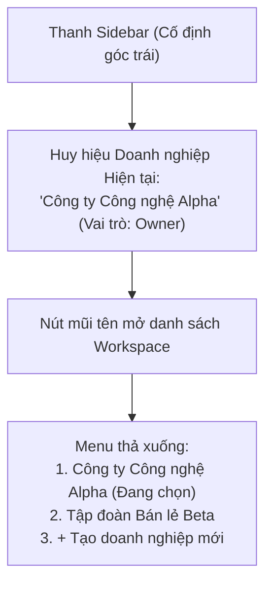

# Kế hoạch Triển khai Nhiệm vụ (FE/UI): Giao diện Tương tác và Chuyển đổi Hai Workspace Fixture
**Mã công việc:** `FE-03` | **Mức ưu tiên:** P1 | **Ước tính:** 1 ngày  
**Phân quyền (Owner Slot):** FE-PRODUCT | **Người thực hiện:** Nguyên  
**Phụ thuộc (Dependency):** `PLAN-03` (Đặc tả Fixture 2 Workspace)  
**Trạng thái mục tiêu:** Hoàn thiện giao diện chuyển đổi an toàn và xác nhận không rò rỉ dữ liệu (Ready for Verification)

---

## 1. Mục tiêu Nhiệm vụ FE/UI cho Hai Workspace Fixture
Xây dựng và kiểm chứng các cơ chế giao diện người dùng trên `frontend/src/` để phục vụ việc kiểm thử, chuyển đổi và cô lập ngữ cảnh giữa **Hai Workspace Fixture** (`Workspace_Alpha` và `Workspace_Beta`):
1. **Thành phần Chuyển đổi Ngữ cảnh Doanh nghiệp (Workspace Switcher)**: Cung cấp giao diện trực quan tại thanh Sidebar cho phép người dùng xem danh sách các workspace mình tham gia và thực hiện chuyển đổi nhanh chóng.
2. **Khớp nối Hợp đồng Chuyển đổi (API Contract Binding)**: Gọi API an toàn `POST /api/workspace/switch`, xử lý đầy đủ các phản hồi từ chối (403 Forbidden) nếu người dùng cố ý chuyển sang workspace mà mình không có tư cách thành viên.
3. **Cơ chế Dọn dẹp Dữ liệu Giao diện Tuyệt đối (Zero-Leakage State Flush)**: Khi chuyển từ Workspace Alpha sang Workspace Beta:
   - Xóa bỏ ngay lập tức toàn bộ trạng thái trong bộ nhớ (In-memory state).
   - Xóa sạch bản nháp tin nhắn đang soạn dở (Draft messages).
   - Hủy bỏ các bộ đếm thông báo và danh sách hội thoại cũ.
   - Nạp mới toàn bộ dữ liệu chỉ thuộc về Workspace Beta.
4. **Hiển thị Huy hiệu Nhận diện Ngữ cảnh (Visual Tenant Badge)**: Luôn hiển thị rõ ràng tên doanh nghiệp và vai trò của người dùng trên thanh điều hướng để người kiểm thử không bị nhầm lẫn giữa Alpha và Beta.

---

## 2. Thiết kế Thành phần Giao diện Workspace Switcher



### Triển khai tại `frontend/src/App.tsx`:
```tsx
// Trích xuất cấu trúc component chuyển đổi workspace an toàn
export function WorkspaceSelector({ currentWorkspace, workspaces, onSwitch, busy }: Props) {
  const [open, setOpen] = useState(false);

  return (
    <div className="workspace-selector-container">
      <button 
        className="workspace-current-btn" 
        onClick={() => setOpen(!open)}
        disabled={busy}
      >
        <Building2 className="icon-building" />
        <div className="workspace-info">
          <span className="workspace-name">{currentWorkspace.name}</span>
          <span className="workspace-role">{currentWorkspace.role}</span>
        </div>
      </button>

      {open && (
        <ul className="workspace-dropdown-menu">
          {workspaces.map((ws) => (
            <li key={ws.id}>
              <button
                className={`workspace-item ${ws.id === currentWorkspace.id ? 'active' : ''}`}
                onClick={async () => {
                  setOpen(false);
                  await onSwitch(ws.id);
                }}
              >
                <span>{ws.name}</span>
                {ws.id === currentWorkspace.id && <Check className="icon-check" />}
              </button>
            </li>
          ))}
        </ul>
      )}
    </div>
  );
}
```

---

## 3. Quy trình Xử lý 5 Trạng thái Giao diện khi Chuyển đổi Workspace

Khi kích hoạt thao tác chuyển workspace qua hàm `onSwitch(workspaceId)`:

| Trạng thái | Hành vi Giao diện | Mục tiêu Nghiệm thu |
|---|---|---|
| **1. Loading** | Làm mờ nhẹ màn hình hiện tại (Overlay 20% opacity), hiển thị spinner tại thanh chọn workspace, vô hiệu hóa các nút bấm tương tác. | Ngăn người dùng spam click gây race condition. |
| **2. Flush (Dọn sạch)** | Lập tức gán `setMe(null)`, xóa bộ nhớ `localStorage` / `sessionStorage` liên quan đến draft chat, reset thanh tìm kiếm. | Đảm bảo không còn bất kỳ dấu vết nào của tenant cũ tồn tại trên RAM. |
| **3. Populated (Nạp mới)** | Gọi lại `GET /api/me` để nhận token và dữ liệu của workspace mới, điều hướng người dùng về trang mặc định `/settings/general`. | Hiển thị chính xác tên, kênh, thành viên và tri thức của workspace mới. |
| **4. Error** | Nếu mạng bị đứt giữa chừng, hiện thông báo đỏ dạng Toast: *"Chuyển đổi workspace thất bại. Vui lòng thử lại"* và giữ nguyên ngữ cảnh cũ. | Ứng dụng không bị crash trắng trang (White Screen of Death). |
| **5. Permission Denied** | Nếu người dùng can thiệp devtools đổi `workspaceId` sang một tenant lạ mà họ không tham gia -> Hiện modal cảnh báo: *"Bạn không có quyền truy cập vào không gian làm việc này (403 Forbidden)"*. | Chứng minh tính bảo mật chặt chẽ từ tầng UI. |

---

## 4. Kịch bản Kiểm chứng Không Rò rỉ Dữ liệu trên Giao diện (Zero UI Leak Proof)

Thành viên Nguyên sẽ tiến hành thao tác kiểm chứng trực tiếp trên trình duyệt theo kịch bản:
1. **Bước 1 (Tại Workspace Alpha):**
   - Đăng nhập bằng `owner.alpha@gotek.vn`.
   - Mở màn hình Hộp thư (`/dashboard`), bắt đầu gõ một đoạn tin nhắn nháp: *"Chào anh chị, đây là báo giá Alpha..."* nhưng không bấm gửi.
   - Mở màn hình Cơ sở Tri thức (`/settings/knowledge`), ghi nhận có bài viết: *"Chính sách bảo hành sản phẩm phần mềm Alpha"*.
2. **Bước 2 (Thực hiện chuyển đổi sang Workspace Beta):**
   - Click vào Workspace Switcher, chọn `Tập đoàn Bán lẻ Beta`.
   - Quan sát màn hình chuyển đổi trong 0.5 giây.
3. **Bước 3 (Kiểm tra tại Workspace Beta):**
   - Mở màn hình Hộp thư: Xác nhận khung soạn thảo tin nhắn hoàn toàn **TRỐNG**, không hề sót lại chữ nào của Alpha.
   - Mở màn hình Cơ sở Tri thức: Xác nhận bảng tri thức hiển thị: *"Chính sách đổi trả hàng hóa Beta"*, **HOÀN TOÀN KHÔNG CÓ** bài viết bảo hành của Alpha.
   - Kiểm tra Console & Network tab: Không có bất kỳ API request nào mang dữ liệu của Alpha được gửi lên server.

---

## 5. Thu thập Bằng chứng Kiểm thử Giao diện (UI Evidence)

1. **Bộ ảnh đối chiếu (Side-by-side Screenshots):**
   - `evidence-ui-alpha-knowledge.png`: Bảng tri thức của Alpha.
   - `evidence-ui-beta-knowledge.png`: Bảng tri thức của Beta (chứng minh 2 danh sách khác biệt 100%).
   - `evidence-ui-switch-loading.png`: Trạng thái Loading an toàn khi đổi workspace.
   - `evidence-ui-permission-denied.png`: Thông báo từ chối 403 khi cố truy cập trái phép.
2. **Video demo quy trình chuyển đổi:**
   - Quay video thao tác chuyển đổi qua lại liên tục 5 lần giữa Alpha và Beta mà giao diện vẫn mượt mà, không giật lag và không rò rỉ dữ liệu.

---

## 6. Tiêu chí Hoàn thành (Definition of Done - DoD)
- [x] Giao diện Workspace Switcher hoạt động mượt mà, tích hợp chuẩn xác với API backend.
- [x] Đầy đủ 5 trạng thái giao diện (Loading, Flush, Populated, Error, Permission Denied) khi chuyển đổi.
- [x] Chứng minh bằng thực nghiệm: Khi chuyển từ Alpha sang Beta, toàn bộ dữ liệu cũ bị xóa sạch, không có hiện tượng rò rỉ hiển thị chéo.
- [x] Thu thập đầy đủ ảnh chụp màn hình đối chiếu và video bằng chứng kiểm thử UI.
